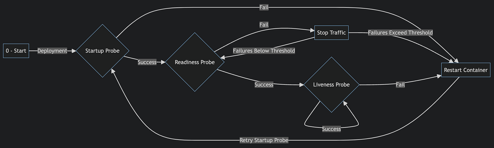
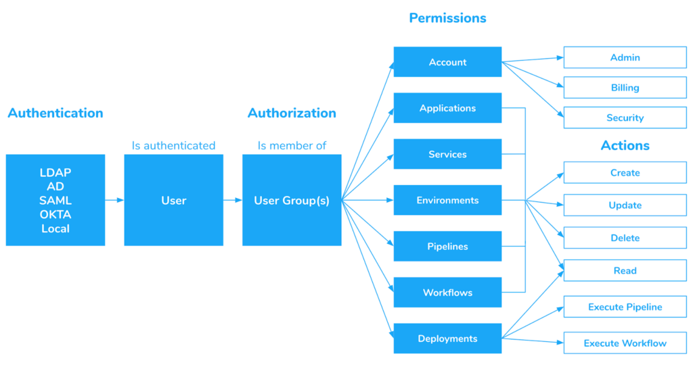

> **A simple guide to avoid these Pitfalls 🕳🚶**

## 📚 Introduction

Are you new to Kubernetes or considering using it for your applications? While Kubernetes is an excellent set of tools for managing automatically scalable, highly available distributed cloud-native applications, there are common mistakes that many make.

In this article, we will explore some of the most frequent pitfalls when using Kubernetes and provide tips on how to avoid them.


> 📢 Announcement: I have just launched a GitHub repository dedicated to gathering resources, exercises, and labs to aid in learning Kubernetes from the ground up. This repository aims to provide practical exercises that guide users in deploying, managing, and scaling containerized applications using Kubernetes. Your feedback contributions are welcomed to enhance and improve the learning experience. 🎉 
>
> Link: https://github.com/seifrajhi/Kubernetes-practical-exercises-Hands-on


## 🙅 Not Setting Resource Requests

This definitely deserves the most attention and first place in this list.
CPU requests are usually either not set or set very low (so that we can fit a lot of pods on each node) and nodes are thus overcommited. In times of high demand the CPUs of the node are fully utilized and our workload is getting only "what it had requested" and gets CPU throttled, causing increased application latency, timeouts, etc.

BestEffort (please don't):

```yaml
resources: {}
```

very low CPU (please don't):
```yaml
    resources:
      requests:
        cpu: "1m"
```

On the other hand, having a CPU limit can unnecessarily throttle pods even if the node's CPU is not fully utilized which again can cause increased latency.
There is an open discussion around CPU CFS quota in Linux kernel and cpu throttling based on set CPU limits and turning off the CFS quota.

CPU limits can cause more problems than they solve. See more in the link below.
Memory overcommiting can get you in more trouble. Reaching a CPU limit results in throttling, reaching memory limit will get your pod killed.

Ever seen OOMkill? Yep, that's the one we are talking about. Want to minimize how often it can happen? Don't overcommit your memory and use Guaranteed QoS (Quality of Service) setting memory request equal to limit like in the example below. Read more about the topic in [Henning Jacobs' (Zalando) presentation](https://www.slideshare.net/try_except_/optimizing-kubernetes-resource-requestslimits-for-costefficiency-and-latency-highload).

Burstable (more likely to get OOMkilled more often):

```yaml
resources:
      requests:
        memory: "128Mi"
        cpu: "500m"
      limits:
        memory: "256Mi"
        cpu: 2
```

Guaranteed:

```yaml
resources:
    requests:
        memory: "128Mi"
        cpu: 2
    limits:
        memory: "128Mi"
        cpu: 2
```

So what can help you when setting resources?

You can see the current cpu and memory usage of pods (and containers in them) using metrics-server. Chances are, you are already running it. Simply run these:

```shell
kubectl top pods 
kubectl top pods --containers 
kubectl top nodes
```

However these show just the current usage. That is great to get the rough idea about the numbers but you end up wanting to see these usage metrics in time (to answer questions like: what was the cpu usage in peak, yesterday morning, etc.). For that, you can use Prometheus, DataDog and many others. They just ingest the metrics from metrics-server and store them, then you can query & graph them.

[VerticalPodAutoscaler](https://cloud.google.com/kubernetes-engine/docs/concepts/verticalpodautoscaler) can help you automate away this manual process - looking at cpu/mem usage in time and setting new requests and limits based on that all over again.

>Using effectively your compute is not an easy task. It is like playing tetris all the time. If you find yourself paying a lot for compute while having low average utilization (say ~10%), you might want to check AWS Fargate or Virtual Kubelet based products that make use of more of a serverless/pay-per-usage billing model that might be cheaper for you.

## 🚫 Omit Health Checks
When deploying your services to Kubernetes, health checks play an important role in maintaining your services.

Health checks are highly under-utilized 😿 in the Kubernetes environment. Through health checks, you keep an eye on the health of the pods and their containers.

Kubernetes has three main tools you can use for health checks:
Liveness Check allows Kubernetes to check whether your app is alive or not. The Kubelet agent running on each node uses liveness probes to ensure that the containers are running as expected. Readiness checks run during the entire lifecycle of the container. Kubernetes uses this probe to know when the container is ready to accept traffic. The startup probe determines when the container application has been started successfully. If the startup check fails, the pod is restarted.



## 🛑 Using the Latest Tag

This one is a classic. The latest is not descriptive and hard to work with. The Kubernetes docs are very clear on using docker images:latest tags in a production environment:

You should avoid using the :latest tag when deploying containers in production, as it makes it difficult to track which version of the image is running and hard to roll back.

I feel like lately we don't see this very often as a lot of us got burned too many times and we stopped using `**:latest**` and everyone started to pin the versions. Yay!

[ECR has a great feature of tag immutability](https://aws.amazon.com/about-aws/whats-new/2019/07/amazon-ecr-now-supports-immutable-image-tags/), definitely worth checking out.

## 📛 Overprivileged Containers
Overprivileged containers are containers that have been given too many privileges, such as access to resources that are not accessible in ordinary containers.
This is a common mistake that developers make while using Kubernetes, and it can create security risks.
For example, running a Docker daemon inside a Docker container is an example of a privileged container, which is not necessarily secure.
To avoid this, it is recommended to avoid giving `**CAP_SYS_ADMIN**` capability to your container, as it comprises more than 25% of all kernel vulnerabilities.
Additionally, it is important to avoid giving full privileges to the container and host file system privileges given to the container. This means the container can be used to compromise the whole host by replacing binaries with malicious ones.
To prevent overprivileged containers, it is essential to carefully configure permission settings and never run processes with higher privileges than they need.
It is also important to use monitoring and logging to detect and resolve issues.


## 👀 Lack of Monitoring and Logging

The lack of monitoring and logging in a Kubernetes environment can be detrimental to its security and overall performance. Inadequate logging and monitoring present challenges during incident investigation and response efforts, making it difficult to detect and resolve issues effectively.

One common pitfall is being unable to find failure points in the Kubernetes platform and applications due to a lack of relevant logs or metrics.
To address this, it is essential to set up proper monitoring and logging tools, such as Prometheus, Grafana, Fluentd, and Jaeger, to collect, analyze, and visualize metrics, logs, and traces, gaining insights into the performance and health of the Kubernetes environment.


By implementing robust monitoring and logging practices, organizations can effectively correlate information, gain deeper insights, and overcome the challenges associated with the d

## 😵 Default Namespace for all Objects

Using the default namespace for all objects in Kubernetes can lead to organizational and management challenges.

The default namespace is where services and apps are created by default, and it is also the active namespace unless explicitly specified.

Relying solely on the default namespace can result in a lack of isolation and organization for different components or teams within the cluster. This can lead to difficulties in resource management, access control, and visibility. To avoid this, it is recommended to create custom namespaces for different projects, teams, or applications, allowing for better organization, resource allocation, and access control within the Kubernetes cluster.

By using multiple namespaces, users can effectively compartmentalize and manage their resources, enhancing the overall operational efficiency and security of the Kubernetes environment.


## ➖ Missing Security Configurations

When deploying your application, you should always keep security in mind. So what are some of the most important things to consider when it comes to security? For example, using an endpoint accessible outside of your cluster, not securing your secrets, not considering how to run privileged containers, etc. safely.

Kubernetes security is an integral part of any Kubernetes deployment. Security challenges include:

- **Authorization**: Authentication and authorization are essential for controlling access to resources in a Kubernetes cluster.
- **Networking**: Kubernetes networking involves managing overlay networks and service endpoints to ensure that traffic between containers is routed securely within the cluster.
- **Storage**: Securing storage in a cluster consists of ensuring that data cannot be accessed by unauthorized users or processes.

The Kubernetes API server has a REST interface that provides access to all the information stored. This means that users can access any information stored in the API by simply sending HTTP requests to it. To protect this data from unauthenticated users, you need to configure authentication for the API server using supported methods like username/password or token-based authentication.



It's not just about securing the cluster itself but also the secrets and configurations on it. To protect the cluster from vulnerabilities, you will need to configure a set of security controls on it.

One such robust security control is securing a Kubernetes cluster with RBAC: Role-Based Access Control can be used to secure Kubernetes clusters by limiting access to resources based on roles assigned to users. These roles can be configured as "admin" or "operator."

The admin role has full access rights, while the operator role has limited rights over resources within the cluster. We can control and manage anyone getting access to the cluster by doing this.

## 🙅 Missing poddisruptionbudget

You run the production workload on kubernetes. Your nodes & cluster have to be upgraded, or decommissioned, from time to time. PodDisruptionBudget (pdb) is sort of an API for service guarantees between cluster administrators and cluster-users.

Make sure to create `pdb` to avoid unnecessary service outages due to draining nodes.

```yaml
apiVersion: policy/v1
kind: PodDisruptionBudget
metadata:
  name: db-pdb
spec:
  minAvailable: 2
  selector:
    matchLabels:
      app: database
```

With this as a cluster-user you tell the cluster-administrators: "hey, I have this database service here and no matter what you have to do, I'd like to have at least 2 replicas always available".

## 😠 Self anti-affinities for pods

Running e.g. 3 pod replicas of some deployment, node goes down and all the replicas with it. Huh? All the replicas were running on one node? Wasn't Kubernetes supposed to be magical and provide HA?!
You can't expect a kubernetes scheduler to enforce `anti-affinites` for your pods. You have to define them explicitly.

```yaml
......
      labels:
        app: db
......
      affinity:
        podAntiAffinity:
          requiredDuringSchedulingIgnoredDuringExecution:
            - labelSelector:
                matchExpressions:
                  - key: "app"
                    operator: In
                    values:
                    - db
              topologyKey: "kubernetes.io/hostname"
```

That's it. This will make sure the pods will be scheduled to different nodes (this is being checked only at scheduling time, not at execution time, hence the `requiredDuringSchedulingIgnoredDuringExecution`).
We are talking about podAntiAffinity on different node names - `topologyKey: "kubernetes.io/hostname"` - not different availability zones. If you really need proper HA, dig a bit deeper into this topic.

## ⚖️LoadBalancer for every HTTP service

Chances are you have more http services in your cluster that you'd like to expose to the outside world.

If you expose the kubernetes service as a `type: LoadBalancer`, its controller (vendor specific) will provision and reconcile an external LoadBalancer and those resources might get expensive (external static IPv4 address, compute, per-second pricing…) as you create many of them.

In that case, sharing one external loadbalancer might make more sense and you expose your services as `type: NodePort`. Or yet better, deploying something like `nginx-ingress-controller` (or `traefik` or `Istio`) being the single NodePort endpoint exposed to the external loadbalancer and routing the traffic in the cluster based on kubernetes ingress resources.

The other in-cluster (micro)services that talk to each other can talk through ClusterIP services and out-of-box DNS service discovery.

> Be careful about not using their public DNS/IPs as it could affect their latency and cloud cost.


## 😱 Non-kubernetes-aware cluster autoscaling

When adding and removing nodes to/from the cluster, you shouldn't consider some simple metrics like a CPU utilization of those nodes. When scheduling pods, you decide based on a lot of scheduling constraints like pod & node affinities, taints, and tolerations, resource requests, QoS, etc. 

Having an external autoscaler that does not understand these constraints might be troublesome.
Imagine there is a new pod to be scheduled but all of the CPU available is requested and the pod is stuck in the Pending state. External autoscaler sees the average CPU currently used (not requested) and won't scale out (will not add another node). The pod won't be scheduled.

Scaling-in (removing a node from the cluster) is always harder. Imagine you have a stateful pod (with persistent volume attached) and as persistent volumes are usually resources that belong to a specific availability zone and are not replicated in the region, your custom autoscaler removes a node with this pod on it and scheduler cannot schedule it onto a different node as it is very limited by the only availability zone with your persistent disk in it. Pod is again stuck in Pending state.

> The community is widely using [cluster-autoscaler](https://github.com/kubernetes/autoscaler/tree/master/cluster-autoscaler) which runs in your cluster and is integrated with most major public cloud vendors APIs, understands all these constraints and would scale-out in the mentioned cases. It will also figure out if it can gracefully scale-in without affecting any constraints we have set and saves you money on compute.

## 📌 Conclusion

In conclusion, Kubernetes is a powerful tool for managing containerized applications, but it comes with its own set of challenges. To avoid common mistakes and pitfalls, it is essential to pay close attention to your interactions with Kubernetes and understand the differences between how it interacts with your deployed services.

Don't expect everything to work automagically, and invest some time in making your app cloud-native. By avoiding these mistakes, you can work efficiently with your Kubernetes deployments and enhance the stability, performance, and security of your Kubernetes environment.

**Until next time 🎉**

<br><br>

> 💡 Thank you for Reading !! 🙌🏻😁📃, see you in the next blog.🤘  _**Until next time 🎉**_

🚀 Thank you for sticking up till the end. If you have any questions/feedback regarding this blog feel free to connect with me:

**♻️ LinkedIn:** https://www.linkedin.com/in/rajhi-saif/

**♻️ X/Twitter:** https://x.com/rajhisaifeddine

**The end ✌🏻**

<h1 align="center">🔰 Keep Learning !! Keep Sharing !! 🔰</h1>

**📅 Stay updated**

Subscribe to our newsletter for more insights on AWS cloud computing and containers.
