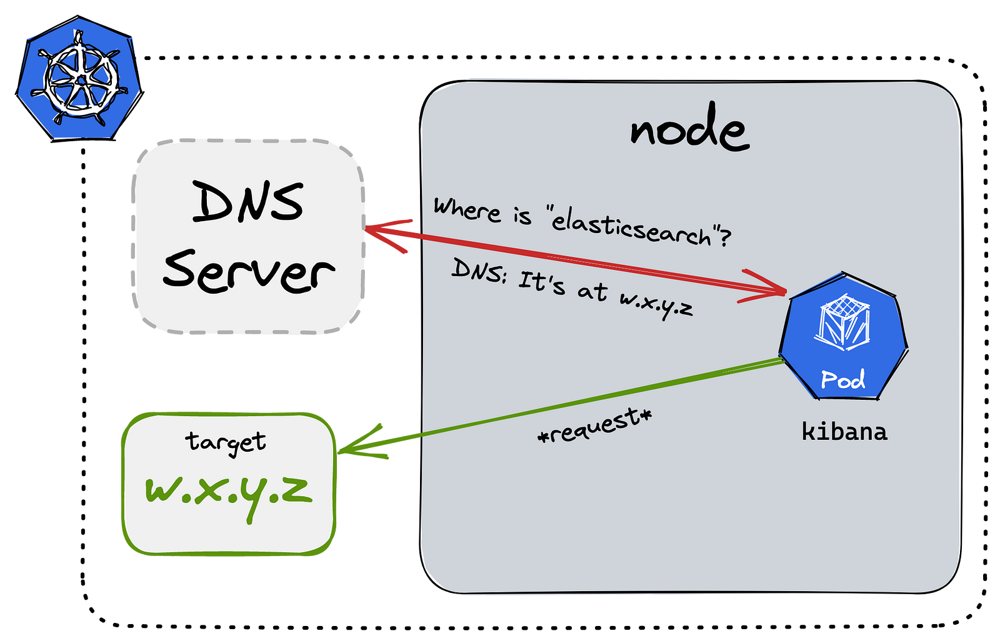
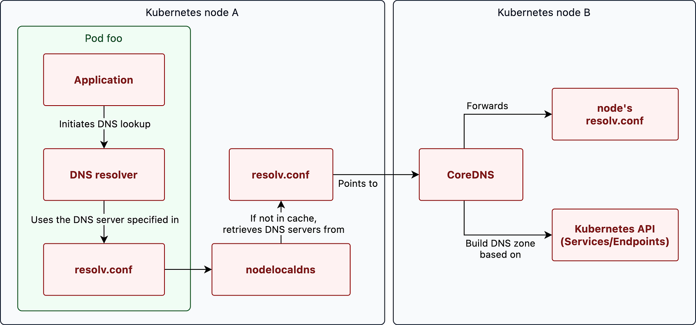

> **Kubernetes DNS Expedition🔥**

## 📚 Introduction

Kubernetes is an orchestration system for managing containerized applications. One of its key features is DNS, which allows pods to communicate with each other using DNS names instead of IP addresses.

In this blog post, we will walk through the life of a DNS query in Kubernetes, from when a pod performs a lookup to when it receives the IP address of the requested hostname. We will also discuss how DNS plays a role in service discovery, which is the process of routing incoming requests to the correct workloads running in the cluster.

By understanding how DNS works in Kubernetes, you will be better equipped to debug issues and troubleshoot problems with your applications.

## Pods communication in Kubernetes

Using IP addresses to communicate between pods presents two key challenges:

* **Dynamic IP assignment:** Pods can be assigned new IP addresses during creation, scaling, or restarts. Tracking these changing addresses and updating configurations becomes complex and error-prone.
* **External accessibility limitation:** Pods' IP addresses are not reachable outside the Kubernetes cluster due to non-routability. To access pods externally, a service is required.

Services address these issues by establishing a consistent name for a pod group:

* `Stable Communication:` Pods can refer to the service name instead of dynamic IP addresses when connecting to other pods. The service efficiently routes traffic to the intended pod.


Beyond IP-related challenges, services offer several advantages:

* **Load balancing:** Traffic distribution across pods enhances application performance by maintaining balanced workloads.
* **High availability:** Service configuration ensures traffic redirection to functioning pods if one fails, ensuring uninterrupted application availability.
* **DNS resolution:** Services can be registered with Kubernetes DNS, enabling easy pod-to-pod connectivity without needing to know individual pod IP addresses.

## 🗝 Kubernetes DNS and Service discovery

In Kubernetes, service discovery relies on the essential component of DNS (Domain Name System). Service resources facilitate service discovery by associating an IP address with a healthy pod, enabling seamless connections.

Upon creating a `service`, the Kubernetes cluster's `DNS server` generates an `A record`, mapping the `service's DNS name` to its `IP address`.

Consequently, pods can conveniently access the service using its DNS name. The DNS server dynamically updates the A record to reflect changes in the service's IP address, ensuring accuracy.

The **Domain Name System (DNS)** is a mechanism that connects user-friendly names, like domain names, to corresponding IP addresses. This translation simplifies end-users' access to target domains. Kubernetes clusters incorporate an internal DNS service by default, ensuring efficient service discovery even as pods and services are created, shifted, or removed across nodes.

Recent Kubernetes versions transitioned from `kube-dns` to `CoreDNS` to address security and stability concerns, with CoreDNS introduced in version `1.11`.

Both implementations function similarly:

* A `kube-dns` service and one or more pods are created.
* The `kube-dns` service monitors the Kubernetes API for service and endpoint events and changes its DNS entries as appropriate. When you modify these Kubernetes services and their related pods with creating, editing, or deleting operations, these events are auto-triggered.
* `Kubelet` assigns the `cluster IP` of the kube-dns service to every new pod `etc/resolv.conf` nameserver option, along with suitable search settings to allow for shorter hostnames:

    ```shell
    nameserver 10.32.0.10
    search namespace.svc.cluster.local svc.cluster.local cluster.local
    options ndots:5
    ```

Containerized applications may then resolve hostnames like `example-service.namespace` to the appropriate cluster IP address.



## Overview of the Kubernetes DNS Records

Let's understand Kubernetes DNS records better with the help of an example. 

The entire DNS A record for a Kubernetes service will look like:

```shell
service.namespace.svc.cluster.local
```

A pod would have a record in this format, which would represent the pod's real IP address:

```shell
10-32-0-125.namespace.pod.cluster.local
```

Besides, **SRV records** are created for the specified **ports** of a Kubernetes service:

```shell
_port-name._protocol.service.namespace.svc.cluster.local
```

As a result, your `application` or `microservice` may hit a simple and consistent hostname to reach other services or pods on the cluster, thanks to the built-in DNS-based service discovery mechanism.

### Resolving shorter hostnames and searching domains

You won't always need to utiuselize the whole hostname to access another service because of the search domain suffixes set in the `resolv.conf` file. 

If you're contacting a service in the same namespace, you may just call it by its name:

```shell
other-service
```

Add `other-namespace` to the query if the service is in a different namespace:

```shell
other-service.other-namespace
```

You'll need to use at least the following if you're going after a pod:

```shell
pod-ip.other-namespace.pod
```

Only the `.svc` suffixes are automatically completed in the default `resolv.conf` file.
Therefore, it is essential to specify the settings up to `.pod`.

An example service definition looks like this:

```yaml
apiVersion: v1
kind: Service
metadata:
  name: foo
  namespace: bar
spec:
  ports:
    - port: 80
      name: http
```

The `A record` and `SRV record` (discussed later in the article) that are created in this instance look like this:

```shell
foo.bar.svc.cluster.local                  30   A   10.129.1.26
_http._tcp.nginx.default.svc.cluster.local 3600 SRV 0 100 80 10-129-1-26.foo.bar.svc.cluster.local.
```

To create the fully qualified domain name FQDN for this service, we use the name of the **service (foo)**, the **namespace (bar**), and the cluster domain **(cluster.local)**.

Any workload running in the cluster can now resolve the service's IP address using this DNS name.

### DNS lookups on services



When a pod performs a DNS lookup, the query is first sent to the local DNS resolver in the pod. This resolver uses the `resolv.conf` configuration file. In this file, the [nodelocaldns](https://kubernetes.io/docs/tasks/administer-cluster/nodelocaldns/) server is set up as the default recursive DNS resolver, which acts as a cache.

If this cache does not contain the IP address for the requested hostname, the query is forwarded to the cluster DNS server ([CoreDNS](https://coredns.io/)).

This DNS server determines the IP address by consulting the Kubernetes service registry. This registry contains a mapping of service names to their corresponding IP addresses. This allows the cluster DNS server to return the correct IP address to the requesting pod.

Any domains that are queried but are not in the Kubernetes service registry are forwarded to an upstream DNS server.

We will go through each of these components in more detail step by step.

## Pod foo

When a pod sends an API request to a service within the same Kubernetes cluster, it must first resolve the IP address of the service. To do this, the pod performs a DNS lookup using the DNS server specified in its [/etc/resolv.conf](https://en.wikipedia.org/wiki/Resolv.conf) configuration file.

This file, which is provisioned by the `Kubelet`, defines the settings for DNS lookups in the pod. It contains a reference to the cluster DNS server.

By default, this configuration file looks something like this:

```shell
search namespace.svc.cluster.local svc.cluster.local cluster.local
nameserver 10.123.0.10
options ndots:5
```

### Pod config

By default, the `/etc/resolv.conf` file provided by the Kubelet will forward all DNS queries to the cluster's DNS server (10.123.0.10 in the example above). The Kubelet also defines search domains and the `ndots` option for DNS queries.

The search domains specify which domain suffixes should be searched when incomplete domains (non-FQDNs) are given. The ndots option determines when a query for the absolute domain is made directly instead of first appending the search domains.

To better understand how this works, let's look at an example. Suppose a pod named `foo` performs a DNS lookup for `bar.other-ns`. If the ndots option is set to 5 (the default value), the resolver will count the number of dots in the domain.

If there are fewer than **5 dots**, the search domains will be appended before the DNS lookup is performed on the DNS server. If there are 5 or more dots, the domain will be queried as-is without appending the search domains. 

In this example, `bar.other-ns` has less than 5 dots, so the search domains will be appended before the DNS lookup is performed.

By default, the search domains are:

* <requester_namespace>.svc.cluster.local
* svc.cluster.local
* cluster.local

Until a valid response is found, these search domains are appended to the domain and queried.

The resolver will try the following queries one by one:

* bar.other-ns.<requester_namespace>.svc.cluster.local
* bar.other-ns.svc.cluster.local (_⇐ match found!_)

The bar service will be listening on `bar.other-ns.svc.cluster.local`, so a match is found and the proper `A-record` is returned.

To change the behavior of a pod's DNS resolver, you can change the DNS config of a pod:

```yaml
apiVersion: v1
kind: Pod
metadata:
  namespace: default
  name: dns-example
spec:
  containers:
    - name: test
      image: nginx
  dnsPolicy: "None"
  dnsConfig:
    nameservers:
      - 1.2.3.4
    searches:
      - ns1.svc.cluster-domain.example
      - my.dns.search.suffix
    options:
      - name: ndots
        value: "2"
      - name: edns0
```

In the example above, the `dnsPolicy` is set to **"None"**, which means that the pod will not use the default DNS settings provided by the cluster.

→ Instead, the `dnsConfig` field is used to specify custom DNS settings for the pod.

The `nameservers` field is used to specify the DNS servers that the pod should use for DNS lookups.

The `searches` field is used to specify the search domains that should be used for incomplete domains.

The `options` field is used to specify custom options for the DNS resolver, such as the `ndots` and `edns0` options in the example above.

These settings will be used by the pod's DNS resolver instead of the default settings provided by the cluster. For more information on pod DNS configuration, [see the official docs](https://kubernetes.io/docs/concepts/services-networking/dns-pod-service/#pod-dns-config).


## 🛠️ Authoritative DNS server

In Kubernetes clusters up to version 1.13, `kube-dns` acted as the **authoritative DNS server for Kubernetes**. In Kubernetes version `1.13`, [CoreDNS replaced kube-dns](https://kubernetes.io/blog/2018/12/03/kubernetes-1-13-release-announcement/#coredns-is-now-the-default-dns-server-for-kubernetes) as the default component for authoritative DNS queries.

The DNS server adds all services to its authoritative DNS zone, so that it can resolve domain names to IP addresses for Kubernetes services. Various software implementations exist for the authoritative DNS server in Kubernetes.

CoreDNS is a popular choice, as it supports building a DNS zone from the Kubernetes service registry.

It also offers extra features such as `caching`, `forwarding`, and `logging`.

An example of a configuration file of CoreDNS:

```yaml
.:53 {
    errors
    health {
        lameduck 5s
    }
    ready
    kubernetes cluster.local in-addr.arpa ip6.arpa {
        fallthrough in-addr.arpa ip6.arpa
        ttl 30
    }
    forward . /etc/resolv.conf
    cache 30
}
```

Important to note are the kubernetes zone and the forward statement.

## Nodelocaldns

DNS queries are a common and essential part of network communication. They need to be processed quickly to avoid performance issues. Slow DNS queries can cause problems that are difficult to diagnose and troubleshoot.

To improve the performance of DNS queries in a Kubernetes cluster, a cache layer can be added on each node using the [nodelocaldns](https://kubernetes.io/docs/tasks/administer-cluster/nodelocaldns/) component. This component caches the responses to DNS queries.

If no response is found in the cache, it forwards the query to the authoritative nameserver (CoreDNS). The response is stored in the local cache so that it can be used to serve future queries from the same or other pods on the same node.

This reduces the amount of network traffic between pods and the DNS server. This means lower latencies and faster DNS query performance. The function of [nodelocaldns](https://kubernetes.io/docs/tasks/administer-cluster/nodelocaldns/) is often fulfilled by CoreDNS as well.

## A note on the TTL (time-to-live) of records in Kubernetes

In Kubernetes, the `time-to-live (TTL)` of DNS records is determined by the `DNS server` implementation that is being used.

By default, CoreDNS sets the TTL of DNS records to `30 seconds`. This means that when a DNS query is resolved, the response will be cached for up to 30 seconds before it is considered stale. The TTL of DNS records can be modified using the `ttl` option in the `CoreDNS configuration file`.

The TTL of DNS records is an important parameter because it determines how long a DNS response will be considered valid before a new query must be made.

A shorter TTL can improve the accuracy of DNS responses, but it can also increase the load on the DNS server. A longer TTL can reduce the load on the DNS server. However, it can also cause DNS responses to be outdated or inaccurate if the underlying DNS records are updated.

Therefore, the appropriate TTL should be chosen based on the specific requirements of the cluster.

## Bonus: SRV records

So far we've only talked about resolving IP addresses using A-records. Kubernetes also uses SRV (service) records to resolve the port numbers of named services. This allows clients to discover the port numbers of services by querying the DNS server for the appropriate SRV record.

```shell
apiVersion: v1
kind: Service
metadata:
  name: nginx
  namespace: default
spec:
  ports:
    - port: 80
      name: http
```

In this service, the container port 80 is exposed and is given the name **"http"**. Because the port is named, Kubernetes will _generate_ an SRV record with the following name: `_<port>._<proto>.<service>.<ns>.svc.<zone>`.

In this case, the SRV record will be named `_http._tcp.nginx.default.svc.cluster.local`. A DNS query for this record would return the port number and IP address of the named service:

```shell
dig +short SRV _http._tcp.nginx.default.svc.cluster.local
0 100 80 10-129-1-26.nginx.default.svc.cluster.local.
```

Some services, such as Kerberos, use SRV records for the discovery of the KDC (Key Distribution Center) servers.

## Putting it all together

Whenever you create a pod, it gets assigned an IP.
Any two pods in your cluster can talk to each other using their IP addresses.
The problem with using IP addresses for pods to talk to each other is that these IPs may change as pods get deleted and recreated.
For pods to consistently address each other correctly, you can use a Service.
When you create a service using kubectl, the Kubernetes apiserver will save its data, and another pod called kubernetes-controller-manager will wake up and break that service down into two resources: Endpoints and EndpointSlices.
CoreDNS will use those resources to know how to turn a service name into a service IP. Additionally, each node's kube-proxy pods will update the node's iptables rules. Those iptables rules cause requests to the service's IP to get addressed to the service's pods.
Finally, when a pod makes a request, it will do a DNS query to CoreDNS to get the service's IP. Then, when sending packets to that IP, the iptables rules created by kube-proxy will cause the packets to get addressed to an actual pod's IP.


## 💡 A few more notes

There are some missing more points, that I did not cover.

Among those details is [how a pod gets assigned an IP](https://ronaknathani.com/blog/2020/08/how-a-kubernetes-pod-gets-an-ip-address/) and [how iptables rules work](https://ronaknathani.com/blog/2020/07/kubernetes-nodeport-and-iptables-rules/).
I also haven't touched on [CNI plugin implementations](https://github.com/containernetworking/cni), like [Kindnet](https://www.tkng.io/cni/kindnet/).

A tour through [container networking](https://medium.com/techlog/diving-into-linux-networking-and-docker-bridge-veth-and-iptables-a05eb27b1e72) itself would also be helpful for most readers.

Finally, if you want to learn more about CoreDNS itself, [this talk is a great start](https://www.youtube.com/watch?v=qRiLmLACYSY).

## Conclusion

In this blog post, we explored how pods in Kubernetes networks talk to each other. We learned about the different components involved in Kubernetes DNS, and how they work together to resolve DNS queries. We also explored some of the challenges of Kubernetes DNS, and how to overcome them.

_We hope that you have found this blog post helpful. If you have any other tips or tricks that you would like to share, please leave a comment below._
<br><br>


https://giphy.com/gifs/theoffice-TNnyxINX87VAKbNYmZ

<br>

**_Until next time, つづく 🎉_**

> 💡 Thank you for Reading !! 🙌🏻😁📃, see you in the next blog.🤘  _**Until next time 🎉**_

🚀 Thank you for sticking up till the end. If you have any questions/feedback regarding this blog feel free to connect with me:

**♻️ LinkedIn:** https://www.linkedin.com/in/rajhi-saif/

**♻️ X/Twitter:** https://x.com/rajhisaifeddine

**The end ✌🏻**

<h1 align="center">🔰 Keep Learning !! Keep Sharing !! 🔰</h1>

**📅 Stay updated**

Subscribe to our newsletter for more insights on AWS cloud computing and containers.
