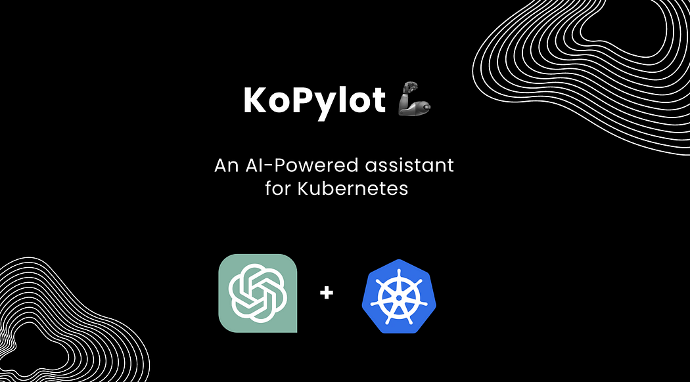

> **Kubernetes & AI team-up**

## 📚 Introduction

AI is generating a lot of buzz these days, and the Kubernetes-powered DevOps world is no exception. Software engineers are huge automation enthusiasts, so it’s natural that AI-powered tools for Kubernetes operators are starting to pop up.

Most of these tools are designed for terminal (CLI) usage. Kubernetes is the go-to platform for container orchestration, but its complexity can be daunting. AI-powered tools can help you master Kubernetes by automating tasks, improving reliability, and providing insights.

One of the most promising AI platforms for Kubernetes AIOps is OpenAI. OpenAI provides a suite of open-source tools that can be used to build AI-powered solutions for Kubernetes.


## Overview

Kubernetes users inevitably encounter cluster issues that require debugging and fixing to keep their pods and services running smoothly. Whether you are new to Kubernetes or managing large and complex environments, debugging in-cluster processes can be challenging and time-consuming.

Cloud-native DevOps involves a lot of complexity in managing containers, microservices and autoscaling capabilities. Generative AI could help troubleshoot and perform some of the operational tasks associated with platforms like Kubernetes. This could involve using natural language prompts to spin up, roll back or get visibility into clusters.

For example, at [KubeCon + CloudNativeCon 2023](https://thenewstack.io/kubiya-launches-first-generative-ai-for-platform-engineering/), Kubiya debuted a generative AI workflow engine that's able to interpret such commands from within Slack. Extending natural language processing might aid platform teams in creating new workflows that abstract the complexity of working [with cloud-native platforms](https://cloudnativenow.com/features/2023-marks-the-rise-of-cloud-native-platforms/).

## ✨ k8sgpt

[K8sGPT](https://github.com/k8sgpt-ai/k8sgpt) is a relatively new open source project that uses AI models to explain Kubernetes error messages and provide cluster insights. It is already used by two organizations in production and has applied to become a CNCF sandbox project.

K8sGPT Features:

- Provides detailed and contextualized explanations of Kubernetes error messages.
- Provides cluster insights.
- Supports multiple installation options.
- Supports different AI backends.

K8sgpt is the most well-known and widely used project of its kind. Launched by [Alex Jones](https://x.com/AlexJonesax), it is marketed as a way to "give Kubernetes superpowers to everyone."

K8sgpt is a CLI tool with a primary command, `k8sgpt analyze`, which is designed to reveal problems in your Kubernetes cluster. It does this by using "analyzers," which define the logic for each Kubernetes object and the possible problems it may be encountering. For example, an analyzer for Kubernetes Services will check whether a particular Service exists and has endpoints, and whether its endpoints are ready.

Identifying such an issue is not a big deal in and of itself, but the magic happens when you ask k8sgpt to explain what you can do about it. To do this, you run the command `k8sgpt analyze --explain`. This will ask the AI for instructions for your specific case and display them for you.

The instructions will include the actions to take to troubleshoot the problem, including specific kubectl commands that you can execute by simply copying and pasting them. This is made possible by the fact that the names of your Kubernetes resources are already in place.


### Installation

There are several installation options available depending on your preferences and Operating system. You can find the different options in [the installation section of the documentation](https://docs.k8sgpt.ai/getting-started/installation/).
The prerequisite for installing K8sGPT as mentioned below is to have [Homebrew](https://brew.sh) installed either on your Mac or WSL on your Windows machine.

Next, you can run the following commands:

```Shell
brew tap k8sgpt-ai/k8sgpt
brew install k8sgpt
```

To view all the commands provided by K8sGPT, used the `--help` flag:

```Shell
k8sgpt --help
```

You can see an overview of the different commands also [on the documentation](https://docs.k8sgpt.ai/reference).

Next, we will have to authorise an AI backend. In this video, we will use OpenAI.

### Prerequisites

The prerequisites to follow the next sections is to have an OpneAI account and a running Kubernetes cluster; any cluster, such as microk8s or minikube will be sufficient.
Once you have the OpneAI account, you want to go to the following site to generate a new [API key](https://platform.openai.com/account/api-keys).
Alternatively, you can run the following command and K8sGPT will open the same site in your default Browser:

```Shell
k8sgpt generate
```

This key is needed for K8sGPT to interact with OpenAI. Authorise K8sGPT with the newly created API key/token:

```Shell
k8sgpt auth add openai
Enter openai Key: openai added to the AI backend provider list
```

You can list your backends with the following command:

```Shell
k8sgpt auth list
Default:
> openai
Active:
> openai
Unused:
> localai
> azureopenai
> noopai
```

Again, [our documentation](https://docs.k8sgpt.ai/reference/providers/backend/?ref=anaisurl.com) provides further information on the different AI backends available.

Next, we will install a malicious Deployment into our Kubernetes cluster. The pod will go into CrashLoopBackOff. Here is the YAML:

```Yaml
apiVersion: apps/v1
kind: Deployment
metadata:
  name: nginx-deployment
  labels:
    app: nginx
spec:
  replicas: 3
  selector:
    matchLabels:
      app: nginx
  template:
    metadata:
      labels:
        app: nginx
    spec:
      containers:
      - name: nginx
        image: nginx:1.14.2
        ports:
        - containerPort: 80
        securityContext:
          readOnlyRootFilesystem: true
```

Next, we will create a dedicated namespace for our example application and install the Deployment:

```shell
kubectl create ns demo
namespace/demo created
```

Then we apply the manifest:

```Shell
kubectl apply -f ./deployment.yaml -n demo
deployment.apps/nginx-deployment created
```

Now you will see the pods in our demo namespace throwing errors:


If we look at the events for one of the pods, we will not become much smarter:

```shell
Warning  BackOff	3s (x8 over 87s)  kubelet        	Back-off restarting failed container
```

So what we can do instead to access more details on why these pods are erroring, we can run a K8sGPT command:

```shell
k8sgpt analyse
```

This will show us the problems that k8sGPT found inside our cluster:
```shell
AI Provider: openai
```
To receive further information as well as recommendations on how to fix the issues, we can use the --explain flag:
```shell 
k8sgpt analyse --explain
0 demo/nginx-deployment-5f4c7db77b-hq74n(Deployment/nginx-deployment)
- Error: back-off 1m20s restarting failed container=nginx pod=nginx-deployment-5f4c7db77b-hq74n_demo(7854b793-21b7-4f81-86e5-dbb4113f64f4)
1 demo/nginx-deployment-5f4c7db77b-phbq8(Deployment/nginx-deployment)
- Error: back-off 1m20s restarting failed container=nginx pod=nginx-deployment-5f4c7db77b-phbq8_demo(74038531-e362-45a6-a436-cf1a6ea46d8a)
2 demo/nginx-deployment-5f4c7db77b-shkw6(Deployment/nginx-deployment)
- Error: back-off 1m20s restarting failed container=nginx pod=nginx-deployment-5f4c7db77b-shkw6_demo(2603f332-3e1c-45da-8080-e34dd6d956ad)
```

## ✨ kubectl-ai project

[This project](https://github.com/sozercan/kubectl-ai) is a kubectl plugin to generate and apply Kubernetes manifests using OpenAI GPT. To make it more interesting and understand in a visualized way, we will make use of Kubectl + OpenAI plugin.

### Installation

**Homebrew:**

Add to brew tap and install with:

```shell
brew tap sozercan/kubectl-ai https://github.com/sozercan/kubectl-ai
brew install kubectl-ai
```

**Krew:**
Add to krew index and install with:

```shell
kubectl krew index add kubectl-ai https://github.com/sozercan/kubectl-ai
kubectl krew install kubectl-ai/kubectl-ai
```

### Usage

**Prerequisites:**

kubectl-ai requires a valid Kubernetes configuration and one of the following:

- [OpenAI API key](https://platform.openai.com/overview)
- [Azure OpenAI Service API key and endpoint](https://aka.ms/azure-openai)
- [Local AI](https://github.com/go-skynet/LocalAI) (see [getting started](https://localai.io/basics/getting_started/index.html))

For OpenAI, Azure OpenAI or LocalAI, you can use the following environment variables:

```shell
export OPENAI_API_KEY=<your OpenAI key>
export OPENAI_DEPLOYMENT_NAME=<your OpenAI deployment/model name. defaults to "gpt-3.5-turbo-0301">
export OPENAI_ENDPOINT=<your OpenAI endpoint, like "https://my-aoi-endpoint.openai.azure.com" or "http://localhost:8080/v1">
```

If `OPENAI_ENDPOINT` variable is set, then it will use the endpoint. Otherwise, it will use OpenAI API.

Azure OpenAI service does not allow certain characters, such as ., in the deployment name. Consequently, kubectl-ai will automatically replace `gpt-3`.`5-turbo` to `gpt-35-turbo` for Azure. However, if you use an Azure OpenAI deployment name completely different from the model name, you can set `AZURE_OPENAI_MAP` environment variable to map the model name to the **Azure OpenAI** deployment name. For example:

```shell
export AZURE_OPENAI_MAP="gpt-3.5-turbo=my-deployment"
```

### Demo

**Nginx Pod:**

Run the below command:

```Shell
kubectl ai "create an nginx pod"
kubectl ai "create an nginx pod"
✨ Attempting to apply the following manifest:
apiVersion: v1
kind: Pod
metadata:
  name: nginx-pod
spec:
  containers:
  - name: nginx
    image: nginx
    ports:
    - containerPort: 80
Use the arrow keys to navigate: ↓ ↑ → ← 
? Would you like to apply this? [Reprompt/Apply/Don't Apply]: 
+   Reprompt
  ▸ Apply
    Don't Apply
```

**Deployment:**

Select `Reprompt` and type "make this into deployment"

```Shell
Reprompt: make this into deployment
✨ Attempting to apply the following manifest:
apiVersion: apps/v1
kind: Deployment
metadata:
  name: nginx-deployment
spec:
  replicas: 1
  selector:
    matchLabels:
      app: nginx
  template:
    metadata:
      labels:
        app: nginx
    spec:
      containers:
      - name: nginx
        image: nginx:1.7.9
        ports:
        - containerPort: 80
```

**ReplicaSet:**

Reprompt: Scale to 3 replicas


```Shell
Reprompt: Scale to 3 replicas
✨ Attempting to apply the following manifest:
apiVersion: apps/v1
kind: Deployment
metadata:
  name: nginx-deployment
spec:
  replicas: 3
  selector:
    matchLabels:
      app: nginx
  template:
    metadata:
      labels:
        app: nginx
    spec:
      containers:
      - name: nginx
        image: nginx
        ports:
        - containerPort: 80
```

## ✨ KoPylot: AI-Powered Kubernetes Assistant 🤖

[KoPylot](https://github.com/avsthiago/kopylot) is an open-source AI-powered Kubernetes assistant. Its goal is to help developers and DevOps engineers to easily manage and monitor their Kubernetes clusters.



### KoPylot features

At the current version, KoPylot has four main features. These features can be translated into subcommands for the kopylot CLI. The subcommands are Audit, Chat, Ctl, and Diagnose. Let's dive into these commands now.


**🔍 Audit:**

Audit resources, such as pods, deployments, and services. KoPylot will take a single resource and look for vulnerabilities based on its manifest file.


**💬 Chat:**

Ask KoPylot in plain English to generate kubectl commands. You will be able to review the command before running it 😉.


**🩺 Diagnose:**

You can use the diagnose tool to help you debug the different components of your application, such as pods, deployments, and services. The diagnose command will list for you possible fixes for the broken resource.


**☸️ Ctl:**

A wrapper around kubectl. All the arguments passed to the ctl subcommand are interpreted by kubectl.


### How does KoPylot work?

At the moment, KoPylot works by extracting information from the Kubernetes resource description *(kubectl describe …)* or manifest and feeding it into [OpenAI's Davinci model](https://platform.openai.com/docs/models/overview) together with a prompt. The prompt tells the model what to do with the Kubernetes resource.

The prompt is also responsible for guiding how the model should structure the output. For example, the prompt used for[the Audit command](https://github.com/avsthiago/kopylot/blob/main/kopylot/prompts.py#L15) asks the model to output the results as a two-column JSON containing the vulnerabilities and their Severities.


### How good are the outputs?

I tested KoPylot on a dummy cluster with some broken pods, some with vulnerabilities and others without. What I noticed is that the Davinci model can give good directions when diagnosing a broken pod. Sometimes the advice will be too short for one to understand, but by running the diagnose command 2–3 times, it is possible to pinpoint the issue.

## ✨ Kopilot 🧑‍✈️: AI Kubernetes Expert

[Kopilot](https://github.com/knight42/kopilot) is the only one out of these projects written in Go. It covers two functions, troubleshooting and auditing. So what do they do?

### Installation guide

**macOS:**

```shell
brew install knight42/tap/kopilot
```

Krew:

```shell
kubectl krew install kopilot
```

### Usage guide

Currently, you need to set two ENVs to run Kopilot:

- Set `KOPILOT_TOKEN` to specify your token.
- Set KOPILOT_LANG to specify the language, defaults to English. Valid options are `Chinese`, `French`, `Spain`, etc.
- `KOPILOT_TOKEN_TYPE` will be available soon to let you specify AI services other than ChatGPT. Please stay tuned.

### Highlight

- Diagnose any unhealthy workload in your cluster and tell you what might be the cause


- Audit Kubernetes resource and find the security misconfigurations


Imagine you have a Pod that is stuck in Pending or CrashLoopBackOff. This is when the kopilot diagnose command will come in handy. It will reach AI for help and print you its answer with possible explanations as to why this has happened.


Not sure if your Deployment is good enough? The kopilot audit command, using a similar approach, will check it against the well-known best practices and possible security misconfigurations.

This tool will use your OpenAI API token and the human language of your choice for the answers. The README also hints that there will be an option to use other AI services in the future.

Sadly, the project hasn't seen any commits since the beginning of April, raising obvious concerns.

## ✨ Kubectl-GPT

[Kubectl-GPT](https://github.com/devinjeon/kubectl-gpt) is a kubectl plugin to generate kubectl commands from natural language input by using GPT model.

This plugin introduces the `kubectl gpt` command, whose sole mission is to make your wishes - i.e. requests stated in human language - come true in your Kubernetes cluster. Here are examples of what you can expect from this plugin as outlined in its documentation:

### Installation

**Homebrew:**

```shell
# Install Homebrew: https://brew.sh/
brew tap devinjeon/kubectl-gpt https://github.com/devinjeon/kubectl-gpt
brew install kubectl-gpt
```

**Krew:**

```shell
# Install Krew: https://krew.sigs.k8s.io/docs/user-guide/setup/install/
kubectl krew index add devinjeon https://github.com/devinjeon/kubectl-gpt
kubectl krew install devinjeon/gpt
```

### Usage mode

Run the command line tool with your natural language input to generate a kubectl command.

```shell
kubectl gpt "<WHAT-YOU-WANT-TO-DO>"
```

Commands generated by the GPT model may not always be perfect, please verify them before execution.

**Prerequisites:**

Before you start, make sure to set your OpenAI API key as an environment variable named `OPENAI_API_KEY`. You can get a key for using the OpenAI API [here](https://platform.openai.com/account/api-keys).

You can add the following line to your `.zshrc` or `.bashrc` file:
```shell
export OPENAI_API_KEY=<your-key>
```

### Examples

It depends on the languages supported by the OpenAI GPT API.

```shell
# English
kubectl gpt "Print the creation time and pod name of all pods in all namespaces."
kubectl gpt "Print the memory limit and request of all pods"
kubectl gpt "Increase the replica count of the coredns deployment to 2"
kubectl gpt "Switch context to the kube-system namespace"
# Korean
kubectl gpt "현재 namespace에서 각 pod 별 생성시간 출력"
kubectl gpt "coredns deployment의 replica를 2로 증가"
```

This project is developed by a solitary enthusiast and hasn't seen any updates since the end of May.

## ✨ kube-copilot

[Kubernetes Copilot](https://github.com/feiskyer/kube-copilot) powered by OpenAI.

Features:

- Automate Kubernetes cluster operations using ChatGPT (GPT-4 or GPT-3.5).
- Diagnose and analyze the potential issues for Kubernetes workloads.
- Generate the Kubernetes manifests based on the provided prompt instructions.
- Utilize native kubectl and trivy commands for Kubernetes cluster access and security vulnerability scanning.
- Access the web and perform Google searches without leaving the terminal.


**Install:**

*Run in Kubernetes:*

- Option 1: Web UI with Helm (recommended)

```shell
# Option 1: OpenAI
export OPENAI_API_KEY="<replace-this>"
helm install kube-copilot kube-copilot \
  --repo https://feisky.xyz/kube-copilot \
  --set openai.apiModel=gpt-4 \
  --set openai.apiKey=$OPENAI_API_KEY

# Option 2: Azure OpenAI Service
export OPENAI_API_KEY="<replace-this>"
export OPENAI_API_BASE="<replace-this>"
helm install kube-copilot kube-copilot \
  --repo https://feisky.xyz/kube-copilot \
  --set openai.apiModel=gpt-4 \
  --set openai.apiKey=$OPENAI_API_KEY \
  --set openai.apiBase=$OPENAI_API_BASE
# Forwarding requests to the service
kubectl port-forward service/kube-copilot 8080:80
echo "Visit http://127.0.0.1:8080 to use the copilot"
```

*Option 2: CLI with kubectl*

```shell
kubectl run -it --rm copilot \
  --env="OPENAI_API_KEY=$OPENAI_API_KEY" \
  --restart=Never \
  --image=ghcr.io/feiskyer/kube-copilot \
  --execute --verbose 'What Pods are using max memory in the cluster'
```
**Local Install:**

Install the copilot with pip command below:

```Python
pip install kube-copilot
```

**Setup:**

- Ensure [kubectl](https://kubernetes.io/docs/tasks/tools/install-kubectl-linux/) is installed on the local machine and the kubeconfig file is configured for Kubernetes cluster access.
- Install [trivy](https://github.com/aquasecurity/trivy) to assess container image security issues (for the audit command).
- Set the [OpenAI API key](https://platform.openai.com/account/api-keys) as the `OPENAI_API_KEY` environment variable to enable ChatGPT functionality.
- For [Azure OpenAI service](https://learn.microsoft.com/en-us/azure/cognitive-services/openai/quickstart?tabs=command-line&pivots=rest-api#retrieve-key-and-endpoint), also set `OPENAI_API_TYPE=azure` and `OPENAI_API_BASE=https://<replace-this>.openai.azure.com/`.
- Google search is disabled by default. To enable it, set `GOOGLE_API_KEY` and `GOOGLE_CSE_ID` (obtain [from](https://cloud.google.com/docs/authentication/api-keys?visit_id=638154888929258210-4085587461) here and [here](http://www.google.com/cse/)).

**How to use web UI:**


**How to use CLI:**

Running directly in the terminal:

```shell
Usage: kube-copilot [OPTIONS] COMMAND [ARGS]...
Kubernetes Copilot powered by OpenAI
Options:
  --version  Show the version and exit.
  --help     Show this message and exit.
Commands:
  analyze   analyze issues for a given resource
  audit     audit security issues for a Pod
  diagnose  diagnose problems for a Pod
  execute   execute operations based on prompt instructions
  generate  generate Kubernetes manifests
```

**Audit Security Issues for Pod:**

`kube-copilot audit POD [NAMESPACE]` will audit security issues for a Pod:

```shell
Usage: kube-copilot audit [OPTIONS] POD [NAMESPACE]
 audit security issues for a Pod
Options:
  --verbose      Enable verbose information of copilot execution steps
  --model MODEL  OpenAI model to use for copilot execution, default is gpt-4
  --help         Show this message and exit.
```
**Diagnose Problems for Pod:**

`kube-copilot diagnose POD [NAMESPACE]` will diagnose problems for a Pod:

```shell
Usage: kube-copilot diagnose [OPTIONS] POD [NAMESPACE]
 diagnose problems for a Pod
Options:
  --verbose      Enable verbose information of copilot execution steps
  --model MODEL  OpenAI model to use for copilot execution, default is gpt-4
  --help         Show this message and exit.
```

**Analyze Potential Issues for k8s Object:**

`kube-copilot analyze RESOURCE NAME [NAMESPACE]` will analyze potential issues for the given resource object:

```shell
Usage: kube-copilot analyze [OPTIONS] RESOURCE NAME [NAMESPACE]
  analyze issues for a given resource
Options:
  --verbose     Enable verbose information of copilot execution steps
  --model TEXT  OpenAI model to use for copilot execution, default is gpt-4
  --help        Show this message and exit.
```

**Execute Operations Based on Prompt Instructions:**

`kube-copilot execute INSTRUCTIONS` will execute operations based on prompt instructions. It could also be used to ask any questions.

```shell
Usage: kube-copilot execute [OPTIONS] INSTRUCTIONS
execute operations based on prompt instructions
Options:
  --verbose      Enable verbose information of copilot execution steps
  --model MODEL  OpenAI model to use for copilot execution, default is gpt-4
  --help         Show this message and exit.
```

**Generate Kubernetes Manifests:**

Use the `kube-copilot generate` command to create Kubernetes manifests based on the provided prompt instructions.
After generating the manifests, you will be prompted to confirm whether you want to apply them.

```shell
Usage: kube-copilot generate [OPTIONS] INSTRUCTIONS
generate Kubernetes manifests
Options:
  --verbose     Enable verbose information of copilot execution steps
  --model TEXT  OpenAI model to use for copilot execution, default is gpt-4
  --help        Show this message and exit.
```

## ✨  holmes GPT

A [ChatGPT](https://github.com/robusta-dev/holmesgpt) bot for Kubernetes issues. Ask the AI how to solve your Prometheus alerts, get pithy responses.
No more solving alerts alone in the darkness - the internet has your back.


### What Can HolmesGPT Do?

- **Investigate Incidents (AIOps)** from PagerDuty/OpsGenie/Prometheus/Jira/more
- **Bidirectional Integrations** see investigation results inside your existing ticketing/incident management system 
- **Automated Triage:** Use HolmesGPT as a first responder. Flag critical alerts and prioritize them for your team to look at
- **Alert Enrichment:** Automatically add context to alerts - like logs and microservice health info - to find root causes faster   
- **Identify Cloud Problems** by asking HolmesGPT questions about unhealthy infrastructure
- **Runbook Automation in Plain English:** Speed up your response to known issues by investigating according to runbooks you provide


### See it in Action


**Examples**

- Kubernetes Troubleshooting

```bash
holmes ask "what pods are unhealthy in my cluster and why?"
```

- Prometheus Alert RCA (root cause analysis)

Investigate Prometheus alerts right from Slack with the official [Robusta integration](https://docs.robusta.dev/holmes_chart_dependency/configuration/ai-analysis.html).


Or run HolmesGPT from the cli:

```bash
kubectl port-forward alertmanager-robusta-kube-prometheus-st-alertmanager-0 9093:9093 &
holmes investigate alertmanager --alertmanager-url http://localhost:9093
```

Note - if on Mac OS and using the Docker image, you will need to use `http://docker.for.mac.localhost:9093` instead of `http://localhost:9093`


### Key Features

- **Connects to Existing Observability Data:** Find correlations you didn’t know about. No need to gather new data or add instrumentation.
- **Compliance Friendly:** Can be run on-premise with your own LLM (or in the cloud with OpenAI/Azure/AWS)
- **Transparent Results:** See a log of the AI’s actions and what data it gathered to understand how it reached conclusions
- **Extensible Data Sources:** Connect the AI to custom data by providing your own tool definitions
- **Runbook Automation:** Optionally provide runbooks in plain English and the AI will follow them automatically
- **Integrates with Existing Workflows:** Connect Slack and Jira to get results inside your existing tools


<h1 align="center">🔰 Keep Learning !! Keep Sharing !! 🔰</h1>

***📚Resources:📚***

[k8sgpt website](https://k8sgpt.ai/)

[k8sgpt documentation](https://docs.k8sgpt.ai/)

[k8sgpt Slack workspace](https://k8sgpt.slack.com/join/shared_invite/zt-1rwe5fpzq-VNtJK8DmYbbm~iWL1H34nw?ref=anaisurl.com#/shared-invite/email)

[k8sgpt GitHub Organisation](https://github.com/k8sgpt-ai)

https://anaisurl.com/k8sgpt-full-tutorial/ 

https://github.com/sozercan/kubectl-ai

https://collabnix.com/the-rise-of-kubernetes-and-ai-kubectl-openai-plugin/

https://medium.com/@thiagoalves/introducing-kopylot-a-kubernetes-ai-assistant-264cff0e7846

https://github.com/knight42/kopilot


https://github.com/devinjeon/kubectl-gpt

https://github.com/robusta-dev/holmesgpt
