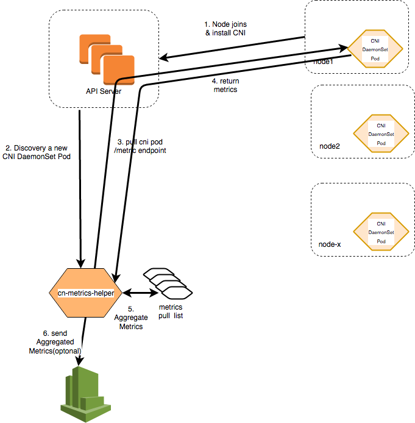
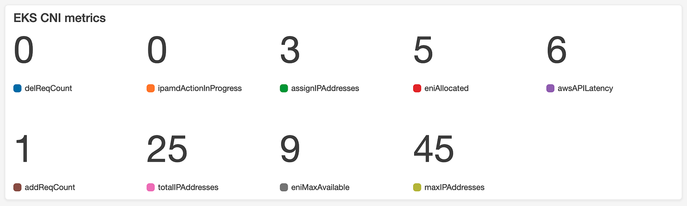

> **Kubernetes Network Monitoring 🕸**

The [CNI Metrics Helper](https://github.com/aws/amazon-vpc-cni-k8s/tree/master/cmd/cni-metrics-helper) plays an important role in the Amazon Elastic Kubernetes Service (EKS) by providing essential insights into the VPC CNI plugin's pod networking.

As a DaemonSet responsible for assigning IP addresses to pods, the VPC CNI plugin is a fundamental component of EKS clusters. In this context, the CNI Metrics Helper emerges as a valuable tool for tracking IP address allocation, troubleshooting issues, and providing insights for capacity planning within EKS clusters.

When managing an EKS cluster, it may be important to know how many IP addresses have been assigned and how many are available. The CNI Metrics Helper can help you track these metrics over time, troubleshoot/diagnose issues related to IP assignment and reclamation, and provide insights for capacity planning.

This blog post aims to unravel the significance of the CNI Metrics Helper in the context of Amazon EKS by exploring its ability to scrape elastic network interface and IP address information, aggregate it at a cluster level, and publish the metrics to Amazon CloudWatch.

## 📊 CNI Metrics Helper Fundamentals

The CNI Metrics Helper is a fundamental tool in the context of the Amazon VPC CNI plugin for Kubernetes. It is designed to perform the following key functions:

- **Scrape** elastic network interface (ENI) and IP address information from worker nodes.
- **Aggregate** the collected data at the cluster level.
- **Publish** the metrics to Amazon CloudWatch, including useful names such as `addReqCount`, `assignIPAddresses`, and `awsAPIErr`.

The tool requires the `cloudwatch:PutMetricData` IAM permission for publishing metrics. By default, IPAM publishes Prometheus metrics on `:61678/metrics`, which can be monitored and scraped for further analysis.

The CNI Metrics Helper is deployed as a Kubernetes deployment and can be installed and configured using the provided source code or as a Helm chart.

The CNI Metrics Helper is not only valuable for tracking IP address allocation, availability, and related metrics but also serves as an example for how to extract data from worker nodes, transform it into the proper format, and load it into CloudWatch as custom metrics, which can then be visualized in a dashboard.



As you can see in the diagram, the CNI Metrics Helper connects to the API Server over HTTPS (TCP/443), and another connection is created from the API Server to the worker node over HTTP (TCP/61678). If you deploy Amazon EKS with the recommended security groups from [Restricting cluster traffic](https://docs.aws.amazon.com/eks/latest/userguide/sec-group-reqs.html#security-group-restricting-cluster-traffic), then make sure that a security group is in place that allows the inbound connection from the API Server to the worker nodes over TCP/61678.

Adding the CNI Metrics Helper will publish the following metrics to CloudWatch:

```shell
"addReqCount",
"assignIPAddresses",
"awsAPIErr",
"awsAPILatency",
"awsUtilErr",
"delReqCount",
"eniAllocated",
"eniMaxAvailable",
"ipamdActionInProgress",
"ipamdErr",
"maxIPAddresses",
"podENIErr",
"reconcileCount",
"totalIPAddresses",
"totalIPv4Prefixes",
"totalAssignedIPv4sPerCidr"
```

---

As per [AWS EKS Security Best Practices](https://docs.aws.amazon.com/eks/latest/userguide/security-best-practices.html), if you are using IRSA for pods, then the following requirements must be satisfied to successfully publish metrics to CloudWatch:

### 📜 IAM Policy Requirements

The IAM Role for your Service Account (IRSA) must have the following policy attached:

```json
{
    "Version": "2012-10-17",
    "Statement": [
        {
            "Effect": "Allow",
            "Action": [
                "cloudwatch:PutMetricData"
            ],
            "Resource": "*"
        }
    ]
}
```

### 🛠️ Deployment Configuration

Specify the IRSA name in the `cni-metrics-helper` deployment spec along with the `AWS_CLUSTER_ID` (as described below). The value that you specify here will show up under the dimension `CLUSTER_ID` for your published metrics. Specifying a value for this field is mandatory only if you are blocking IMDS access.

An identifier for your Cluster which will be used as the dimension for published metrics. Ideally, it should be `ClusterName` or `ClusterID`.

For more details, refer to the [Amazon EKS User Guide](https://docs.aws.amazon.com/eks/latest/userguide/what-is-eks.html).

```shell
kind: Deployment
apiVersion: apps/v1
metadata:
  name: cni-metrics-helper
  namespace: kube-system
  labels:
    k8s-app: cni-metrics-helper
spec:
  selector:
    matchLabels:
      k8s-app: cni-metrics-helper
  template:
    metadata:
      labels:
        k8s-app: cni-metrics-helper
    spec:
      containers:
      - env:
        - name: AWS_CLUSTER_ID
          value: ""  
        - name: USE_CLOUDWATCH
          value: "true"
        name: cni-metrics-helper
        image: <image>
      serviceAccountName: <IRSA name>
```

### 🌍 Region and Cluster ID Configuration

With IRSA, the above deployment spec will be auto-injected with the `AWS_REGION` parameter, which will be used to fetch region information when publishing metrics. Possible scenarios for the above configuration:

- **Without IRSA**: Region and `CLUSTER_ID` information will be fetched using IMDS (should have access).
- **With IRSA but without `AWS_CLUSTER_ID`**: The value for `CLUSTER_ID` will be fetched if IMDS access is not blocked.
- **With IRSA and blocked IMDS access**: You must specify a value for `AWS_CLUSTER_ID` in the deployment spec.
- **With IRSA and specified `AWS_CLUSTER_ID`**: The specified value will be used.

### 🛠️ Installing and Configuring the Metrics Helper

The metrics helper is programmed to write metrics to CloudWatch every 30 seconds. If you want to decrease the frequency at which metrics are written to CloudWatch, you can adjust the configuration accordingly.

#### 📥 Installation Instructions

To install the CNI metrics helper, follow the instructions below:

1. **Add the EKS repository to Helm**:
    ```shell
    helm repo add eks https://aws.github.io/eks-charts
    ```

2. **Install the chart with the release name `cni-metrics-helper` and default configuration**:
    ```shell
    helm install cni-metrics-helper --namespace kube-system eks/cni-metrics-helper
    ```

3. **Manual Installation**:
- Clone the Amazon VPC CNI for Kubernetes repository to your local machine:
  
```shell
git clone https://github.com/aws/amazon-vpc-cni-k8s.git
```

- Use the Helm install command to install the chart into your Kubernetes cluster:

```shell
helm install cni-metrics-helper --namespace kube-system ./charts/cni-metrics-helper
```

### 📊 Creating a Metrics Dashboard

After deploying the CNI metrics helper, you can view the CNI metrics in the Amazon CloudWatch console.

#### Steps to Create a CNI Metrics Dashboard:

1. Open the CloudWatch console at [Amazon CloudWatch Console](https://console.aws.amazon.com/cloudwatch/).
2. In the left navigation pane, choose **Metrics** and then select **All metrics**.
3. Choose the **Graphed metrics** tab.
4. Choose **Add metrics using browse or query**.
5. Ensure that under **Metrics**, you've selected the AWS Region for your cluster.
6. In the **Search** box, enter `Kubernetes` and press Enter.
7. Select the metrics that you want to add to the dashboard.
8. At the upper right of the console, select **Actions**, and then **Add to dashboard**.
9. In the **Select a dashboard** section, choose **Create new**, enter a name for your dashboard, such as `EKS-CNI-metrics`, and then choose **Create**.
10. In the **Widget type** section, select **Number**.
11. In the **Customize widget title** section, enter a logical name for your dashboard title, such as `EKS CNI metrics`.
12. Choose **Add to dashboard** to finish. Now your CNI metrics are added to a dashboard that you can monitor.

For more information about Amazon CloudWatch Logs metrics, see [Using Amazon CloudWatch metrics](https://docs.aws.amazon.com/AmazonCloudWatch/latest/monitoring/working_with_metrics.html) in the Amazon CloudWatch User Guide.



**Get cni-metrics-helper logs:**

```shell
kubectl get pod -n kube-system
NAME                                  READY     STATUS    RESTARTS   AGE
aws-node-248ns                        1/1       Running   0          6h
aws-node-257bn                        1/1       Running   0          2h
...
cni-metrics-helper-6dcff5ddf4-v5l6d   1/1       Running   0          7h
kube-dns-75fddcb66f-48tzn             3/3       Running   0          1d
```

```shell
kubectl logs cni-metrics-helper-6dcff5ddf4-v5l6d -n kube-system
```

**cni-metrics-helper key log messages:**

Example of some aggregated metrics

```shell
I0516 17:11:58.489648       7 metrics.go:350] Produce GAUGE metrics: ipamdActionInProgress, value: 0.000000
I0516 17:11:58.489657       7 metrics.go:350] Produce GAUGE metrics: assignIPAddresses, value: 2.000000
I0516 17:11:58.489665       7 metrics.go:350] Produce GAUGE metrics: totalIPAddresses, value: 11186.000000
I0516 17:11:58.489674       7 metrics.go:350] Produce GAUGE metrics: eniMaxAvailable, value: 800.000000
I0516 17:11:58.489685       7 metrics.go:340] Produce COUNTER metrics: ipamdErr, value: 1.000000
I0516 17:11:58.489695       7 metrics.go:350] Produce GAUGE metrics: eniAllocated, value: 799.000000
I0516 17:11:58.489715       7 metrics.go:350] Produce GAUGE metrics: maxIPAddresses, value: 11200.000000
```

## Conclusion

The CNI Metrics Helper is a valuable tool that provides insights into IP address allocation, availability, and related metrics for the Amazon VPC CNI plugin in Kubernetes. It can be used to troubleshoot, diagnose issues, and plan for capacity.

**_Until next time, つづく 🎉_**

<br><br>

> 💡 Thank you for Reading !! 🙌🏻😁📃, see you in the next blog.🤘  **_Until next time 🎉_**

🚀 Thank you for sticking up till the end. If you have any questions/feedback regarding this blog feel free to connect with me:

**♻️ LinkedIn:** https://www.linkedin.com/in/rajhi-saif/

**♻️ X/Twitter:** https://x.com/rajhisaifeddine

**The end ✌🏻**

<h1 align="center">🔰 Keep Learning !! Keep Sharing !! 🔰</h1>

**📅 Stay updated**

Subscribe to our newsletter for more insights on AWS cloud computing and containers.
