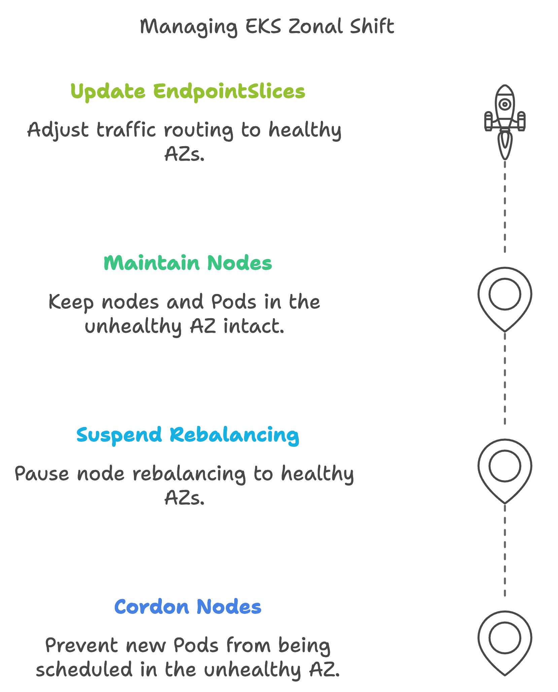
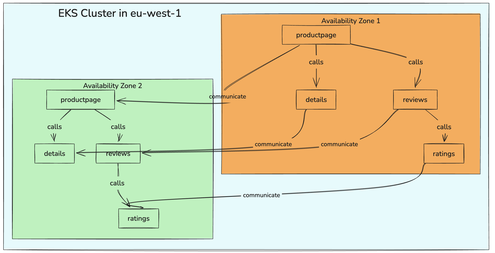
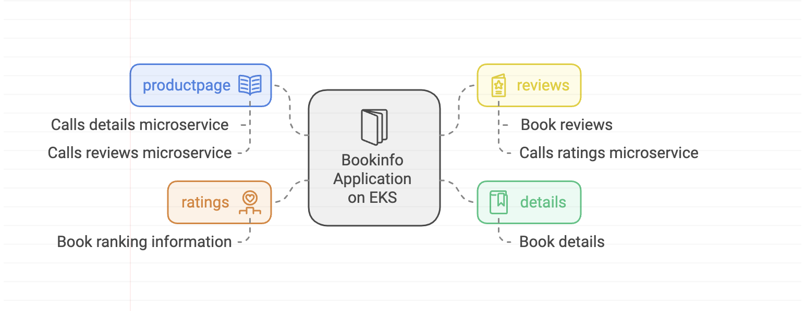

> **Maintaining apps' availability during zones and regions outages**

## 🔊 Introduction

Amazon Elastic Kubernetes Service (EKS) is a widely used managed Kubernetes service for running applications in the cloud. However, cloud parts, known as Availability Zones (AZs) or Regions, can experience outages, disrupting your applications.

To address this, Amazon provides the Application Recovery Controller (ARC) with a key feature called zonal shift, which redirects traffic away from affected zones, ensuring operational reliability.

In this blog post, we will explore how ARC zonal shift works within Amazon EKS, its benefits, and why it is essential for maintaining application availability during outages.

Let’s dive in!

### ⚡ What is the Application Recovery Controller (ARC)?

[The Application Recovery Controller (ARC)](https://aws.amazon.com/application-recovery-controller/) helps manage and coordinate the recovery of applications across different AWS Regions and AZs. It provides insights into recovery readiness, making it easier to handle issues when they arise.

ARC supports the following resources for zonal shift and zonal autoshift:

- [Amazon Elastic Kubernetes Service](https://docs.aws.amazon.com/r53recovery/latest/dg/arc-zonal-shift.resource-types.eks.html)
- [Application Load Balancers](https://docs.aws.amazon.com/r53recovery/latest/dg/arc-zonal-shift.resource-types.app-load-balancers.html) with cross-zone load balancing disabled
- [Network Load Balancers](https://docs.aws.amazon.com/r53recovery/latest/dg/arc-zonal-shift.resource-types.network-load-balancers.html) with cross-zone load balancing enabled or disabled

**Benefits of ARC:**

- **Manage Recovery for Multi-AZ and Multi-Region Applications**: Quickly address problems for applications spanning multiple AZs or Regions, supporting both active-active and active-standby setups.
- **Validate Recovery Readiness**: Continuously monitor resources, checking limits, capacity, and configurations, and suggest fixes.
- **Maintain High Availability**: Manage failures for critical applications by quickly shifting traffic between environments.
- **Automate Recovery**: Automatically redirect traffic away from an AZ when AWS detects a potential failure.

### What is ARC Zonal Shift?

[ARC zonal shift](https://docs.aws.amazon.com/r53recovery/latest/dg/arc-zonal-autoshift.html) automatically moves network traffic away from an AZ experiencing problems, keeping applications running smoothly.

**How It Helps During AZ Problems**  
When an AZ faces issues, zonal shift quickly redirects traffic to healthy AZs, reducing downtime and maintaining a better user experience.

### How Does Zonal Shift Work?

**Shifting Traffic Away from an Impaired AZ**  
When an AZ is identified as having problems, zonal shift activates, redirecting traffic to healthy AZs to minimize user impact.

**Role of AWS in Managing This Process**  
AWS continuously monitors AZ health and automatically triggers zonal shifts, ensuring traffic is redirected without manual intervention.

### Benefits of Using ARC Zonal Shift

1. **Faster Recovery**: Allows for quicker recovery during outages by redirecting traffic to healthy AZs.
2. **Reduced Downtime**: Significantly reduces downtime by automatically managing traffic during AZ problems.
3. **Simplified Application Management**: Automates traffic redirection, reducing the workload on your team.
4. **Enhanced Reliability**: Quickly shifts traffic away from impaired zones, maintaining high availability.
5. **Improved User Experience**: Minimizes downtime, ensuring applications remain accessible.

### Amazon Application Recovery Controller’s (ARC) Zonal Shift in Amazon EKS

#### EKS Zonal Shift Requirements

To ensure effective ARC zonal shift in Amazon EKS:

1. **Distribute Worker Nodes Across Multiple AZs**: Protect applications from issues in any single AZ.
2. **Ensure Sufficient Compute Capacity**: Handle the loss of one AZ.
3. **Pre-scale Your Pods**: Ensure enough Pods are ready to manage traffic.
4. **Spread Pod Replicas Across AZs**: Maintain capacity in healthy AZs.
5. **Co-locate Related Pods**: Maintain performance and connectivity.
6. **Test Your Setup**: Verify cluster functionality with one less AZ.

Kubernetes has built-in features for resilience during AZ impairments. Using ARC with zonal shift and zonal autoshift enhances fault tolerance and recovery capabilities in Amazon EKS.

During an EKS zonal shift:

- Nodes in the impacted AZ are cordoned to prevent new Pods from being scheduled there.
- Availability Zone rebalancing is suspended for Managed Node Groups.
- Nodes in the unhealthy AZ are not terminated, and Pods are not evicted. This is to make sure that when a zonal shift expires or gets cancelled, the traffic can be safely returned to the AZ which still has full capacity
- The EndpointSlice controller removes Pod endpoints in the impaired AZ from relevant EndpointSlices.

## Real-World Example

Consider an EKS cluster spread across three AZs. If one AZ experiences an outage, ARC zonal shift redirects traffic to the remaining healthy AZs, ensuring minimal interruption.

### Bookinfo Application on Amazon EKS

The Bookinfo application, deployed in Amazon EKS, consists of four microservices operating across multiple AZs in the eu-west-1 region:

1. **Productpage**: Aggregates data from details and reviews microservices.
2. **Details**: Provides detailed information about books.
3. **Reviews**: Manages user-generated reviews.
4. **Ratings**: Handles ranking information for books.

**Deployment in Amazon EKS**  
Deployed in Amazon EKS, the application benefits from high availability and scalability, distributed across multiple AZs.

**How to Use Zonal Shift**  
Initiate a zonal shift manually or enable **zonal autoshift** for automatic traffic updates.

**Hands-On: Simulating an AZ Outage**
To test ARC zonal shift, you can simulate an AZ outage by manually cordoning and draining nodes in one of the AZs. This will mimic an AZ impairment and allow you to observe how ARC handles traffic redirection. Use `kubectl cordon <node-name>` and `kubectl drain <node-name> --ignore-daemonsets --delete-local-data` to simulate the outage.

Monitor your application to ensure traffic is redirected to healthy AZs and verify application availability. After testing, uncordon the nodes using `kubectl uncordon <node-name>` to revert the simulation.

**Routing Traffic with Load Balancers**  
Application Load Balancers (ALBs) and Network Load Balancers (NLBs) automatically route traffic to healthy AZs during a zonal shift.

### Understanding the Importance of ARC Zonal Shift

ARC zonal shift automates recovery by redirecting traffic away from impaired AZs, avoiding lengthy recovery steps and extended downtime.

### Integration with AWS Services

ARC zonal shift modifies network traffic routing, working seamlessly with AWS Load Balancers and interacting with Amazon EC2 Auto Scaling Groups.

### Enhancing Resilience Beyond Kubernetes Protections

ARC zonal shift complements Kubernetes' built-in protections, providing an additional layer of safety by isolating degraded AZs.

### Automation with Zonal Autoshift

Enable ARC zonal autoshift for AWS to monitor AZ health and automatically trigger shifts, ensuring minimal disruption.

### Preparing for Zonal Shifts

Pre-scale resources to ensure application availability during AZ issues.

### Considerations for Stateful Applications

Assess fault tolerance for stateful applications, ensuring connectivity to persistent volumes in healthy AZs.

### Compatibility with Karpenter and EKS Fargate

Karpenter does not support ARC zonal shift. Adjust NodePool configuration for new worker nodes in healthy AZs. ARC zonal shift does not apply to EKS Fargate.

### Impact on the EKS Control Plane

ARC zonal shift affects the Kubernetes data plane, not the control plane.

### Cost Considerations

ARC zonal shift and zonal autoshift are available at no extra charge, but you will incur costs for provisioned instances. Pre-scale your Kubernetes data plane to balance cost and availability effectively.

## Conclusion

In this blog post, we explored the Amazon Application Recovery Controller (ARC) and its zonal shift feature, which is very important for maintaining application availability during AZ outages. We discussed how ARC zonal shift works, its benefits, and the steps to prepare your EKS cluster for effective zonal shifts. Additionally, we provided a hands-on guide to simulate an AZ outage and test the functionality of ARC zonal shift.

By making use of ARC zonal shift, you can enhance the resilience and reliability of your applications running on Amazon EKS. This feature ensures that your applications remain operational even during unexpected AZ impairments, providing a seamless user experience and reducing downtime.

**References and links for further reading:**

1. **Amazon Application Recovery Controller (ARC)**:
   - [The Application Recovery Controller (ARC)](https://aws.amazon.com/application-recovery-controller/)

2. **ARC Zonal Shift Documentation**:
   - [ARC Zonal Shift](https://docs.aws.amazon.com/r53recovery/latest/dg/arc-zonal-autoshift.html)

3. **ARC Supported Resources**:
   - [Amazon Elastic Kubernetes Service](https://docs.aws.amazon.com/r53recovery/latest/dg/arc-zonal-shift.resource-types.eks.html)
   - [Application Load Balancers](https://docs.aws.amazon.com/r53recovery/latest/dg/arc-zonal-shift.resource-types.app-load-balancers.html)
   - [Network Load Balancers](https://docs.aws.amazon.com/r53recovery/latest/dg/arc-zonal-shift.resource-types.network-load-balancers.html)

4. **Kubernetes Commands**:
   - [kubectl cordon](https://kubernetes.io/docs/reference/generated/kubectl/kubectl-commands#cordon)
   - [kubectl drain](https://kubernetes.io/docs/reference/generated/kubectl/kubectl-commands#drain)
   - [kubectl uncordon](https://kubernetes.io/docs/reference/generated/kubectl/kubectl-commands#uncordon)

**_Until next time, つづく 🎉_**

  

> 💡 Thank you for Reading !! 🙌🏻😁📃, see you in the next blog.🤘  **_Until next time 🎉_**

🚀 Thank you for sticking up till the end. If you have any questions/feedback regarding this blog feel free to connect with me:

**♻️ LinkedIn:** https://www.linkedin.com/in/rajhi-saif/

**♻️ X/Twitter:** https://x.com/rajhisaifeddine

**The end ✌🏻**

<h1 align="center">🔰 Keep Learning !! Keep Sharing !! 🔰</h1>

**📅 Stay updated**

Subscribe to our newsletter for more insights on AWS cloud computing and containers.
