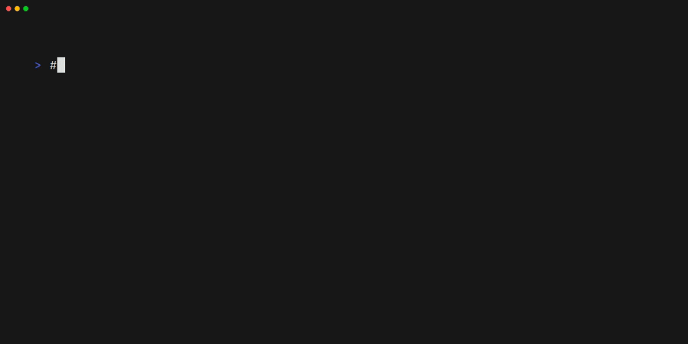

> **One-Stop-Shop for CLI Tools 🛒**

## 📑 〽️ Introduction

As a Platform or SRE engineer, you know how important it is to have the right tools at your disposal.

Whether you're working with CLI tools or Kubernetes applications, having the latest versions of your favorite tools can make all the difference. That's where Arkade comes in.

[Arkade](https://github.com/alexellis/arkade) is an open-source marketplace for developer tools that simplifies the installation process, making it easy to get the tools you need with just a single command.

In this blog post, we'll take a closer look at Arkade and explore why it's become known as the Swiss Army Knife of developers. By the end of this post, you'll have a better understanding of what Arkade is, how it can benefit you as a developer, and how to get started using it.

So, let's dive in and explore the world of Arkade!

### Intro to Arkade



Arkade is how developers install the latest versions of their favorite CLI tools and Kubernetes apps. With `arkade get`, you'll have `kubectl`, `kind`, `terraform`, and `jq` on your machine faster than you can type `apt-get install` or `brew update`.

With over 120 CLIs and 55 Kubernetes apps (charts, manifests, installers) available for Kubernetes, gone are the days of contending with dozens of README files just to set up a development stack with the usual suspects like `ingress-nginx`, `Postgres`, and `cert-manager`.

### Getting Arkade

```shell
# Note: you can also run without `sudo` and move the binary yourself
curl -sLS https://get.arkade.dev | sudo sh
arkade --help
ark --help  # a handy alias
# Windows users with Git Bash
curl -sLS https://get.arkade.dev | sh
```

Windows users: Arkade requires bash to be available, therefore Windows users should [install and use Git Bash](https://git-scm.com/downloads). An alias of `ark` is created at installation time, so you can also run `ark install APP`.

### Usage Overview

Arkade can be used to install Kubernetes apps or to download CLI tools.

- `arkade install` - install a Kubernetes app
- `arkade info` - see the post-installation screen for a Kubernetes app
- `arkade get` - download a CLI tool
- `arkade update` - perform a self-update of Arkade on MacOS and Linux

An Arkade "app" could represent a Helm chart such as `openfaas/faas-netes`, a custom CLI installer such as `istioctl`, or a set of static manifests (i.e., `MetalLB`). An Arkade "tool" is a CLI that can be downloaded for your operating system. Arkade downloads statically linked binaries from their upstream locations on GitHub or the vendor's chosen URL such as with `kubectl` and `terraform`.

Did you know? Arkade users run `arkade get` both on their local workstations and on their CI runners such as GitHub Actions or Jenkins.

### Download CLI Tools with Arkade

Arkade downloads the correct version of a CLI for your OS and CPU with automatic detection of Windows / MacOS / Linux / Intel / ARM.

```shell
# Download a binary release of a tool
arkade get kubectl
# Download a specific version of that tool
arkade get kubectl@v1.22.0
# Download multiple tools at once
arkade get kubectl \
    helm \
    istioctl
# Download multiple specific versions
arkade get faas-cli@0.13.15 \
    kubectl@v1.22.0
# Override machine os/arch
arkade get faas-cli \
    --arch arm64 \
    --os linux
# Override machine os/arch
arkade get faas-cli \
    --arch arm64 \
    --os darwin
```

This is a time saver compared to searching for download pages every time you need a tool. Files are stored at `$HOME/.arkade/bin/`.

Want to download tools to a custom path such as into the GitHub Actions cached tool folder?

```shell
arkade get faas-cli kubectl \
    --path $HOME/runner/_work/_tools
```

```shell
# Usage:
# /runner/_work/_tools/faas-cli version
PATH=$PATH:$HOME/runner/_work/_tools
faas-cli version
```

Think of `arkade get TOOL` as doing for CLIs what `arkade install` does for Helm. Adding a new tool for download is as simple as editing [tools.go](https://github.com/alexellis/arkade/blob/master/pkg/get/tools.go).

[Click here for the full catalog of CLIs](https://github.com/alexellis/arkade?tab=readme-ov-file#catalog-of-clis).

### Install System Packages

System packages are tools designed for installation on a Linux workstation, server, or CI runner. These are a more limited group of applications designed for quick setup, scripting, and CI, and generally do not fit into the `arkade get` pattern due to additional installation steps or system configuration.

```shell
# Show packages
arkade system install
# Show package flags
arkade system install go --help
# Install latest version of Go to /usr/local/bin/go
arkade system install go
# Install Go 1.18 to /tmp/go
arkade system install go \
    --version 1.18 \
    --path /tmp/
# Install containerd for ARM64, 32-bit ARM or x86_64
# with systemd enabled
arkade system install containerd \
    --systemd
```

Run the following to see what's available:

```shell
arkade system install
```

```shell
actions-runner  Install GitHub Actions Runner
buildkitd       Install Buildkitd
cni             Install CNI plugins
containerd      Install containerd
firecracker     Install Firecracker
gitlab-runner   Install Gitlab Runner
go              Install Go
node            Install Node.js
prometheus      Install Prometheus
tc-redirect-tap Install tc-redirect-tap
registry        Install Open Source Registry implementation for storing and distributing container images using the OCI Distribution Specification
```

### Install CLIs during CI with GitHub Actions

[alexellis/arkade-get@master](https://github.com/alexellis/arkade-get)

Example downloading `faas-cli` (specific version) and `kubectl` (latest), putting them into the PATH automatically, and executing one of them in a subsequent step.

```shell
- uses: alexellis/arkade-get@master
    with:
        kubectl: latest
        faas-cli: 0.14.10
- name: check for faas-cli
    run: |
        faas-cli version
```

If you just need system applications, you could also try "setup-arkade":

[alexellis/setup-arkade@master](https://github.com/alexellis/setup-arkade)

```shell
- uses: alexellis/setup-arkade@v2
- name: Install containerd and go
    run: |
        arkade system install containerd
        arkade system install go
```

### Verify and Upgrade Images in Helm Charts

There are two commands built into Arkade designed for software vendors and open source maintainers.

- `arkade helm chart upgrade` - run this command to scan for container images and update them automatically by querying a remote registry.
- `arkade helm chart verify` - after changing the contents of a `values.yaml` or `docker-compose.yaml` file, this command will check each image exists on a remote registry.

Whilst end-users may use a GitOps-style tool to deploy charts and update their versions, maintainers need to make conscious decisions about when and which images to change within a Helm chart or compose file. These two features are used by OpenFaaS Ltd on projects and products like OpenFaaS CE/Pro (Serverless platform) and faasd (docker-compose file).

### 📑 Conclusion

Arkade is an open-source marketplace for developer tools that simplifies the process of installing and managing CLI tools, Kubernetes applications, and system packages. It offers a one-stop-shop solution for developers, making it easier to find and install the latest versions of their favorite tools.

**_Until next time, つづく 🎉_**

<br><br>

> 💡 Thank you for Reading !! 🙌🏻😁📃, see you in the next blog.🤘  **_Until next time 🎉_**

🚀 Thank you for sticking up till the end. If you have any questions/feedback regarding this blog feel free to connect with me:

**♻️ LinkedIn:** https://www.linkedin.com/in/rajhi-saif/

**♻️ X/Twitter:** https://x.com/rajhisaifeddine

**The end ✌🏻**

<h1 align="center">🔰 Keep Learning !! Keep Sharing !! 🔰</h1>

**📅 Stay updated**

Subscribe to our newsletter for more insights on AWS cloud computing and containers.
