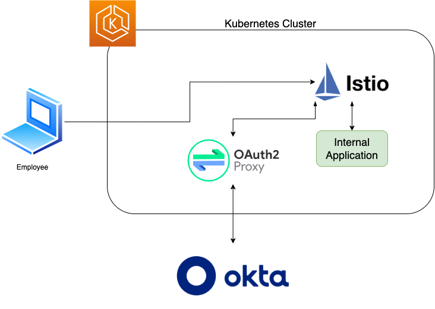
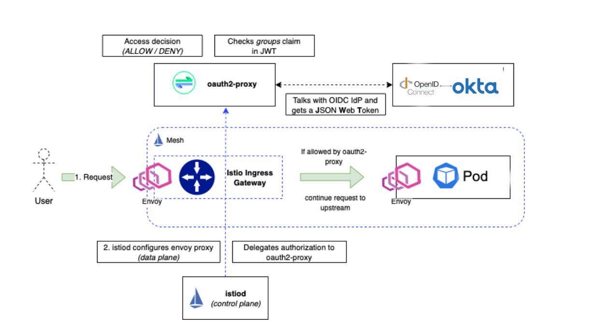
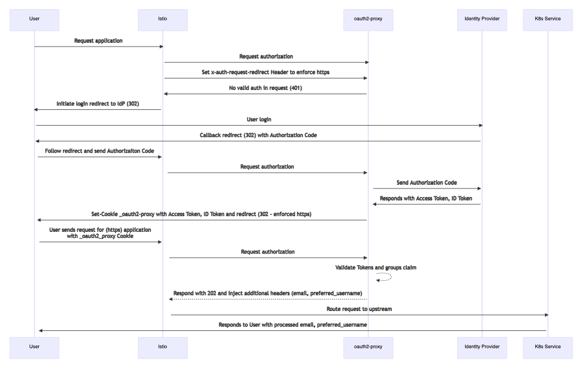
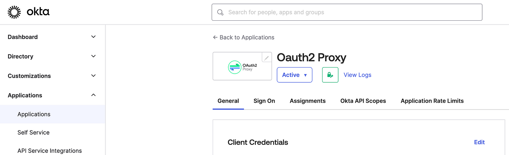
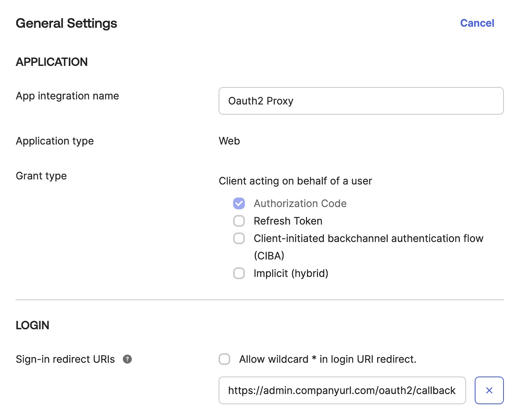

> **Secure authentication and authorization for Kubernetes apps 👮‍♀**

## 📑 Introduction

Authenticating applications on Kubernetes can be a complex process, but integrating [Okta](https://www.okta.com/), [Istio](https://istio.io/), and [OAuth2-Proxy](https://github.com/oauth2-proxy/oauth2-proxy) provides a powerful solution.

This guide will walk you through the steps to establish a robust and secure authentication framework for your Kubernetes-based applications.

From using Istio for [OpenID Connect (OIDC)](https://openid.net/) authentication to leveraging OAuth2-Proxy for seamless interaction with identity providers like Okta, this integration allows you to enforce user authentication and authorization with confidence.



## Workflow and Architecture Diagram



1. An employee tries to access an internal application (e.g., admin-service).
2. The employee connects to the application URL, and the request is sent to the Istio service mesh inside our Kubernetes cluster.
3. The request arrives via the [Istio Ingress Gateway](https://istio.io/latest/docs/tasks/traffic-management/ingress/ingress-control/).
4. We have an Istio authorization policy that limits access to the admin service.
5. The authorization policy points to the custom extension provider, OAuth2-Proxy. OAuth2-Proxy is set up to connect with our identity provider, Okta.
6. When the user is authenticated successfully with our IdP, OAuth2-Proxy gets a JWT back and looks into the "groups" claim. This will be evaluated against any groups we have configured, let's say "admins". If the "admins" group is found in the JWT groups claim, OAuth2-Proxy puts the token into a cookie and sends it back to the requesting client — our user.
7. The employee's request is redirected to Okta for login. On successful authentication, it passes through the Istio authorization policy and connects with the admin service.
8. The user will now be forwarded to the actual application. If the application supports it (e.g., [Grafana](https://grafana.com/)), we can configure the application to look into the headers we inject with OAuth2-Proxy. This allows us to set, for example, the `preferred_username` or `email` attributes in the application - info we get from the ID token claims.



### Technologies Used

- AWS EKS Kubernetes
- Istio
- OAuth2-Proxy
- Helm
- Okta
- [Grafana](https://grafana.com/)

## Setup Okta Application for OAuth2-Proxy

This Okta application will allow for access management to your application.





Be sure to include the URL of your internal application as the sign-in redirect URI in Okta. This allows Okta to redirect to your internal app after authenticating an employee.

You can also add other internal app URLs to this application. However, be aware that any Okta users or groups added to this Okta application will be able to access every internal application URL listed.

If you need to control access to an application for specific groups, such as allowing only the finance team to access an application, you will need to create a separate OAuth2-Proxy app in Okta for each application you want to customize access to.

### Deploy OAuth2-Proxy to Kubernetes

OAuth2-Proxy is an open-source software handling the authentication flow needed for OAuth2 or in this case OIDC. This will handle the authentication flow and pass the needed token back to the application.

Install by replacing `oauth2-proxy-values.yaml` with your value then apply with:

```shell
helm repo add oauth2-proxy https://oauth2-proxy.github.io/manifests
helm repo update
helm install --values oauth2-proxy-values.yaml oauth2-proxy oauth2-proxy/oauth2-proxy
```

Where `oauth2-proxy-values.yaml`:

```shell
config:
  clientID: xx
  clientSecret: xx
  cookieSecret: xx
  configFile: false

extraArgs:
  provider: oidc
  cookie-secure: true
  cookie-samesite: lax
  cookie-refresh: 1h
  cookie-expire: 4h
  cookie-name: _oauth2_proxy_istio_ingressgateway
  set-authorization-header: true
  email-domain: "*"
  http-address: 0.0.0.0:4180
  upstream: static://200
  skip-provider-button: true
  oidc-issuer-url: {{ .Values | get "charts.oauth2-proxy.issuer" "https://your-okta.com" }}
service:
  portNumber: 4180

serviceAccount:
  enabled: false

resources:
  limits:
    cpu: 100m
    memory: 300Mi
  requests:
    cpu: 100m
    memory: 300Mi

livenessProbe:
  enabled: true
  initialDelaySeconds: 0
  timeoutSeconds: 1

readinessProbe:
  enabled: true
  initialDelaySeconds: 0
  timeoutSeconds: 1
  periodSeconds: 10
  successThreshold: 1

metrics:
  # Enable Prometheus metrics endpoint
  enabled: false

replicaCount: 2

podDisruptionBudget:
  enabled: true
  minAvailable: 1

topologySpreadConstraints:
  - maxSkew: 1
    topologyKey: topology.kubernetes.io/zone
    whenUnsatisfiable: ScheduleAnyway
    labelSelector:
      matchLabels:
        app.kubernetes.io/instance: {{ .Release.Name }}
```

### Add OAuth2-Proxy as an Extension Provider in Istio

Inside your Istio mesh config, you will need to add an [extension provider](https://istio.io/latest/docs/tasks/security/authorization/authz-custom/#define-the-external-authorizer). This will reference the OAuth2-Proxy deployment and will allow us to use OAuth2-Proxy as a CUSTOM action in our Istio Authorization Policy.

```yaml
meshConfig:
  extensionProviders:
  - name: oauth2-proxy
    envoyExtAuthzHttp:
      service: oauth2-proxy.oauth2-proxy.svc.cluster.local
      port: 4180
      headersToDownstreamOnDeny:
      - content-type
      - set-cookie
      headersToUpstreamOnAllow:
      - authorization
      - path
      - x-auth-request-user
      - x-auth-request-email
      - x-auth-request-access-token
      includeHeadersInCheck:
      - authorization
      - cookie
  defaultConfig:
    terminationDrainDuration: 310s
```

This config is creating a new provider with the name `oauth2-proxy`. This can later be used in the authorization-policy to route requests through the OAuth2-Proxy. The rest of this config is basically what headers to include to make sure the correct tokens are passed along.

### 🛡️ Add Istio Authorization Policy

Finally, apply the authorization policy to tell Istio what requests should be routed through the OAuth2-Proxy. This CUSTOM authorization policy allows us to restrict access to the host specified and authenticate via Okta and the OAuth2-Proxy. See the [Istio reference document](https://istio.io/latest/docs/tasks/security/authorization/authz-custom/) for more info.

```yaml
apiVersion: security.istio.io/v1beta1
kind: AuthorizationPolicy
metadata:
  name: oauth-policy
  namespace: istio-system
spec:
  selector:
    matchLabels:
      istio: ingressgateway
  action: CUSTOM
  provider:
    name: "oauth2-proxy"
  rules:
  - to:
    - operation:
        hosts:
          - <INTERNAL APPLICATION HOST>
```

The most important part of this config is the provider name which has to match the provider created in the `meshConfig` part of the `istio-controlplane.yaml` and the hosts list which is the host names that the policy applies to.

Apply by replacing `<INTERNAL APPLICATION HOST>` with your app URL in `authorization-policy.yaml` then run:

```shell
kubectl apply -f authorization-policy.yaml
```

### 🔐 Authentication and Authorization

If you have made it this far, you have probably heard of authentication vs authorization before. I just want to make it clear that this use case of Istio is only used for authentication. Istio will route to the authentication service and if a valid token is presented, it will pass you on to the application. This provides some security for all the applications, but the application will still have to be responsible for authorization and any form of RBAC.

## 🖋 Final Notes

This blog post aims to provide a clear understanding of how to use Istio and OAuth2-Proxy for authentication in Kubernetes applications. By following the steps outlined in the guide, you can ensure that your applications are secure and that user authentication and authorization are enforced with confidence.

The integration of Okta, Istio, and OAuth2-Proxy allows you to leverage the power of these tools to create a robust and secure authentication framework for your Kubernetes-based applications.

**References:**

- [Istio: External Authorization](https://istio.io/latest/docs/tasks/security/authorization/authz-custom/)
- [Welcome to OAuth2 Proxy | OAuth2 Proxy](https://oauth2-proxy.github.io/oauth2-proxy/)
- [Deep Dive Auth Policies - Lawrence Gadban](https://events.istio.io/istiocon-2021/slides/d8p-DeepDiveAuthPolicies-LawrenceGadban.pdf)
- [Alpha Configuration | OAuth2 Proxy](https://oauth2-proxy.github.io/oauth2-proxy/configuration/alpha-config)
- [OpenId Connect Scopes](https://developers.onelogin.com/openid-connect/scopes)
- [SaaS Identity and Routing with Istio Service Mesh and Amazon EKS | Amazon Web Services](https://aws.amazon.com/blogs/apn/saas-identity-and-routing-with-istio-service-mesh-and-amazon-eks/)
- [Istio OIDC Authentication | Jetstack Blog](https://venafi.com/blog/istio-oidc/)
- [Istio and OAuth2-Proxy in Kubernetes for Microservice Authentication](https://elastisys.com/istio-and-oauth2-proxy-in-kubernetes-for-microservice-authentication/)
- Alternative to OAuth2-Proxy: [Authservice](https://github.com/istio-ecosystem/authservice)
- Alternative to OAuth2-Proxy: [Open Policy Agent](http://openpolicyagent.org)

**_Until next time, つづく 🎉🇵🇸_**

<br><br>

> 💡 Thank you for Reading !! 🙌🏻😁📃, see you in the next blog.🤘  **_Until next time 🎉_**

🚀 Thank you for sticking up till the end. If you have any questions/feedback regarding this blog feel free to connect with me:

**♻️ LinkedIn:** https://www.linkedin.com/in/rajhi-saif/

**♻️ X/Twitter:** https://x.com/rajhisaifeddine

**The end ✌🏻**

<h1 align="center">🔰 Keep Learning !! Keep Sharing !! 🔰</h1>

**📅 Stay updated**

Subscribe to our newsletter for more insights on AWS cloud computing and containers.
