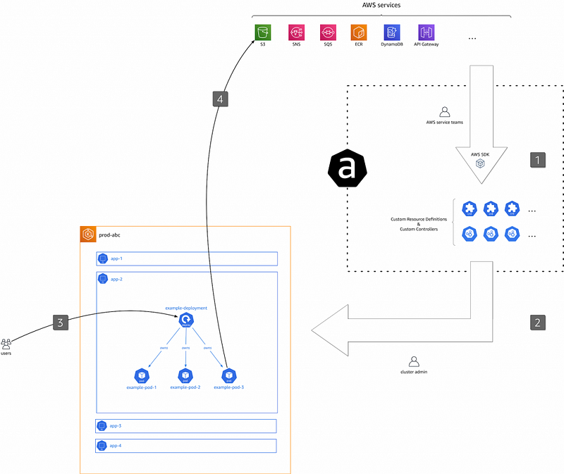

> **A Path to AWS Service Control in Kubernetes**

## 🤖 Introduction

[AWS Controllers for Kubernetes (ACK)](https://aws-controllers-k8s.github.io/community/docs/community/overview/) is an open-source project that lets you define and use AWS service resources directly from Kubernetes. This means that you can manage all of your application's resources, including its infrastructure and dependencies, from a single place.

ACK works by extending the Kubernetes API with custom resource definitions (CRDs) and custom controllers. These CRDs and controllers allow you to define and manage AWS service resources using the same Kubernetes constructs that you use to manage your application's other resources.

ACK makes it easy to take advantage of AWS managed services for your Kubernetes applications. With ACK, you don't need to worry about provisioning or managing the underlying infrastructure for these services. You can simply define the AWS service resources that you need in your Kubernetes cluster, and ACK will take care of the rest.

This article aims to discover this service and test it by installing a controller within a Kubernetes cluster.

### 🌟 What is the benefit of ACK?

ACK can be considered as an additional abstraction for managing AWS resources that is added to the existing solutions. Today, there are three levels of "abstraction" for infrastructure as code:

1. **Level 1**: Infrastructure as code defined as shell scripts. In this category, we can cite the launching of commands via the [AWS CLI](https://aws.amazon.com/cli/).
2. **Level 2**: The use of tools such as [Puppet](https://puppet.com/), [Terraform](https://www.terraform.io/), [Ansible](https://www.ansible.com/), and [Salt](https://saltproject.io/) to define step by step the infrastructure that we want to put in place.
3. **Level 3**: We only define the desired final state of the infrastructure. This is the level that ACK belongs to.

Currently, the use of AWS and Kubernetes represents a design complexity that is not easy to understand. Indeed, these architectures require the articulation of resources with each other in order to allow the general infrastructure to function properly. The understanding of the infrastructure in its entirety is therefore necessary and requires switching very regularly between the different technologies.

AWS offers us this new tool to allow its users to create new resources and control their current state. Thus, the user would only have to define the state of the desired AWS resource, and the controller would take care of bringing the resource from the current state to the desired state.

### ⚙️ How ACK works

Our goal with ACK is to provide a consistent Kubernetes interface for AWS, regardless of the AWS service API. One example of this is ensuring field names and identifiers are normalized and tags are handled the same way across AWS resources.



As depicted above, from a high level, the ACK workflow is as follows:

1. **Artifact Generation**: We, as in "the project team led by the authors", generate and maintain a collection of artifacts (binaries, container images, Helm charts, etc.). These artifacts are automatically derived from the AWS services APIs and represent the business logic of how to manage AWS resources from within Kubernetes.
2. **Controller Installation**: As a cluster admin, you select one or more ACK controllers you want to install and configure for a cluster you're responsible for.
3. **Custom Resource Creation**: As an application developer, you create (Kubernetes) custom resources representing AWS resources.
4. **Resource Management**: The respective ACK controller (installed in step 2) manages said custom resources and with it the underlying AWS resources. Based on the custom resource defined in step 3, the controller creates, updates, or deletes the underlying AWS resources using the AWS APIs.

## 🛠️ Hands-On for Testing ACK on a Kubernetes Cluster

**Required Tools:**

- 🐳 **Docker**
- 📦 **kubectl**
- 🎛️ **Helm 3**
- ☸️ **eksctl**

### Setting Up the EKS Cluster

To test this service, quickly set up an EKS Kubernetes cluster using the following command:

```sh
eksctl create cluster --name=ack-demo --nodes=2 --region=eu-west-1
```

You can consult the [CloudFormation stack on AWS](https://aws.amazon.com/cloudformation/) to learn more about the resources created previously.

### Installing an ACK Service Controller with Helm (Recommended)

The recommended way to install an ACK service controller for Kubernetes is to use [Helm 3.8+](https://helm.sh/docs/intro/install/).

Each ACK service controller has a separate Helm chart that installs the necessary supporting artifacts as a Kubernetes Deployment. This includes the ACK service controller, custom resource definitions (CRDs), and Kubernetes Role-Based Access Control (RBAC) manifests.

Helm charts for ACK service controllers can be found in the ACK registry within the [Amazon ECR Public Gallery](https://gallery.ecr.aws/aws-controllers-k8s). To find a Helm chart for a specific service, you can go to `gallery.ecr.aws/aws-controllers-k8s/$SERVICENAME-chart`. For example, the link to the ACK service controller Helm chart for Amazon Simple Storage Service (Amazon S3) is [gallery.ecr.aws/aws-controllers-k8s/s3-chart](https://gallery.ecr.aws/aws-controllers-k8s/s3-chart).

Helm charts for individual ACK service controllers are tagged with their release version. You can find charts for different releases under the **Image tags** section in the chart repository on the ECR Public Gallery.

Before installing a Helm chart, you can query the controller repository to find the latest release tag. This tag will correspond with a version of the Helm chart and a controller image. Then, you can use the Helm CLI to log into the ECR public Helm registry and install the chart.

```sh
export SERVICE=s3
export RELEASE_VERSION=$(curl -sL https://api.github.com/repos/aws-controllers-k8s/${SERVICE}-controller/releases/latest | jq -r '.tag_name | ltrimstr("v")')
export ACK_SYSTEM_NAMESPACE=ack-system
export AWS_REGION=eu-west-1

aws ecr-public get-login-password --region us-east-1 | helm registry login --username AWS --password-stdin public.ecr.aws
helm install --create-namespace -n $ACK_SYSTEM_NAMESPACE ack-$SERVICE-controller \
    oci://public.ecr.aws/aws-controllers-k8s/$SERVICE-chart --version=$RELEASE_VERSION --set=aws.region=$AWS_REGION
```

The `helm install` command should return relevant installation information:

```yaml
NAME: ack-s3-controller
LAST DEPLOYED: Thu Nov 02 10:30:16 2023
NAMESPACE: ack-system
STATUS: deployed
REVISION: 1
TEST SUITE: None
NOTES: ...
```

To verify that the Helm chart was installed, use the `helm list` command:

```sh
helm list --namespace $ACK_SYSTEM_NAMESPACE -o yaml
```

## 🔐 Configure IAM Permissions

### Set up ACK with IAM Roles for Service Accounts

IAM Roles for Service Accounts (IRSA) is a system that automates the provisioning and rotation of IAM temporary credentials (called a Web Identity) that a Kubernetes ServiceAccount can use to call AWS APIs.

The primary advantage of IRSA is that Kubernetes Pods which use the ServiceAccount associated with an IAM Role can have a reduced IAM permission footprint compared to the IAM Role in use for the Kubernetes EC2 worker node (known as the EC2 Instance Profile Role). This security concept is known as **Least Privilege**.

### Step 1: Create an OIDC Identity Provider for Your Cluster

Create an OpenID Connect (OIDC) identity provider for your EKS cluster using the `eksctl utils` command:

```shell
export EKS_CLUSTER_NAME=<eks cluster name>
export AWS_REGION=<aws region id>
eksctl utils associate-iam-oidc-provider --cluster $EKS_CLUSTER_NAME --region $AWS_REGION --approve
```

For detailed instructions, refer to the [Amazon EKS documentation](https://docs.aws.amazon.com/eks/latest/userguide/enable-iam-roles-for-service-accounts.html) on how to create an IAM OIDC provider for your cluster.

### Step 2. Create an IAM role and policy for your service account

```shell
# Update the service name variables as needed
SERVICE="s3"
AWS_ACCOUNT_ID=$(aws sts get-caller-identity --query "Account" --output text)
OIDC_PROVIDER=$(aws eks describe-cluster --name $EKS_CLUSTER_NAME --region $AWS_REGION --query "cluster.identity.oidc.issuer" --output text | sed -e "s/^https:\/\///")
ACK_K8S_NAMESPACE=ack-system

ACK_K8S_SERVICE_ACCOUNT_NAME=ack-$SERVICE-controller

read -r -d '' TRUST_RELATIONSHIP <<EOF
{
  "Version": "2012-10-17",
  "Statement": [
    {
      "Effect": "Allow",
      "Principal": {
        "Federated": "arn:aws:iam::${AWS_ACCOUNT_ID}:oidc-provider/${OIDC_PROVIDER}"
      },
      "Action": "sts:AssumeRoleWithWebIdentity",
      "Condition": {
        "StringEquals": {
          "${OIDC_PROVIDER}:sub": "system:serviceaccount:${ACK_K8S_NAMESPACE}:${ACK_K8S_SERVICE_ACCOUNT_NAME}"
        }
      }
    }
  ]
}
EOF

echo "${TRUST_RELATIONSHIP}" > trust.json

ACK_CONTROLLER_IAM_ROLE="ack-${SERVICE}-controller"
ACK_CONTROLLER_IAM_ROLE_DESCRIPTION="IRSA role for ACK ${SERVICE} controller deployment on EKS cluster using Helm charts"
aws iam create-role --role-name "${ACK_CONTROLLER_IAM_ROLE}" --assume-role-policy-document file://trust.json --description "${ACK_CONTROLLER_IAM_ROLE_DESCRIPTION}"
ACK_CONTROLLER_IAM_ROLE_ARN=$(aws iam get-role --role-name=$ACK_CONTROLLER_IAM_ROLE --query Role.Arn --output text)
```

### Attach IAM policy to the IAM role:

```shell
# Download the recommended managed and inline policies and apply them to the
# newly created IRSA role
BASE_URL=https://raw.githubusercontent.com/aws-controllers-k8s/${SERVICE}-controller/main
POLICY_ARN_URL=${BASE_URL}/config/iam/recommended-policy-arn
POLICY_ARN_STRINGS="$(wget -qO- ${POLICY_ARN_URL})"

INLINE_POLICY_URL=${BASE_URL}/config/iam/recommended-inline-policy
INLINE_POLICY="$(wget -qO- ${INLINE_POLICY_URL})"

while IFS= read -r POLICY_ARN; do
    echo -n "Attaching $POLICY_ARN ... "
    aws iam attach-role-policy \
        --role-name "${ACK_CONTROLLER_IAM_ROLE}" \
        --policy-arn "${POLICY_ARN}"
    echo "ok."
done <<< "$POLICY_ARN_STRINGS"

if [ ! -z "$INLINE_POLICY" ]; then
    echo -n "Putting inline policy ... "
    aws iam put-role-policy \
        --role-name "${ACK_CONTROLLER_IAM_ROLE}" \
        --policy-name "ack-recommended-policy" \
        --policy-document "$INLINE_POLICY"
    echo "ok."
fi
```

### Step 3. Associate an IAM role to a service account and restart deployment

If you installed your [ACK service controller using a Helm chart](https://aws-controllers-k8s.github.io/community/docs/user-docs/install/), then a service account already exists on your cluster.

> However, it is still neccessary to associate an IAM role with the service account.

Verify that your service account exists using kubectl describe:

```shell
kubectl describe serviceaccount/$ACK_K8S_SERVICE_ACCOUNT_NAME -n $ACK_K8S_NAMESPACE
```

Note that the Amazon Resource Name (ARN) of the IAM role that you created is not yet set as an annotation for the service account.

Use the following commands to associate an IAM role to a service account:

```shell
# Annotate the service account with the ARN
export IRSA_ROLE_ARN=eks.amazonaws.com/role-arn=$ACK_CONTROLLER_IAM_ROLE_ARN
kubectl annotate serviceaccount -n $ACK_K8S_NAMESPACE $ACK_K8S_SERVICE_ACCOUNT_NAME $IRSA_ROLE_ARN
```

Restart ACK service controller deployment using the following commands. The restart will update service controller pods with IRSA environment variables:

```shell
# Note the deployment name for ACK service controller from following command
kubectl get deployments -n $ACK_K8S_NAMESPACE
kubectl -n $ACK_K8S_NAMESPACE rollout restart deployment <ACK deployment name>
```

## Create an ACK Resource

**Create an S3 bucket:**

```shell
export AWS_ACCOUNT_ID=$(aws sts get-caller-identity --query "Account" --output text)
export BUCKET_NAME=my-ack-s3-bucket-$AWS_ACCOUNT_ID
read -r -d '' BUCKET_MANIFEST <<EOF
apiVersion: s3.services.k8s.aws/v1alpha1
kind: Bucket
metadata:
  name: $BUCKET_NAME
spec:
  name: $BUCKET_NAME
EOF
echo "${BUCKET_MANIFEST}" > bucket.yaml
kubectl create -f bucket.yaml
kubectl describe bucket/$BUCKET_NAME
```

**Update the S3 bucket:**

```shell
read -r -d '' BUCKET_MANIFEST <<EOF
apiVersion: s3.services.k8s.aws/v1alpha1
kind: Bucket
metadata:
  name: $BUCKET_NAME
spec:
  name: $BUCKET_NAME
  tagging:
    tagSet:
    - key: myTagKey
      value: myTagValue
EOF

echo "${BUCKET_MANIFEST}" > bucket.yaml
kubectl apply -f bucket.yaml
kubectl describe bucket/$BUCKET_NAME
```

**Delete the S3 bucket:**

```shell
kubectl delete -f bucket.yaml
# verify the bucket no longer exists
kubectl get bucket/$BUCKET_NAME
```

## What can we learn from this exploration?

The ACK service offers significant benefits for managing AWS resources through Kubernetes. However, it is best suited for organizations with advanced proficiency in both AWS and Kubernetes. A strong understanding of these technologies by the DevOps team is crucial for effectively implementing ACK. This includes managing resource separation into namespaces and addressing security concerns related to AWS resource management from Kubernetes.

To adhere to a "least privilege" policy, Kubernetes users should be granted access only to the necessary namespaces. Implementing and maintaining this level of granularity can be challenging in large organizations where teams require access to numerous resources.

<br>

**_Until next time, つづく 🎉_**

> 💡 Thank you for Reading !! 🙌🏻😁📃, see you in the next blog.🤘  _**Until next time 🎉**_

🚀 Thank you for sticking up till the end. If you have any questions/feedback regarding this blog feel free to connect with me:

**♻️ LinkedIn:** https://www.linkedin.com/in/rajhi-saif/

**♻️ X/Twitter:** https://x.com/rajhisaifeddine

**The end ✌🏻**

<h1 align="center">🔰 Keep Learning !! Keep Sharing !! 🔰</h1>

**📅 Stay updated**

Subscribe to our newsletter for more insights on AWS cloud computing and containers.
