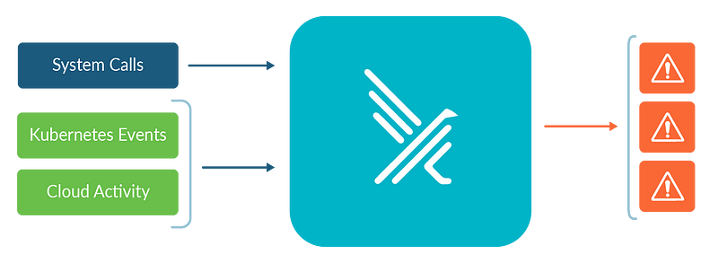
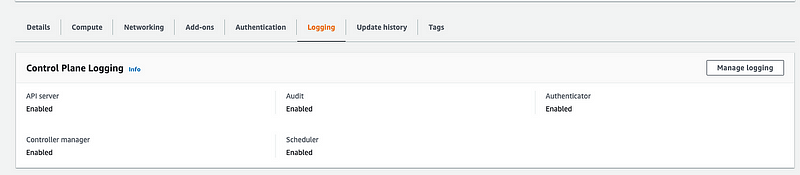
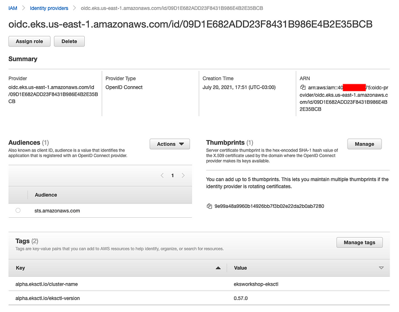
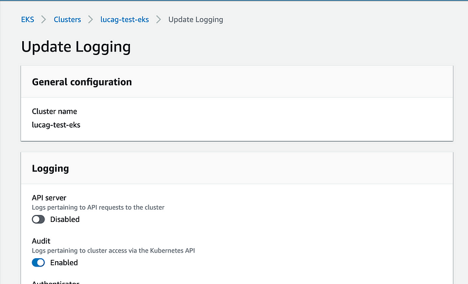
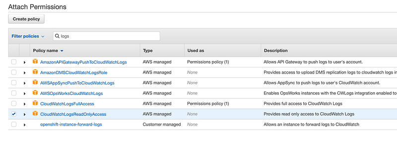

> **🔍 Detecting Threats in AWS EKS Audit Logs with Falco**

## 📑 Introduction

AWS EKS Audit Logs provide a detailed record of all activity on your EKS cluster, including user actions, API calls, and system events. This information can be used to track changes to your cluster, detect suspicious activity, and troubleshoot problems.

[Falco](https://github.com/falcosecurity/falco) is a Kubernetes threat detection engine that can be used to monitor AWS EKS Audit Logs for suspicious activity. Falco uses a [set of rules](https://github.com/falcosecurity/rules/tree/main/rules) to detect events that may indicate a security breach or attack. For example, Falco can detect events such as:

- Containers running with elevated privileges
- Containers accessing sensitive files or resources
- Containers communicating with known malicious IP addresses

By monitoring [AWS EKS Audit Logs](https://docs.aws.amazon.com/eks/latest/userguide/control-plane-logs.html) with Falco, you can improve the security of your Kubernetes clusters and detect threats early.

In this blog post, we will show you how to configure Falco to monitor AWS EKS Audit Logs. We will also discuss some of the benefits of using Falco to monitor EKS Audit Logs.



## 🛡️ Falco: What is it and How it Works

Falco is a Kubernetes threat detection engine. Falco supports Kubernetes [Audit Events](https://kubernetes.io/docs/tasks/debug/debug-cluster/audit/#audit-backends) to track the changes defined in k8s audit rules made to your cluster.

Unfortunately, AWS EKS is a managed Kubernetes service, and it only can send audit logs to CloudWatch. This means there is no direct way for Falco to inspect the EKS audit events. We need to implement a solution to ship audit logs from CloudWatch to Falco.

There are three solutions:

1. [EKS CloudWatch](https://github.com/sysdiglabs/ekscloudwatch)
2. [Falco EKS Audit Bridge](https://github.com/xebia/falco-eks-audit-bridge) (Not recommended due to complexity and additional setup requirements like S3 bucket and AWS Kinesis Firehose service)
3. [Kubernetes Audit Events Plugin for EKS](https://github.com/falcosecurity/plugins/tree/master/plugins/k8saudit-eks#kubernetes-audit-events-plugin-for-eks): This plugin supports consuming Kubernetes Audit Events stored in CloudWatch Logs for the EKS Clusters.

## 📋 Prerequisites

**🔧 Enable Audit in EKS Cluster**
Ensure that audit logging is enabled in your EKS cluster:



**🔐 Enable IAM Roles for Service Accounts (IRSA)**

[Enable IAM Roles for Service Accounts (IRSA)](https://docs.aws.amazon.com/emr/latest/EMR-on-EKS-DevelopmentGuide/setting-up-enable-IAM.html) on the EKS cluster if you have not enabled it yet:



## 🚀 Install Falco Server

The deployment of Falco in a Kubernetes cluster is managed through a Helm chart. This chart handles all the Kubernetes objects needed by Falco to be seamlessly integrated into your environment.

Based on the configuration in the `values.yaml` file, the chart will render and install the required Kubernetes objects. Keep in mind that Falco can be deployed in your cluster using either a DaemonSet or a Deployment.

### ⚠️ Kernel Version Check
Before installing Falco in a Kubernetes cluster, ensure that the kernel version used in the nodes is supported by the community. Also, before reporting any issues with Falco (e.g., missing kernel image, `CrashLoopBackOff`), make sure to read about the driver section and adjust your setup as required.

### 📥 Adding FalcoSecurity Repository
Before installing the chart, add the FalcoSecurity charts repository:

```sh
helm repo add falcosecurity https://falcosecurity.github.io/charts
helm repo update
```

## 📥 Adding Falco Security Repository

Before installing the chart, add the Falco Security charts repository:

```sh
helm repo add falcosecurity https://falcosecurity.github.io/charts
helm repo update
```

## 🚀 Installing the Chart

To install the chart with the release name `falco` in namespace `falco`, run:

```sh
helm install falco falcosecurity/falco --namespace falco \
--create-namespace --values-k8saudit.yaml
```

### `values-k8saudit.yaml` Configuration

```yaml
# -- Disable the drivers since we want to deploy only the k8saudit plugin.
driver:
    enabled: false

# -- Disable the collectors, no syscall events to enrich with metadata.
collectors:
    enabled: false

# -- Deploy Falco as a deployment. One instance of Falco is enough. Anyway the number of replicas is configurable.
controller:
    kind: deployment
    deployment:
        replicas: 1

falcoctl:
    artifact:
        install:
            enabled: true
        follow:
            enabled: true
    config:
        artifact:
            install:
                resolveDeps: false
                refs: [k8saudit-rules:0.6]
            follow:
                refs: [k8saudit-rules:0.6]

services:
    - name: k8saudit-webhook
        type: NodePort
        ports:
            - port: 9765
                nodePort: 30007
                protocol: TCP

falco:
    rules_file:
        - /etc/falco/k8s_audit_rules.yaml
        - /etc/falco/rules.d
    plugins:
        - name: k8saudit
            library_path: libk8saudit.so
            init_config: ""
            open_params: "http://:9765/k8s-audit"
        - name: json
            library_path: libjson.so
            init_config: ""
    load_plugins: [k8saudit, json]
```

For more details, refer to the [Falco Helm Chart documentation](https://github.com/falcosecurity/charts/tree/master/charts/falco).

After a few minutes, Falco instances should be running on all your nodes. The status of Falco pods can be inspected through `kubectl`:

```sh
kubectl get pods -n falco -o wide
```

If everything went smoothly, you should observe an output similar to the following, indicating that all Falco instances are up and running in your cluster.

Helm will also expose a service with the Helm application name prefix. It is `falco` in this deployment.

### 📡 EKS CloudWatch: Forward EKS CloudWatch k8s Audit Events to Sysdig

The following instructions show how to deploy a simple application that reads EKS Kubernetes audit logs and forwards them to the Sysdig Secure agent. The steps below show an example configuration implemented with the AWS console, but the same can be done with scripts, API calls, or Infrastructure-as-Code configurations.

These instructions have been tested with `eks.5` on Kubernetes `v1.14`.

#### 🛠️ EKS Setup: Enable CloudWatch Audit Logs

Your EKS cluster needs to be configured to forward audit logs to CloudWatch, which is disabled by default.

1. Open the EKS dashboard from the [AWS console](https://aws.amazon.com/console/).
2. Select your cluster > Logging > Update and enable Audit.



#### 🌐 EKS Setup: Configure the VPC Endpoint

Your VPC needs an endpoint for the service `com.amazonaws.<your-region>.logs`, accessible from all the EKS security groups.

1. Open the VPC dashboard from the [AWS console](https://aws.amazon.com/console/).
2. Select **Endpoints** > **Create Endpoints**.
3. Select **Find service by name**, enter `com.amazonaws.<your-region>.logs` and click "Verify".
4. Under VPC, select your cluster's VPC.
5. Select all security groups.

#### 🛡️ EKS Setup: Configure EC2 Instance Profiles and Roles

The EC2 instances that make up your EKS cluster must have the necessary permission to read CloudWatch logs. Usually, they all use the same IAM Role, so that is the one to configure.

1. Open the EC2 dashboard from the [AWS console](https://aws.amazon.com/console/).
2. Select the AWS EC2 instances that are configured as cluster nodes.
3. Select the associated IAM Role, which should be the same for all nodes.
4. Find the policy `CloudWatchReadOnlyAccess` and attach it.



Configure IAM role and policy for IRSA:
Create a policy called ekscloudwatch-eks-cw-policy then create a role with a Trust Relationship for and attach the policy above which is called ekscloudwatch-eks-cw-role in this deployment

```markdown
## 🛠️ IAM Policy for CloudWatch Logs Access

To allow your EKS cluster to read CloudWatch logs, create the following IAM policy:

```json
{
    "Version": "2012-10-17",
    "Statement": [
        {
            "Sid": "",
            "Effect": "Allow",
            "Action": [
                "logs:List*",
                "logs:Get*",
                "logs:FilterLogEvents",
                "logs:Describe*",
                "cloudwatch:List*",
                "cloudwatch:Get*",
                "cloudwatch:Describe*"
            ],
            "Resource": "arn:aws:logs:*:*:log-group:/aws/eks/*"
        }
    ]
}
```

## 🔐 IAM Role for Service Account

Edit the following trust relationship for the IAM role `ekscloudwatch-eks-cw-role` to allow the service account in the `falco` namespace to assume the role:

```json
{
  "Version": "2012-10-17",
  "Statement": [
    {
      "Sid": "",
      "Effect": "Allow",
      "Principal": {
        "Federated": "arn:aws:iam::12345678910:oidc-provider/oidc.eks.eu-west-1.amazonaws.com/id/1847B92748AB2A2XYZ"
      },
      "Action": "sts:AssumeRoleWithWebIdentity",
      "Condition": {
        "StringEquals": {
          "oidc.eks.eu-west-1.amazonaws.com/id/1847B92748AB2A2XYZ:sub": "system:serviceaccount:falco:ekscloudwatch"
        }
      }
    }
  ]
}
```

## 📄 Kubernetes Configuration

Edit the following Kubernetes resources to configure the service account, config map, and deployment for forwarding EKS CloudWatch logs to Falco.

### Service Account

```yaml
apiVersion: v1
kind: ServiceAccount
metadata:
  name: ekscloudwatch
  namespace: falco
  annotations:
    eks.amazonaws.com/role-arn: "arn:aws:iam::12345678910:role/ekscloudwatch-eks-cw-role"
```

### ConfigMap

```yaml
apiVersion: v1
kind: ConfigMap
metadata:
  name: ekscloudwatch-config
  namespace: falco
data:
  endpoint: "http://falco-k8saudit-webhook:9765/k8s-audit"
  cw_polling: "5m"
  cw_filter: '{ $.sourceIPs[0] != "::1" && $.sourceIPs[0] != "127.0.0.1" }'
  cluster_name: "my-eks-cluster"
  aws_region: "eu-west-1"
```

### Deployment

```yaml
apiVersion: apps/v1
kind: Deployment
metadata:
  name: eks-cloudwatch
  namespace: falco
spec:
  minReadySeconds: 5
  replicas: 1
  selector:
    matchLabels:
      app: eks-cloudwatch
  template:
    metadata:
      labels:
        app: eks-cloudwatch
    spec:
      serviceAccountName: ekscloudwatch
      securityContext:
        fsGroup: 65534
      containers:
        - image: sysdiglabs/k8sauditlogforwarder:ekscloudwatch-0.3
          imagePullPolicy: Always
          name: eks-cloudwatch-container
          env:
            - name: ENDPOINT
              valueFrom:
                configMapKeyRef:
                  name: ekscloudwatch-config
                  key: endpoint
            - name: CLUSTER_NAME
              valueFrom:
                configMapKeyRef:
                  name: ekscloudwatch-config
                  key: cluster_name
            - name: AWS_REGION
              valueFrom:
                configMapKeyRef:
                  name: ekscloudwatch-config
                  key: aws_region
            - name: CW_POLLING
              valueFrom:
                configMapKeyRef:
                  name: ekscloudwatch-config
                  key: cw_polling
            - name: CW_FILTER
              valueFrom:
                configMapKeyRef:
                  name: ekscloudwatch-config
                  key: cw_filter
```

1. Edit the value of `eks.amazonaws.com/role-arn` in the ServiceAccount with your role ARN:

```yaml
eks.amazonaws.com/role-arn: "arn:aws:iam::12345678910:role/ekscloudwatch-eks-cw-role"
```

2. Edit `cluster_name: "my-eks-cluster"` with your cluster name in the ConfigMap.
3. Edit `endpoint: "http://falco-k8saudit-webhook:9765/k8s-audit"` if you installed Falco with a different name than `falco`.
4. Don't forget to set your region `aws_region`. If you don't set it, `ekscloudwatch` will call EC2 IMDSv1 to get the region name.

Deploy `ekscloudwatch`:

```sh
kubectl apply -f .
```

You can get details of the rules at: [Falco Security Rules](https://github.com/falcosecurity/rules/tree/main/rules).

## Kubernetes Audit Events Plugin for EKS

This plugin extends Falco to support Kubernetes Audit Events from AWS EKS clusters as a new data source. For more details about what Audit logs are, see the [README of k8saudit plugin](https://github.com/falcosecurity/plugins/blob/main/plugins/k8saudit/README.md).

### Functionality

This plugin supports consuming Kubernetes Audit Events stored in CloudWatch Logs for the EKS Clusters. See the [AWS official documentation](https://docs.aws.amazon.com/eks/latest/userguide/control-plane-logs.html) for details.

### Capabilities

The `k8saudit-eks` uses the field extraction methods of the `k8saudit` plugin as the format for the Audit Logs is the same.

### Event Source

The event source for Kubernetes Audit Events from EKS is `k8s_audit`. It allows using the same rules as the `k8saudit` plugin.

### Configuration

Here's an example of the configuration in `falco.yaml`:

```yaml
plugins:
  - name: k8saudit-eks
    library_path: libk8saudit-eks.so
    init_config:
      region: "eu-west-1"
      profile: "default"
      shift: 10
      polling_interval: 10
      use_async: false
      buffer_size: 500
    open_params: "my-cluster"
  - name: json
    library_path: libjson.so
    init_config: ""
load_plugins: [k8saudit-eks, json]
```

## ⚙️ Initialization Config

- **profile**: The Profile to use to create the session, env var `AWS_PROFILE` if present.
- **region**: The Region of your EKS cluster, env var `AWS_REGION` is used if present.
- **use_async**: If true, then async extraction optimization is enabled (Default: true).
- **polling_interval**: Polling Interval in seconds (default: 5s).
- **shift**: Time shift in past in seconds (default: 1s).
- **buffer_size**: Buffer Size (default: 200).

## 🔧 Open Parameters

A string which contains the name of your EKS Cluster (required).

## 📜 Rules

The `k8saudit-eks` plugin ships with no default rule for test purposes. You can use the same rules as those for the `k8saudit` plugin. See [here](https://github.com/falcosecurity/plugins/tree/master/plugins/k8saudit).

To test if it works, you can use this example rule:

```yaml
- required_engine_version: 15
- required_plugin_versions:
    - name: k8saudit-eks
        version: 0.2.0

- rule: Dummy rule
    desc: >
        Dummy rule
    condition: >
        ka.verb in (get,create,delete,update)
    output: user=%ka.user.name verb=%ka.verb target=%ka.target.name target.namespace=%ka.target.namespace resource=%ka.target.resource
    priority: WARNING
    source: k8s_audit
    tags: [k8s]
```

## 🔐 AWS IAM Policy Permissions

This plugin retrieves Kubernetes audit events from Amazon CloudWatch Logs and therefore needs appropriate permissions to perform these actions. If you use a profile or associate a role to the service account in Kubernetes with an OIDC provider, you need to grant it permissions.

Here is an AWS IAM policy document that satisfies the requirements:

```json
{
    "Version": "2012-10-17",
    "Statement": [
        {
            "Sid": "ReadAccessToCloudWatchLogs",
            "Effect": "Allow",
            "Action": [
                "logs:Describe*",
                "logs:FilterLogEvents",
                "logs:Get*",
                "logs:List*"
            ],
            "Resource": [
                "arn:aws:logs:${REGION}:${ACCOUNT_ID}:log-group:/aws/eks/${CLUSTER_NAME}/cluster:*"
            ]
        }
    ]
}
```

Replace the placeholders `REGION`, `ACCOUNT_ID`, and `CLUSTER_NAME` with appropriate values.

## 🖥️ Running Locally

This plugin requires Falco with version >= 0.35.0.

```shell
falco -c falco.yaml -r rules/k8s_audit_rules.yaml
17:48:41.067076000: Warning user=eks:certificate-controller verb=get target=eks-certificates-controller target.namespace=kube-system resource=configmapsEvents detected: 1
Rule counts by severity:
     WARNING: 1
Triggered rules by rule name:
     Dummy rule: 1
Syscall event drop monitoring:
     - event drop detected: 0 occurrences
     - num times actions taken: 0
```

For more details, refer to the [Falco documentation](https://falco.org/docs/).

## Running in EKS

When running Falco with the `k8saudit-eks` plugin in a Kubernetes cluster, you can't have more than one pod at once. The plugin pulls the logs from CloudWatch Logs, and having multiple instances will lead to multiple gatherings of the same logs and the duplication of alerts.

You can use the official Falco Helm chart to deploy it with the `k8saudit-eks` plugin as a single replica deployment. You can also use it to associate the IAM role you created (see [AWS IAM Policy Permissions](https://github.com/falcosecurity/plugins/tree/master/plugins/k8saudit-eks#aws-iam-policy-permissions)).

### Example `values.yaml`

```yaml
tty: true
kubernetes: false # Disable the collection of k8s metadata
falco:
    rules_file:
        - /etc/falco/k8s_audit_rules.yaml # Rules to use
        - /etc/falco/rules.d
    plugins:
        - name: k8saudit-eks
            library_path: libk8saudit-eks.so
            init_config:
                region: ${REGION} # Replace with your region
                shift: 10
                polling_interval: 10
                use_async: false
                buffer_size: 500
            open_params: ${CLUSTER_NAME} # Replace with your cluster name
        - name: json
            library_path: libjson.so
            init_config: ""
    load_plugins: [k8saudit-eks, json] # Plugins to load
driver:
    enabled: false # Disable the collection of syscalls
collectors:
    enabled: false # Disable the collection of container metadata
controller:
    kind: deployment
    deployment:
        replicas: 1 # Single replica deployment to avoid duplication of alerts
falcoctl: # Use falcoctl to install automatically the plugin and the rules
    indexes:
    - name: falcosecurity
        url: https://falcosecurity.github.io/falcoctl/index.yaml
    artifact:
        install:
            enabled: true
        follow:
            enabled: true
    config:
        artifact:
            allowedTypes:
                - plugin
                - rulesfile
            install:
                resolveDeps: false
                refs: [k8saudit-rules:0, k8saudit-eks:0, json:0]
            follow:
                refs: [k8saudit-rules:0]
serviceAccount:
    create: true
    annotations:
        - eks.amazonaws.com/role-arn: arn:aws:iam::${ACCOUNT_ID}:role/${ROLE} # If you use an OIDC provider, you can attach a role to the service account
```

## 📝 Conclusion

To enhance your [Kubernetes security strategy](https://sysdig.com/solutions/container-and-kubernetes-security/), it is important to be attentive to new features and improvements, incorporating those that will let you gain visibility into suspicious events or misconfigurations like Kubernetes audit log events.

The information gathered in these logs can be very useful to understand what is going on in our cluster and can even be required for compliance purposes. Tuning the rules with care and using less verbose mode when required can also help us lower costs when using a SaaS centralized logging solution.

But what really makes a difference here is the use of Falco as a threat detection engine. Choosing it to be your webhook backend is the first step towards enforcing [Kubernetes security best practices](https://sysdig.com/s-kubernetes-security-guide/), detecting misuse, and filling the gap between what you think the cluster is running and what's actually running.

For more details, refer to the [Falco documentation](https://falco.org/docs/).

If you would like to find out more about Falco:

* Get started in [Falco.org](http://falco.org/)
* Check out the [Falco project in GitHub](https://github.com/falcosecurity/falco).
* Get involved in the [Falco community](https://falco.org/community).
* Meet the maintainers on the [Falco Slack](https://kubernetes.slack.com/?redir=%2Farchives%2FCMWH3EH32).
* Follow @falco_org on [X/Twitter](https://twitter.com/falco_org).

<br>

**_Until next time, つづく 🎉_**

> 💡 Thank you for Reading !! 🙌🏻😁📃, see you in the next blog.🤘  _**Until next time 🎉**_

🚀 Thank you for sticking up till the end. If you have any questions/feedback regarding this blog feel free to connect with me:

**♻️ LinkedIn:** https://www.linkedin.com/in/rajhi-saif/

**♻️ X/Twitter:** https://x.com/rajhisaifeddine

**The end ✌🏻**

<h1 align="center">🔰 Keep Learning !! Keep Sharing !! 🔰</h1>

**📅 Stay updated**

Subscribe to our newsletter for more insights on AWS cloud computing and containers.
