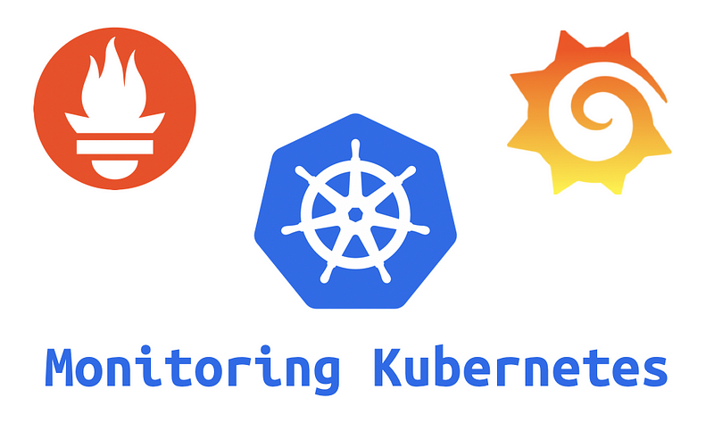
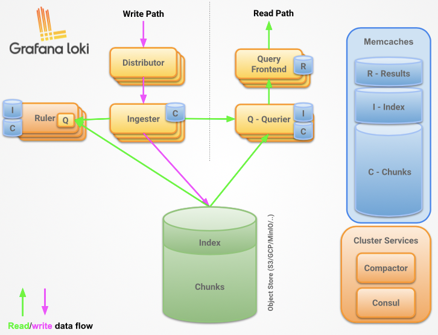

> **Monitoring AWS EKS with performant open source tools**

## 🔖 Introduction

Amazon Elastic Kubernetes Service (EKS) is a managed Kubernetes service that makes it easy to run Kubernetes on AWS. However, EKS doesn't come with a built-in monitoring solution. This means that you need to set up your own monitoring stack if you want to track the health and performance of your EKS cluster.

In this article, we will show you how to create a monitoring stack for AWS EKS using **Grafana**, **Prometheus**, **AlertManager**, **Promtail**, and **Loki**. These open source tools provide a comprehensive monitoring solution that can help you track all aspects of your EKS cluster, from metrics to logs.

We will walk you through the steps of installing and configuring these tools, and we will show you how to create dashboards in Grafana to visualize your data. By the end of this article, you will have a solid understanding of how to monitor your AWS EKS cluster using open source tools.



### 🎯 Goals & Objectives

If you are looking for a comprehensive and cost-effective monitoring solution for your AWS EKS cluster, then this monitoring stack is a great option. So, roll your sleeves and let's get cracking! 🔥

### 📋 Prerequisites

- Knowledge of Kubernetes.
- AWS EKS cluster.
- [Helm](https://helm.sh/docs/intro/install/).

## 🛠️ Kube-Prometheus-Stack: An Effective Way to Monitor AWS EKS Cluster

[**Kube-Prometheus-stack**](https://github.com/prometheus-community/helm-charts/tree/main/charts/kube-prometheus-stack), also known as **Prometheus Operator**, is a popular open-source project providing complete monitoring and alerting solutions for Kubernetes clusters. It combines tools and components to create a monitoring stack for Kubernetes environments.

We will use the official Helm Chart [**Kube-Prometheus-stack**](https://artifacthub.io/packages/helm/prometheus-community/kube-prometheus-stack), with a customized value file.

#### Steps to Deploy the Monitoring Stack

1. **Creating Namespace called monitoring**

    ```sh
    kubectl create namespace monitoring
    ```

2. **Add a new Helm Repository**

    ```sh
    helm repo add prometheus-community https://prometheus-community.github.io/helm-charts
    helm repo update
    ```

3. **Edit the Values**

    These settings indicate that the selectors mentioned (rule, service monitor, pod monitor, and scrape config) will have independent configurations and will not be based on Helm graphic values.

    ```yaml
    prometheus:
      enabled: true
      agentMode: false
      annotations: {}
      networkPolicy:
        enabled: false
        flavor: kubernetes
      serviceAccount:
        create: true
        name: ""
        annotations: {}
      serviceMonitor:
        interval: ""
        selfMonitor: true
        sampleLimit: 0
        targetLimit: 0
        labelLimit: 0
        labelNameLengthLimit: 0
        labelValueLengthLimit: 0
        scheme: ""
        tlsConfig: {}
        bearerTokenFile:
        metricRelabelings: []
        relabelings: []
      prometheusSpec:
        disableCompaction: false
        enableRemoteWriteReceiver: false
        replicaExternalLabelName: ""
        replicaExternalLabelNameClear: false
        prometheusExternalLabelName: ""
        prometheusExternalLabelNameClear: false
        externalUrl: ""
        nodeSelector: {}
        secrets: []
        configMaps: []
        query: {}
        ruleNamespaceSelector: {}
        ruleSelectorNilUsesHelmValues: true
        ruleSelector: {}
        serviceMonitorSelectorNilUsesHelmValues: true
        serviceMonitorSelector: {}
        serviceMonitorNamespaceSelector: {}
        podMonitorSelectorNilUsesHelmValues: true
        podMonitorSelector: {}
        podMonitorNamespaceSelector: {}
        probeSelectorNilUsesHelmValues: true
        probeSelector: {}
        probeNamespaceSelector: {}
        scrapeConfigSelectorNilUsesHelmValues: true
        scrapeConfigSelector: {}
        scrapeConfigNamespaceSelector: {}
        retention: 10d
        retentionSize: ""
        tsdb:
          outOfOrderTimeWindow: 0s
        walCompression: true
        paused: false
        replicas: 1
        shards: 1
        logLevel: info
        logFormat: logfmt
        routePrefix: /
        podMetadata: {}
        podAntiAffinity: ""
        podAntiAffinityTopologyKey: kubernetes.io/hostname
        affinity: {}
        remoteRead: []
        additionalRemoteRead: []
        remoteWrite: []
        additionalRemoteWrite: []
        remoteWriteDashboards: false
        resources: {}
        storageSpec: {}
        volumes: []
        volumeMounts: []
        additionalScrapeConfigs: []
        additionalScrapeConfigsSecret: {}
        additionalPrometheusSecretsAnnotations: {}
        additionalAlertManagerConfigs: []
        additionalAlertManagerConfigsSecret: {}
        additionalAlertRelabelConfigs: []
        additionalAlertRelabelConfigsSecret: {}
        arbitraryFSAccessThroughSMs: false
        overrideHonorLabels: false
        overrideHonorTimestamps: false
        ignoreNamespaceSelectors: false
        enforcedNamespaceLabel: ""
        prometheusRulesExcludedFromEnforce: []
        excludedFromEnforcement: []
        queryLogFile: false
        enforcedSampleLimit: false
        enforcedTargetLimit: false
        enforcedLabelLimit: false
        enforcedLabelNameLengthLimit: false
        enforcedLabelValueLengthLimit: false
        allowOverlappingBlocks: false
        minReadySeconds: 0
        hostNetwork: false
        hostAliases: []
        tracingConfig: {}
    ```

4. **Run the Helm Deployment Command**

    ```sh
    helm upgrade --install -f values.yaml kube-prometheus-stack prometheus-community/kube-prometheus-stack -n monitoring
    ```

After we deploy the Kube-Prometheus stack, we get:

- **Grafana**
- **Prometheus**
- **AlertManager**


## 🧪 Testing

To check if everything is working, you can use the following commands:

### Prometheus Dashboard

```sh
kubectl port-forward svc/prometheus-operated 9090:9090 -n monitoring
```

You can access the Prometheus dashboard at [http://localhost:9090](http://localhost:9090).

### Grafana Dashboard

```sh
kubectl port-forward svc/kube-prometheus-stack-grafana 3000:3000 -n monitoring
```

You can access the Grafana dashboard at [http://localhost:3000](http://localhost:3000).

### Check Running Pods

To ensure all pods are running, use the following command:

```sh
kubectl get pods --namespace monitoring
```

## 🛡️ Create a ServiceMonitor

Prometheus Operator uses ServiceMonitors to auto-detect target pods based on label selectors and associate them with Prometheus instances. The ServiceMonitor defines an application that scrapes metrics from Kubernetes.

Below is an example manifest for a ServiceMonitor:

```yaml
apiVersion: monitoring.coreos.com/v1
kind: ServiceMonitor
metadata:
    name: prometheus-self
    labels:
        app: kube-prometheus-stack-prometheus
spec:
    endpoints:
        - interval: 30s
            port: web
    selector:
        matchLabels:
            app: kube-prometheus-stack-prometheus
```

The ServiceMonitor defined above will select pods labeled `app: kube-prometheus-stack-prometheus` using the `spec.selector.matchLabels` field.

To apply the ServiceMonitor manifest, run the following command:

```sh
kubectl apply -f servicemonitor.yaml -n monitoring
```


## 🔗 Integration of Promtail and Loki to Grafana

Promtail is a log agent that ships logs to Loki, a horizontally scalable, highly available, and efficient log store. Loki can be integrated with Grafana to create dashboards that visualize your logs and metrics. This integration provides a powerful way to monitor your applications and infrastructure.

### 📜 Intro to Loki

Loki uses Promtail as its primary log collector, but it can also accept log flows from other sources, such as Syslog or other log senders. It offers high uptime and supports data replication across multiple replicas for durability and fault tolerance. Loki is tightly integrated with Grafana, allowing you to visualize log metrics. Think of Loki as Prometheus, but for logs.



### 📥 Add a New Helm Repository

```sh
helm repo add grafana https://grafana.github.io/helm-charts
helm repo update
```

### 🚀 Run the Helm Deployment Command

```sh
helm upgrade --install loki grafana/loki-distributed -n monitoring
```

After deploying Loki, update the Kube-Prometheus-stack values file to add additional data sources. This configuration defines a default additional data source that connects to a Loki log aggregation system. It specifies the URL for accessing Loki and sets the access method to the proxy.

```yaml
grafana:
    additionalDataSources:
        - name: Loki
            type: loki
            url: http://loki-loki-distributed-gateway.monitoring.svc.cluster.local
            access: proxy
```

Please refer to the [Helm values](https://github.com/grafana/helm-charts) for more details.

### 📜 Intro to Promtail

Promtail can log files from different sources, including local files, container output streams (stdout and stderr), and systemd journals. It supports the development, filtering, and relabeling of logs before sending them to Loki.

```yaml
clients:
    - url: http://loki-loki-distributed-gateway.monitoring.svc.cluster.local/loki/api/v1/push
```

Please refer to the [Helm values](https://github.com/grafana/helm-charts) for more details.

### 🚀 Run the Helm Upgrade Command

```sh
helm upgrade --install -f promtail.yaml promtail grafana/promtail -n monitoring
```

After deploying Promtail and Loki, two new data sources will be presented to Grafana.

### 🔍 Access Grafana

Run the following command to port-forward Grafana:

```sh
kubectl port-forward svc/kube-prometheus-stack-grafana 3000:3000 -n monitoring
```

Connect to Grafana by navigating to [http://localhost:3000](http://localhost:3000), then go to **Menu -> Data Sources** to add the new data sources.

### 📝 Summary

Setting up a monitoring stack for Kubernetes is a complex task, but it is essential for ensuring the health and performance of your applications. The steps outlined in this article provide a good starting point, but they are just the beginning. In most cases, workloads will not be limited to Kubernetes pods and containers. There will also be a need to monitor virtual machines and other infrastructure components. A unified logging mechanism based on the same tools is essential for getting a complete view of your system.

<br>

**_Until next time, つづく 🎉_**

> 💡 Thank you for Reading !! 🙌🏻😁📃, see you in the next blog.🤘  **_Until next time 🎉_**

🚀 Thank you for sticking up till the end. If you have any questions/feedback regarding this blog feel free to connect with me:

**♻️ LinkedIn:** https://www.linkedin.com/in/rajhi-saif/

**♻️ X/Twitter:** https://x.com/rajhisaifeddine

**The end ✌🏻**

<h1 align="center">🔰 Keep Learning !! Keep Sharing !! 🔰</h1>

**📅 Stay updated**

Subscribe to our newsletter for more insights on AWS cloud computing and containers.
