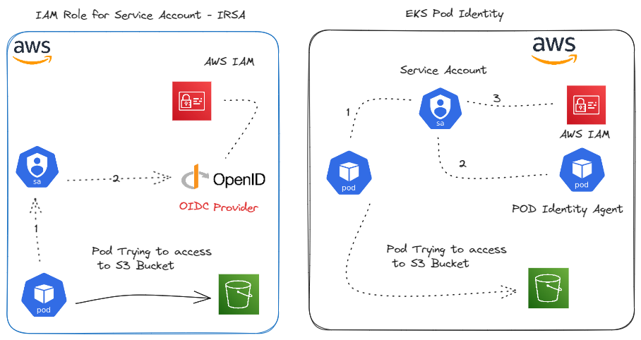

> **Boto3 inside a Pod with Pod identities**

## 📚 Introduction

In this blog post, we will guide you through the process of using the [AWS EKS Pod Identity Agent](https://docs.aws.amazon.com/eks/latest/userguide/pod-identities.html) with the Python [SDK](https://aws.amazon.com/fr/what-is/sdk/) to manage AWS resources. 

[Boto3](https://boto3.amazonaws.com/v1/documentation/api/latest/index.html) is the name of the Python SDK for AWS. It allows you to directly manage AWS resources from your Python code. We will see in the hands-on.

To connect to AWS APIs in Python, you typically use the boto3 library, which is the Amazon Web Services (AWS) SDK for Python. It allows Python developers to write software that makes use of services like Amazon S3 and Amazon EC2. 

We will take you step-by-step through setting up the EKS cluster, creating the IAM role, and writing a Python script to access AWS resources.

## 🔑 EKS Pod Identity

[**Pod Identity**](https://aws.amazon.com/blogs/aws/amazon-eks-pod-identity-simplifies-iam-permissions-for-applications-on-amazon-eks-clusters/) is a mechanism that allows Kubernetes pods to assume specific identities, enabling them to access cloud resources securely. Applications running in a pod's containers can use an AWS SDK or the AWS CLI to make API requests to AWS services using AWS IAM permissions. These applications must sign their AWS API requests with AWS credentials.

**EKS Pod Identities** provide the ability to manage credentials for your applications, similar to how [Amazon EC2 instance profiles](https://docs.aws.amazon.com/IAM/latest/UserGuide/id_roles_use_switch-role-ec2_instance-profiles.html)provide credentials to Amazon EC2 instances. Instead of creating and distributing your AWS credentials to the containers or using the Amazon EC2 instance's role, you associate an IAM role with a [Kubernetes service account](https://kubernetes.io/docs/concepts/security/service-accounts/) and configure your pods to use the service account.

### 🆔 How It Works in Amazon EKS

In Amazon EKS, Pod Identity is implemented using IAM roles. When a pod needs to access AWS resources, it can assume an IAM role that grants the necessary permissions. This is achieved through the AWS [EKS Pod Identity Agent](https://github.com/aws/eks-pod-identity-agent), which manages the association between Kubernetes service accounts and IAM roles. The agent ensures that the pods receive temporary credentials to access AWS services securely.

- **🔒 Secure connection**: EKS Pod Identity allows secure connections between Amazon EKS clusters and AWS services like S3.
- **🔄 Simplified IAM roles**: It simplifies the use of IAM roles with Kubernetes pods, reducing operational overhead compared to [IRSA](https://docs.aws.amazon.com/eks/latest/userguide/iam-roles-for-service-accounts.html).
- **💡 Backward compatibility**: Pod Identity is backward compatible with IAM Roles for Service Accounts IRSA.
- **🔑 RBAC authorization**: Kubernetes authorizes users using RBAC with cluster roles and namespace roles.
- **🆔 Service accounts**: Service accounts within Kubernetes are used to authorize workloads accessing the Kubernetes API.
- **🔄 IAM Role association**: Pod Identity allows Kubernetes workloads to access AWS services by associating IAM roles with pods.
- **💡 No OIDC Providers needed**: With EKS Pod Identity, there's no need to create [OIDC providers](https://docs.aws.amazon.com/eks/latest/userguide/enable-iam-roles-for-service-accounts.html) for each cluster, unlike IRSA.
- **🔑 ABAC**: Pod Identity uses attribute-based access control [ABAC](https://docs.aws.amazon.com/IAM/latest/UserGuide/introduction_attribute-based-access-control.html) for more flexible role management.
- **🆔 Pod Identity Agent**: The Pod Identity agent, deployable as an [EKS add-on](https://docs.aws.amazon.com/eks/latest/userguide/eks-add-ons.html), handles pod identity management with minimal operational overhead.
- **🔒 Secure Access**: Pod Identity ensures that Kubernetes workloads running in EKS securely access external AWS services like S3 using the right IAM roles.

### 💡 The f(ea)uture state: EKS Pod Identities

Before this enhancement, we used the IAM Roles for Service Accounts (IRSA) model. To give a pod access to, for example, S3, we had to:
1. Create an IAM Role with the appropriate IAM Policy.
2. Configure its Trust Policy to allow `AssumeRole` and `TagSession` to be executed only from the appropriate cluster.
3. Create a Kubernetes ServiceAccount with the ARN of this role in its annotations.

#### Common Issues with the Previous Model:

- **Trust Policy Errors**: Often errors occurred in the Trust Policy, where it was necessary to specify the cluster OIDC.
- **ServiceAccount Errors**: Mistakes could be made in the ARN of the role within the ServiceAccount annotations.


### 🔄 Enhanced mechanism: Pod Identity association

AWS EKS has introduced a new enhanced mechanism called **Pod Identity Association** for cluster administrators to configure Kubernetes applications to receive IAM permissions required to connect with AWS services outside of the cluster. Pod Identity Association makes use of IRSA, but it makes it configurable directly through the EKS API, eliminating the need for using the IAM API altogether.

As a result, IAM roles no longer need to reference an OIDC provider and hence won't be tied to a single cluster anymore. This means IAM roles can now be used across multiple EKS clusters without the need to update the role trust policy each time a new cluster is created. This, in turn, eliminates the need for role duplication and simplifies the process of automating IRSA altogether.


### 🆔 How EKS Pod Identities Simplify the Process

1. **Add a New Controller**: Introduce the Amazon EKS Pod Identity Agent add-on.
2. **Create an IAM Role**: In the Trust Policy, use `Principal: pods.eks.amazonaws.com`.
3. **Connect the Role**: Use the AWS CLI, AWS Console, or AWS API to connect this role directly to the desired ServiceAccount.

### 🔄 Pod Identity vs. IAM Roles for Service Accounts (IRSA)




- **Pod Identity**: This method involves assigning IAM roles directly to Kubernetes pods. It provides fine-grained control over which pods can access specific AWS resources. The AWS EKS Pod Identity Agent handles the credential management, ensuring that pods receive the necessary permissions.

- **IAM Roles for Service Accounts IRSA**: IRSA is a feature that allows you to associate IAM roles with Kubernetes service accounts. When a pod uses a service account, it inherits the permissions of the associated IAM role. This method simplifies the management of permissions at the service account level rather than the individual pod level.


| Feature | EKS Pod Identity | IRSA |
| --- | --- | --- |
| **Role Extensibility** | No need to update the role's trust policy for each new cluster. | Need to update role's trust policy with new EKS cluster OIDC provider endpoint. |
| **Cluster Scalability** | No need to setup IAM OIDC provider. | Need to setup IAM OIDC provider. Default global limit of 100 OIDC providers for AWS account applies. |
| **Role Scalability** | No need to define trust relationship between IAM role and service account in the trust policy. | Need to define trust relationship between IAM role and service account in the trust policy. Max of 8 trust relationships within a single trust policy applies due to limit on trust policy size. |
| **Role Reusability** | AWS STS temporary credentials supplied by EKS Pod Identity include role session tags, such as cluster name, namespace, service account name. | AWS STS session tags are not supported. You can reuse a role between clusters but every pod receives all of the permissions of the role. |
| **Environments Supported** | Only available on Amazon EKS. | IRSA can be used with Amazon EKS, Amazon EKS Anywhere, Red Hat OpenShift Service on AWS, and self-managed Kubernetes clusters on Amazon EC2 instances. |
| **EKS Versions Supported** | EKS Kubernetes versions 1.24 or later. | All of the supported EKS cluster versions. |

#### Use cases for each method

- **Pod Identity**: Ideal for scenarios where you need granular control over individual pod permissions. It is useful when different pods within the same application require different levels of access to AWS resources.

- **IRSA**: Suitable for managing permissions at a higher level, such as for a group of pods that share the same service account. It simplifies the setup and is easier to manage when multiple pods need the same permissions.

### Technical Details and Benefits

- **Applications in Pods**: Applications in a pod's containers can use an AWS SDK or the AWS CLI to make API requests to AWS services using IAM permissions. These applications must sign their AWS API requests with AWS credentials.

- **Credential Management**: EKS Pod Identities manage credentials for your applications, similar to how Amazon EC2 instance profiles provide credentials to Amazon EC2 instances.

- **IAM Role Association**: Instead of creating and distributing your AWS credentials to the containers or using the Amazon EC2 instance's role, you associate an IAM role with a Kubernetes service account and configure your pods to use the service account.

- **Pod Identity Agent**: The Pod Identity agent, deployable as an EKS add-on, handles pod identity management with minimal operational overhead.

- **ABAC**: Pod Identity uses attribute-based access control ABAC for more flexible role management.

### 💡 Introduction to Boto3

[**Boto3**](https://boto3.amazonaws.com/v1/documentation/api/latest/index.html)  is the Amazon Web Services (AWS) SDK for Python. It allows Python developers to write software that makes use of services like Amazon S3 and Amazon EC2. Boto3 provides an easy-to-use, object-oriented API as well as low-level access to AWS services.

#### Benefits of Using Boto3 for AWS Resource Management

- **Ease of use**: Boto3 simplifies the process of interacting with AWS services by providing a high-level, Pythonic interface.
- **Comprehensive coverage**: It supports a wide range of AWS services, allowing you to manage everything from S3 buckets to EC2 instances.
- **Integration**: Boto3 integrates seamlessly with other Python libraries and frameworks, making it a versatile tool for AWS resource management.
- **Automation**: With Boto3, you can automate repetitive tasks, such as creating and managing AWS resources, which improves efficiency and reduces the risk of human error.
- **Community and support**: As a widely-used SDK, Boto3 has a large community and extensive documentation, making it easier to find help and resources.

### 🔄 Takeaways

- **EKS Pod Identity** simplifies the process of granting AWS permissions to Kubernetes pods.
- **Pod Identity Association** eliminates the need for OIDC providers and allows IAM roles to be used across multiple clusters.
- **Pod Identity** provides fine-grained control over pod permissions, while **IRSA** simplifies permission management at the service account level.
- **Boto3** is a great tool for managing AWS resources programmatically with Python.


## Setting Up EKS Pod Identity

We can create an EKS cluster using `eksctl` with the following configuration:

```yaml
# cluster.yaml
---
apiVersion: eksctl.io/v1alpha5
kind: ClusterConfig

metadata:
  name: eks-pod-identity-boto3
  region: eu-west-1

managedNodeGroups:
  - name: managed-nodes
    instanceType: m5.large
    minSize: 2
    desiredCapacity: 3
    maxSize: 4
    availabilityZones: ["eu-west-1a", "eu-west-1b"]
    volumeSize: 20
    updateConfig:
      maxUnavailable: 3 
    securityGroups:
      attachIDs: ["sg-1", "sg-2"]
```

Create the cluster with:

```shell
$ eksctl create cluster -f cluster.yaml
```

### Step-by-Step Guide to Creating an IAM Role

1. **Create an IAM Role**:

   - Go to the IAM console.
   - Click on **Roles** and then **Create role**.
   - Select **EKS** as the trusted entity and choose **EKS - Pod**.
   - Attach the necessary policies (e.g., `AmazonS3ReadOnlyAccess` for S3 access).
   - Name the role (e.g., `EKS-S3-Access-Role`) and create it.

2. **Update the Trust Policy**:

   - Go to the IAM role you just created.
   - Under the **Trust relationships** tab, click **Edit trust relationship**.
   - Update the trust policy to allow the `pods.eks.amazonaws.com` principal.

```json
{
  "Version": "2012-10-17",
  "Statement": [
    {
      "Effect": "Allow",
      "Principal": {
        "Service": "eks.amazonaws.com"
      },
      "Action": ["sts:AssumeRole","sts:TagSession"]
    }
  ]
}
```

### Associating the IAM Role with a Kubernetes Service Account

> **Note**: Unlike IAM roles for service accounts, EKS Pod Identity doesn't use an annotation on the service account.

#### Create a Kubernetes Service Account

Create a service account in your Kubernetes cluster.

```yaml
apiVersion: v1
kind: ServiceAccount
metadata:
  name: s3-access-sa
  namespace: default
```

#### Apply the Service Account

Apply the service account configuration to your cluster.

```shell
$ kubectl apply -f service-account.yaml
```

### Installing the Pod Identity Agent

#### Install the Pod Identity Agent

Use the AWS CLI to install the Pod Identity Agent as an EKS add-on.

```shell
$ aws eks create-addon --cluster-name eks-pod-identity-boto3 --addon-name eks-pod-identity-agent --addon-version v1.0.0-eksbuild.1
```

Confirm that the EKS Pod Identity Agent pods are running on your cluster.

```shell
$ kubectl get pods -n kube-system | grep 'eks-pod-identity-agent'
```

### Creating a Pod Identity Association

Create a pod identity association using the AWS CLI:

```shell
$ aws eks create-pod-identity-association \
  --cluster-name eks-pod-identity-boto3 \
  --namespace default \
  --service-account s3-access-sa \
  --role-arn arn:aws:iam::012345678901:role/EKS-S3-Access-Role
```

Ensure the IAM role has the following trust policy:

```json
{
  "Version": "2012-10-17",
  "Statement": [{
    "Effect": "Allow",
    "Principal": {
      "Service": "pods.eks.amazonaws.com"
    },
    "Action": ["sts:AssumeRole","sts:TagSession"]
  }]
}
```


## Deploying a test Pod

### Creating a Kubernetes Pod Spec

Create a Kubernetes pod specification that uses the service account with the IAM role.

```yaml
apiVersion: v1
kind: Pod
metadata:
  name: s3-list-pod
  namespace: default
spec:
  serviceAccountName: s3-access-sa
  containers:
  - name: s3-list-container
    image: amazonlinux
    command: ["/bin/sh", "-c", "while true; do sleep 30; done;"]
```

Save this specification to a file named `pod-spec.yaml`.

### Deploying the Pod with the Service Account

Apply the pod specification to your Kubernetes cluster.

```sh
kubectl apply -f pod-spec.yaml
```

Verify that the pod is running.

```sh
kubectl get pods -n default
```

## Using Boto3 Inside the Pod

### Accessing the Pod and Installing Boto3

Use `kubectl exec` to access the pod.

```sh
kubectl exec -it s3-list-pod -- /bin/bash
```

Inside the pod, install Boto3 using pip.

```sh
yum install -y python3-pip
pip3 install boto3
```

### Writing a Python Script to List S3 Bucket Objects

Create a Python script to list objects in an S3 bucket. Save this script as `list_s3_objects.py`.

```python
import boto3

# Create a session using the default credentials chain
session = boto3.Session()

# Create an S3 client
s3 = session.client('s3')

# List all buckets
response = s3.list_buckets()

# Print bucket names
print("Buckets:")
for bucket in response['Buckets']:
    print(f"  {bucket['Name']}")
```

### Running the Script and Verifying Access

Run the Python script inside the pod.

```sh
python3 list_s3_objects.py
```

Check the output to verify that the script lists the S3 buckets.

```sh
kubectl logs s3-list-pod
```

## Conclusion

In this blog post, we explored how to securely manage AWS resources using the AWS EKS Pod Identity Agent and Boto3. We began by understanding the importance of managing AWS resources securely and introduced the concept of Pod Identity in Kubernetes, highlighting its implementation in Amazon EKS. 

We then provided a detailed, step-by-step guide to setting up EKS Pod Identity, including creating an IAM role, associating it with a Kubernetes service account, and installing the Pod Identity Agent. Following this, we demonstrated how to deploy a test pod and use Boto3 inside the pod to list S3 bucket objects. 

By using these tools, you can enhance security, simplify management, and increase the flexibility and scalability of your AWS resource management.

## 📻🧡 Additional Resources

- [AWS EKS Pod Identity agent documentation](https://docs.aws.amazon.com/eks/latest/userguide/pod-id-how-it-works.html)
- [Boto3 documentation](https://boto3.amazonaws.com/v1/documentation/api/latest/index.html)
- [Kubernetes Service accounts](https://kubernetes.io/docs/concepts/security/service-accounts/)
- [IAM Roles for Service Accounts (IRSA)](https://docs.aws.amazon.com/eks/latest/userguide/iam-roles-for-service-accounts.html)
- [Amazon EKS documentation](https://docs.aws.amazon.com/eks/latest/userguide/what-is-eks.html)
- [Kubernetes RBAC](https://kubernetes.io/docs/reference/access-authn-authz/rbac/)
- [AWS ABAC](https://docs.aws.amazon.com/IAM/latest/UserGuide/introduction_attribute-based-access-control.html)

Further reading on Kubernetes, EKS, and Boto3:

- [Kubernetes documentation](https://kubernetes.io/docs/concepts/)
- [Amazon EKS best practices Guide](https://aws.github.io/aws-eks-best-practices/)
- [Boto3 GitHub repository](https://github.com/boto/boto3)
- [Pod Agent GitHub repository](https://github.com/aws/eks-pod-identity-agent)
- [EKS addons GitHub repository](https://github.com/aws-ia/terraform-aws-eks-blueprints-addons)

<br>
<br>

> 💡 Thank you for Reading !! 🙌🏻😁📃, see you in the next blog.🤘  _**Until next time 🎉**_


🚀 Thank you for sticking up till the end. If you have any questions/feedback regarding this blog feel free to connect with me:

**♻️ LinkedIn:** https://www.linkedin.com/in/rajhi-saif/

**♻️ X/Twitter:** https://x.com/rajhisaifeddine

**The end ✌🏻**

_**Keep Learning !! Keep Sharing !! 🔰**_

**📅 Stay updated**

Subscribe to our newsletter for more insights on AWS cloud coomputing and containers.
