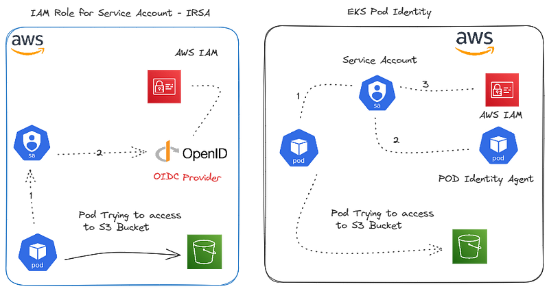
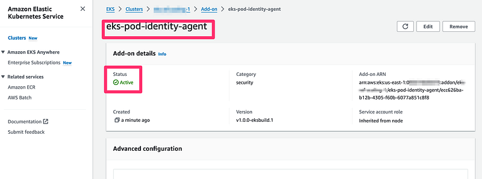

> **EKS Pod Identity - An easy way to grant AWS access**

## 🗯 Introduction

Running applications on Kubernetes is great, but sometimes they need to talk to other AWS services like S3 or DynamoDB. In the past, setting up the right permissions for your Kubernetes apps to access these AWS services was a bit of a headache. You had to jump through hoops and follow complex instructions 😕.

But now, there's a new feature called EKS Pod Identity that makes granting AWS permissions to your Kubernetes apps a breeze 🤩. With just a few clicks (or commands), you can give your apps the AWS access they need, without any complicated setup.

EKS Pod Identity is a part of Amazon's Elastic Kubernetes Service (EKS), and it's designed to make your life as a Kubernetes user much easier. It's a simple, straightforward way to manage AWS permissions for your Kubernetes workloads, saving you time and effort.

_In this blog post, we'll explore what EKS Pod Identity is, how it works, and why you should consider using it for your Kubernetes applications running on EKS._

## Grant AWS permissions to your K8S apps

When you're running Kubernetes apps on Amazon EKS (Elastic Kubernetes Service), you have two main options to give them the ability to access other AWS services like [S3](https://aws.amazon.com/s3/) or [DynamoDB](https://aws.amazon.com/dynamodb/):

**IAM Roles for Service Accounts (IRSA)**

This method allows associating IAM roles with Kubernetes service accounts. It supports various Kubernetes environments on AWS like [EKS](https://aws.amazon.com/eks/), [EKS Anywhere](https://aws.amazon.com/eks/eks-anywhere/), OpenShift, and self-managed clusters. IRSA uses core AWS services like IAM and doesn't directly depend on the EKS service.

**EKS Pod Identity**

This EKS-specific feature simplifies how cluster admins can configure IAM permissions for Kubernetes apps. It allows directly mapping an IAM role to a Kubernetes service account through EKS APIs. Pods under the associated service account can automatically obtain temporary AWS credentials.



Both options achieve the same goal - granting your Kubernetes workloads on EKS the necessary AWS permissions.

However, EKS Pod Identity is a more EKS-specific and simplified approach, while IRSA is a more general solution that works across different Kubernetes environments on AWS.


| Feature | EKS Pod Identity | IRSA |
| --- | --- | --- |
| **Role Extensibility** | No need to update the role's trust policy for each new cluster. | Need to update role's trust policy with new EKS cluster OIDC provider endpoint. |
| **Cluster Scalability** | No need to setup IAM OIDC provider. | Need to setup IAM OIDC provider. Default global limit of 100 OIDC providers for AWS account applies. |
| **Role Scalability** | No need to define trust relationship between IAM role and service account in the trust policy. | Need to define trust relationship between IAM role and service account in the trust policy. Max of 8 trust relationships within a single trust policy applies due to limit on trust policy size. |
| **Role Reusability** | AWS STS temporary credentials supplied by EKS Pod Identity include role session tags, such as cluster name, namespace, service account name. | AWS STS session tags are not supported. You can reuse a role between clusters but every pod receives all of the permissions of the role. |
| **Environments Supported** | Only available on Amazon EKS. | IRSA can be used with Amazon EKS, Amazon EKS Anywhere, Red Hat OpenShift Service on AWS, and self-managed Kubernetes clusters on Amazon EC2 instances. |
| **EKS Versions Supported** | EKS Kubernetes versions 1.24 or later. | All of the supported EKS cluster versions. |

## Pod Identity hands-on

- **Deploy the cluster:**

Execute the following commands to provision the EKS Cluster:

```shell
git clone https://github.com/seifrajhi/aws-eks-terraform.git
cd aws-eks-terraform
terraform init 
terraform plan 
terraform auto-approve
```

- **Deploy Pod Identity agent:**
  
To use EKS Pod Identity in your cluster, the EKS Pod Identity Agent addon must be installed on your EKS cluster.

Let's install it using the below command.

```shell
aws eks create-addon --cluster-name eks-pod-identity-demo --addon-name eks-pod-identity-agent
aws eks wait addon-active --cluster-name eks-pod-identity-demo --addon-name eks-pod-identity-agent
```

Go to EKS Console and view the `eks-pod-identity-agent` under the **Add-on** tab.



You can also take a look at what has been created in your EKS cluster by the new addon:

```shell
$ kubectl -n kube-system get daemonset eks-pod-identity-agent

# Or 

$ kubectl -n kube-system get pods -l app.kubernetes.io/name=eks-pod-identity-agent
```

- **Deploy the sample app:**

Below is the manifest we will be using:

```yaml
apiVersion: v1
kind: Namespace
metadata:
  name: demo-ns
---
apiVersion: v1
kind: ServiceAccount
metadata:
  name: demo-sa
  namespace: demo-ns
--- 
apiVersion: v1
kind: Pod
metadata:
  name: demo-app
  namespace: demo-ns
  labels:
     app: demo-app
spec:
  serviceAccountName: demo-sa
  containers:
    - name: demo-app
      image: amazon/aws-cli:latest
      command: ['sleep', '36000']
  restartPolicy: Never
```

Run the below command to deploy the app:

```shell
kubectl  apply -f manifests.yaml
```

- **Configure Amazon EKS Pod Identity:**

Create a trust policy and configure the principal to `pods.eks.amazonaws.com`.

**IAM_ROLE_TRUST_POLICY.json:**

```json

{
    "Version": "2012-10-17",
    "Statement": [
        {
            "Effect": "Allow",
            "Principal": {
                "Service": "pods.eks.amazonaws.com"
            },
            "Action": [
                "sts:AssumeRole",
                "sts:TagSession"
            ]
        }
    ]
}
```

Using the above trust policy, create the IAM role.

```shell
aws iam create-role \
        --role-name eks-pod-s3-readonly-access \
        --description  "allow EKS pods readonly acces to S3" \
        --assume-role-policy-document file://IAM_ROLE_TRUST_POLICY.json \
        --output text \
        --query 'Role.Arn'
```

Then create the IAM Policy for S3 to list buckets and get Objects.

**IAM_POLICY.json:**

```json
{
    "Version": "2012-10-17",
    "Statement": [
        {
            "Effect": "Allow",
            "Action": [
                "s3:ListAllMyBuckets"
            ],
            "Resource": "*"
        },
        {
            "Effect": "Allow",
            "Action": [
                "s3:GetObject",
                "s3:GetObjectTagging"
            ],
            "Resource": "*"
        }
    ]
}
```

- **Create the IAM Policy:**

```shell
aws iam create-policy --policy-name eks-pod-s3-readonly-access-policy --policy-document file://IAM_POLICY.json --output text --query Policy.Arn
```

- **Attach the policy to the IAM Role:**

```shell
aws iam attach-role-policy --role-name eks-pod-s3-readonly-access \
  --policy-arn eks-pod-s3-readonly-access-policy
```

**Create Pod Identity association:**

Create the EKS Pod Identity association for the Service account demo-sa in Namespace demo-ns for the IAM Role `eks-pod-s3-readonly-access`.

```shell
$ export IAM_ROLE_ARN=$(aws iam get-role --role-name eks-pod-s3-readonly-access | jq -r '.Role.Arn')

$ aws eks create-pod-identity-association \
  --cluster-name eks-pod-identity-demo \
  --namespace demo-ns\
  --service-account demo-sa \
  --role-arn $IAM_ROLE_ARN
```

We can get the list of current EKS Pod Identity associations using the below command:

```shell
aws eks list-pod-identity-associations --cluster-name eks-pod-identity-demo
```

- **Test AWS EKS Pod Identity:**
  
Run the below command:

```shell
kubectl -n demo-ns exec -it demo-app -- aws s3 ls
```

The App can list of S3 Buckets 🎉.

## Conclusion

EKS Pod Identity is a great solution that lets you easily give your Kubernetes apps running on Amazon EKS the AWS permissions they need.

## References

- https://docs.aws.amazon.com/eks/latest/userguide/pod-identities.html
- https://securitylabs.datadoghq.com/articles/eks-pod-identity-deep-dive/
- https://medium.com/@phanindra.sangers/eks-pod-identites-ca88c9cadac6
- https://aws.amazon.com/blogs/containers/amazon-eks-pod-identity-a-new-way-for-applications-on-eks-to-obtain-iam-credentials/

<br>

**_Until next time, つづく 🎉_**

> 💡 Thank you for Reading !! 🙌🏻😁📃, see you in the next blog.🤘  _**Until next time 🎉**_

🚀 Thank you for sticking up till the end. If you have any questions/feedback regarding this blog feel free to connect with me:

**♻️ LinkedIn:** https://www.linkedin.com/in/rajhi-saif/

**♻️ X/Twitter:** https://x.com/rajhisaifeddine

**The end ✌🏻**

<h1 align="center">🔰 Keep Learning !! Keep Sharing !! 🔰</h1>

**📅 Stay updated**

Subscribe to our newsletter for more insights on AWS cloud computing and containers.
