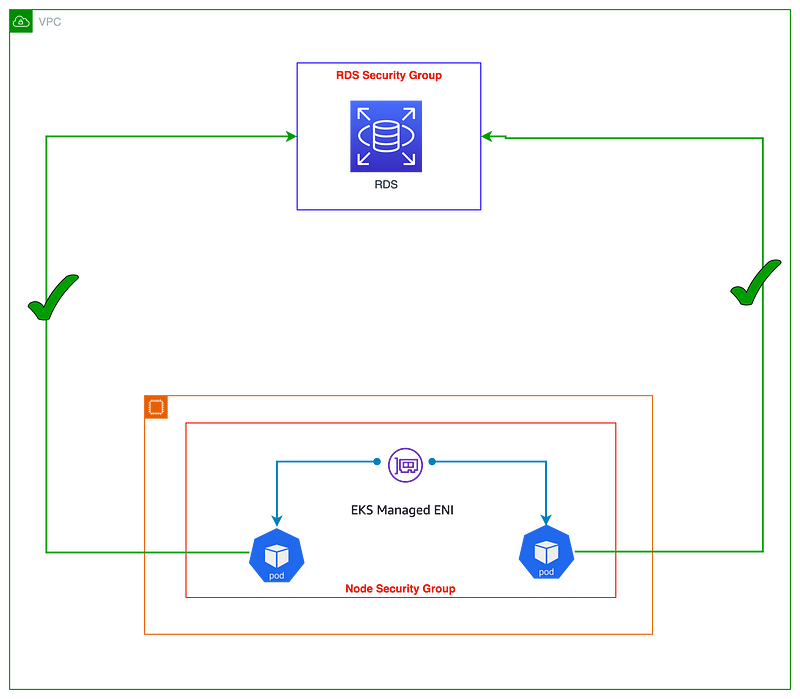

> **Enhancing EKS Security posture**

## 📑 Introduction

AWS EKS Security Groups Per Pod is a feature that allows you to assign security groups to individual Kubernetes pods. This gives you more granular control over the network traffic that can flow to and from each pod.

Before this feature was released, you could only assign security groups to nodes. This meant that all pods running on a node shared the same security group. This could be a security risk, as it allowed pods with different security requirements to communicate with each other.

With Security Groups Per Pod, you can assign different security groups to different pods, even if they are running on the same node. This allows you to isolate pods with different security requirements from each other.

**🎯 Goals and Objectives**

In this blog post, we will discuss the benefits of using Security Groups Per Pod and how to use this feature to improve the security of your EKS clusters.


**🛠️ The Problem**

Containerized applications running in Kubernetes often need to access other services running in the cluster, as well as external AWS services like [Amazon RDS](https://aws.amazon.com/rds/) or [Amazon ElastiCache Redis](https://aws.amazon.com/elasticache/). On AWS, controlling network-level access between services is often done with EC2 security groups. Until recently, you could only assign security groups at the node level, and all pods on a node shared the same security groups.

**💡 The Solution**

Security groups for pods make it easy to comply with network security requirements by running applications with different network security needs on shared compute resources. Network security rules for pod-to-pod and pod-to-external AWS service traffic can be defined in a single place with EC2 security groups and applied to applications using Kubernetes native APIs.

For more information, you can refer to the [AWS documentation on Security Groups for Pods](https://docs.aws.amazon.com/eks/latest/userguide/security-groups-for-pods.html).

## 🔒 EKS Security Groups per Pod: What Is It and Why Should You Use It

AWS security groups are virtual firewalls that control inbound and outbound traffic to and from Elastic Compute Cloud (EC2) instances. By default, the Amazon Virtual Private Cloud (VPC) Container Network Interface (CNI) uses the security groups associated with the primary Elastic Network Interface (ENI) on the node. This means that every ENI associated with the instance will have the same EC2 security groups, and every pod on a node shares the same security groups as the node it runs on.

This can be a security risk, as it allows pods with different security requirements to communicate with each other. For example, a pod that needs to access a database should not be able to communicate with a pod that exposes a web service to the public internet.

Security groups for pods solve this problem by allowing you to assign different security groups to different pods, even if they are running on the same node. This gives you granular control over the network traffic that can flow to and from each pod.

This is an important feature for improving the security and compliance of your Kubernetes clusters. For example, the [PCI DSS](https://www.pcisecuritystandards.org/pci_security/) standard requires that you isolate cardholder data from other systems. Security groups for pods can help you to achieve this isolation.

For more details, refer to the [AWS documentation on Security Groups for Pods](https://docs.aws.amazon.com/eks/latest/userguide/security-groups-for-pods.html).

### 🛠️ Example Use Cases

Here is an example of how you can use security groups for pods:

- **Database Access:** You have a pod that needs to access a database. You can assign a security group to this pod that only allows inbound traffic from the database. This will prevent other pods from accessing the database.

- **Web Service Exposure:** You have a pod that needs to expose a web service to the public internet. You can assign a security group to this pod that only allows inbound traffic from the public internet. This will prevent other pods from accessing the web service.



Security groups for pods allow you to run applications with different network security requirements on the same shared compute resources. This can improve compute efficiency by reducing the number of nodes required to run your applications.

With security groups for pods, you can define multiple types of security rules in a single place with EC2 security groups and apply them to workloads with Kubernetes native APIs. This makes it easy to manage the network security of your pods and simplifies the deployment and management of your applications.

The image below shows how security groups can be applied at the pod level to simplify application deployment and node architecture. The pod in the image can now access an Amazon RDS database because the security group for that pod allows inbound traffic from the RDS database.


### 🔧 Enabling Security Groups for Pods

Security groups for pods is a feature of AWS EKS that allows you to assign different security groups to different pods, even if they are running on the same node. This gives you granular control over the network traffic that can flow to and from each pod.

To enable security groups for pods, you need to set the `ENABLE_POD_ENI` flag to `true` for the VPC CNI. Once enabled, the VPC Resource Controller will create and attach a trunk interface called `aws-k8s-trunk-eni` to the node. The trunk interface acts as a standard network interface attached to the instance.

The controller also creates branch interfaces named `aws-k8s-branch-eni` and associates them with the trunk interface. Pods are assigned a security group using the `SecurityGroupPolicy` custom resource and are associated with a branch interface. Since security groups are specified with network interfaces, you can now schedule pods requiring specific security groups on these additional network interfaces.

For more details, refer to the [AWS documentation on Security Groups for Pods](https://docs.aws.amazon.com/eks/latest/userguide/security-groups-for-pods.html).

## 🛠️ Configure the Amazon VPC CNI Plugin for Kubernetes for Security Groups for Pods

### 🚀 To Deploy Security Groups for Pods

> **Note:** If you're using security groups for Fargate Pods only and don't have any Amazon EC2 nodes in your cluster, skip to [Deploy an example application](https://docs.aws.amazon.com/eks/latest/userguide/security-groups-for-pods.html).

### ☑️ Check Your Current Amazon VPC CNI Plugin for Kubernetes Version

Run the following command to check your current version:

```sh
kubectl describe daemonset aws-node --namespace kube-system | grep amazon-k8s-cni: | cut -d : -f 3
```

An example output is as follows:

```shell
v1.7.6
```

If your Amazon VPC CNI plugin for Kubernetes version is earlier than `1.7.7`, update the plugin to version `1.7.7` or later. For more information, see [Working with the Amazon VPC CNI plugin for Kubernetes Amazon EKS add-on](https://docs.aws.amazon.com/eks/latest/userguide/cni-upgrades.html).

### ☑️ Add the AmazonEKSVPCResourceController Managed IAM Policy

Add the policy to the cluster role associated with your Amazon EKS cluster. This policy allows the role to manage network interfaces, their private IP addresses, and their attachment and detachment to and from network instances.

1. Retrieve the name of your cluster IAM role and store it in a variable. Replace `my-cluster` with the name of your cluster:

    ```sh
    cluster_role=$(aws eks describe-cluster --name my-cluster --query cluster.roleArn --output text | cut -d / -f 2)
    ```

2. Attach the policy to the role:

    ```sh
    aws iam attach-role-policy --policy-arn arn:aws:iam::aws:policy/AmazonEKSVPCResourceController --role-name $cluster_role
    ```

### ☑️ Enable the Amazon VPC CNI Add-on

Enable the add-on to manage network interfaces for Pods by setting the `ENABLE_POD_ENI` variable to `true` in the `aws-node` DaemonSet:

```sh
kubectl set env daemonset aws-node -n kube-system ENABLE_POD_ENI=true
```

Once this setting is enabled, for each node in the cluster, the add-on adds a label with the value `vpc.amazonaws.com/has-trunk-attached=true`. The VPC resource controller creates and attaches a special network interface called a trunk network interface with the description `aws-k8s-trunk-eni`.

You can see which of your nodes have `aws-k8s-trunk-eni` set to `true` with the following command:

```sh
kubectl get nodes -o wide -l vpc.amazonaws.com/has-trunk-attached=true
```

If `No resources found` is returned, wait several seconds and try again. The previous step requires restarting the Amazon VPC CNI plugin for Kubernetes Pods, which takes several seconds.

### ☑️ Disable TCP Early Demux

If you are using liveness or readiness probes, disable TCP early demux so that the kubelet can connect to Pods on branch network interfaces using TCP:

```sh
kubectl patch daemonset aws-node -n kube-system \
  -p '{"spec": {"template": {"spec": {"initContainers": [{"env":[{"name":"DISABLE_TCP_EARLY_DEMUX","value":"true"}],"name":"aws-vpc-cni-init"}]}}}}'
```

> **Note:** If you're using version `1.11.0` or later of the Amazon VPC CNI plugin for Kubernetes add-on and set `POD_SECURITY_GROUP_ENFORCING_MODE=standard`, you don't need to run the previous command.

### ☑️ Enable Additional Settings for Specific Use Cases

If your cluster uses NodeLocal DNSCache, or you want to use Calico network policy with your Pods that have their own security groups, or you have Kubernetes services of type NodePort and LoadBalancer using instance targets with an `externalTrafficPolicy` set to `Local` for Pods that you want to assign security groups to, you must be using version `1.11.0` or later of the Amazon VPC CNI plugin for Kubernetes add-on, and you must enable the following setting:

```sh
kubectl set env daemonset aws-node -n kube-system POD_SECURITY_GROUP_ENFORCING_MODE=standard
```

For more details, refer to the [AWS documentation on Security Groups for Pods](https://docs.aws.amazon.com/eks/latest/userguide/security-groups-for-pods.html).


## 🛠️ Branch Interface Capacity and Max-Pods Limit

Branch interface capacity is added to the existing instance type limits for secondary IP addresses. Pods that use security groups are not counted towards the max-pods limit, so when you use security groups for pods, you need to either increase the max-pods value or be willing to run fewer pods than the node can actually support.

For example, an `m5.large` instance can have up to 9 branch network interfaces and up to 27 secondary IP addresses assigned to its standard network interfaces. By default, the max-pods value for an `m5.large` instance is 29. If you use security groups for pods on an `m5.large` instance, EKS will count the Pods that use security groups towards the maximum Pods. This means that you will only be able to run 20 Pods on the instance, even though it can actually support 29 Pods.

You can increase the max-pods value for nodes by following the instructions in the [EKS User Guide](https://docs.aws.amazon.com/eks/latest/userguide/cni-increase-max-pods.html).

> **Important:** When security groups for pods are used in combination with custom networking, the security group defined in security groups for pods is used rather than the security group specified in the ENIConfig. This means that you need to carefully consider the order of security groups when using security groups for pods with custom networking.

## 🛡️ Best Practices and Recommendations

### 🚫 Disable TCP Early Demux for Liveness Probe

If you are using liveness or readiness probes, you need to disable TCP early demux so that the kubelet can connect to Pods on branch network interfaces via TCP. This is only required in strict mode. To do this, run the following command:

```sh
kubectl edit daemonset aws-node -n kube-system
```

Under the `initContainer` section, change the value for `DISABLE_TCP_EARLY_DEMUX` to `true`.

### 🔒 Use Security Groups for Pods

Security groups make it easier to restrict network access to VPC resources, such as RDS databases or EC2 instances. One advantage of security groups per Pod is the opportunity to reuse existing AWS security group resources. If you are using security groups as a network firewall to limit access to your AWS services, we recommend applying security groups to Pods using branch ENIs. Consider using security groups for Pods if you are transferring apps from EC2 instances to EKS and limit access to other AWS services with security groups.

### 🔧 Configure Pod Security Group Enforcing Mode

The Amazon VPC CNI plugin version 1.11 added a new setting named `POD_SECURITY_GROUP_ENFORCING_MODE` ("enforcing mode"). The enforcing mode controls both which security groups apply to the pod, and if source NAT is enabled. You may specify the enforcing mode as either strict or standard. Strict is the default, reflecting the previous behavior of the VPC CNI with `ENABLE_POD_ENI` set to true.

**Strict Mode**

In Strict Mode, only the branch ENI security groups are enforced. The source NAT is also disabled.

**Standard Mode**

In Standard Mode, the security groups associated with both the primary ENI and branch ENI (associated with the pod) are applied. Network traffic must comply with both security groups.

> **Warning:** Any mode change will only impact newly launched Pods. Existing Pods will use the mode that was configured when the Pod was created. Customers will need to recycle existing Pods with security groups if they want to change the traffic behavior.

### 🔒 Enforcing Mode: Use Strict Mode for Isolating Pod and Node Traffic

By default, security groups for Pods is set to "strict mode." Use this setting if you must completely separate Pod traffic from the rest of the node's traffic. In strict mode, the source NAT is turned off so the branch ENI outbound security groups can be used.

> **Warning:** When strict mode is enabled, all outbound traffic from a pod will leave the node and enter the VPC network. Traffic between pods on the same node will go over the VPC. This increases VPC traffic and limits node-based features. The NodeLocal DNSCache is not supported with strict mode.

### 🔓 Enforcing Mode: Use Standard Mode in the Following Situations

#### 🌐 Client Source IP Visible to the Containers in the Pod

If you need to keep the client source IP visible to the containers in the Pod, consider setting `POD_SECURITY_GROUP_ENFORCING_MODE` to standard. Kubernetes services support `externalTrafficPolicy=local` to support preservation of the client source IP (default type cluster). You can now run Kubernetes services of type NodePort and LoadBalancer using instance targets with an `externalTrafficPolicy` set to Local in the standard mode. Local preserves the client source IP and avoids a second hop for LoadBalancer and NodePort type Services.

#### 🧩 Deploying NodeLocal DNSCache

When using security groups for pods, configure standard mode to support Pods that use NodeLocal DNSCache. NodeLocal DNSCache improves Cluster DNS performance by running a DNS caching agent on cluster nodes as a DaemonSet. This will help the pods that have the highest DNS QPS requirements to query local kube-dns/CoreDNS having a local cache, which will improve the latency.

NodeLocal DNSCache is not supported in strict mode as all network traffic, even to the node, enters the VPC.

#### 🔄 Supporting Kubernetes Network Policy

We recommend using standard enforcing mode when using network policy with Pods that have associated security groups. We strongly recommend utilizing security groups for Pods to limit network-level access to AWS services that are not part of a cluster. Consider network policies to restrict network traffic between Pods inside a cluster, often known as East/West traffic.

### 🚫 Identify Incompatibilities with Security Groups per Pod

Windows-based and non-nitro instances do not support security groups for Pods. To utilize security groups with Pods, the instances must be tagged with `isTrunkingEnabled`. Use network policies to manage access between Pods rather than security groups if your Pods do not depend on any AWS services within or outside of your VPC.

## 📝 Conclusion

Every company has their own security and compliance policies, some of which are tightly coupled to security groups. I did find it very easy to configure our clusters to use Security Groups for pods and I don't believe any engineer will struggle with it. However, this is yet another Kubernetes resource that further expands and effectively complicates various configurations.

<br>

**_Until next time, つづく 🎉_**

> 💡 Thank you for Reading !! 🙌🏻😁📃, see you in the next blog.🤘  _**Until next time 🎉**_

🚀 Thank you for sticking up till the end. If you have any questions/feedback regarding this blog feel free to connect with me:

**♻️ LinkedIn:** https://www.linkedin.com/in/rajhi-saif/

**♻️ X/Twitter:** https://x.com/rajhisaifeddine

**The end ✌🏻**

<h1 align="center">🔰 Keep Learning !! Keep Sharing !! 🔰</h1>

**📅 Stay updated**

Subscribe to our newsletter for more insights on AWS cloud computing and containers.
