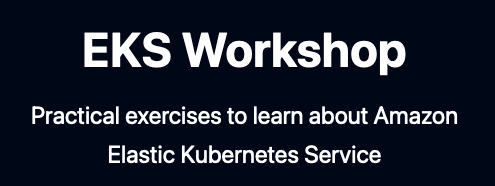

> **Fun with AWS: Learn AWS EKS Step-by-Step 💬**

## 📘 Introduction

Hey there! Ready to learn EKS? We're diving into the world of Amazon Web Services (AWS) Elastic Kubernetes Service (EKS) with a super cool workshop called [EKS Workshop](https://github.com/aws-samples/eks-workshop-v2). In this blog, we're going to explore this workshop together. We'll learn how to set up a special place in the cloud called a cluster, play with containers, and do some cool tricks with AWS services. The workshop is designed to be easy to follow, and you can choose which parts you want to do. You'll get to practice using Amazon EKS and other AWS tools, like an EKS cluster, to see how they work together. By the end of this blog post, you'll have a good understanding of Amazon EKS and how to use it to manage your applications on AWS.

### 🏗 Amazon EKS Workshop

The Amazon EKS Workshop is built to help users learn about Amazon EKS features and integrations with popular open-source projects. The workshop is abstracted into high-level learning modules, including Networking, Security, Cost Optimization, DevOps Automation, and more. These are further broken down into standalone labs focusing on a particular feature, tool, or use case. For example, you can find a lab for [Karpenter](https://karpenter.sh/), an open-source cluster autoscaler, in the Cost Optimization module. To ensure a consistent and predictable learning experience, the Amazon EKS Workshop closely adheres to the following tenets:

#### Principles

- **Modular**: The workshop is made up of standalone modules that can be individually completed, allowing you to start at any module and easily switch between them.
- **Consistent sample app**: The workshop uses the same sample retail store application across all modules: AWS Containers Retail Sample.
- **Amazon EKS-focused**: Although the workshop covers some Kubernetes basics, it primarily focuses on familiarizing the user with concepts directly related to Amazon EKS.
- **Continuously tested**: We automatically test the infrastructure provisioning and CLI steps in the workshop, allowing us to keep the workshop updated and tracking the latest versions of Amazon EKS.

### 🚀 How to Get Started with the Workshop

We designed the workshop for users with a basic understanding of containers and Kubernetes. As a primer to this workshop, users can learn the basics about containers, Kubernetes, and Amazon EKS with the [Learn Kubernetes and EKS playlist](https://www.youtube.com/playlist?list=PLhr1KZpdzukcYwxz6XJz0LhB1yJYt8g8k) hosted on "Containers from the Couch".

#### Prerequisites

- An active AWS account with administrative permissions
- A basic understanding of containers and Kubernetes
- [Terraform v1.3.x](https://learn.hashicorp.com/tutorials/terraform/install-cli) (installation instructions here)

To start the Amazon EKS Workshop, you'll first need to deploy the Amazon EKS cluster environment. To automate these steps, the workshop follows infrastructure as code (IaC) best practices leveraging [Terraform](https://www.terraform.io/), an open-source tool to manage cluster creation and other prerequisites. We decided to use Terraform as a large number of Amazon EKS customers are already using Terraform today, and we expect the workshop to serve as an example for how to configure an Amazon EKS cluster and its various add-ons and integrations.

Under the hood, Terraform uses [Amazon EKS Blueprints for Terraform](https://aws.amazon.com/blogs/containers/introducing-eks-blueprints-for-terraform/), allowing you to easily bootstrap the Amazon EKS cluster. The workshop cluster is provisioned with a number of these tools and configurations ready to go, including managed node groups, an Amazon Fargate profile, Karpenter, Kubernetes Cluster Autoscaler, Kubecost, Crossplane, various Amazon EKS add-ons, and more. This means you spend less time installing, and more time navigating and learning the workshop material. To learn how to deploy the cluster environment with Terraform, refer to the [Getting Started instructions](https://www.eksworkshop.com/020_prerequisites/workspace/) on the Amazon EKS Workshop.

### 🛠 Amazon EKS Workshop Features

Once your workshop environment is deployed, most of the lab is completed through CLI commands. For every command in the workshop, you can easily left-click anywhere in the instruction to copy the command or press the clipboard on the top right to copy all commands.

#### Kustomize

Kubernetes is configured using declarative YAML files, and most of the workshop modules include steps to update the cluster's YAML configuration. To streamline the edits for YAML files, we leverage [Kustomize](https://kustomize.io/), an open-source configuration management tool that's built into the `kubectl` CLI. This enables us to not only apply changes easily, but also easily see exactly what has changed.

### 🏗 Environment Reset

After completing a module, you can easily switch to other modules by running the `reset-environment` command. This command cleans up any artifacts in your cluster and returns it to the initial state. This allows you to easily jump between any module in the workshop, and even clean up an uncompleted module.

### 🔚 Conclusion

With the new Amazon EKS Workshop, customers now have a reliable and continuously tested hands-on approach to learning about Amazon EKS and its ecosystem of open-source tooling. Get started today with the self-guided experience by using Terraform to deploy the workshop environment and then follow the step-by-step instructions in the standalone workshop modules.

- Get started with the workshop: [eksworkshop.com](https://www.eksworkshop.com/)
- Learn more about the project and start contributing: [github.com/aws-samples/eks-workshop-v2](https://github.com/aws-samples/eks-workshop-v2)
