> **Make your FinOps easier withrReal-time cost insights**

## 🔖 Introduction

In today’s cloud-driven landscape, managing and optimizing AWS costs is extremely important for organizations. However, the complexities surrounding cost monitoring and financial operations (FinOps) can pose significant challenges.

**[AWS Cost Explorer](https://aws.amazon.com/aws-cost-management/aws-cost-explorer/)** provides detailed insights into cost allocation and usage trends, enabling informed decisions for cost efficiency. Integrating it with **Slack ChatOps** enables real-time collaboration, customized alerts, and actionable recommendations.

The integration empowers organizations to proactively manage budgets, identify cost anomalies, and optimize cloud spend. By fostering a culture of cost optimization and accountability, teams can work together towards common cost optimization goals, achieving financial efficiency and maximizing their AWS investments.

### 🎯 Goals & Objectives

In this blog post, we explore how AWS Cost Explorer and Slack ChatOps simplify AWS cost monitoring and FinOps using **[aws-cost-cli](https://github.com/kamranahmedse/aws-cost-cli)**, AWS, and [GitHub Actions](https://github.com/features/actions).

There is no better way to learn than by doing it yourself 😊

**HAPPY LEARNING** 💻

### 🚀 Prerequisites

Before we start, I assume you have the following:

- **AWS and GitHub accounts.**
- **[Terraform](https://www.terraform.io/) installed and configured.**
- **The [AWS CLI](https://aws.amazon.com/cli/) installed and configured.**

## ❄ The Workflow Landscape

So our workflow consists of the following steps:

1. **GitHub Actions** to trigger a daily cost analysis of the AWS account using the [aws-cost-cli](https://github.com/kamranahmedse/aws-cost-cli).
2. **Push the notification to a private Slack channel**.

**aws-cost-cli** is an excellent tool that allows you to perform cost analysis on your AWS account, providing valuable insights into your cloud spending. With the integration of GitHub Actions and Slack notifications, you can enhance your cost analysis workflow and improve cost management practices. In this blog post, we will explore the benefits of using AWS Cost CLI with GitHub Actions and Slack integration, enabling you to gain real-time cost visibility, automate cost analysis tasks, and receive timely cost notifications on Slack.

And now, I will walk you through the Terraform configuration for setting up the authentication and an Actions workflow that uses it.

### 🔐 Setup of GitHub OIDC

In order to authenticate to AWS, we will use an **OpenID Connect (OIDC) Identity Provider** for GitHub Actions, which enables us to configure workflows that request temporary, on-demand credentials from any service provider on the internet that supports OIDC authentication.

Using OpenID Connect, we can remove the need to have keys stored in GitHub Actions, saving the headache of [rotating the keys](https://github.com/cloudquery/cq-provider-aws/tree/main/policies/cis_v1.2.0) or other tedious tasks. The [GitHub OIDC deployment guide](https://docs.github.com/en/actions/deployment/security-hardening-your-deployments/about-security-hardening-with-openid-connect) highlights many advantages to using OIDC over access keys.

OIDC allows you to adopt good security practices, such as:

- **No Cloud Secrets**: Eliminating the need to store cloud credentials as long-lived secrets. Instead, workflows will request and use a short-lived access token from the cloud provider through OIDC.
- **Authentication and Authorization Management**: Having granular control over how workflows can use credentials, using the cloud provider's authentication and authorization tools to control access to cloud resources.
- **Rotating Credentials**: With OIDC, the cloud provider issues a short-lived access token that is only valid for a single job, and then automatically expires.

The following steps provide an overview of how GitHub's OIDC provider integrates with GitHub Actions and the cloud provider:

1. **Configure AWS Identity and Access Management (IAM)** in our AWS account to trust the GitHub Actions Identity Provider.
2. **Make an IAM role available** to GitHub Actions entities with specific properties.
3. **Add an Actions workflow** to request and use credentials from AWS.

Here is a schema representing what we are going to accomplish:

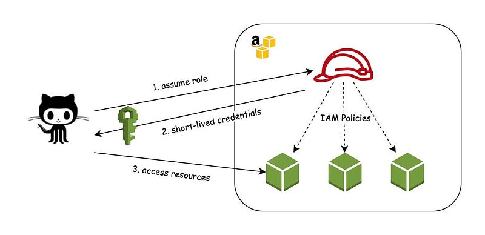

## 🛠️ Automating with Terraform

It is really a straightforward Terraform script to create an OpenID Connect Identity provider with its required role and permissions. Luckily, the [Terraform registry](https://registry.terraform.io/providers/hashicorp/aws/latest/docs) contains a complete AWS provider to use.

We will need to make sure you have the provider `aws {}` configured to actually interact with the AWS account in question. Another block or resource is actually configuring the OpenID Connect Identity provider. Then we will need to grant it a role to assume within AWS.

Now that we have a working OpenID Connect provider within AWS, we need to add the configuration to GitHub for use in our GitHub Actions. To do this, we simply add another step to the desired YAML workflow.

The relevant blocks look like so:

```yaml
permissions:  
    id-token: write  
    contents: read # This is required for actions/checkout@v2
```

Adding the permissions to the job allows the action that gets the credentials from AWS to store them for use in further steps. The permission that is specifically required is `id-token: write`.

The next step is where the credential-retrieving magic actually happens:

```yaml
- name: Configure AWS credentials
    uses: aws-actions/configure-aws-credentials@v1
    with:
        role-to-assume: arn:aws:iam::XXXXXXXXXX:role/github-oidc
        role-duration-seconds: 900
        aws-region: eu-west-1
```

where `XXXXXXXXXX` is the AWS account ID.

For more details, you can refer to the [AWS Actions documentation](https://github.com/aws-actions/configure-aws-credentials).

### 📜 Provision of the GitHub OIDC Resources on AWS

The Terraform configuration is organized in the `main.tf` file:

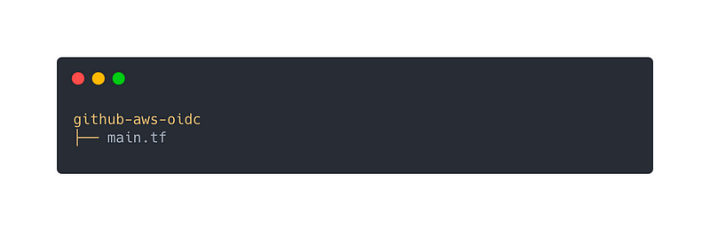

First, we use the [aws_iam_openid_connect_provider](https://registry.terraform.io/providers/hashicorp/aws/latest/docs/resources/iam_openid_connect_provider) Terraform resource to add the GitHub Actions Identity Provider in the same way as one would any other SSO option.

We also define data blocks to get the AWS account ID and `thumbprint_list`.

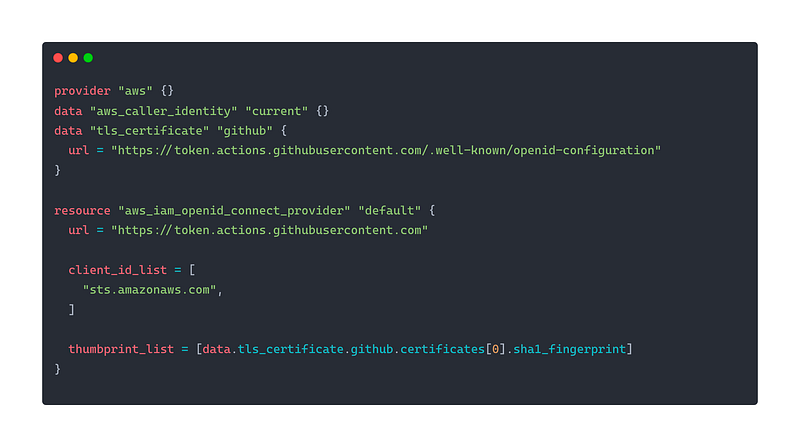

Next, with the [aws_iam_policy_document](https://registry.terraform.io/providers/hashicorp/aws/latest/docs/data-sources/iam_policy_document) Terraform data source, we create an assume role policy (which will determine under which circumstances the role we are creating can be used).

Notice specifically that:

- `principles.identifiers` is a reference to the `aws_iam_openid_connect_provider` resource created above.
- We are testing `token.actions.githubusercontent.com:sub` (which is the attribute that the GitHub Identity Provider uses to convey the workspace, repository name, and git ref of the GitHub Action making the request) to be sure that it matches the projects and branches we want to provide credentials to. Your values will need to replace `github_workspace`, `application_repo`, and the `*` if you intend to prevent Actions for arbitrary branches from accessing credentials.

Then, we simply create a role using that policy. At this point, you can attach whatever permissions policies to the role are necessary for the work you intend the GitHub Action to perform (cost explorer `ce` and `iam` in our case).

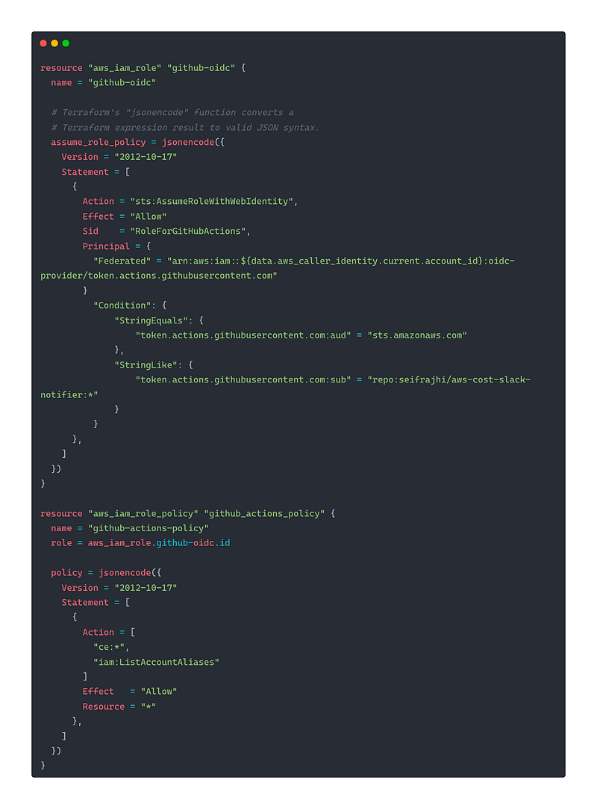

### 🏗️ Initialize Terraform Workspace

In order to initialize the Terraform configuration, we will run the below command:

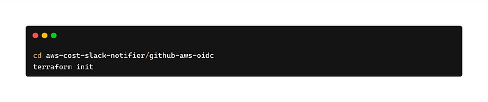

### 🚀 Provision of the GitHub OIDC

Run the below command to create your cluster and other necessary resources.

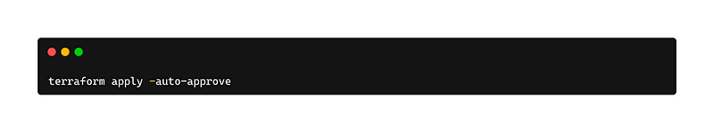

### 📡 Build the Slack App for Incoming Messages with Webhooks

Slack webhooks provide a simple and efficient way to send messages to Slack channels programmatically. By leveraging this functionality, you can automate message delivery, integrate external systems, and enhance real-time notifications.

#### Section 1: Creating a Slack App

To get started, sign in to your Slack account and navigate to the [Slack App Directory](https://api.slack.com/apps). Click on "Create New App" to initiate the app creation process. Provide a name for your app and select the workspace where you want to install it. This establishes the foundation for your incoming message handling.

#### Section 2: Enabling Incoming Webhooks

Once your app is created, navigate to the **"Incoming Webhooks"** feature in the left sidebar. Enable incoming webhooks for your app by toggling the switch. This enables your app to receive and process incoming messages.

#### Section 3: Adding the Incoming Webhook to Your Workspace

Scroll down to the **"Add New Webhook to Workspace"** section and click on the **"Add Incoming Webhooks Integration"** button. Customize the settings for your webhook, including the target channel for incoming messages, and optionally provide a name and icon. These settings determine where and how your messages will appear in Slack.

#### Section 4: Authenticating Your App with Automatically Generated Tokens

After configuring the incoming webhook, you can use the automatically generated tokens to authenticate your app. These tokens were generated when you installed the app to your team. You can use these tokens to establish secure communication between your app and the Slack API.

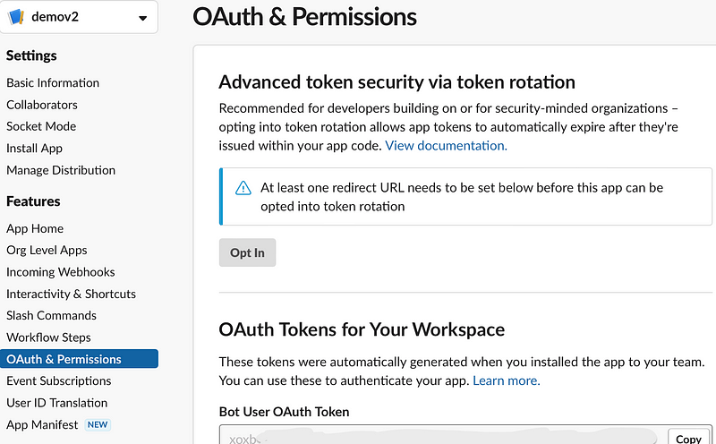

#### Section 5: Managing Scopes and Permissions with OAuth & Permissions

To manage scopes and permissions for your app, navigate to the **"OAuth & Permissions"** section in your app settings. Here, you can specify the necessary scopes required for your app to access different Slack features and resources. Configure the required permissions to ensure your app has the necessary capabilities to perform desired actions within Slack.

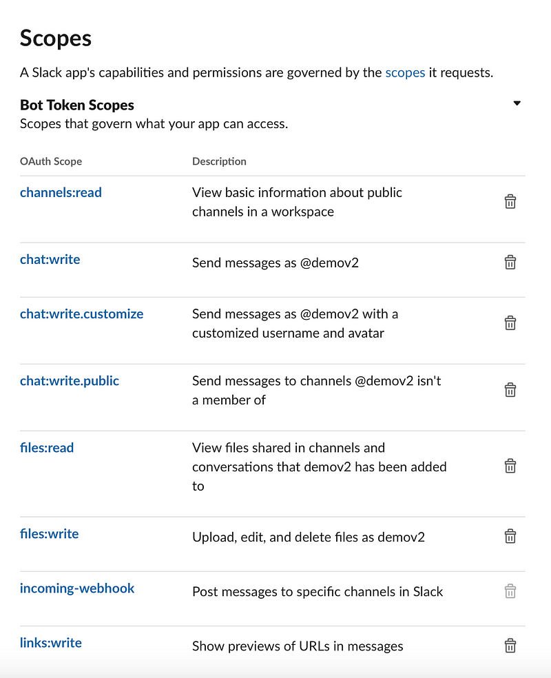

### Add the GitHub Workflow

Now, we define a workflow in `.github/workflows/cost.yml`, which will assume the IAM role defined above, and make the credentials available for subsequent steps. Set `role-to-assume` to the ARN of the role created above. Also, set `region` and `duration` appropriately. Running `aws sts get-caller-identity` is all you need to prove that your credential workflow has succeeded.

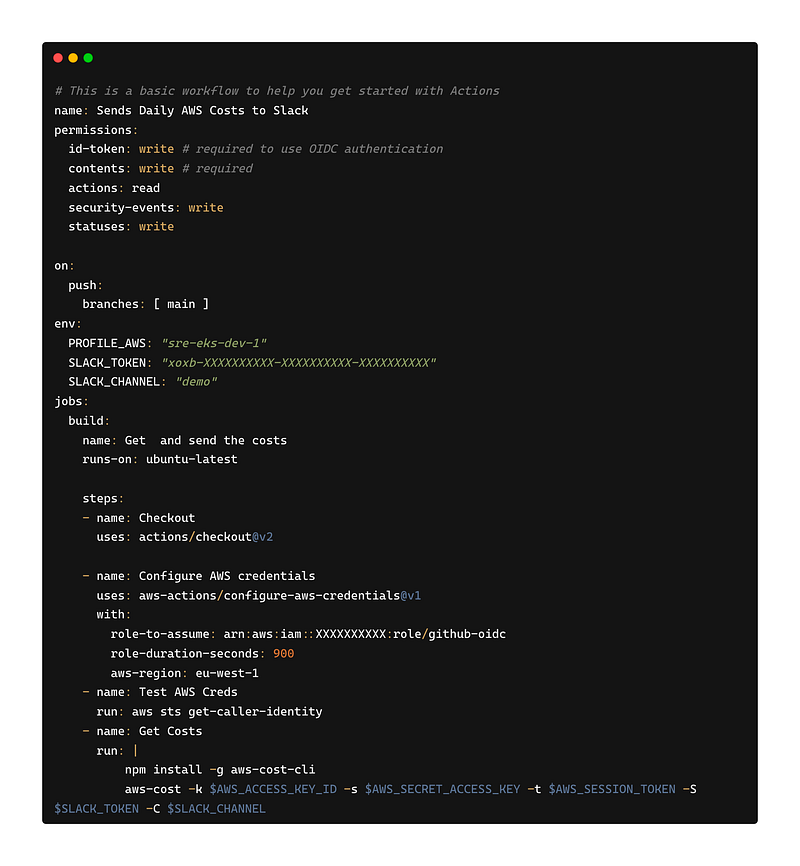

**PS:**
You can create cron GitHub actions that get triggered on a daily basis. After the action is launched, you will receive a message in the Slack channel that you have chosen in the configuration:

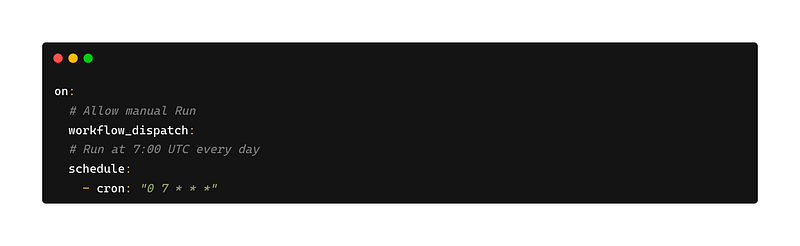

After the action is launched, you will receive a message in the Slack channel that you have chosen in the configuration:

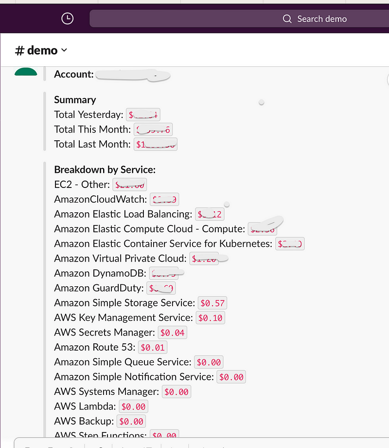

Now that you've seen it, I'm sure you'll agree — this approach is much cleaner, simpler, nicer, and safer when compared with the old, common practice of creating an IAM user and exporting access keys to GitHub Actions secrets. You can find the source code of the project on my [GitHub](https://github.com).

For your reference, here are some docs:

- [GitHub OIDC/AWS](https://docs.github.com/en/actions/deployment/security-hardening-your-deployments/configuring-openid-connect-in-amazon-web-services)
- [GitHub Action, configure-aws-credentials](https://github.com/aws-actions/configure-aws-credentials)

Shout-out to the resources we found when we approached setting this for the first time. These posts really made the path clear:

- [AWS Federation Comes to GitHub Actions](https://awsteele.com/blog/2021/09/15/aws-federation-comes-to-github-actions.html)
- [Securely Access Your AWS Resources from GitHub Actions](https://benoitboure.com/securely-access-your-aws-resources-from-github-actions)
- [AWS Access Key ID and GitHub Actions Secrets](https://sixfeetup.com/blog/aws_access_key_id-and-github-actions-secrets)

## 🌟 Conclusion 🌟

I hope you guys have enjoyed this hands-on tutorial and learned a bit more than what you knew before. Let me know if you have any questions related to this blog.

<br>

**_Until next time, つづく 🎉_**

> 💡 Thank you for Reading !! 🙌🏻😁📃, see you in the next blog.🤘  _**Until next time 🎉**_

🚀 Thank you for sticking up till the end. If you have any questions/feedback regarding this blog feel free to connect with me:

**♻️ LinkedIn:** https://www.linkedin.com/in/rajhi-saif/

**♻️ X/Twitter:** https://x.com/rajhisaifeddine

**The end ✌🏻**

<h1 align="center">🔰 Keep Learning !! Keep Sharing !! 🔰</h1>

**📅 Stay updated**

Subscribe to our newsletter for more insights on AWS cloud computing and containers.
