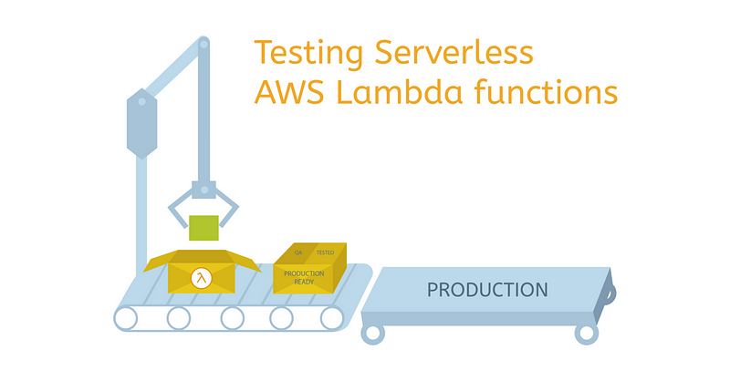
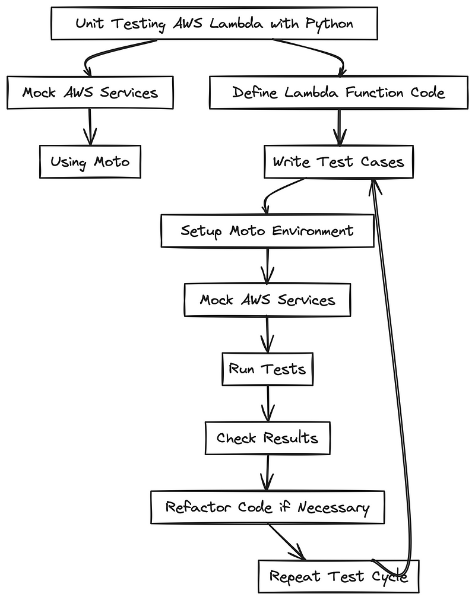

> **Quality Assurance and Resilience of AWS Lambda with Moto 🚁✨**

## 📍 Introduction

When developing [serverless](https://www.cloudflare.com/en-gb/learning/serverless/what-is-serverless/) [event-driven](https://en.wikipedia.org/wiki/Event-driven_architecture) applications with AWS Lambda, ensuring the reliability and functionality of individual components is important.

[Unit testing](https://www.techtarget.com/searchsoftwarequality/definition/unit-testing) serves as a fundamental practice to swiftly identify and isolate potential issues within [AWS Lambda function](https://aws.amazon.com/lambda/features/) code.

This blog post explores the application of unit testing techniques for Python-based AWS Lambda functions, particularly focusing on interactions with various AWS services. In this context, the [Moto](https://github.com/getmoto/moto/tree/master) library emerges as a valuable tool for simulating AWS resources, enabling the testing of Python code that interfaces with services such as [DynamoDB](https://aws.amazon.com/dynamodb/features/) and [S3](https://aws.amazon.com/s3/features/).

Through the integration of Moto with [pytest](https://github.com/pytest-dev/pytest), this post aims to provide insights into effectively testing Python-based AWS Lambda functions.



### 🛠️ What is Moto and Why Use It?

When testing code that interacts with cloud services, it's essential to mimic the functionality of those services. However, replicating them completely locally can be challenging. This is where [Moto](https://github.com/getmoto/moto), a library that allows mocking AWS services, comes into play.

Moto is particularly useful when testing Python code that interacts with AWS services like DynamoDB, S3, and others. It enables developers to simulate AWS resources, making it easier to test code that interfaces with various AWS services.

By using Moto in combination with [pytest](https://docs.pytest.org/en/6.2.x/), developers can ensure comprehensive testing of their Python code, thereby enhancing the reliability and quality of their applications.

Moto has gained recognition for its ability to simplify testing in the cloud, making it a valuable tool for developers working on serverless applications. By using Moto, developers can test their code without the need to directly access real AWS resources, ultimately streamlining the testing process and contributing to the overall robustness of their applications.




## 🧩 Decorator Approach

The decorator approach simplifies AWS service mocking using Moto in the `eu-west-1` region. The `@mock_ec2` decorator encapsulates the test function, ensuring automatic management of the Moto mock environment for seamless testing.

```python
import boto3
from moto import mock_ec2
from main import create_instances

@mock_ec2
def test_create_instances_with_decorator(self):
    instance_count = 1
    image_id = 'ami-02ed82f3a38303e6f'
    create_instances('eu-west-1', image_id, instance_count)
    client = boto3.client('ec2', region_name='eu-west-1')
    instances = client.describe_instances()['Reservations'][0]['Instances']
    assert len(instances) == instance_count
    assert instances[0]['ImageId'] == image_id
```

## 🧩 Context Manager Approach

In the Ireland region, the context manager-based approach facilitates AWS service mocking with Moto. Utilizing `with mock_ec2():`, the test logic within the block benefits from the active Moto mock environment, maintaining clarity and proper resource management.

```python
import boto3
from main import create_instances
from moto import mock_ec2

def test_create_instances_with_context_manager(self):
    with mock_ec2():
        instance_count = 1
        image_id = 'ami-02ed82f3a38303e6f'
        create_instances('eu-west-1', image_id, instance_count)
        client = boto3.client('ec2', region_name='eu-west-1')
        instances = client.describe_instances()['Reservations'][0]['Instances']
        assert len(instances) == instance_count
        assert instances[0]['ImageId'] == image_id
```

## 🧩 Raw Approach

For explicit control over the Moto mock environment, the raw approach is demonstrated in the Ireland region. Manually starting and stopping the mock using `mock.start()` and `mock.stop()` provides flexibility, as shown in the following example.

```python
import boto3
from main import create_instances
from moto import mock_ec2

def test_create_instances_raw(self):
    mock = mock_ec2()
    mock.start()
    instance_count = 1
    image_id = 'ami-02ed82f3a38303e6f'
    create_instances('eu-west-1', image_id, instance_count)
    client = boto3.client('ec2', region_name='eu-west-1')
    instances = client.describe_instances()['Reservations'][0]['Instances']
    assert len(instances) == instance_count
    assert instances[0]['ImageId'] == image_id
    mock.stop()
```


---

## 🎩 Local Lambda Testing

Moto uses decorators to intercept and simulate responses to and from AWS resources. By adding a decorator for a given AWS service, subsequent calls from the module to that service will be re-directed to the mock.

In this section, we'll couple the Moto library and pytest framework to have clean and scalable unit tests. Let's test a serverless app using Pytest and Moto. Our goal? Check if a piece of code (AWS Lambda) works right. We'll focus on the Lambda function, not AWS services. We'll use Pytest for testing and Moto to pretend AWS services. This keeps tests clear and reliable.

### 📄 Lambda Function Code

This file (`main.py`) contains the main Lambda function (`lambda_handler`) that manipulates data and uploads it to an S3 bucket. It utilizes the Boto3 library to interact with AWS services.

```python
import boto3

def lambda_handler(event, context):
    # Sample Lambda function that manipulates data and uploads to S3
    data_to_upload = "Hello, Moto!"

    # AWS S3 Configuration
    s3_bucket = "your-s3-bucket"
    s3_key = "example.txt"

    # Upload to S3
    s3 = boto3.client("s3")
    s3.put_object(Body=data_to_upload, Bucket=s3_bucket, Key=s3_key)

    return {"statusCode": 200, "body": "Data uploaded to S3 successfully."}
```

### 🛠️ Pytest Configuration

`conftest.py` serves as a configuration file for Pytest. In this example, it defines two fixtures:

- **aws_credentials**: A fixture to set up mocked AWS credentials using environment variables.
- **s3_mock**: A fixture that uses Moto's `mock_s3` context manager to mock the S3 service. It depends on the `aws_credentials` fixture to ensure mocked credentials are available.

```python
import pytest
import os
from moto import mock_s3

@pytest.fixture(scope='function')
def aws_credentials():
    # Mocked AWS Credentials for Moto
    os.environ['AWS_ACCESS_KEY_ID'] = 'fake-access-key'
    os.environ['AWS_SECRET_ACCESS_KEY'] = 'fake-secret-key'
    os.environ['AWS_SECURITY_TOKEN'] = 'fake-security-token'
    os.environ['AWS_SESSION_TOKEN'] = 'fake-session-token'

@pytest.fixture(scope='function')
def s3_mock(aws_credentials):
    with mock_s3():
        yield boto3.client('s3')
```

### 🧪 Unit Test

`test_main.py` is a Pytest test file that contains a single unit test (`test_lambda_handler`). This test checks if the Lambda function in `main.py` successfully uploads a file to an S3 bucket. It uses the `s3_mock` and `aws_credentials` fixtures from `conftest.py` to set up the required mocking environment.

```python
import pytest
import boto3
from main import lambda_handler

def test_lambda_handler(s3_mock, aws_credentials):
    # Event and Context are not used in this example
    event = {}
    context = {}

    # Invoke the Lambda function
    response = lambda_handler(event, context)

    # Check if the S3 object was created successfully
    assert response["statusCode"] == 200

    # Check if the object exists in S3
    objects = s3_mock.list_objects(Bucket='your-s3-bucket')
    assert objects["Contents"][0]["Key"] == "example.txt"
```

### 🚀 Running the Unit Tests

The unit testing framework can be run using the Python `pytest` utility. To ensure network isolation and verify the unit tests are not accidentally connecting to AWS resources, the [pytest-socket](https://pypi.org/project/pytest-socket/) project provides the ability to disable network communication during a test.

```sh
pytest -v --disable-socket -s test_main.py
```

The `pytest` command results in a PASSED or FAILED status for each test. A PASSED status verifies that your unit tests, as written, did not encounter errors or issues.

### 📌 Conclusion

In this guide, we explored some ways for mocking AWS responses with Moto, offering a swift and cost-free approach to testing Python code. When paired with Pytest, it delivers scalable and tidy unit tests specifically tailored for AWS interactions.

### 🔍 What Next?

You can keep an eye on this [repository](https://github.com/seifrajhi/Python-AWS-Lambda-Testing) as I continue to develop it and add more use cases and integrations!

<br>

**_Until next time, つづく 🎉_**

> 💡 Thank you for Reading !! 🙌🏻😁📃, see you in the next blog.🤘  _**Until next time 🎉**_

🚀 Thank you for sticking up till the end. If you have any questions/feedback regarding this blog feel free to connect with me:

**♻️ LinkedIn:** https://www.linkedin.com/in/rajhi-saif/

**♻️ X/Twitter:** https://x.com/rajhisaifeddine

**The end ✌🏻**

<h1 align="center">🔰 Keep Learning !! Keep Sharing !! 🔰</h1>

**📅 Stay updated**

Subscribe to our newsletter for more insights on AWS cloud computing and containers.
