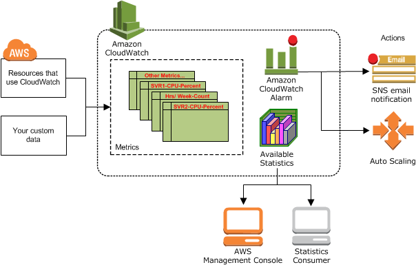
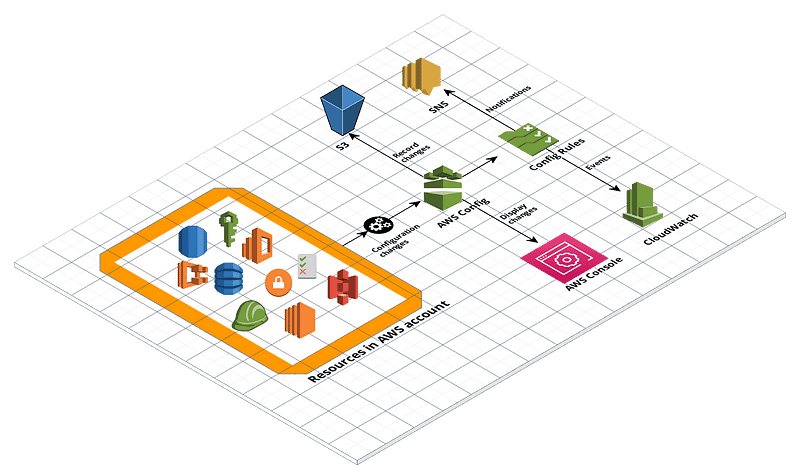
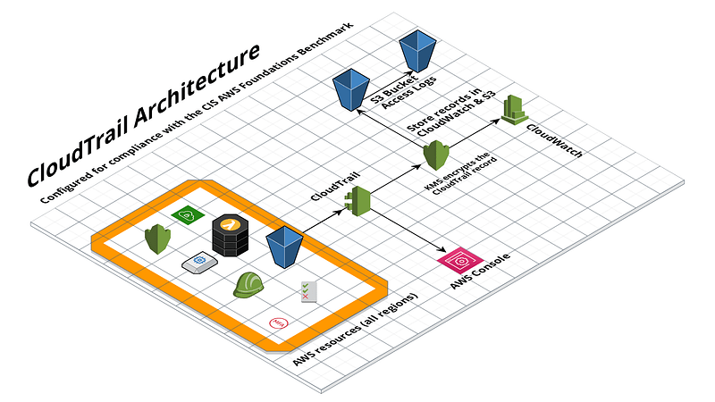
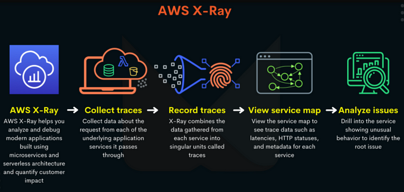
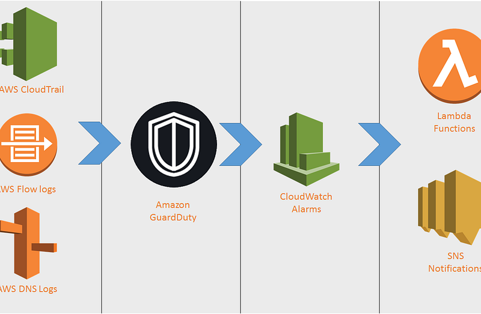
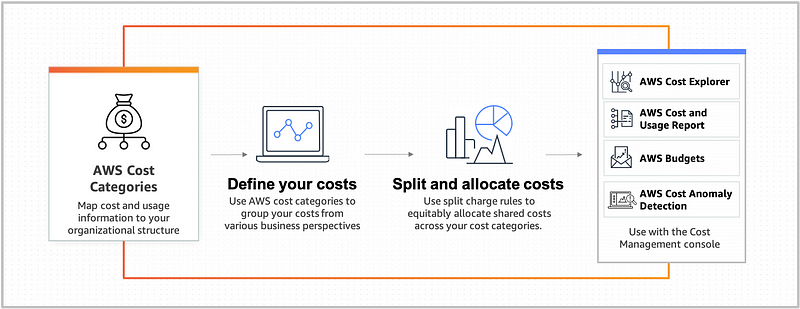
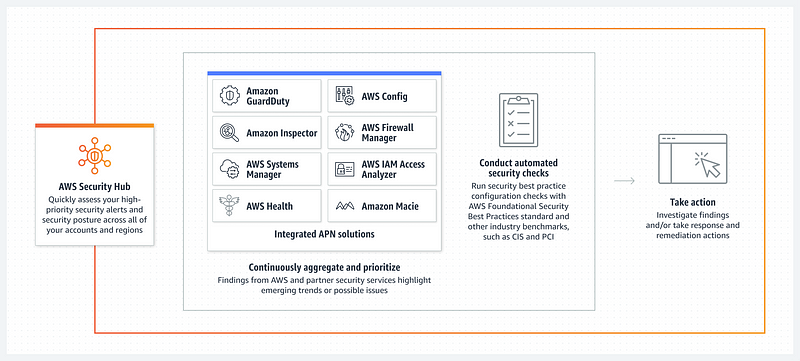
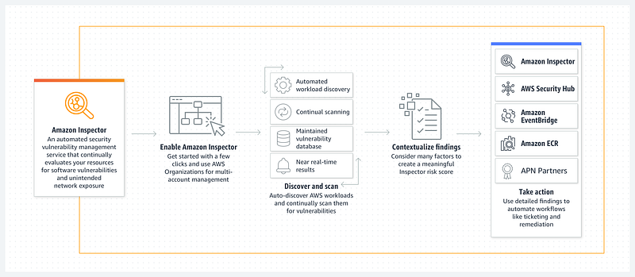

> **Don’t let your cloud catch you sleeping**

## 🔖 Introduction

As more and more companies move their workloads to the cloud, the need for effective monitoring of cloud resources becomes increasingly critical. AWS provides a suite of tools and services that enable organizations to monitor their cloud resources and ensure their availability, performance, and security.

### 🎯 Goals & Objectives

In this guide, we will discuss best practices for AWS monitoring and the tools available to implement them. **HAPPY LEARNING** 💻

### 📝 Define Your Monitoring Strategy

Before you start monitoring your infrastructure, it is important to define your monitoring strategy. Determine what you want to monitor, why you want to monitor it, and what metrics you will use to evaluate your infrastructure's performance. By having a clear strategy in place, you can ensure that you are collecting the right data and using it to make informed decisions.

### 📊 Use CloudWatch for Metrics and Alarms

AWS CloudWatch is a monitoring service that provides metrics for AWS resources and applications. CloudWatch metrics are used to monitor the performance of your EC2 instances, databases, and other services. By default, CloudWatch metrics are available for EC2 instances, but other AWS resources can be monitored using custom metrics.

To set up CloudWatch metrics and alarms, follow these steps:

1. **Enable detailed monitoring** for your EC2 instances, which provides additional metrics.
2. **Define CloudWatch alarms** for important metrics such as CPU utilization, disk usage, and network traffic.
3. **Configure SNS (Simple Notification Service) topics** to receive notifications when alarms are triggered.

For example, you can create an alarm that sends an email notification when CPU utilization on an EC2 instance goes above 80%. This allows you to proactively address issues before they become critical.

For more information, visit the [AWS CloudWatch Documentation](https://docs.aws.amazon.com/AmazonCloudWatch/latest/monitoring/WhatIsCloudWatch.html).

### 🗂️ Utilize AWS Config for Resource Inventory

AWS Config is a service that provides a detailed inventory of your AWS resources and their configurations. Config continuously monitors your resources and their configurations for compliance with policies, including security and governance policies.

To use AWS Config, follow these steps:

1. **Enable AWS Config** for your AWS account and select the resources you want to monitor.
2. **Create rules** to evaluate resource compliance with policies.
3. **Review the Config dashboard** to identify non-compliant resources.

For example, you can use AWS Config to check whether all of your S3 buckets are encrypted. Config provides a centralized view of your resources and their configurations, making it easier to ensure compliance with policies.

AWS Config Rules and AWS Security Hub can both take remediation actions to help you maintain the security and compliance of your AWS environment. AWS Config can take actions in response to changes in your AWS resources. AWS Config provides a feature called AWS Config Rules, which are automated rules that evaluate the configuration of your AWS resources and can trigger automatic remediation actions if the resources are not compliant with your desired configuration.

For more information, visit the [AWS Config Documentation](https://docs.aws.amazon.com/config/latest/developerguide/WhatIsConfig.html).

### 🕵️ Use AWS CloudTrail for Auditing

AWS CloudTrail is a service that records all API calls made in your AWS account. CloudTrail provides a detailed record of activity across your AWS resources, including who made the call, when it was made, and which resource was accessed.

To use AWS CloudTrail, follow these steps:

1. **Enable CloudTrail** for your AWS account and select the resources you want to monitor.
2. **Create trails** to specify where CloudTrail logs are stored.
3. **Use CloudTrail logs** to investigate security incidents and perform compliance audits.

For example, you can use CloudTrail to investigate a security incident by reviewing the API calls made during that time. CloudTrail provides a valuable tool for auditing your AWS account and maintaining compliance.

AWS CloudTrail can trace management API calls and data API calls made to supported AWS services within your AWS account. Management APIs are used to manage AWS resources, and CloudTrail can trace the Create, Update, and Delete actions for these resources. Data APIs, on the other hand, are used to read or modify the data stored in AWS resources. CloudTrail can trace data API calls that read or write data to a resource.

For more information, visit the [AWS CloudTrail Documentation](https://docs.aws.amazon.com/awscloudtrail/latest/userguide/cloudtrail-user-guide.html).

### 🌐 Monitor Network Traffic with VPC Flow Logs

AWS VPC Flow Logs is a feature that captures IP traffic flowing in and out of network interfaces in your VPC. Flow Logs provide visibility into network traffic, including source and destination IP addresses, ports, and protocols.

To use VPC Flow Logs, follow these steps:

1. **Enable Flow Logs** for your VPC and select the network interfaces to monitor.
2. **Specify the destination** for Flow Logs data, such as S3 or CloudWatch Logs.
3. **Analyze Flow Logs data** to detect security issues and troubleshoot network problems.

For example, you can use VPC Flow Logs to detect and investigate suspicious network activity. Flow Logs provides a valuable tool for monitoring network traffic and maintaining network security.

For more information, visit the [AWS VPC Flow Logs Documentation](https://docs.aws.amazon.com/vpc/latest/userguide/flow-logs.html).

### 🕸️ Use AWS X-Ray for Distributed Tracing

AWS X-Ray is a service that helps you analyze and debug distributed applications. X-Ray provides a detailed view of how requests propagate through your application, including how long each service takes to respond.

To use AWS X-Ray, follow these steps:

1. **Instrument your application code**: To trace requests through your application, you need to instrument your application code with the X-Ray SDK.
2. **Configure X-Ray** to trace requests for your application.
3. **Use X-Ray to analyze performance** and troubleshoot issues in your distributed application.
4. **Use X-Ray integrations**: X-Ray integrates with other AWS services, such as AWS Lambda, Amazon API Gateway, and Amazon ECS, to provide additional functionality.
5. **Configure X-Ray sampling**: By default, X-Ray samples a subset of incoming requests to reduce the amount of trace data collected and stored.

For example, you can use X-Ray to identify the source of latency in your application by tracing the flow of requests through different services. X-Ray provides a powerful tool for understanding the performance of your distributed application.

For more information, visit the [AWS X-Ray Documentation](https://docs.aws.amazon.com/xray/latest/devguide/aws-xray.html).

### 🛡️ Use Amazon GuardDuty for Threat Detection

Amazon GuardDuty is a threat detection service that continuously monitors your AWS accounts and workloads for malicious activity. GuardDuty analyzes AWS CloudTrail logs, VPC Flow Logs, and DNS logs to identify security threats.

To use Amazon GuardDuty, follow these steps:

1. **Enable GuardDuty** for your AWS account and specify which resources to monitor.
2. **Configure GuardDuty** to send alerts when it detects suspicious activity.
3. **Use GuardDuty alerts** to investigate and respond to security threats.

For example, you can use GuardDuty to detect unauthorized access attempts or instances of malware in your AWS environment. GuardDuty provides a valuable tool for maintaining the security of your AWS resources.

For more information, visit the [Amazon GuardDuty Documentation](https://docs.aws.amazon.com/guardduty/latest/ug/what-is-guardduty.html).

### 💰 Monitor Your Costs

One of the most important aspects of managing your AWS resources is keeping your costs under control. AWS provides a number of tools to help you monitor your costs, including:

- **AWS Cost Explorer**: Allows you to view your costs and usage over time.
- **AWS Budgets**: Sends you alerts when you exceed certain spending thresholds.
- **AWS Cost and Usage Reports (CUR)**: Provides detailed data about your AWS usage and costs, including resource usage, cost, and pricing information.
- **AWS Billing and Cost Management Dashboard**: Provides an overview of your AWS billing and usage, including current and forecasted costs.

By monitoring your costs, you can make informed decisions about resource allocation and adjust your usage patterns to optimize spending.

For more information, visit the [AWS Cost Management Documentation](https://docs.aws.amazon.com/cost-management/latest/userguide/what-is-cost-management.html).

### 🔒 Monitor Your Security with AWS Security Hub

AWS Security Hub is a security service that provides a comprehensive view of your security posture across your AWS accounts. It aggregates and prioritizes security alerts and findings from AWS services and third-party tools, allowing you to quickly identify and remediate security issues.

Here's how to use Security Hub to monitor your security:

1. **Activate Security Hub**: You can do this from the AWS Console or by using the AWS CLI. Once activated, Security Hub starts collecting security findings from supported AWS services, including Amazon GuardDuty, Amazon Inspector, and AWS Config.
2. **Review security findings**: After Security Hub starts collecting security findings, you can review them in the Security Hub console.
3. **Remediate security issues**: When you identify security issues in Security Hub, you can take actions to remediate them. For example, you can apply patches to vulnerable instances, configure security groups to restrict access, or modify IAM policies to restrict permissions.
4. **Monitor compliance status**: Security Hub provides a compliance dashboard that shows your compliance status with various security standards and regulations, such as CIS AWS Foundations Benchmark, PCI DSS, and HIPAA.

For more information, visit the [AWS Security Hub Documentation](https://docs.aws.amazon.com/securityhub/latest/userguide/what-is-securityhub.html).

### 🖥️ Monitor Your EC2 Instances with Amazon Inspector

Amazon Inspector is an automated security assessment service that helps improve the security and compliance of your applications deployed on AWS. Inspector automatically assesses the security and compliance of your Amazon EC2 instances, Amazon ECR container images, and AWS Lambda functions, identifying vulnerabilities and deviations from best practices. Inspector provides detailed findings and prioritizes them based on severity, helping you to quickly remediate issues.

For more information, visit the [Amazon Inspector Documentation](https://docs.aws.amazon.com/inspector/latest/userguide/inspector_introduction.html).

### 🌟 Conclusion 🌟

AWS provides a suite of tools and services that enable organizations to monitor their cloud resources and ensure their availability, performance, and security. By following best practices for AWS monitoring, organizations can proactively identify and resolve issues before they become critical.

Using the tools and services mentioned in this guide will help organizations maintain the highest level of availability, performance, and security for their AWS resources.

 

**_Until next time, つづく 🎉_**

> 💡 Thank you for Reading !! 🙌🏻😁📃, see you in the next blog.🤘  _**Until next time 🎉**_

🚀 Thank you for sticking up till the end. If you have any questions/feedback regarding this blog feel free to connect with me:

**♻️ LinkedIn:** https://www.linkedin.com/in/rajhi-saif/

**♻️ X/Twitter:** https://x.com/rajhisaifeddine

**The end ✌🏻**

<h1 align="center">🔰 Keep Learning !! Keep Sharing !! 🔰</h1>

**📅 Stay updated**

Subscribe to our newsletter for more insights on AWS cloud computing and containers.
