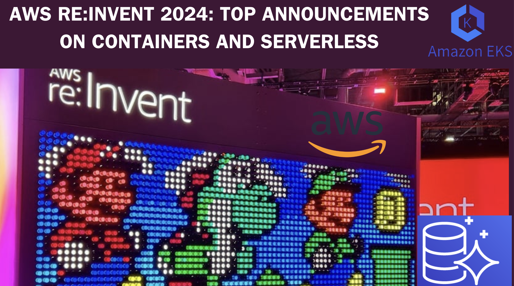

> **AWS re:Invent 2024: Key Announcements on Containers and Serverless**

## 🔖  **Introduction**

During re:Invent 2024, AWS made several significant announcements regarding their container and serverless offerings. Here's what you need to know.

## 1. Amazon EKS Auto Mode

AWS introduced [Amazon Elastic Kubernetes Service (Amazon EKS) Auto Mode](https://aws.amazon.com/about-aws/whats-new/2024/12/amazon-eks-auto-mode/), a new capability designed to streamline Kubernetes cluster management. With EKS Auto Mode, you can manage compute, storage, and networking from provisioning to ongoing maintenance with a single click. This feature enhances agility, performance, and cost-efficiency by automating cluster management tasks, allowing you to focus on building innovative applications instead of managing infrastructure.

## 2. Amazon EKS Hybrid Nodes

Another major announcement was the general availability of [Amazon EKS Hybrid Nodes](https://aws.amazon.com/about-aws/whats-new/2024/12/amazon-eks-hybrid-nodes/). This feature allows you to attach your on-premises and edge infrastructure as nodes to EKS clusters in the cloud. By unifying Kubernetes management across cloud and on-premises environments, EKS Hybrid Nodes enable you to leverage the scalability and availability of Amazon EKS while using your existing hardware. This integration supports consistent operational practices and tooling across your environments.

## 3. Amazon Aurora Serverless v2

AWS also announced that [Amazon Aurora Serverless v2](https://aws.amazon.com/about-aws/whats-new/2024/11/amazon-aurora-serverless-v2-scaling-zero-capacity/) now supports scaling to zero capacity. This feature allows databases to scale down to zero, with resume times typically around 15 seconds. It's particularly useful for low-usage databases, such as those in development or user acceptance testing (UAT) environments, offering significant cost savings for small and medium-sized businesses (SMBs).

## 🔚 Conclusion

These announcements underscore AWS's commitment to providing flexible, efficient, and cost-effective solutions for managing container and serverless environments.
