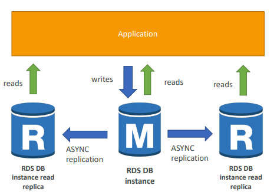
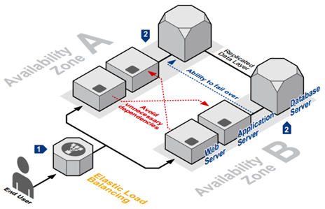
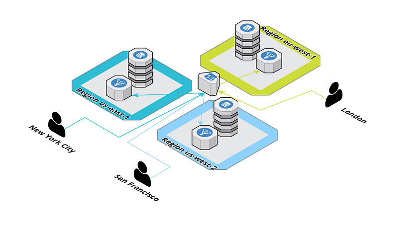
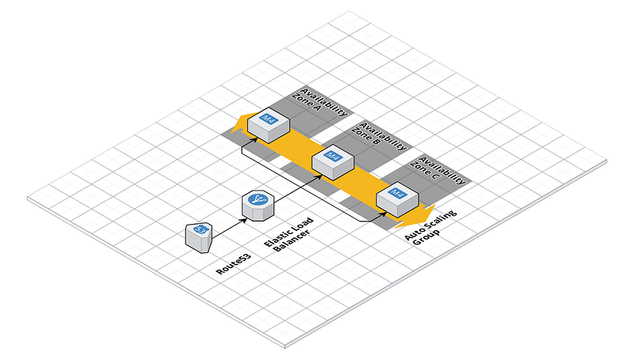
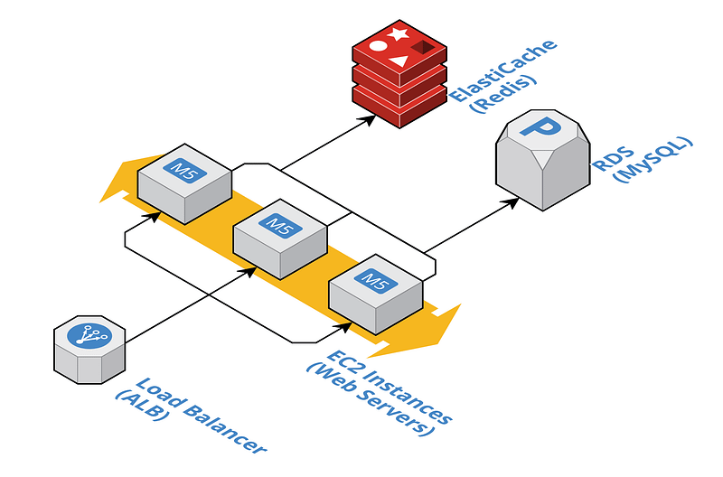
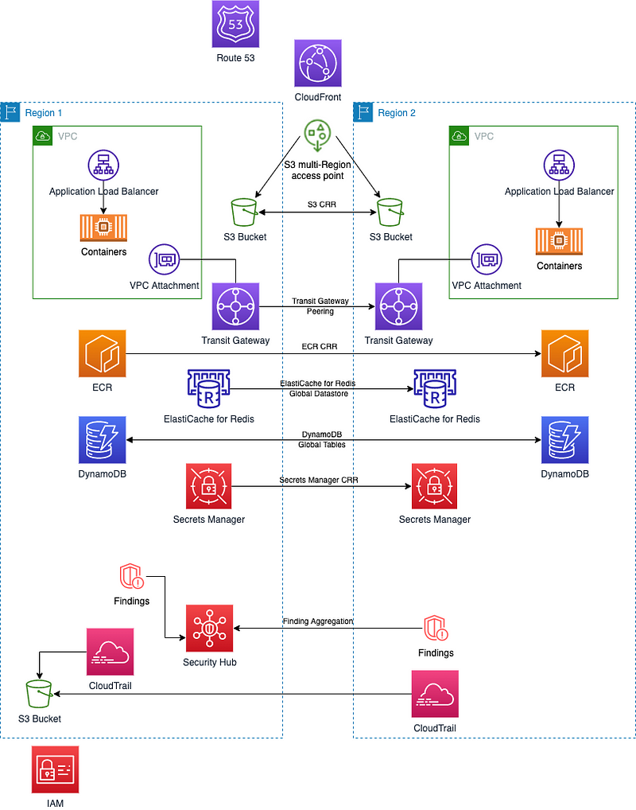

> **Optimizing Performance and Reliability in AWS Architectures**

## 📚 Introduction

Amazon Web Services (AWS) is a great and flexible cloud computing platform that can provide organizations with the scalability, reliability, and security needed to support their business operations.

However, it's important to design your AWS architecture for performance and reliability to ensure that your application or service can handle the demands of your users, while also providing high availability and resilience.

## 🎯 Goals & Objectives

In this blog post, we'll cover several key concepts that you can implement to optimize your AWS architecture for performance and reliability. We'll discuss:

- **Read Replicas**
- **Multi-AZ Deployments**
- **Cross-Region Failover**
- **Redundancy**
- **Auto-Scaling**
- **Caching**
- **Backup**
- **Disaster Recovery**
- **Replication**
- **Snapshots**
- **Logging**

There is no better way to learn than by doing it yourself 😊  
**HAPPY LEARNING** 💻

### 📈 Read Replicas

One way to improve the performance and reliability of your AWS architecture is to use read replicas. Read replicas are copies of your database that can be used to offload read traffic from your primary database. This can help to improve the performance of your application by reducing the load on your primary database, while also providing a high level of availability and fault tolerance. Some of the tools that can be used for setting up read replicas include [Amazon Aurora](https://aws.amazon.com/rds/aurora/), which is a relational database engine that provides read replicas with sub-millisecond latency.

### 🌐 Multi-AZ Deployments

Another way to optimize your AWS architecture for performance and reliability is to use multi-AZ deployments. Multi-AZ deployments involve replicating your resources across multiple availability zones (AZs) in a region. This can help to improve the availability and reliability of your application by providing automatic failover in the event of an outage in one AZ. [Amazon RDS](https://aws.amazon.com/rds/), [Amazon Aurora](https://aws.amazon.com/rds/aurora/), and [Amazon DynamoDB](https://aws.amazon.com/dynamodb/) all support Multi-AZ deployment. In the context of RDS, Multi-AZ provides automatic failover to a standby instance in case of a primary instance failure, while read replicas are used to offload read traffic from a primary database instance to improve read throughput and decrease read latency.

### 🌍 Cross-Region Failover

In addition to multi-AZ deployments, you may also want to consider cross-region failover. Cross-region failover involves replicating your resources across multiple regions. This can help to improve the availability and reliability of your application by providing automatic failover in the event of a region-wide outage. [Amazon Route 53](https://aws.amazon.com/route53/) provides DNS failover for cross-region failover scenarios.

### 🔄 Redundancy

To ensure the reliability of your AWS architecture, you should also consider using redundancy. Redundancy involves duplicating critical components of your application to ensure that they are available in the event of a failure. For example, you may want to consider using multiple load balancers or web servers to ensure that your application can continue to function even if one component fails. [Amazon Elastic Load Balancer (ELB)](https://aws.amazon.com/elasticloadbalancing/) provides load balancing across multiple instances to ensure redundancy.

### 📈 Auto-Scaling

Another important concept to consider when optimizing your AWS architecture for performance and reliability is auto-scaling. Auto-scaling involves automatically adding or removing resources based on the demand for your application. This can help to ensure that your application can handle spikes in traffic without experiencing performance issues. [Amazon EC2](https://aws.amazon.com/ec2/), [Amazon ECS](https://aws.amazon.com/ecs/), and [Amazon Elastic Beanstalk](https://aws.amazon.com/elasticbeanstalk/) all support Auto Scaling based on the demand for the application.

### ⚡ Caching

Caching is another technique that can help to improve the performance of your AWS architecture. Caching involves storing frequently accessed data in a cache, such as [Amazon ElastiCache](https://aws.amazon.com/elasticache/), which can help to reduce the number of requests to your primary database, and improve the overall performance of your application. [Amazon ElastiCache](https://aws.amazon.com/elasticache/) and [Amazon CloudFront](https://aws.amazon.com/cloudfront/) can be used to cache frequently accessed data to improve application performance.

### 🛡️ Disaster Recovery

In addition to backup, you should also have a disaster recovery plan in place. This involves having a plan for recovering your data and resources in the event of a disaster, such as a natural disaster or cyberattack. AWS provides a variety of tools to help you implement backup and disaster recovery, including [Amazon S3](https://aws.amazon.com/s3/), [Amazon Glacier](https://aws.amazon.com/glacier/), and [Amazon CloudWatch](https://aws.amazon.com/cloudwatch/).

### 🔄 Replication

Replication is another important concept to consider when optimizing your AWS architecture for performance and reliability. Replication involves copying your data to multiple locations to ensure that it is available in the event of a failure. This can help to improve the availability and reliability of your application. [Amazon S3 replication](https://aws.amazon.com/s3/features/replication/) can be used to replicate data across multiple regions for disaster recovery scenarios.

### 💾 Backup

To ensure that your data is safe and secure, you should also implement a backup strategy. This involves regularly backing up your data to a separate location, such as [Amazon S3](https://aws.amazon.com/s3/), to ensure that you can recover your data in the event of a disaster. [AWS Backup](https://aws.amazon.com/backup/) can be used to create and manage backups for your AWS resources.

### 📸 Snapshots

Snapshots are another technique that can be used to improve the reliability of your AWS architecture. Snapshots involve creating a point-in-time copy of your data, which can be used to restore your data in the event of a failure. [AWS Backup](https://aws.amazon.com/backup/) is a fully-managed backup service that centralizes and automates backups for EBS volumes, Amazon RDS, DynamoDB, and EFS. Snapshots, on the other hand, are point-in-time backups of EBS volumes and EFS that can be used to restore data or create new volumes.

### 📊 Logging

Finally, you should also consider implementing a logging strategy to help you monitor the performance and health of your AWS architecture. Logging involves capturing and storing information about the activity and events that occur in your application or service. This can help you to identify and diagnose issues, as well as track performance metrics over time. AWS provides several logging tools that can be used to monitor and analyze your environment, including [Amazon CloudWatch Logs](https://aws.amazon.com/cloudwatch/) and [Amazon Elasticsearch](https://aws.amazon.com/elasticsearch-service/).

## 🌟 Conclusion 🌟

Optimizing your AWS architecture for performance and reliability is essential to ensure that your application or service can handle the demands of your users, while also providing high availability and resilience. By implementing concepts such as read replicas, multi-AZ deployments, cross-region failover, redundancy, auto-scaling, caching, backup, disaster recovery, replication, snapshots, and logging, you can create a robust and reliable AWS architecture that can support your business operations now and into the future.

 

**_Until next time, つづく 🎉_**

> 💡 Thank you for Reading !! 🙌🏻😁📃, see you in the next blog.🤘  _**Until next time 🎉**_

🚀 Thank you for sticking up till the end. If you have any questions/feedback regarding this blog feel free to connect with me:

**♻️ LinkedIn:** https://www.linkedin.com/in/rajhi-saif/

**♻️ X/Twitter:** https://x.com/rajhisaifeddine

**The end ✌🏻**

<h1 align="center">🔰 Keep Learning !! Keep Sharing !! 🔰</h1>

**📅 Stay updated**

Subscribe to our newsletter for more insights on AWS cloud computing and containers.
