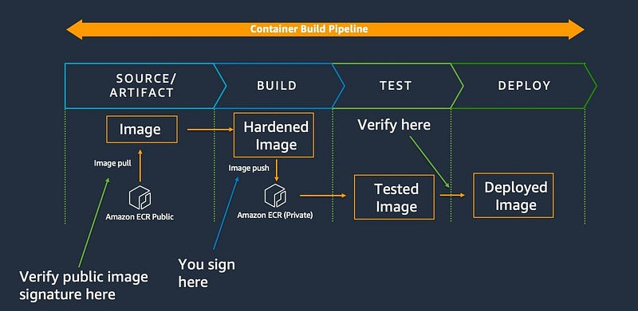
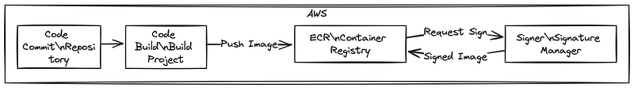

> **Ensuring the integrity and authenticity of containerized applications and Metadata**

## 🔖 Introduction

The adoption of containers grows, so does the need to ensure the integrity and authenticity of the software artifacts that make up these applications.

Beyond just the container images themselves, organizations are required to secure additional metadata files, such as Common Vulnerabilities and Exposure (CVE) scan results, Software Bill of Materials (SBOM), and Helm charts, that provide critical information about the components and dependencies of their containerized applications.

_Ensuring the provenance and trustworthiness of these artifacts is essential for maintaining the overall security and compliance of the software supply chain._

In this blog post, we will explore how AWS Signer, a fully managed code-signing service, can be used to cryptographically sign and validate not only container images, but also the associated OCI (Open Container Initiative) artifacts that accompany them.

## Open Container Initiative OCI
The Open Container Initiative (OCI) is a lightweight, open governance structure (project), formed under the auspices of the Linux Foundation, for the express purpose of creating open industry standards around container formats and runtimes. The OCI was launched on June 22nd 2015 by Docker, CoreOS and other leaders in the container industry.

The OCI currently contains three specifications: the Runtime Specification (runtime-spec), the Image Specification (image-spec) and the Distribution Specification (distribution-spec). The Runtime Specification outlines how to run a “filesystem bundle” that is unpacked on disk.

## AWS Signer

AWS Signer is a fully managed signing service that simplifies the process of signing container images. It integrates seamlessly with ECR, allowing you to sign and verify images easily in your ECR repositories.

AWS Signer uses the Notary project, an open-source container image signing tool, to perform the signing and verification operations. Image signing involves creating a cryptographic signature using a private key and the image’s digest.

The signature is then attached to the image, and when the image is deployed, the signature is verified using the corresponding public key.

If the verification fails, it indicates that the image has been tampered with and should not be deployed.

## Hands-On example

If you want to implement image signing within our development workflows. It’s important to think about which other OCI artifacts we intend to incorporate alongside our images. Equally critical is ensuring that security is integrated at every stage of the image’s lifecycle, from its initial creation to deployment. For this latter aspect, leveraging signatures within an OCI repository can be advantageous, addressing key container security practices:

- Establishing ongoing trust as vulnerabilities and configuration requirements evolve
- Validating the integrity of images to ensure they remain untampered
- Approving images and artifacts that align with organizational compliance standards.

Consequently, our approach should involve selecting, signing, and managing all relevant OCI artifacts for an image to enhance trust and enhance visibility across the software development lifecycle (SDLC).

Let’s check a typical development process and explore how our organization can embrace these practices. Additionally, you can refer to this security blog for further insights on integrating AWS Signer into a pipeline.

Initially, developers fetch public images for initial testing and customization on their local machines.

Once prepared for building, they upload their build specification files to a shared code repository, such as **AWS CodeCommit**.

A modification in the shared repository triggers a pipeline via AWS CodeBuild. This pipeline utilizes the build specification files to construct and sign an image using** AWS Signer**.

Subsequently, the image is uploaded to an **OCI-compliant** image repository, such as Amazon Elastic Container Registry (Amazon ECR). Notably, AWS Signer, in conjunction with the underlying Notation CLI client, can be employed with any OCI 1.0 compatible registry.

## Conclusion

By integrating AWS Signer into your software development lifecycle, you can establish a robust and centralized solution for managing the signing and verification of your containerized applications and their supporting metadata, ensuring the trust and integrity of your software supply chain.

**References:**

- https://aws.amazon.com/blogs/containers/signing-and-validating-oci-artifacts-with-aws-signer/
- https://aws.amazon.com/blogs/security/best-practices-to-help-secure-your-container-image-build-pipeline-by-using-aws-signer/
- https://aws.amazon.com/blogs/containers/cryptographic-signing-for-containers/
- https://opencontainers.org/about/overview/
  
**_Until next time, つづく 🎉_**

> 💡 Thank you for Reading !! 🙌🏻😁📃, see you in the next blog.🤘  _**Until next time 🎉**_

🚀 Thank you for sticking up till the end. If you have any questions/feedback regarding this blog feel free to connect with me:

**♻️ LinkedIn:** https://www.linkedin.com/in/rajhi-saif/

**♻️ X/Twitter:** https://x.com/rajhisaifeddine

**The end ✌🏻**

<h1 align="center">🔰 Keep Learning !! Keep Sharing !! 🔰</h1>

**📅 Stay updated**

Subscribe to our newsletter for more insights on AWS cloud computing and containers.
