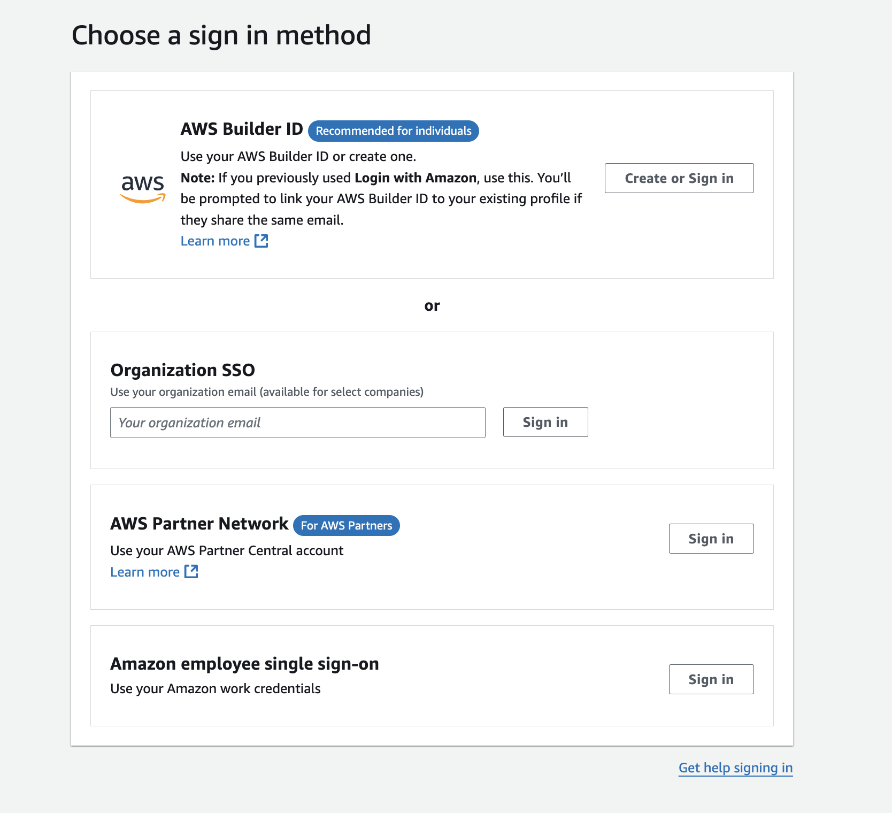

## Overview of AWS Skill Builder

[AWS Skill Builder](https://skillbuilder.aws/) is an online learning center designed to help individuals and organizations build in-demand cloud skills. It offers a wide range of training resources, including over 600 free courses, certification exam preparation, hands-on labs, and more.

### Key Features

1. **Free Learning Content**: AWS Skill Builder provides access to over 600 free courses and learning plans. These cover various topics, from basic cloud concepts to advanced AWS services.

2. **AWS Exam Prep**: The platform offers comprehensive exam preparation resources, including official question sets, practice exams, and pretests. This helps learners gain confidence and be well-prepared for AWS certification exams.

3. **AWS Builder Labs**: These labs provide guided instructions to help users develop practical skills in a sandbox environment. This allows learners to practice building without the risk of incurring unexpected costs.

4. **AWS Digital Classroom**: Available with the annual subscription, this feature includes expert-led videos, hands-on labs, knowledge checks, and course assessments. It offers a structured learning experience similar to traditional classroom training.

5. **Game-Based Learning**: AWS Skill Builder includes interactive learning experiences like AWS Cloud Quest and AWS Jam. These game-based simulations and challenges make learning engaging and fun.

6. **Community and Networking**: Users can connect with a large community of AWS professionals to share knowledge, ask questions, and network. This community aspect enhances the learning experience by providing support and collaboration opportunities.

### Subscription Options

AWS Skill Builder offers several subscription plans to cater to different needs:

- **Free Account**: Access to 600+ on-demand courses, standard exam prep courses, and digital badges.
- **Individual Monthly Subscription**: Priced at $29 per month, it includes enhanced exam prep courses, hands-on labs, and more.
- **Individual Annual Subscription**: Priced at $299 per year, it offers everything in the monthly subscription plus access to the AWS Digital Classroom.
- **Team Subscription**: Designed for organizations, this plan costs $449 per learner per year and includes additional features like administrator dashboards, comprehensive reporting, and SSO support.

### Specialized Learning Paths

AWS Skill Builder offers tailored learning paths for different roles and industries. These paths help learners focus on the skills most relevant to their career goals.

For example, there are specific tracks for cloud practitioners, solutions architects, developers, DevOps, serverless, containers and more.

### Practical Experience

The platform emphasizes hands-on learning through its extensive lab offerings. With over 1,000 lab experiences, learners can apply their knowledge in real-world scenarios. This practical approach ensures that users not only understand theoretical concepts but also know how to implement them.

### Continuous Updates

AWS Skill Builder is regularly updated to reflect the latest AWS services and best practices. This ensures that learners are always getting the most current and relevant information.

### Additional Features

1. **Login to skills Builder**: Users can log in using their Builder ID, AWS Partner Network credentials, Organization SSO, or Amazon employee single sign-on, making access seamless and secure.

2. **Generative AI-Powered Simulations**: The platform includes AI-powered simulations that provide a dynamic and interactive learning experience, helping users understand complex concepts through practical application.

3. **Instructor-Driven Digital Courses**: These courses offer a blend of video instruction, hands-on labs, and assessments, providing a comprehensive learning experience.

4. **Jam Journey Challenges**: These challenges present real-world, open-ended problems in an AWS Console environment, enhancing problem-solving skills and preparing users for professional scenarios.

5. **Ramp-Up Guides**: Downloadable guides are available for further study, allowing users to delve deeper into specific roles or solutions within the AWS ecosystem.

6. **Activities Board**: This feature helps users track their course progress, completions, and test scores, providing insights into their learning journey and keeping them motivated.

### Conclusion

AWS Skill Builder is an excellent training platform that caters to a wide range of learning needs. Whether you're new to the cloud or an experienced professional, it offers the resources and support needed to build and validate your AWS skills. The combination of free and paid content, practical labs, and community support makes it a valuable tool for anyone looking to advance their career in cloud computing.

If you're looking for alternatives, DataScientest offers AWS training courses that teach you how to use cloud services to make your infrastructure scalable, identify migration procedures, and design solutions integrating security, authentication, and access functions with AWS. Their training is delivered entirely remotely, and they are recognized by the French government, making their courses eligible for funding under the Compte Personnel de Formation scheme.

 
 

> 💡 Thank you for Reading !! 🙌🏻😁📃, see you in the next blog.🤘  _**Until next time 🎉**_

🚀 Thank you for sticking up till the end. If you have any questions/feedback regarding this blog feel free to connect with me:

**♻️ LinkedIn:** https://www.linkedin.com/in/rajhi-saif/

**♻️ X/Twitter:** https://x.com/rajhisaifeddine

**The end ✌🏻**

<h1 align="center">🔰 Keep Learning !! Keep Sharing !! 🔰</h1>

**📻🧡 Resources**

- https://support.hashicorp.com/hc/en-us/articles/4406026108435-Known-issues-with-default-tags-in-the-Terraform-AWS-Provider-3-38-0-4-67-0
- https://medium.com/@leslie.alldridge/how-to-tag-aws-resources-in-terraform-effectively-f4f12bc2416b
- https://engineering.deptagency.com/best-practices-for-terraform-aws-tags

**📅 Stay updated**

Subscribe to our newsletter for more insights on AWS cloud computing and containers.
