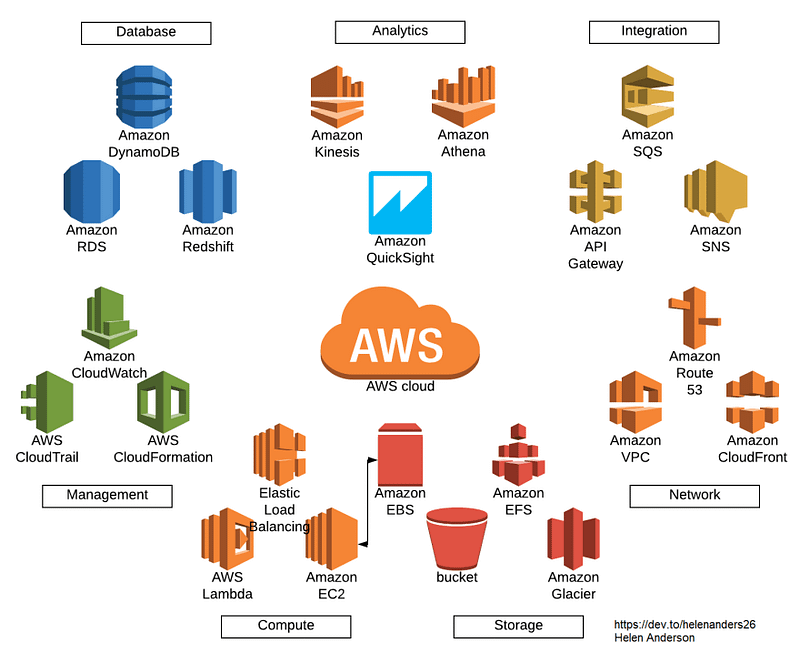
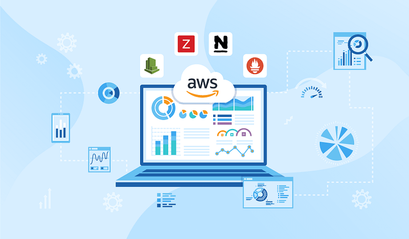
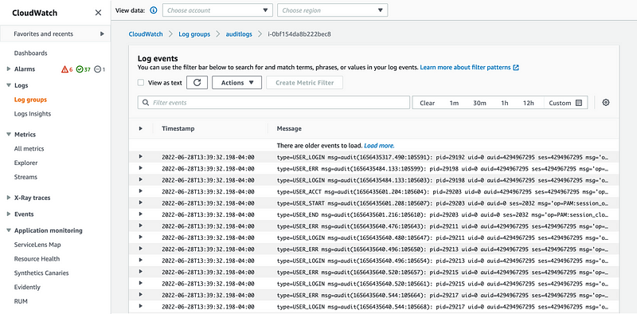

> **Building strategies for troubleshooting issues in AWS, emphasizing the importance of using logs and monitoring tools effectively.**

## 🔖 Introduction

If you’re an AWS user, you’re likely familiar with the power and flexibility the platform offers. AWS can enable organizations to scale their infrastructure, automate deployments, and improve the reliability of their services.

However, even with all of its benefits, AWS can also be a challenging platform to troubleshoot when things go wrong. With its vast number of services, complex integrations, and sometimes cryptic error messages, finding the root cause of an issue can feel like finding a needle in a haystack. But fear not!

### 🎯 Goals & Objectives

In this blog post, we'll explore some tips and best practices for AWS troubleshooting, so you can quickly and effectively identify and solve problems.

### 🛠️ Understand Your AWS Architecture

Before you can troubleshoot an issue, you need to understand how the AWS architecture is set up. AWS is a complex system of interconnected services, and understanding how they work together is essential for effective troubleshooting. Start by familiarizing yourself with the [AWS Management Console](https://aws.amazon.com/console/), the central hub for managing your AWS resources. From there, explore the various services available in AWS, including EC2, RDS, S3, Lambda, and others, and learn how they interact with each other.

#### 🔍 Start with a Solid Foundation

The key to effective AWS troubleshooting is to start with a solid foundation. Make sure you have a clear understanding of your infrastructure, including your network topology, security protocols, and access controls. Create a comprehensive inventory of your AWS resources, including EC2 instances, RDS databases, and S3 buckets, and document their interdependencies. By having a clear picture of your infrastructure, you can more easily identify the source of any problems that arise.

### 🔧 2. Start with the Basics

When troubleshooting an issue in AWS, it's essential to start with the basics. Verify that all the services are running correctly and that the required permissions are in place. Sometimes, an issue can be resolved by simply restarting a service or adding a missing permission.

### 📚 3. Follow AWS Best Practices

AWS has a vast library of [best practices](https://aws.amazon.com/architecture/well-architected/) for building, deploying, and managing applications on its platform. These best practices are designed to help you optimize your AWS infrastructure for performance, security, and cost-effectiveness. Following these best practices can also make it easier to troubleshoot issues. For example, using AWS CloudFormation to deploy infrastructure can make it easier to track changes and identify issues. Using Amazon S3 to store logs can help you quickly search and analyze them.

### 🗂️ 4. Use a Structured Approach

A structured approach to troubleshooting is essential. Start by defining the problem and the scope of the issue. Gather all relevant information, including system logs, metrics, and configuration settings. Next, identify possible causes and test each hypothesis until you find the root cause.

### 🩺 5. Start with the Symptoms

When you encounter an issue, it's essential to start with the symptoms. Document everything you see, hear, and experience. This will help you determine the scope of the problem and its severity. Once you have a clear understanding of the symptoms, you can move on to the next step.

### 📊 6. Use AWS Monitoring and Logging Tools

As an AWS engineer, you should use monitoring and logging tools such as [CloudWatch](https://aws.amazon.com/cloudwatch/) and [CloudTrail](https://aws.amazon.com/cloudtrail/) to proactively identify and troubleshoot issues before they become critical. With CloudWatch, you can set up alarms and notifications for specific metrics, and with CloudTrail, analyze detailed logs of API calls to track down access control and user activity issues. Additionally, you should leverage [AWS X-Ray](https://aws.amazon.com/xray/) for distributed tracing and performance analysis. By utilizing these tools, you ensure the health and performance of the system and minimize downtime. You must have a strong understanding of AWS services and infrastructure, and be always eager to learn and keep up with the latest trends in cloud computing.

### 🤝 7. Collaborate with AWS Support

Collaborating with AWS Support can be highly beneficial when you encounter issues that you're unable to resolve on your own. AWS offers various support plans, such as Basic, Developer, Business, and Enterprise, with different levels of support. Access to [AWS Trusted Advisor](https://aws.amazon.com/premiumsupport/technology/trusted-advisor/) is also available, which provides personalized recommendations for optimizing your infrastructure. AWS Support engineers are available round-the-clock to assist you with troubleshooting and finding solutions. By working with AWS Support, you can leverage their technical expertise and receive proactive guidance for enhancing the performance, security, and cost optimization of your infrastructure. This collaborative approach can help you to quickly and efficiently identify and resolve issues, minimizing their impact on your business operations.

### 📜 8. Check the Logs

Examining logs is a crucial step in troubleshooting issues in AWS. The platform generates an enormous volume of logs that can be accessed through the [AWS Management Console](https://aws.amazon.com/console/), CLI, or APIs. By analyzing the logs, you can gain valuable insights into events that occurred before and after an issue. These insights can help you to pinpoint the root cause of the problem and take corrective action. Look for patterns or anomalies that may be related to the issue, and use this information to guide your troubleshooting efforts. With the help of AWS logs, you can identify and resolve issues more quickly, minimizing their impact on your infrastructure and operations.

### 👥 9. Collaborate

AWS is a vast and intricate system, and it's impossible for any one individual to know everything. Collaborating with others is essential when troubleshooting an issue in AWS. Reach out to colleagues, AWS support, and the broader AWS community for help. By discussing the symptoms and potential causes of the problem with others, you can gain valuable insights and perspectives that may not have occurred to you on your own. Remember, two heads are often better than one. Utilize [AWS forums](https://forums.aws.amazon.com/), attend events, and engage with the community to expand your knowledge and build your network of support. By working together, you can more effectively resolve issues and ensure the optimal performance of your AWS infrastructure.

### 📚 10. Learn from Your Mistakes and Keep Learning

Improve your troubleshooting skills through practice. Set up a lab environment to simulate issues and participate in [AWS events](https://aws.amazon.com/events/) and training programs to stay current. When faced with an issue, take the time to review your processes and identify areas for improvement. Document your findings and share them with your team to learn from your mistakes and continually refine your processes. By doing so, you can become more efficient and effective in managing your infrastructure in AWS.

### 🤖 11. Automate Your Troubleshooting Processes

Where possible, automate: Troubleshooting can be time-consuming and error-prone when done manually. AWS provides automation tools such as [AWS Systems Manager](https://aws.amazon.com/systems-manager/), which automates tasks like patch management, configuration management, and instance remediation, and [AWS Lambda](https://aws.amazon.com/lambda/), which can trigger automated responses to specific events or alerts. Automating troubleshooting processes can save you time and effort, increase accuracy, and improve the speed and efficiency of your remediation efforts.

---

### 🌟 Conclusion

Troubleshooting AWS issues can be challenging, but with the right tools, best practices, and support, you can quickly identify and resolve problems. Understanding the AWS architecture, using AWS monitoring and logging tools, following best practices, collaborating with AWS support, and keeping up-to-date with the latest developments are all essential for effective AWS troubleshooting. By mastering these skills, you can take full advantage of the power and flexibility that AWS offers. Happy troubleshooting!

 

**_Until next time, つづく 🎉_**

> 💡 Thank you for Reading !! 🙌🏻😁📃, see you in the next blog.🤘  _**Until next time 🎉**_

🚀 Thank you for sticking up till the end. If you have any questions/feedback regarding this blog feel free to connect with me:

**♻️ LinkedIn:** https://www.linkedin.com/in/rajhi-saif/

**♻️ X/Twitter:** https://x.com/rajhisaifeddine

**The end ✌🏻**

<h1 align="center">🔰 Keep Learning !! Keep Sharing !! 🔰</h1>

**📅 Stay updated**

Subscribe to our newsletter for more insights on AWS cloud computing and containers.
