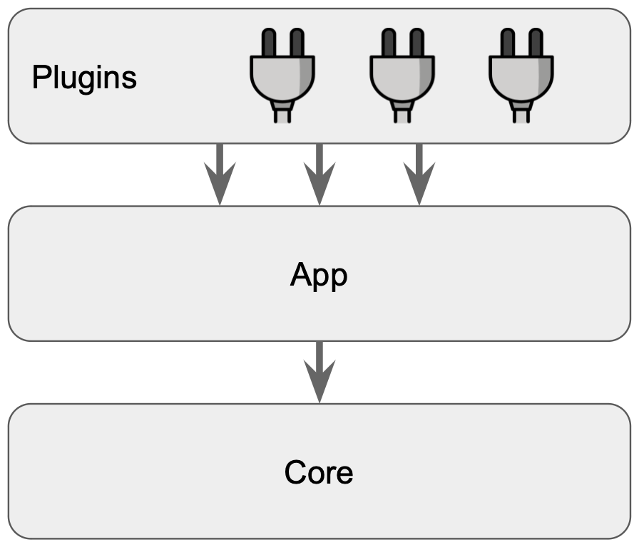

> **Introduction to Backstage and Its Key Features**

## 📕 Introduction

Are you tired of managing multiple infrastructure tooling, services, and documentation for your software development projects? Then consider using Backstage. Backstage is powered by a centralized software catalog that restores order to your microservices and infrastructure, unifying all your infrastructure tooling, services, and documentation to create a streamlined development environment from end to end.

In this quick start guide, we will introduce you to Backstage and its features. We will cover the Backstage software catalog for managing all your software, software templates for quickly spinning up new projects, and TechDocs for making it easy to create, maintain, find, and use technical documentation.

We will also explore the growing ecosystem of open-source plugins that further expand Backstage's customizability.


## 🧑‍💻 Developer Portal

A developer portal is a go-to place for developers, engineers, and managers when they need to learn about their ecosystem and contribute to it; a sort of window into your IT landscape. Developer portals balance autonomy and discoverability by allowing teams to work independently while exposing their work to others. They serve three purposes: navigating the ecosystem, empowering engineers, and providing insight into tech's health. Automated and centralized discoverability through a software catalog helps developers explore, track ownership, and find useful information while providing leadership with tech insights.

## 🤔 What is Backstage?

[Backstage](https://backstage.io/) is an open-source project that serves as a centralized hub for software development teams. It offers a collaborative environment where developers, operations teams, and stakeholders can manage projects, streamline workflows, and access tools and services needed for the software development process. By enhancing productivity and collaboration, Backstage aims to facilitate efficient delivery of high-quality software.

A Backstage instance is a React/Node app built on top of the core libraries whose functionality you can define by installing plugins.

### The 3-layer Model of Backstage

1. **Core**: The Backstage core is composed of several packages, which include the CLI, utility tools, API definitions, etc. The core is maintained and released by the Backstage open source team.
2. **App**: This is the developer portal that the end users in the organization will interact with. Typically, a platform team in the organization would be concerned with setting this up.
3. **Plugins**: Plugins are what really makes Backstage extensible. There are dozens of open-source plugin packages available, or you can create your own plugins.



You can pick and choose what you need and extend its functionality by creating new plugins too. In essence, Backstage should be considered a framework to build your own developer portal, and not a plug-and-play product.

## 🚀 Backstage Features

### 📋 Software Catalog

Backstage's Software Catalog is a crucial feature that maps all software assets in an organization in a centralized directory to enable discoverability and manage technology. The Catalog can host a wide range of software entities, each differentiated by kind and type, and powered by metadata stored in YAML files. The Catalog helps to track ownership and dependencies, identifying orphaned entities and extracting insights such as maturity readiness and security warnings.

### 🛠️ Scaffolder

The Scaffolder helps onboard new team members and establishes best practices by providing software templates that initialize repositories with skeleton code and predefined settings. A software template defined in a YAML file specifies parameters and steps to execute, which are then generated into a UI in the Scaffolder. The Scaffolder and the Catalog work together to promote discoverability and standardization, with all components initialized by the Scaffolder automatically added to the Catalog.

### 📚 TechDocs

TechDocs provides a centralized hub for documentation that transforms markdown files into static pages. TechDocs follows the Catalog metadata files' principle of staying close to the source code for accuracy, allowing developers to focus on writing instead of managing the publishing process.

Building over these functionalities and by extending it with the use of plugins, one can implement sophisticated workflows or Golden Paths, a modern configuration management database, or a centralized overview of the IT landscape.

## ❌ What Backstage is Not

There are several things Backstage is not:

- It is not a 'one-size-fits-all' solution that will work out of the box. Every organization is different and has unique requirements. This calls for customizations as needed, integration with existing tooling, creation of custom workflows, custom plugins, and UI modifications.
- It is not a replacement for your current tools, but instead a universal abstraction layer that spans all of your tooling. Backstage enables automation of information aggregation to streamline processes and facilitate collaboration.
- Not just for developers. Engineers, Product Managers, and virtually everyone in the organization can use Backstage to find information and streamline their workflows.

## ⚠️ Gotchas

There are a few things to watch out for:

- Self-hosted Backstage is a popular deployment mode, and offers the full benefits of customizability. However, it also brings the additional overhead of setup and maintenance, which could run to more than 1 full-time engineer depending on the topology.
- As with any new technology, it is likely to run into unsolved challenges during implementation. Typically RBAC is one that could pose a challenge based on the existing infrastructure. The good news is that adoption is exploding, and things should mature as it progresses across the hype cycle.
- Since Backstage is not plug-and-play, it requires effort and skills to integrate into the existing ecosystem. For instance, developing and maintaining custom plugins oneself calls for knowledge with TypeScript. Commercial plugins might not always be available, for example, when there is a custom in-house tool that we want to plugin to Backstage.
- Backstage should not be considered as a silver bullet; organizational culture and any associated restrictions will hamper any benefits, so adoption requires a holistic approach.

## 🏢 Type of Organizations that Benefit the Most

Developer portals are particularly useful for scale-ups and larger companies with complex ecosystems of tools and services. However, large companies may also encounter restrictions and bureaucracy that could limit the benefits of using Backstage, and therefore adoption requires a holistic approach to change. Smaller companies with fewer tools may not gain a lot with developer portals, since they might have a more straightforward overview of their processes and direct communication with those involved. The [adopters' list](https://github.com/backstage/backstage/blob/master/ADOPTERS.md) gives you an idea of the type of organizations that are using Backstage.

## Getting Started with Backstage

Now I'm going to start with Backstage from scratch. I'd like to get a feel for the product and the UI, so we'll start with a very simple example out of the box. Note that I couldn't get it to work in Codespaces, I suspect something to do with port forwarding, so I've installed it on my local machine. Below are the instructions.

### Step 1: Install the App

As per the [official documentation](https://backstage.io/docs/getting-started/), you will need to have Node.js, Yarn, npx, and git installed on your local machine. Start by running the following command:

```shell
npx @backstage/create-app@latest
```

Here is the expected output:

```shell
npx @backstage/create-app@latest
Need to install the following packages:
@backstage/create-app@0.5.4
Ok to proceed? (y) y
? Enter a name for the app [required] my-backstage-app
Creating the app...
 Checking if the directory is available:
    checking      my-backstage-app ✔ 
 Creating a temporary app directory:
    creating      temporary directory ✔ 
 Preparing files:
    copying       .dockerignore ✔ 
    templating    .eslintrc.js.hbs ✔ 
    ....
    ....
    ....
    ....
🥇  Successfully created my-backstage-app
 All set! Now you might want to:
    Install the dependencies: cd my-backstage-app && yarn install
    Run the app: cd my-backstage-app && yarn dev
    Set up the software catalog: https://backstage.io/docs/features/software-catalog/configuration
    Add authentication: https://backstage.io/docs/auth/
```

### Step 2: Navigate to the Project Directory

Now navigate to the project directory using:

```shell
cd my-backstage-app
```

### Step 3: Start the Backstage App

Start the Backstage app using the following command:

```shell
yarn dev
```

This will launch the app and make it accessible via a web browser at `http://localhost:3000`. Here is a screenshot of the UI:


### Step 4: Integrate GitHub

My first goal was to see if I could create a template for developers to use when creating a new application. Fortunately, Backstage comes with a default template out of the box, but first, we need to integrate GitHub.

If you open the `app-config.yaml` file inside the `my-backstage-app` folder, you will see an integration section as shown below:

```yaml
integrations:
    github:
        - host: github.com
            # This is a Personal Access Token or PAT from GitHub. You can find out how to generate this token, and more information
            # about setting up the GitHub integration here: https://backstage.io/docs/getting-started/configuration#setting-up-a-github-integration
            token: ${GITHUB_TOKEN}
        ### Example for how to add your GitHub Enterprise instance using the API:
        # - host: ghe.example.net
        #   apiBaseUrl: https://ghe.example.net/api/v3
        #   token: ${GHE_TOKEN}
```

Since it's not a good idea to put any kind of secrets into a file that gets pushed into git, I opted to use an environment variable to pass my GitHub personal token into Backstage. You can do the same by running this command:

```shell
export GITHUB_TOKEN=your/personal/github/token
```

Now restart the app by hitting `Ctrl+C` and re-running `yarn dev`.

### Step 5: Create a Sample App using a Backstage Template

Now it's time to finally see how a developer can create the scaffolding for an app from within Backstage using a pre-defined template created by the platform engineering team. As mentioned before, this template comes out of the box for creating Node.js apps. You can find it under the `examples` folder in the `my-backstage-app` folder.

```shell
├── examples
│   ├── entities.yaml
│   ├── org.yaml
│   └── template
│       ├── content
│       │   ├── catalog-info.yaml
│       │   ├── index.js
│       │   └── package.json
│       └── template.yaml
```

Navigate to the 'Create' section and follow the on-screen instructions.


Now give your new app a name and a repo with a repo owner. The repo owner is your GitHub username. In Backstage terms, this app is called a **Component**. It's recommended to name the component the same as the repo to avoid errors when registering the component in the software registry.


You should have successfully added your new app/component.


### 🧭 Step 6: Explore the Newly Created Component

This is what the new GitHub repo created by Backstage looks like:


Now, check out your new service/app/component in the service catalog. Below is a screenshot of it:


Notice a few things about our new component. There are multiple tabs at the top which are:

- **Overview**
- **CI/CD**
- **API**
- **Dependencies**
- **Docs**

### 🎯 Key Takeaways

- **The Rise of Platform Engineering**: This discipline is revolutionizing the way organizations approach software development, making it more efficient, collaborative, and enjoyable.
- **Backstage's Capabilities**: With its wide array of features and plugins, Backstage emerges as a robust tool designed for Platform Engineers.
- **Developer-Centric Design**: The focus on streamlining workflows places Backstage at the forefront of this evolution, offering an integrated, flexible, and dynamic platform to cater to all your development needs.

Stay tuned for more in-depth posts on Backstage as I continue my exploration!

### 🏁 Wrapping Up

Backstage is a great tool to build functional developer portals. If you treat it as a framework instead of a platform, you can harness its full potential. Working along with the end users is the key to creating a robust development platform. Hopefully, this article got you up to speed with what Backstage is.

**Suggested Reading:**

- [Powerful Backstage Templates | An EKS & Terraform Example](https://tekanaid.com/posts/backstage-software-templates/)
- [Unlock Hidden Perks in Your Backstage Software Catalog](https://tekanaid.com/posts/backstage-software-catalog-tutorial/)

**_Until next time, つづく 🎉_**

<br><br>

> 💡 Thank you for Reading !! 🙌🏻😁📃, see you in the next blog.🤘  **_Until next time 🎉_**

🚀 Thank you for sticking up till the end. If you have any questions/feedback regarding this blog feel free to connect with me:

**♻️ LinkedIn:** https://www.linkedin.com/in/rajhi-saif/

**♻️ X/Twitter:** https://x.com/rajhisaifeddine

**The end ✌🏻**

<h1 align="center">🔰 Keep Learning !! Keep Sharing !! 🔰</h1>

**📅 Stay updated**

Subscribe to our newsletter for more insights on AWS cloud computing and containers.


