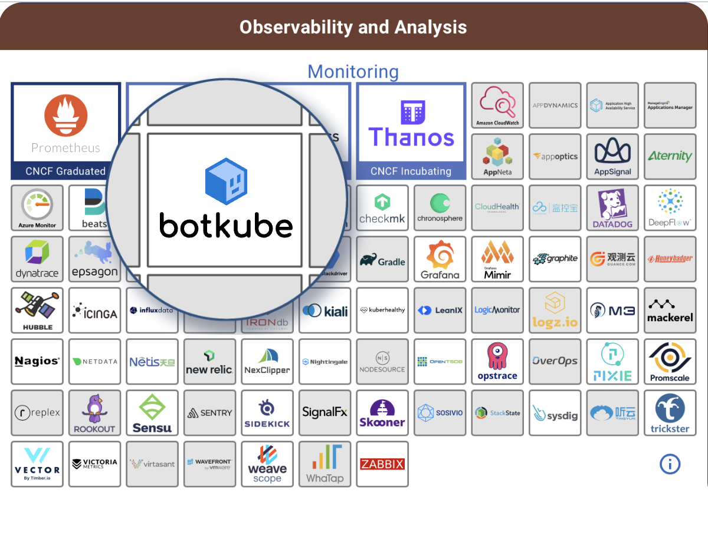

> **Making cluster operation automation simple for everyone 📗**

## 📕 Introduction

[Botkube](https://github.com/kubeshop/botkube) helps operators manage k8s by sending alerts and automating tasks.
It's great for both experts and beginners. You can use it to run commands, follow best practices, and integrate with Slack, Teams, Discord, or Mattermost.

In this blog post, we'll show you how Botkube makes managing Kubernetes simpler. We'll look at some key tasks it can help you with, making your cluster management smoother and more efficient.



## Setup BotKube on Kubernetes


<div class="image-title"><a href="https://kubetools.io/botkube-the-ultimate-tool-for-kubernetes-alerts-and-notifications/">Source</a></div>

The following steps guide you through the setup process of BotKube on your Kubernetes cluster, enabling efficient monitoring and management.

### Create a Bot Account

To initiate the configuration of BotKube on Kubernetes, begin by creating a Bot account. This account serves as the communication bridge between BotKube and your Kubernetes cluster, facilitating seamless interaction and data exchange necessary for effective monitoring and troubleshooting.

### Deploying BotKube within K8s

Upon creating the Bot account, proceed to deploy BotKube on your Kubernetes cluster. This deployment process involves configuring BotKube to operate within your cluster setup, granting it the required access to monitor and manage resources efficiently.

> **Note:** Helm must be installed to use the charts. Please refer to [Helm's documentation](https://helm.sh/docs/intro/install/) to get started.

Once Helm is set up properly, add the repo as follows:

```sh
helm repo add botkube https://charts.botkube.io
```

You can then run:

```sh
helm search repo botkube
```

to see the charts.

Then install Botkube with Slack configured:

```sh
helm install botkube botkube/botkube --set config.bot.slack.enabled=true \
--set config.bot.slack.token=<SLACK_BOT_TOKEN> \
--set config.bot.slack.channel=<SLACK_CHANNEL_NAME>
```

Replace `<SLACK_BOT_TOKEN>` and `<SLACK_CHANNEL_NAME>` with your Slack bot token and the name of the Slack channel you want to use for notifications.


## Automating K8s Tasks

In the final part of this blog, we're going to talk about some important jobs in Kubernetes that we can make easier by using Botkube. When we automate these tasks, it helps keep our Kubernetes system running smoothly and efficiently.

### 📈 Monitoring and Alerting Kubernetes Clusters

Watching out for issues in Kubernetes clusters is really important to keep everything running smoothly. Normally, setting up alerts from Prometheus in Slack involves a lot of manual work, like defining alert conditions and configuring Alertmanager.

But with Botkube, you just need to put in the Prometheus endpoint and pick how you want to get alerts and log information. Unlike doing it by hand, Botkube gives you more choices for where alerts can go, like Slack, PagerDuty, email, MS Teams, or Discord. It's a simpler way to make sure you're alerted to any problems in your Kubernetes setup.


### ⬆️ Resource Scaling

Automation of resource scaling empowers Kubernetes clusters to dynamically adjust resource allocation based on workload demands. This automated scaling capability optimizes resource utilization, improves application performance, and ensures efficient use of infrastructure resources, leading to cost savings and enhanced scalability.

Botkube offers a valuable solution for automating resource scaling within a team. It simplifies access to Kubernetes clusters by providing actionable notifications and the ability to execute `kubectl`, `helm`, and GitOps commands directly from a shared team channel.


One example of this is the ability to automate the process of creating GitHub issues for failing Kubernetes resources such as jobs, deployments, statefulsets, and pods. This plugin can create GitHub issues that include Kubernetes-specific information, making debugging more efficient.

### 📜 Kubernetes Log Management

Automating log management in Kubernetes simplifies the collection, analysis, and storage of logs generated by cluster components and applications. Automated log management enhances troubleshooting capabilities, provides valuable insights into system behavior, and facilitates compliance with auditing requirements.


### 🔄 GitOps Workflows

Automation of GitOps workflows streamlines the deployment and management of applications in Kubernetes by leveraging version-controlled repositories. Automated GitOps workflows promote consistency, reliability, and traceability in application deployments, enabling teams to adopt a robust continuous delivery pipeline.

An important aspect is the Botkube Flux plugin, which simplifies connecting Kubernetes clusters, GitHub repositories, and the Flux CLI. This plugin enables users to run Flux CLI commands directly from their chosen communication platforms, ensuring convenient interaction even on mobile devices.

### ⚙️ K8s Configuration Management

Automating configuration management tasks in Kubernetes ensures consistent configuration across clusters, reduces manual errors, and simplifies maintenance efforts. Automated configuration management enhances system stability, accelerates deployment processes, and fosters standardization across environments.


## 🔚 Conclusion

In conclusion, Botkube simplifies Kubernetes management by automating tasks like monitoring, alerting, and log management. With Botkube, setting up alerts from Prometheus in Slack becomes easier, offering more integration options like Slack, PagerDuty, email, MS Teams, or Discord. Overall, Botkube enhances operational efficiency and system reliability, ensuring a smoother Kubernetes experience for users.

**📚 References:**

- [5 Essential K8s Troubleshooting & Monitoring Tasks with Botkube](https://medium.com/kubeshop-i/5-essential-k8s-troubleshooting-monitoring-tasks-with-botkube-e1420bb5d49e)
- [Botkube Documentation](https://docs.botkube.io/)
- [Botkube GitHub Repository](https://github.com/kubeshop/botkube/tree/main?tab=readme-ov-file#overview)
- [5 Essential K8s Tasks to Automate](https://medium.com/kubeshop-i/5-essential-k8s-tasks-to-automate-a6f33bd3420b)
- [Botkube: The Ultimate Tool for Kubernetes Alerts and Notifications](https://kubetools.io/botkube-the-ultimate-tool-for-kubernetes-alerts-and-notifications/)
- [Monitoring TrilioVault Kubernetes Resources with Botkube](https://www.infracloud.io/blogs/monitoring-triliovault-kubernetes-resources-botkube/)
