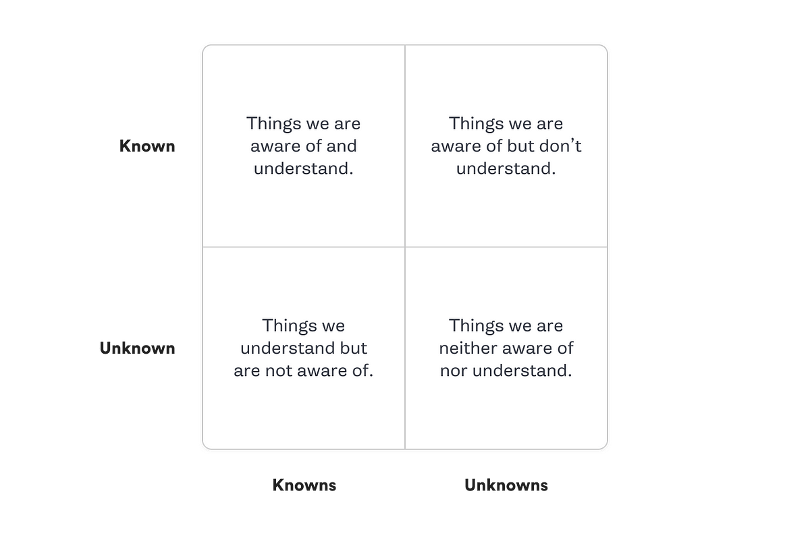
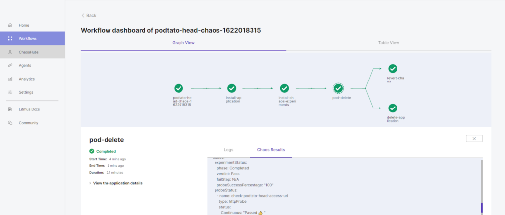
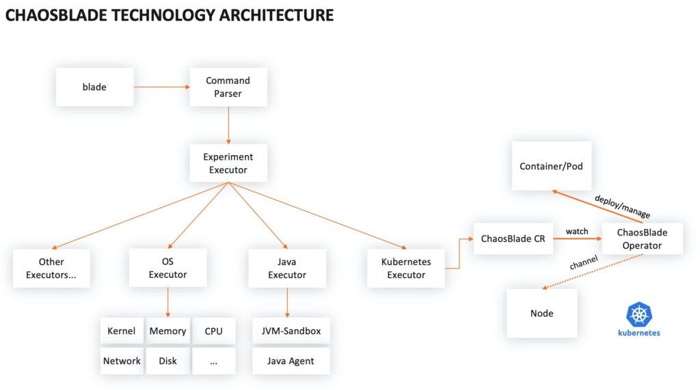

> **Easy Guide to Chaos Testing on Kubernetes 🗺**

## Overview 👀

Making sure our systems work well is super important in today's fast world. This blog post is all about chaos testing on Kubernetes, which is a fancy way of checking if everything stays strong and doesn't break. We'll talk about why it's useful, how to do it, and what tools you can use.

[Chaos testing](https://en.wikipedia.org/wiki/Chaos_engineering) is like playing pretend chaos with your computer on purpose. It helps find weak spots, makes things stronger, and gets ready for problems. For Kubernetes, it means pretending things go wrong when making apps to find and fix problems early.

In this article, we explain how you can use the practice of Chaos Engineering to proactively test the reliability of your Kubernetes clusters and ensure your workloads can run reliably, even during a failure.

By using chaos testing, you make your Kubernetes setup stronger, so your apps keep working even if things don't go perfectly.

## The need for Chaos Engineering 🛠️

Testing these complex, distributed systems is challenging. Traditional testing tools like JMeter struggle to effectively test these productionized applications, highlighting the need for a different mechanism: chaos engineering.

Chaos engineering isn't a new concept. It has been around for over 13 years, with Netflix's [Chaos Monkey](https://netflix.github.io/chaosmonkey/) being one of the earliest implementations. As systems have matured, so have the tools, leading to the emergence of cloud-native chaos engineering.

Chaos engineering is the discipline of experimenting on a system to build confidence in its capability to withstand turbulent conditions in production. It involves injecting failures into the system to understand its behavior under different conditions and catch potential issues before they occur in production.

## How does Chaos Engineering work? 🔍

Chaos engineering operates on principles that start with defining a steady state representing how our application should behave. We then hypothesize that the steady state will continue, despite introducing real-world variables such as latency or node failures. By injecting these failures, we can observe how our application behaves and see if our hypothesis is disproven.

Doing chaos engineering in production might seem counterintuitive. After all, turning off things isn't a good thing in production, right? This is where the concept of minimizing the blast radius comes into play. We carefully select which nodes or pods to run chaos experiments on to avoid negatively impacting customers.

Communication is key when conducting chaos experiments. Everyone on the team should be aware of the what, why, and when of the chaos experiments. And as we keep adding new features to our applications, we need to redo these experiments to ensure the application's resilience.

## Define your Kubernetes Chaos Engineering tests 🧪

Deciding which tests to run can be difficult for engineers new to Chaos Engineering. Chaos Engineering tools come with many tests, each with several customizable parameters. How do you determine which test to run and where to run it?

The best way to start is by separating potential issues into four categories:

- **Known Knowns:** Things you are aware of and understand.
- **Known Unknowns:** Things you are aware of but don't fully understand.
- **Unknown Knowns:** Things you understand but are not aware of.
- **Unknown Unknowns:** Things you are neither aware of nor fully understand.



While learning, focus on the "Known Unknowns" quadrant. These are characteristics of Kubernetes that you're aware of but don't fully understand. For example, you might know that Kubernetes uses several criteria to determine which node to schedule a Pod onto, but without knowing exactly what those criteria are.

## 🏗 Tools For Cloud-Native Chaos Engineering

There are some great tools out there to help you invoke chaos engineering without altering your production state. Below, we'll look at three open-source chaos engineering projects that you can use to quickly run experiments on your cloud-native architecture.

### Chaos Mesh

A chaos engineering platform for Kubernetes.

[Website](https://chaos-mesh.org/) | [GitHub](https://github.com/chaos-mesh/chaos-mesh)

Want to test the limits of your Kubernetes deployment? Look no further than Chaos Mesh to perform chaos engineering on your production Kubernetes clusters. Chaos Mesh is easily deployable as a CustomResourceDefinition (CRD), so you can get started quickly.

```bash
curl -sSL https://mirrors.chaos-mesh.org/v2.6.2/install.sh | bash
```

Using Chaos Mesh, operators could perform fault injection on the network, disk, file system, operating system, and other areas. Experiments can either be created in a user-friendly GUI or initiated using a YAML file.

For example, you could use Chaos Mesh to simulate a stress test inside containers. This configuration below defines a sample StressChaos experiment to continually read and write, draining up to 256MB of memory. Fields could be easily changed to adjust the duration, pod, size, and other factors.

```yaml
apiVersion: chaos-mesh.org/v1alpha1
kind: StressChaos
metadata:
    name: memory-stress-example
    namespace: chaos-testing
spec:
    mode: one
    selector:
        labelSelectors:
            'app': 'app1'
    stressors:
        memory:
            workers: 4
            size: '256MB'
```

What's cool is that you can use Chaos Mesh to schedule cyclical testing behaviors. For example, this snippet in YAML from the documentation demonstrates how to configure Chaos Mesh to continually perform a NetworkChaos experiment five minutes after every hour. This particular experiment produces a network latency fault with a 12-second duration.

```yaml
apiVersion: chaos-mesh.org/v1alpha1
kind: Schedule
metadata:
    name: schedule-delay-example
spec:
    schedule: '5 * * * *'
    historyLimit: 2
    concurrencyPolicy: 'Allow'
    type: 'NetworkChaos'
    networkChaos:
        action: delay
        mode: one
        selector:
            namespaces:
                - default
            labelSelectors:
                'app': 'web-show'
        delay:
            latency: '10ms'
        duration: '12s'
```

Using Chaos Mesh, there's no need to change your deployment logic to perform chaos experiments. You can observe the behavior in real-time and, if it's really going haywire, you can quickly roll back failures. The platform also supports RBAC as well as blacklisting and whitelisting to help protect the experimentation process itself from abuse. At the time of writing, Chaos Mesh is an open source incubating project with the CNCF.

## Litmus

Helps SREs and developers practice chaos engineering in a cloud-native way.

[Website](https://litmuschaos.io/) | [GitHub](https://github.com/litmuschaos/litmus)

Litmus is an open-source chaos engineering project aimed at SREs who want to push their cloud-native architecture to the limits. Compared to Chaos Mesh, Litmus is a bit larger in scope, enabling developers to perform tests on many environments, including the Kubernetes platform, Kubernetes apps, cloud platforms, bare metal, legacy applications, and virtual machines.

Litmus is easy to install using Helm:

```shell
helm install litmuschaos/litmus
```

Once installed, engineers can choose a chaos scenario from a number of pre-defined Litmus Workflows. [ChaosHub](https://hub.litmuschaos.io/) is an open marketplace hosting many Litmus experiments to run chaos on various infrastructures. Litmus can structure chained sequences of experiments, so you can chain many experiments to wreak as much havoc as you like.

For example, [the documentation](https://docs.litmuschaos.io/docs/getting-started/run-your-first-workflow/) showcases using the Litmus user interface to install an application, perform a chaos experiment on it, uninstall the application, and revert the chaos.



Using Litmus, engineers can also create custom workflows and schedule workflows to occur on a regular basis. For an open-source free tool, Litmus is surprisingly comprehensive, offering a feature-rich platform with a SaaS-like console.

## ChaosBlade

A powerful chaos engineering experiment toolkit.

[Website](https://chaosblade.io/en/) | [GitHub](https://github.com/chaosblade-io/chaosblade)

ChaosBlade is another toolkit that can help DevOps engineers and SREs perform chaos on their cloud-native systems. Originally produced at Alibaba, ChaosBlade was open sourced in 2021 and is currently a sandbox project hosted by the CNCF. The package includes two main components: The chaos engineering experimental tool, ChaosBlade, and a chaos engineering platform, ChaosBlade-Box.

Using ChaosBlade, engineers can perform experiments through a unified interface. The platform brings an assortment of features to help experiment with resource fluctuations pertaining to the CPU, memory, network, disk, process, kernel or files. Like the tools above, ChaosBlade also supports automating chaos engineering regularly.



## chaoskube

chaoskube periodically kills random pods in your Kubernetes cluster.

[GitHub](https://github.com/linki/chaoskube)

chaoskube periodically kills random pods in your Kubernetes cluster.


By default chaoskube will be friendly and not kill anything. When you validated your target cluster you may disable dry-run mode by passing the flag `--no-dry-run`. You can also specify a more aggressive interval and other supported flags for your deployment.
If you're running in a Kubernetes cluster and want to target the same cluster then this is all you need to do.
If you want to target a different cluster or want to run it locally specify your cluster via the `--master` flag or provide a valid kubeconfig via the `--kubeconfig` flag. By default, it uses your standard kubeconfig path in your home. That means, whatever is the current context in there will be targeted.
If you want to increase or decrease the amount of chaos change the interval between killings with the --interval flag. Alternatively, you can increase the number of replicas of your chaoskube deployment.

Remember that chaoskube by default kills any pod in all your namespaces, including system pods and itself.
chaoskube provides a simple HTTP endpoint that can be used to check that it is running. This can be used for Kubernetes liveness and readiness probes. By default, this listens on port 8080. To disable, pass --metrics-address="" to chaoskube.

## Pumba

Chaos testing, network emulation, and stress testing tool for containers

[GitHub](https://github.com/alexei-led/pumba)

Pumba is a chaos testing command line tool for Docker containers. Pumba disturbs your containers by crashing containerized application, emulating network failures and stress-testing container resources (cpu, memory, fs, io, and others).

### Demo

[](https://asciinema.org/a/82428)

## kubeinvaders 🎮

**Gamified Chaos Engineering Tool for K8s**

[GitHub](https://github.com/lucky-sideburn/kubeinvaders)

Backed by the teams at [platformengineering.it](https://platformengineering.it/) and [devopstribe.it](https://devopstribe.it/), which provide enterprise-grade features and certified resilience services for your Kubernetes infrastructure.


## Summary 📝

Unexpected, turbulent conditions are bound to arise from time to time. With that in mind, it's best to be prepared. Chaos engineering brings many benefits to modern cloud-native operators, helping expose bugs or bottlenecks in a system.

By testing your architecture early on, your team can also practice how you respond to unforeseen problems.

[Learn more about Chaos Engineering](https://principlesofchaos.org/)

**Thank You 🖤**

<br>

**_Until next time, つづく 🎉_**

> 💡 Thank you for Reading !! 🙌🏻😁📃, see you in the next blog.🤘  **_Until next time 🎉_**

🚀 Thank you for sticking up till the end. If you have any questions/feedback regarding this blog feel free to connect with me:

**♻️ LinkedIn:** https://www.linkedin.com/in/rajhi-saif/

**♻️ X/Twitter:** https://x.com/rajhisaifeddine

**The end ✌🏻**

<h1 align="center">🔰 Keep Learning !! Keep Sharing !! 🔰</h1>

**📅 Stay updated**

Subscribe to our newsletter for more insights on AWS cloud computing and containers.
