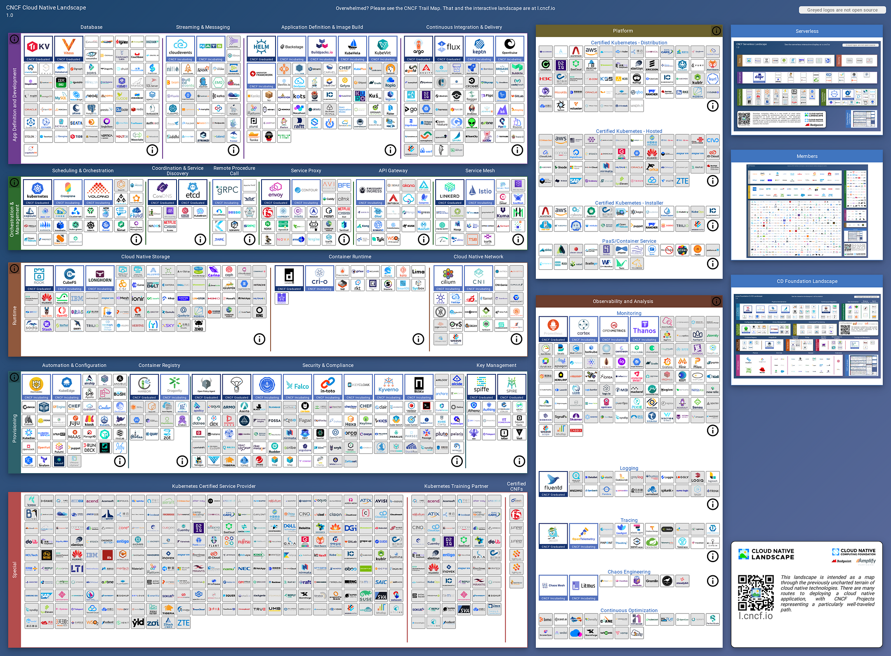
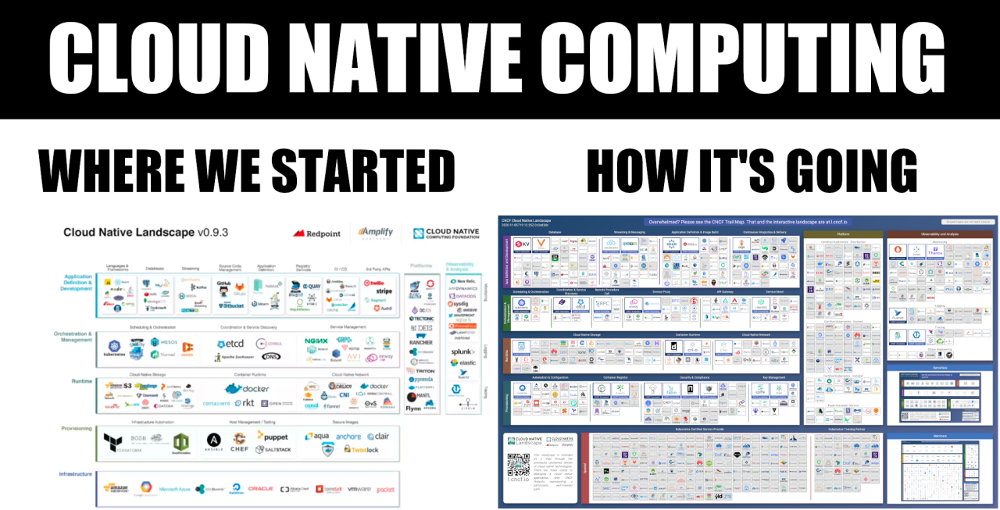

> **Cloudy with a Chance of Containers: Navigating the Murky Waters of Cloud-Native Projects ☁️ 🌩**

## Overview 👀

They say I was supposed to be a simple `kubectl get pods` command, but oh boy 😟, what a surprise! Instead, I found myself immersed in an unlimited, vast ecosystem of cloud-native wonders.

Welcome to the dynamic world where Kubernetes, the leading container orchestration platform, is just the tip of the iceberg. As the cloud-native landscape continues to expand, it brings forth a plethora of innovative projects and possibilities. 🚢

As organizations strive for agility, scalability, and efficiency, navigating the vast and ever-evolving cloud-native landscape can feel like traversing murky waters. Amidst this bewildering array of choices, it's easy to feel lost in the depths of this large and vast ecosystem.

Fear not, fellow explorer! 😃 In this blog post, we will be your trusted guide, helping you navigate the murky waters and discover the hidden treasures beyond Kubernetes.

<a href="https://twitter.com/dastbe/status/1303858170155081728">Source</a>

### 🎯 Goals & Objectives

In this blog post, we'll embark on a journey to demystify the cloud-native universe, exploring the dynamic world of Kubernetes and venturing beyond its horizons.

## What Does the CNCF Landscape Entail? 🌁

The [CNCF Landscape](https://landscape.cncf.io/) initiative aims to compile, categorize, and organize an extensive collection of open-source projects and proprietary products that hold value for cloud-native applications.

Under the stewardship of the [Cloud Native Computing Foundation (CNCF)](https://www.cncf.io/), this project offers several key resources:

- **Cloud Native Landscape Map**: An interactive map that consolidates and showcases the entirety of cloud-native offerings. It provides comprehensive information about each category, product, and project. Take a look at the interactive map [here](https://landscape.cncf.io/).
- **Cloud Native Trail Map**: An infographic that outlines a recommended process for implementing cloud-native technology. It visually depicts and explains the steps involved in adopting cloud-native practices.
- **Cloud Native Landscape Guide**: An online resource that provides a detailed explanation of the cloud-native landscape map. It defines and elaborates on the six essential categories present within the landscape: Provisioning, Runtime, Orchestration, Observability, and Platform.

<a href="https://landscape.cncf.io/">Source</a>

## 🌟 Pillars of the CNCF Cloud Native Landscape 🏞

Within the CNCF cloud-native landscape, there are six distinct categories:

1. **Provisioning** 🛠️: This category encompasses tools that establish the foundational infrastructure for cloud environments and supporting technologies. They enable the creation and management of resources required for running cloud-native applications.

2. **Runtime** ⏱️: The runtime category comprises tools that facilitate the execution and operation of containers within cloud-native environments. These tools handle container orchestration and provide essential functionalities for a container runtime.

3. **Orchestration & Management** ⚙️: Tools within this category are responsible for orchestrating and managing containers, applications, and associated resources. They enable efficient deployment, scaling, and monitoring of cloud-native systems.

4. **App Definition & Development** 🖥️: This category focuses on tools and frameworks that aid in the development of cloud-native applications. It includes tools for data storage, communication, and the building and deployment of applications using cloud-native principles.

5. **Observability & Analysis** 🔍: Tools in this category offer capabilities for monitoring, logging, and analyzing cloud-native applications and infrastructure. They provide insights into system performance, health, and security, enabling effective troubleshooting and proactive issue detection.

6. **Platforms** 🏗️: Platforms combine multiple functionalities and tools to simplify the adoption of cloud-native technologies. They provide comprehensive solutions for configuring, managing, and fine-tuning various components within the cloud-native landscape.

For more detailed information, you can explore the [CNCF Landscape](https://landscape.cncf.io/) and the [Cloud Native Trail Map](https://www.cncf.io/projects/).

## Deep Dive into CNCF Landscape Categories

And now we will explore in depth this large and vast ecosystem.

### Provisioning: 📀

The provisioning category forms the fundamental building blocks of cloud-native applications. It encompasses a range of tools that are utilized for creating, configuring, managing, and securing the cloud-native infrastructure. Examples of tools within this category include:

- **Automation and Configuration**: These tools enable the swift deployment of cloud-native computing resources through automated processes and configuration management techniques.
- **Container Registry**: This tool facilitates the storage of container images and allows other tools to access and utilize them for running containers.
- **Security & Compliance**: Tools in this category offer functionalities such as scanning, monitoring, and other security measures to ensure the safety of cloud-native environments and workloads.
- **Key Management**: This set of tools is responsible for effectively managing passwords, credentials, and secrets within microservices applications.

👉 **Example of tools**:

- **[Helm](https://helm.sh/)**: Helm is a widely recognized package manager for Kubernetes, simplifying the installation and management of intricate applications. It introduces a templating system that allows you to define your applications as charts, enabling effortless installation and configuration on your Kubernetes cluster.
  
- **[Kustomize](https://kustomize.io/)**: Kustomize is an effective tool that allows you to customize your Kubernetes resources by applying patches to base configurations. It offers a straightforward and declarative approach to managing your Kubernetes configurations, making it effortless to handle different environments and configurations.
  
- **[Jsonnet](https://jsonnet.org/)**: Jsonnet is a powerful configuration language used for generating Kubernetes manifests. It provides a clear and expressive syntax, enabling you to define Kubernetes resources in a flexible manner. With Jsonnet, managing complex and extensive configurations becomes much more manageable.
  
- **[Skaffold](https://skaffold.dev/)**: Skaffold is a command-line utility designed to streamline the development workflow for Kubernetes applications. It supports various popular programming languages and development tools, making it adaptable to different environments. Skaffold seamlessly integrates with CI/CD pipelines to enhance the efficiency of your development process.

### Runtime: 🏃

The runtime category comprises tools that are designed for running containers and managing associated resources like persistent storage and networking. Some of the tools found in this category include:

- **Container Runtime**: This toolset focuses on running containerized applications and managing their lifecycle. Well-known examples include [Docker](https://www.docker.com/), [containerd](https://containerd.io/), and [CRI-O](https://cri-o.io/).
- **Cloud Native Storage**: These tools provide persistent storage capabilities for containers and establish standardized interfaces for interacting with storage devices.
- **Cloud Native Network**: By overlaying a virtual network on top of the physical network infrastructure, this tool allows seamless communication between containers, ensuring efficient networking within cloud-native environments.

### Orchestration & Management: 💥

The Orchestration & Management category handles the scalable management of cloud-native applications. It includes tools like:

- **Scheduling & Orchestration**: Manages resource scheduling and automation of containerized workloads, with [Kubernetes](https://kubernetes.io/) being a leading example.
- **Coordination & Service Discovery**: Facilitates communication and discovery between containers and elements in the cloud-native environment.
- **Remote Procedure Call**: Provides a communication transport within cloud-native clusters.
- **Service Proxy**: Intercepts and forwards traffic between services.
- **API Gateway**: Manages API communication between end-users and cloud-native applications, as well as between microservices.
- **Service Mesh**: Ensures reliable and observable communication between services, handling ingress traffic.

👉 **Example of tools**:

- **[Crossplane](https://crossplane.io/)**: Crossplane is an open-source platform that facilitates the management of cloud-native infrastructure across multiple clouds. It enables organizations to adopt a multi-cloud strategy by providing a unified control plane to manage infrastructure resources in a consistent and efficient manner.
- **[Traefik](https://traefik.io/)**: Traefik is a popular reverse proxy and load balancer that is widely used in Kubernetes environments. It manages network traffic, routes requests, and enforces security policies, ensuring secure and optimized communication between Kubernetes resources.
- **[Istio](https://istio.io/)**: Istio is a service mesh that enhances the management and security of communication between services within a Kubernetes cluster. It offers features such as traffic routing, load balancing, and the enforcement of security policies, making it easier to manage and secure the interactions between services.
  
### App Definition & Development: 💻

The App Definition & Development category includes tools for planning, developing, and deploying cloud-native applications, such as:

- **Database**: Cloud-native data stores that integrate with the infrastructure.
- **Streaming & Messaging**: Middleware that enables service-to-service communication.
- **App Definition & Image Build**: Tools supporting the container developer experience.
- **CI/CD (Continuous Integration & Delivery)**: Manages the development pipeline and automates the fast deployment of new releases.

👉 **Example of tools**:

- **[Argo CD](https://argoproj.github.io/argo-cd/)**: Argo CD is a powerful tool that leverages GitOps principles to automate the deployment of applications to Kubernetes. By synchronizing with Git repositories, Argo CD ensures consistency and reliability in the deployment process, providing a simple and efficient way to manage application deployments.

- **[Tekton](https://tekton.dev/)**: Tekton is an open-source framework specifically designed for building continuous integration and continuous delivery (CI/CD) pipelines on Kubernetes. It offers a declarative approach to defining and executing pipelines using Kubernetes resources, making it easier to adopt Kubernetes for CI/CD purposes. 👉 Learn more about Tekton on [GitHub](https://github.com/tektoncd).

### Observability & Analysis: 🔭

The observability and analysis category provides teams with insights into cloud-native environments and helps identify and address issues. These tools include:

- **Monitoring**: Instrumentation of applications, collecting metrics, visualizing data, and creating alerts and reports.
- **Logging**: Centralizing operational data and errors from cloud-native components.
- **Tracing**: Tracking request paths in distributed systems for troubleshooting purposes.
- **Chaos Engineering**: Intentionally creating faults to test system behavior and verify resilience.

👉 **Example of tools**:

- **[Prometheus](https://prometheus.io/)**: Prometheus is an advanced monitoring tool designed to collect metrics from various Kubernetes resources and store them in a time-series database. It provides a powerful solution for monitoring the health and performance of your Kubernetes cluster and applications.

- **[Thanos](https://thanos.io/)**: Thanos extends the capabilities of Prometheus by adding features like long-term storage, global querying, and cross-cluster federation. With Thanos, you can store your Kubernetes metrics over an extended period of time, enabling efficient analysis and monitoring.

- **[Grafana](https://grafana.com/)**: Grafana is a popular visualization tool that can be seamlessly integrated with Prometheus. It allows you to create visually appealing dashboards and visualizations of your Kubernetes metrics. With Grafana, it becomes easier to gain insights into the health and performance of your applications.

- **[Sysdig](https://sysdig.com/)**: Sysdig offers a comprehensive solution for unifying visibility, security, and compliance in Kubernetes and other cloud-native technologies. It enables real-time monitoring of your Kubernetes infrastructure and applications, detects security threats and vulnerabilities, and enforces compliance policies.

### Platforms: 🏗️

The platform category offers comprehensive solutions that package cloud-native technology for easy adoption. Instead of building applications from scratch using open-source projects, these tools provide all-in-one solutions. Examples include:

- **Certified Kubernetes Distribution**: Special Kubernetes distributions created by vendors, like [Red Hat OpenShift](https://www.redhat.com/en/technologies/cloud-computing/openshift).
- **Certified Kubernetes Hosted**: Managed Kubernetes platforms that handle the installation and management of clusters, such as [Google Kubernetes Engine](https://cloud.google.com/kubernetes-engine), [Amazon Elastic Kubernetes Service](https://aws.amazon.com/eks/), and [Azure Kubernetes Service](https://azure.microsoft.com/en-us/services/kubernetes-service/).
- **Certified Kubernetes Installer**: Tools automating the installation and configuration of Kubernetes on self-managed or managed infrastructure.
- **PaaS/Container Service**: Fully managed services for running container applications, often including container orchestration. [Heroku](https://www.heroku.com/) is a notable example.

But in the end, it's all about keeping your CNCF game strong and staying informed. Stay containerized with the CNCF landscape — don't let your knowledge kubeaway, helm yourself up, and always pod your curiosity to keep up with the ever-evolving tech stack without getting **container-overwhelmed**!

## Key Takeaways: 🔚

in this blog we've taken a wild ride through the cloud-native landscape, from the bewildering variety of tools to the dynamic world beyond Kubernetes. We've explored provisioning, runtime, orchestration, observability, app development, and platform categories, unlocking the secrets of cloud-native technology.

But remember, even in this vast ecosystem, it all started with a simple `kubectl get pods` command 😆, and look where we ended up! So, whether you're navigating the murky waters of container orchestration or diving into the depths of observability, embrace the adventure with a sense of humor and a thirst for knowledge.

Stay curious, keep exploring, and let the cloud-native journey continue to surprise and delight you. Happy cloud-native adventures!

If you found this article helpful, please don't forget to hit the **Follow** 👉 and **Clap** 👏 buttons to help me write more articles like this.

**Thank You 🖤**

 

**_Until next time, つづく 🎉_**

> 💡 Thank you for Reading !! 🙌🏻😁📃, see you in the next blog.🤘  **_Until next time 🎉_**

🚀 Thank you for sticking up till the end. If you have any questions/feedback regarding this blog feel free to connect with me:

**♻️ LinkedIn:** https://www.linkedin.com/in/rajhi-saif/

**♻️ X/Twitter:** https://x.com/rajhisaifeddine

**The end ✌🏻**

<h1 align="center">🔰 Keep Learning !! Keep Sharing !! 🔰</h1>

**📅 Stay updated**

Subscribe to our newsletter for more insights on AWS cloud computing and containers.
