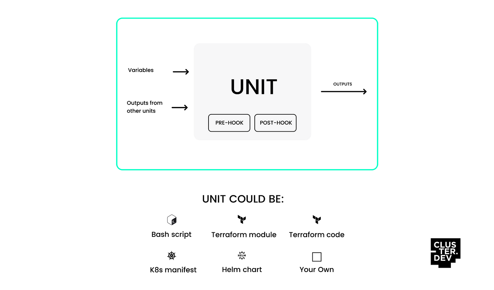
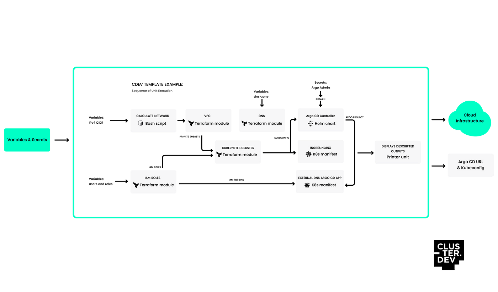
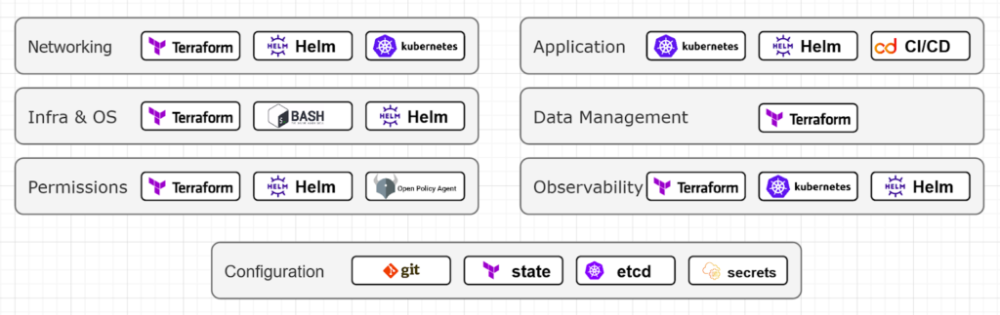

> **Manage Cloud Infrastructures Declaratively ☁️**

## 📙 Introduction

Have you ever wished for a single tool to manage all your cloud infrastructure needs?

[Cluster.dev](https://cluster.dev/) is one of these tools that will change the way you handle cloud-native infrastructures.

In this blog post, we will explore the incredible features of Cluster.dev and how it simplifies the deployment, testing, and distribution of cloud-native components.

Get ready to discover Cluster.dev and how it can make your infrastructure management a breeze.

## ❓ When do I need Cluster.dev

If you have a common infrastructure pattern that contains multiple components stuck together, like a bunch of TF-modules or a set of K8s addons, you need to re-use this pattern inside your projects.
If you develop an infrastructure platform that you ship to other teams, and they need to launch new infrastructures from your template.
If you build a complex infrastructure that contains different technologies, and you need to perform integration testing to confirm the components' interoperability. After which you can promote the changes to the next environments.
If you are a software vendor and you need to deliver infrastructure deployment along with your software.

### For whom

The target audience is primarily infrastructure teams with a certain level of expertise, to whom Cluster.dev could simplify their daily routine: creating clusters, deploying services to the clusters, launching environments, sharing experience with development teams, etc.

💠 **Base concept diagrams**

Stack templates are composed of [units](https://docs.cluster.dev/units-overview/) - Lego-like building blocks responsible for passing variables to a particular technology.

Templates define infrastructure patterns or even the whole platform.

🔥 **Features**

- Common variables, secrets, and templating for different technologies.
- Same GitOps Development experience for Terraform, Shell, Kubernetes.
- Could be used with any Cloud, On-premises or Hybrid scenarios.
- Encourage teams to follow technology best practices.

📌 **Differences between Cluster.dev and Terraform:**

Cluster.dev improves on Terraform in a few key ways:

- **Relations:** Terraform struggles with defining relationships between components, but Cluster.dev makes it easier, allowing you to trigger only what's needed.
- **Templating:** Unlike Terraform, Cluster.dev supports templating, making it simpler to include or exclude modules like Jenkins Terraform.
- **External Tools:** Terraform has limitations when using external tools, while Cluster.dev provides consistent support and integration for better control.

Overall, Cluster.dev simplifies infrastructure management and addresses some limitations of Terraform.

❔ **Why Infrastructure Templating is Essential:**

In modern cloud-native settings, infrastructure templating plays a crucial role in simplifying the processes of developing and maintaining infrastructure. Here's why it's vital:

- Streamlines infrastructure development by establishing clear functional boundaries.
- Facilitates testing the interoperability of components, even if they employ different technologies.
- Enables the sharing of infrastructure patterns among team members.
- Allows the integration of infrastructure into the product, enhancing overall efficiency.
- Facilitates the division of responsibilities between Platform and SRE teams.
- Supports a comprehensive GitOps approach for all infrastructure components.

Now, let's explore the primary use cases of infrastructure templating and examine the benefits it brings.

Templating significantly simplifies tasks for DevOps and SRE teams, especially in deploying and testing within complex environments. So, what comprises infrastructure templates? Let's explore the essential building blocks necessary for creating an infrastructure template, starting with infrastructure layering:

- **Networking Layer:** Involves VPCs, Peerings, VPNs, Security Groups, and Routing.
- **Permissions Layer:** Encompasses IAM roles and user policies.
- **Infra and OS Layer:** Encompasses server instance provisioning and operating system settings.
- **Data Management Layer:** Includes Relational and NoSQL databases, caches, file and object storages.
- **Application Layer:** Involves container orchestration, continuous delivery of applications, business applications and workloads, and infrastructure applications.
- **Observability Layer:** Encompasses metric logs, tracing applications, and storages.
- **Configuration Layer:** Involves declarative configuration storage, infrastructure state storages, and secret storages.

📚 **Conclusion:**

Cluster.dev is a great tool that simplifies the management of cloud-native infrastructures. It uses simple declarative manifests, or stack templates, to enable users to describe and deploy entire infrastructures with a single tool. The platform's support for various technologies, powerful templating engine, GitOps-first approach, and cross-platform compatibility make it a versatile and adaptable solution for managing complex infrastructures. By consolidating previously disconnected infrastructure components under one roof, Cluster.dev enables efficient, one-shot deployment of entire stacks, saving time and effort on operating tasks and allowing teams to focus on code development.

If you found this article helpful, please don't forget to hit the **Follow** 👉 and **Clap** 👏 buttons to help me write more articles like this.

**Thank You 🖤**

 

**_Until next time, つづく 🎉_**

> 💡 Thank you for Reading !! 🙌🏻😁📃, see you in the next blog.🤘  **_Until next time 🎉_**

🚀 Thank you for sticking up till the end. If you have any questions/feedback regarding this blog feel free to connect with me:

**♻️ LinkedIn:** https://www.linkedin.com/in/rajhi-saif/

**♻️ X/Twitter:** https://x.com/rajhisaifeddine

**The end ✌🏻**

<h1 align="center">🔰 Keep Learning !! Keep Sharing !! 🔰</h1>

**📅 Stay updated**

Subscribe to our newsletter for more insights on AWS cloud computing and containers.
