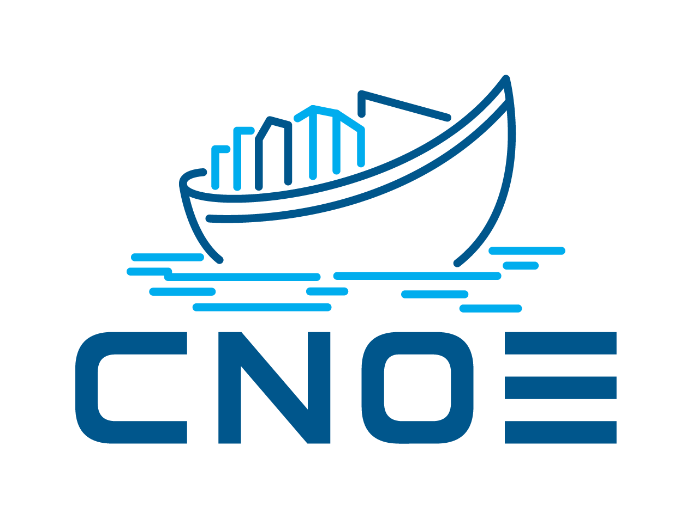
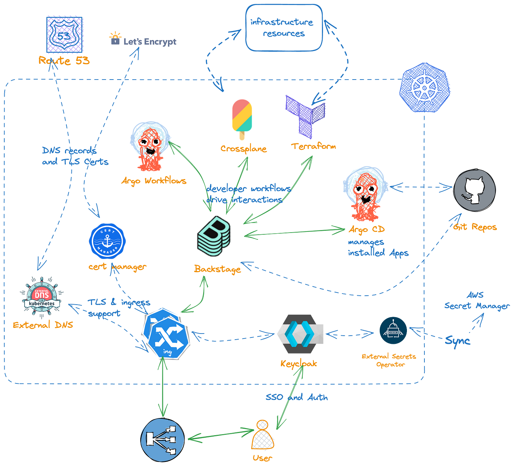

> **Use CNOE to build better software tools 🏗 🌩**

## 💡 Introduction

Cloud Native Operational Excellence (CNOE) is a framework for platform engineers to efficiently build [Internal Developer Platforms (IDP)](https://internaldeveloperplatform.org/what-is-an-internal-developer-platform/) with cloud-native technologies and community-driven best practices. Key tenets include prioritizing open-source tech, community-driven decision-making, suggesting tools over practices, relying on Kubernetes, and offering standardized yet customizable infrastructure.

CNOE supports deployment in Cloud, On-Premises, and Edge environments, incorporating tools like [Kind](https://kind.sigs.k8s.io/), [Argo CD](https://argo-cd.readthedocs.io/en/stable/), [Argo Workflows](https://argoproj.github.io/argo-workflows/), [Backstage](https://backstage.io/), [Gitea](https://gitea.io/en-us/), [Keycloak](https://www.keycloak.org/), [External Secrets](https://external-secrets.io/), [Ingress NGINX](https://kubernetes.github.io/ingress-nginx/), [Crossplane](https://crossplane.io/), and [Spark Operator](https://github.com/GoogleCloudPlatform/spark-on-k8s-operator).

This blog post explores CNOE's features, benefits, modular design, and how it aids platform engineers in building IDP platforms quickly and securely. Stay tuned for more insights on this innovative Platform Engineering framework.

## 🛥 Intro to CNOE

For enterprises using open-source software (OSS) as the backbone of their cloud platforms, the challenge lies in selecting technologies that align with their long-term business objectives. The significant costs associated with retooling and re-platforming for large organizations underscore the importance of strategic technology decisions. To mitigate risks, enterprises often look to the investments and experiences of their peers.

The primary aim of the CNOE framework is to unite a group of enterprises operating at a similar scale, enabling them to collectively navigate operational technology choices, reduce risks associated with technology selections, coordinate contributions, and provide guidance on leveraging CNCF technologies effectively for optimal cloud efficiencies. In other words, CNOE is a framework developed around open-source cloud-native projects to assist companies in building their internal developer tooling. It aims to help platform engineers build their IDP platforms faster and more securely, with best practices integrated. CNOE prioritizes open-source technologies, community-driven decisions, and offers guidance on technology choices for optimal cloud efficiencies.

It is not just a unified control plane or a CI/CD tool but provides building blocks for expanding control planes and enhancing application delivery. CNOE is modular, allowing users to select core technologies for their internal developer platforms while being standardized to infrastructure and customizable by developers. All CNOE deliverables are developed openly for sharing within the open-source community.

## 🤔 Problem Statement

The dynamic tooling landscape, fragmented infrastructure, and evolving CI/CD definitions present challenges for customers. Adopting a wide array of tools without clear direction can lead to supportability and maintainability issues within tool-governing communities. Traditional infrastructure and modern tools like [ArgoCD](https://argo-cd.readthedocs.io/en/stable/), [Flux](https://fluxcd.io/), and [Tekton](https://tekton.dev/) require a shift in paradigms, while legacy systems still interact with traditional infrastructure setups. Developers' core workflows have remained consistent, but the abstractions in *-Ops frameworks create a gap between developers and delivery processes. Fragmentation in software delivery methods results in non-portable software components that are difficult to integrate into a cohesive application.

## ✅ CNOE Principles

- **Open source first**: Prioritize open-source technology over proprietary technology, allowing for collaboration and customization.
- **Community driven**: Decisions guided by the community and its governing body.
- **Tools, not practices**: Suggestions on tools and configurations, not practices.
- **Kubernetes-powered, not limited**: Operate on Kubernetes, but not restricted to orchestrating against it.
- **Standardized, customizable**: Address usability requirements while allowing customization.
- **Built to be shared**: Develop deliverables openly for the larger open-source community.

### ❌ CNOE is not

- A unified control plane, but a way to expand and extend it.
- A CI/CD tool, but a platform for integrating and delivering applications.
- New technologies or managed services, but a way to interact and integrate.
- Responsible for operationalizing the toolchain, requiring companies to fund and operate open-source tools.

### Reference Implementation of CNOE and its Toolings on AWS

CNOE organization on GitHub has a repo which is a reference implementation of CNOE and toolings on AWS cloud provider. This installation pattern where some Kubernetes manifests are handled in Terraform while others are handled in a GitOps manner may not be suitable for many organizations. If you can be certain about parameters such as domain name and certificate handling, it is better to utilize the GitOps approach where this information is committed to a repository. The reason it is handled this way is to allow for customization for different organizations without forking this repository and committing organization-specific information into the repository.

## 🔚 Conclusion

With the launch of CNOE, members will contribute tooling, plugins, and reference implementations that facilitate building internal developer platforms. Members are also releasing a capability map that captures key open technologies and their relevance in building internal developer platforms across these organizations.

**Thank You 🖤**

 

**_Until next time, つづく 🎉_**

> 💡 Thank you for Reading !! 🙌🏻😁📃, see you in the next blog.🤘  **_Until next time 🎉_**

🚀 Thank you for sticking up till the end. If you have any questions/feedback regarding this blog feel free to connect with me:

**♻️ LinkedIn:** https://www.linkedin.com/in/rajhi-saif/

**♻️ X/Twitter:** https://x.com/rajhisaifeddine

**The end ✌🏻**

<h1 align="center">🔰 Keep Learning !! Keep Sharing !! 🔰</h1>

**📅 Stay updated**

Subscribe to our newsletter for more insights on AWS cloud computing and containers.
