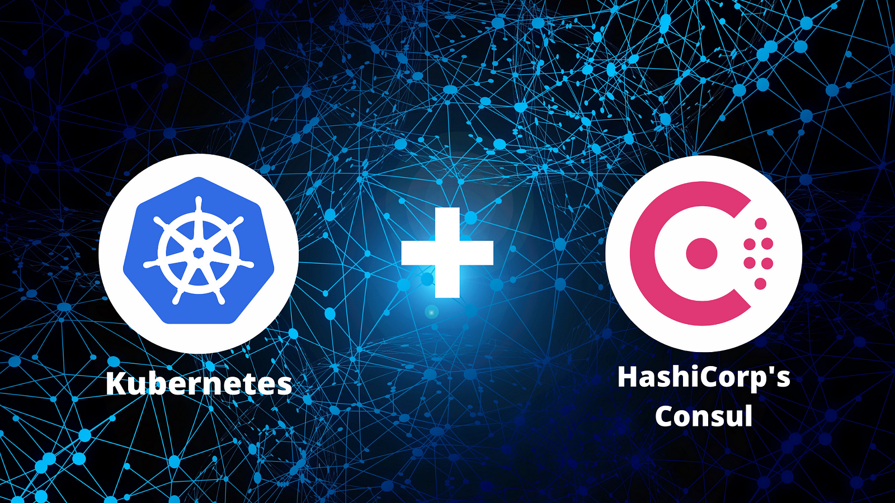
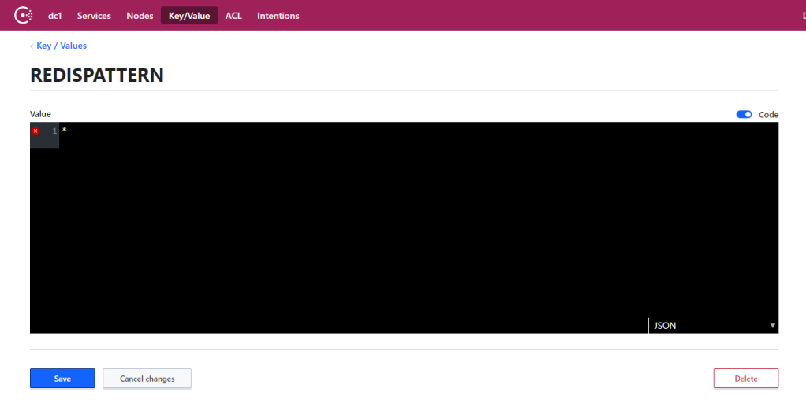
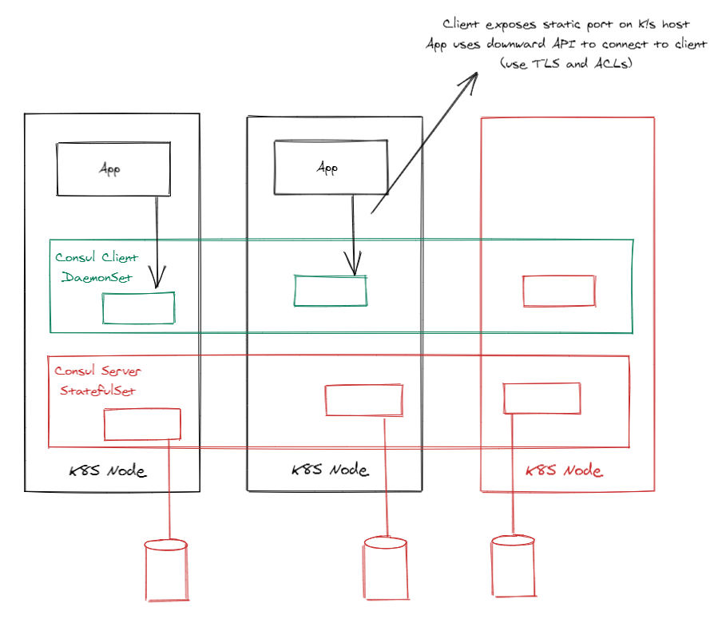

> **The Tech-Forward Approach to Service Discovery 🔍**

## 🌠 Introduction

Welcome to this blog post where I'll be sharing the fundamental concepts of Consul as a service mesh and discovery tool. Whether you're just starting out or looking to enhance your knowledge, this post will provide you with a head start on your journey.

[Consul](https://www.consul.io/) acts as a facilitator, allowing services to communicate smoothly. I'll simplify the complexities and guide you through the essential aspects of Consul, ensuring you have a solid understanding. So, let's dive in and explore the wonders of Consul together! 🙌



### Exploring Consul's Core Features: Installation, Configuration, and Service Discovery

In essence, Consul is a networking tool that serves multiple purposes. It functions as a [service discovery](https://en.wikipedia.org/wiki/Service_discovery) mechanism and enables the storage and retrieval of configuration values.

Additionally, it offers [service-mesh](https://developer.hashicorp.com/consul/docs/connect) capabilities by managing and encrypting traffic between services. Although this may seem straightforward, in intricate and dynamic infrastructures spanning various locations, such as on-premises and cloud environments, it can become highly complex.

Let's focus on the fundamentals and highlight three key aspects:

1. **Installation on Kubernetes**
2. **Utilizing the key-value store for configuration purposes**
3. **Leveraging the service catalog to obtain service information**

To demonstrate the practical usage of the Consul API, we will employ a small Go program. Let's begin our exploration.

### Prerequisites 🏗

- Kubernetes cluster
- Helm installed and configured
- Kubectl installed and configured
- Go installed

### Consul Setup

I intend to deploy Consul using the [Helm chart](https://github.com/hashicorp/consul-k8s/tree/main/charts/consul) provided. It's important to note that the installation I'm about to carry out is suitable for testing purposes only and should not be utilized in a production environment. When dealing with production setups, there are numerous additional considerations to take into account, such as certificates, storage size and class, and options for enabling or disabling certain features. However, it's worth mentioning that the Helm chart does include the installation of multiple servers and clients to ensure high availability.

The chart supports multiple use cases of Consul on Kubernetes, depending on the values provided. Detailed installation instructions for Consul on Kubernetes are found [here](https://www.consul.io/docs/k8s/installation/overview).

Add the HashiCorp Helm repository:

```shell
helm repo add hashicorp https://helm.releases.hashicorp.com
```

Ensure you have access to the Consul Helm chart and you see the latest chart version listed. If you have previously added the HashiCorp Helm repository, run:

```shell
helm repo update
helm search repo hashicorp/consul
```

Now you're ready to install Consul! To install Consul with the default configuration using Helm 3.2, run the following command below. This will create a Consul Kubernetes namespace if not already present, and install Consul on the dedicated namespace.

```shell
helm install consul hashicorp/consul --set global.name=consul --create-namespace -n consul
```

Please see the many options supported in the `values.yaml` file. These are also fully documented directly on the [Consul website](https://www.consul.io/docs/platform/k8s/helm.html).


### Connecting to the Consul UI

The chart installs Consul in the `consul` namespace. You can run the following command to get to the UI:

```shell
kubectl port-forward services/consul-ui 8080:80 -n consul
```

Then you access the UI on [http://localhost:8080](http://localhost:8080). You will see the list of services depending on the Kubernetes services in your system. The services include Consul itself. Additionally, the Consul service is equipped with health checks. The remaining services displayed are Kubernetes services that were discovered by Consul. We will install Redis in the default namespace and make it accessible through a service named `redissvc`. Consequently, a Consul service called `redissvc-default` is generated. Later on, we will query this service from our Go application.

By selecting **Key/Value**, you can view the configured keys. One of the keys I created is named `REDISPATTERN`, which is subsequently utilized in the Go program to determine the Redis channels to subscribe to. This key serves as a runtime configuration value.



The Key/Value pair can be created via the Consul CLI, the HTTP API, or via the UI (Create button in the main Key/Value screen). I created the `REDISPATTERN` key via the Create button in the web UI.

### Discovering Consul: Querying the Key/Value Store

Now, let's focus on developing code that fetches a Consul key during runtime. The main question here is: 'How does your application discover Consul?'



### The Architecture of Consul: Server and Client Agents

In the above setup, the Consul server agents are deployed as a Kubernetes StatefulSet. Each server pod utilizes a volume, such as an Azure disk, to store data, including key/value pairs. However, your application won't directly connect to these server agents. Instead, it will connect through the client agents.

The client agents are implemented as a DaemonSet, ensuring that there is a client agent running on each Kubernetes node. The client agent pods expose a static port on the Kubernetes host, allowing your application to connect to the IP address of the host it is running on. Your app can discover that IP address via the [Downward API](https://kubernetes.io/docs/tasks/inject-data-application/downward-api-volume-expose-pod-information/#the-downward-api).

The container spec contains the following code:

```yaml
containers:
    - name: realtimeapp
        image: rajhisaifeddine/realtime-go-consul:1.0.0
        env:
            - name: HOST_IP
                valueFrom:
                    fieldRef:
                        apiVersion: v1
                        fieldPath: status.hostIP
            - name: CONSUL_HTTP_ADDR
                value: http://$(HOST_IP):8500
```

The `HOST_IP` will be set to the IP of the Kubernetes host via a reference to `status.hostIP`. Next, the environment variable `CONSUL_HTTP_ADDR` is set to the full HTTP address including port 8500. In your code, you will need to read that environment variable.

### Fetching a Key/Value Pair

Below is a code snippet in Go that demonstrates how to retrieve a key/value pair from Consul. You can find the complete source code [here](https://github.com/hashicorp/consul).

```go
// return a Consul client based on given address
func getConsul(address string) (*consulapi.Client, error) {
    config := consulapi.DefaultConfig()
    config.Address = address
    consul, err := consulapi.NewClient(config)
    return consul, err
}

// get key/value pair from Consul client and passed key name
func getKvPair(client *consulapi.Client, key string) (*consulapi.KVPair, error) {
    kv := client.KV()
    keyPair, _, err := kv.Get(key, nil)
    return keyPair, err
}

func main() {
    // retrieve address of Consul set via downward API in spec
    consulAddress := getEnv("CONSUL_HTTP_ADDR", "")
    if consulAddress == "" {
        log.Fatalf("CONSUL_HTTP_ADDRESS environment variable not set")
    }

    // get Consul client
    consul, err := getConsul(consulAddress)
    if err != nil {
        log.Fatalf("Error connecting to Consul: %s", err)
    }

    // get key/value pair with Consul client
    redisPattern, err := getKvPair(consul, "REDISPATTERN")
    if err != nil || redisPattern == nil {
        log.Fatalf("Could not get REDISPATTERN: %s", err)
    }
    log.Printf("KV: %v %s\n", redisPattern.Key, redisPattern.Value)
}
```

The comments in the code should be self-explanatory. When the `REDISPATTERN` key is not set or another error occurs, the program will exit. If `REDISPATTERN` is set, we can use the value later:

```go
pubsub := client.PSubscribe(string(redisPattern.Value))
```

### Looking up a Service

That's great, but how do you look up an address of a service? That's easy with the following basic code via the catalog:

```go
cat := consul.Catalog()
svc, _, err := cat.Service("redissvc-default", "", nil)
log.Printf("Service address and port: %s:%d\n", svc[0].ServiceAddress, svc[0].ServicePort)
```

`consul` is a `*consulapi.Client` obtained earlier. You use the `Catalog()` function to obtain access to the catalog service functionality. In this case, we simply retrieve the address and port value of the Kubernetes service `redissvc` in the default namespace. We can use that information to connect to our Redis back-end.

## 🚀 Wrap Up

Exploring the Service Mesh Galaxy, particularly through Consul on Kubernetes, opens up a world of possibilities for an efficient service mesh and discovery experience.

By adopting a tech-forward approach to service discovery, organizations can overcome the challenges of a distributed and dynamic microservices environment. Its integration with Kubernetes empowers developers to leverage the full potential of service mesh capabilities. As we venture deeper into the realm of service mesh, Consul on Kubernetes stands as a powerful tool to navigate the vast expanse of interconnected services, ensuring a smooth and reliable journey for both developers and end-users.
