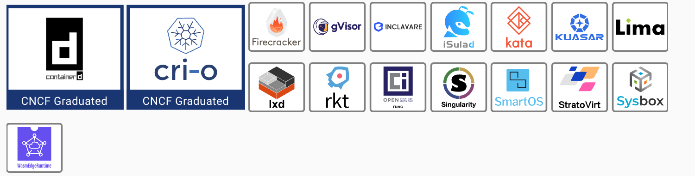
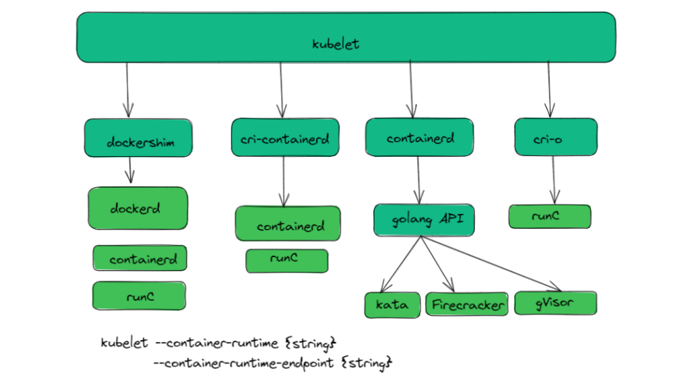
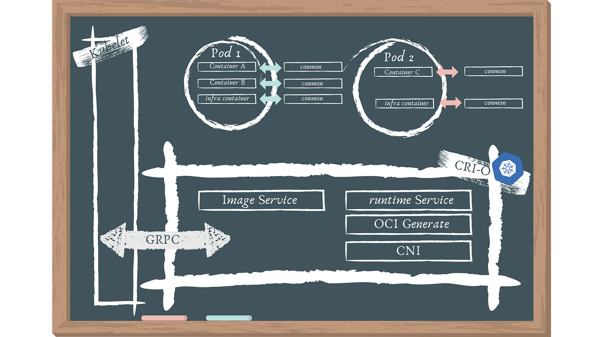

> **A Deep Dive into the Evolution**

## Overview 👀

Containerization technologies have revolutionized the way we build, deploy, and manage applications. Docker, Kubernetes, and other popular containerization tools have made it possible to deliver applications more quickly, reliably, and efficiently than ever before.

At the heart of containerization technology are a number of building blocks, including container runtimes and the Container Runtime Interface (CRI).

Container runtimes are responsible for creating, running, and managing containers. They provide a layer of abstraction between the host operating system and the container, allowing containers to be isolated from each other and from the host.

The CRI is a standard interface that allows different container runtimes to be used with Kubernetes. This makes it easier to switch between different container runtimes without having to make major changes to Kubernetes.

In this blog post, we will explore the evolution of container runtimes and the CRI in more detail.

<a href="https://landscape.cncf.io/guide#runtime--container-runtime">Source</a>

Now, welcome to the world of containers!

Lots of applications can run containers, whereas every application would have a slightly different opinion about what a container runtime should do and support. For example, systemd is able to run containers via [systemd-nspawn](https://www.freedesktop.org/software/systemd/man/systemd-nspawn.html), and [NixOS](https://nixos.org/) has integrated [container management](https://nixos.org/nixos/manual/#ch-containers) as well. Not to mention all the other existing container runtimes like [CRI-O](https://cri-o.io/), [Kata Containers](https://katacontainers.io/), [Firecracker](https://firecracker-microvm.github.io/), [gVisor](https://github.com/google/gvisor), [containerd](https://containerd.io/), [LXC](https://linuxcontainers.org/), [runc](https://github.com/opencontainers/runc), [Nabla Containers](https://nabla-containers.github.io/) and many more.

A lot of them are now part of the [Cloud Native Computing Foundation (CNCF)](https://www.cncf.io/) and their [huge landscape](https://landscape.cncf.io/).

## A Brief History 📜

After the invention of cgroups back in 2008, a project called Linux Containers (LXC) started to pop up in the wild, which should revolutionize the container world. LXC combined cgroup and namespace technologies to provide an isolated environment for running applications. You may know that we sometimes live in a parallel world. This means that Google started its own containerization project in 2007 called [Let Me Contain That For You (LMCTFY)](https://github.com/google/lmctfy), which works mainly at the same level as LXC does. With LMCTFY, Google tried to provide a stable and API-driven configuration without users having to understand the details of cgroups and its internals.

If we now look back into 2013, we see that there was a tool written called Docker, which was built on top of the already existing LXC stack. One invention of Docker was that the user is now able to package containers into images to move them between machines. Docker were the first ones who tried to make containers a standard software unit, as they state in their [«Standard Container Manifesto»](https://github.com/moby/moby/blob/0db56e6c519b19ec16c6fbd12e3cee7dfa6018c5/README.md).

Some years later, they began to work on [libcontainer](https://github.com/docker/libcontainer), a [Go](https://golang.org/) native way to spawn and manage containers. LMCTFY was abandoned during that time too, whereas the core concepts and major benefits of LMCTFY were ported into libcontainer and Docker.

We are now back in 2015, where projects like Kubernetes hit version 1.0. A lot of stuff was ongoing during that time: The CNCF was founded as part of the [Linux Foundation](https://www.linuxfoundation.org/) with the target to promote containers. The [Open Container Initiative (OCI)](https://www.opencontainers.org/) was founded in 2015 as well, as an open governance structure around the container ecosystem.

## Open Container Initiative (OCI) 🛠️

OCI, short for the Open Container Initiative, is indeed a community project that was established in 2015 to address the need for containerization standards. It is a collaborative effort within the container ecosystem to develop open industry standards for container formats and runtime. The OCI's primary goal is to ensure interoperability between container technologies, making it easier to create and run containerized applications across different platforms and container runtimes.

**Key points about OCI include:**

- **Standardization:** OCI defines open standards for container images and runtimes. This includes the OCI Image Format specification for container images and the OCI Runtime Specification for container runtimes.
- **Interoperability:** By adhering to OCI specifications, container runtimes, and container images from various vendors can work seamlessly together. This promotes compatibility and flexibility in choosing containerization tools.
- **Ecosystem Benefits:** OCI standards have been widely adopted in the container ecosystem. This adoption has led to the development of a rich ecosystem of container tools, orchestrators, and platforms that are OCI-compliant.

On the other side of the container engine is the container runtime controlled through the Open Container Initiative specs. There are two specifications produced by the OCI: OCI-runtime and OCI-image. These specs work together to define how to start containers through the container runtime.

The OCI runtime spec defines how to interact with a container runtime to control the lifecycle of a container. While it might seem redundant (given that CRI seems to define the same thing), it adds another layer of contract definition to the architecture. As with CRI, this layer of contract gives some guarantees to the system regarding how the developer's code will run.

The container engine provides the runtime with a filesystem bundle (conforming to the OCI-image spec) to run. Within this filesystem bundle are all the files needed in the runtime and a configuration specifying what to run in the container (also known as its entrypoint).

For some extremely dense reading, the specs can be found [here](https://github.com/opencontainers/runtime-spec) and [here](https://github.com/opencontainers/image-spec).

If we give an example of OCI Runtime, a simple picture is to imagine a technology such as USB that many vendors produce, whether any version of PC or OS can use USB. That's because they follow USB standards, which OCI Runtime is a similar standard. Same thing, but only used with Container Runtimes.

### What is Container Runtime?

Container runtimes are described as the software responsible for executing containerized applications. They take container images (which specify how an application should look) and launch applications within containers, providing them with the necessary resources.

**Problem Addressed by Container Runtimes:**

- **Standardization:** Container runtimes ensure that containerized applications are launched in a standardized manner across different environments.
- **Security:** They establish security boundaries to prevent unauthorized access to containerized applications.
- **Isolation:** They ensure isolation to protect applications from interfering with each other, even if one of them crashes.
- **Resource Allocation:** They allocate and manage resources like CPU, storage, and memory for containerized applications.

**How Container Runtimes Help:**

- **Standardization:** Container runtimes launch applications in a consistent way, regardless of the environment, ensuring predictability.
- **Security:** Some container runtimes, like CRI-O and gVisor (via "runsc"), emphasize security and harden the security boundaries.
- **Isolation:** Container runtimes enforce isolation to prevent interference between applications.
- **Resource Allocation:** They set resource limits to prevent one application from consuming all available resources, which could affect other applications.

**Technical Overview:**

Container runtimes vary in their capabilities and focus:

- [Containerd](https://containerd.io/) and [CRI-O](https://cri-o.io/): These are standard container runtime implementations.
- [Kata](https://katacontainers.io/): Allows running containers as virtual machines (VMs), expanding the use of containers to other technologies.
- [gVisor](https://gvisor.dev/) (via runsc): Provides an additional security layer between containers and the host operating system, enhancing security.
- [runc](https://github.com/opencontainers/runc): runc is a separate container runtime associated with the Open Container Initiative (OCI) standard. It serves as the reference implementation of the OCI runtime specification and is used to run containers in a standardized way.
- [crun](https://github.com/containers/crun): A fast and lightweight fully featured OCI runtime and C library for running containers.

The CRI interface is built on gRPC and Protobuf over a Unix socket. The spec can be found on [GitHub](https://github.com/kubernetes/kubernetes/blob/master/pkg/kubelet/apis/cri/runtime/v1alpha2/api.proto).

## Putting it all together: Kubernetes and CRI 🚀

The CRI gives Kubernetes the flexibility to run a variety of container managers and container runtimes.

In Kubernetes, a container runtime is responsible for managing the lifecycle of containers. It is the component that actually runs the container images and provides an interface between Kubernetes and the container.

Kubernetes could use any container runtime that implements CRI to manage pods, containers, and container images. Docker is the most common container runtime used in production Kubernetes environments, but containerd (initiated by Docker Inc. & donated to CNCF in March of 2017) may prove to be a better option. For more details, you could refer to the [official blog](https://kubernetes.io/blog/2017/11/containerd-container-runtime-options-kubernetes/).

## Docker Shim Deprecated from K8s 1.24 ⚠️

In version 1.24, Kubernetes is no longer supported Docker as a container runtime. Docker is being phased out in favor of runtimes that use the Container Runtime Interface (CRI), which was built for Kubernetes. If you're a Kubernetes end-user, you won't notice much of a difference.

This does not imply that Docker is dead, nor does it imply that you can't or shouldn't use it as a development tool. Docker is still a helpful tool for creating containers, and the images generated by the docker build may be used in your Kubernetes cluster.

If you wish to create your cluster, you'll have to make certain adjustments to avoid cluster failure. As Docker will be deprecated from K8s 1.24, you'll have to transition to one of the other compatible container runtimes, such as containerd or CRI-O. Simply ensure that the runtime you select supports the current settings of the Docker daemon (such as logging).

### Demo: CRI-O and K8s

CRI-O may pull from any container registry and supports OCI container images. It's a lightweight alternative as a Kubernetes runtime.

**Features:**

- OCI compatible runtime
- containers/storage
- containers/image
- networking (CNI)
- container monitoring
- Several essential Linux functions support security

**How does CRI-O work?**

It is a Kubernetes CRI implementation that allows OCI-compatible runtimes to be used. It's a lighter alternative to using Docker as the runtime for Kubernetes. It enables Kubernetes to use any OCI-compliant container runtime for pod execution. It now supports runc and Kata Containers as container runtimes, and any OCI-compliant runtime can theoretically be plugged in.

**Architecture:**

The following are the architectural elements:

- To deploy a pod, Kubernetes communicates with the kubelet.
- Pods are a Kubernetes notion that consists of one or more containers in the same cgroup that share the same IPC, NET, and PID namespaces.
- To launch a new pod, the kubelet sends a request to the CRI-O daemon using the Kubernetes CRI.
- CRI-O pulls the image from a container registry using the containers/image library.
- Using the containers/storage library, the downloaded image is unpacked into the container's root filesystems and stored in COW file systems.
- After the container's rootfs have been constructed, CRI-O creates an OCI runtime specification JSON file that describes how to use the OCI Generate tools to run the container.
- The specification is then used by CRI-O to launch an OCI Compatible Runtime, which runs the container processes. The OCI Runtime by default is runc.
- A separate conmon process monitors each container. The pty of the container process's PID1 is held by the conmon process. It manages the container's logging and keeps track of the container's exit code.
- CNI is used to set up the pod's networking, therefore any CNI plugin can be used with CRI-O.

## Conclusion 🎯

Container runtimes and CRIs have evolved rapidly in recent years, driven by the need to support new features and use cases. This overview has provided a high-level overview of the current state of the art, but there is still much more to explore.

As Kubernetes continues to mature and new container technologies emerge, we can expect to see continued innovation in the container runtime and CRI space.

I hope this blog post has given you a better understanding of container runtimes and CRIs, and their role in the Kubernetes ecosystem.

 

**_Until next time, つづく 🎉_**

> 💡 Thank you for Reading !! 🙌🏻😁📃, see you in the next blog.🤘  **_Until next time 🎉_**

🚀 Thank you for sticking up till the end. If you have any questions/feedback regarding this blog feel free to connect with me:

**♻️ LinkedIn:** https://www.linkedin.com/in/rajhi-saif/

**♻️ X/Twitter:** https://x.com/rajhisaifeddine

**The end ✌🏻**

<h1 align="center">🔰 Keep Learning !! Keep Sharing !! 🔰</h1>

**📅 Stay updated**

Subscribe to our newsletter for more insights on AWS cloud computing and containers.
