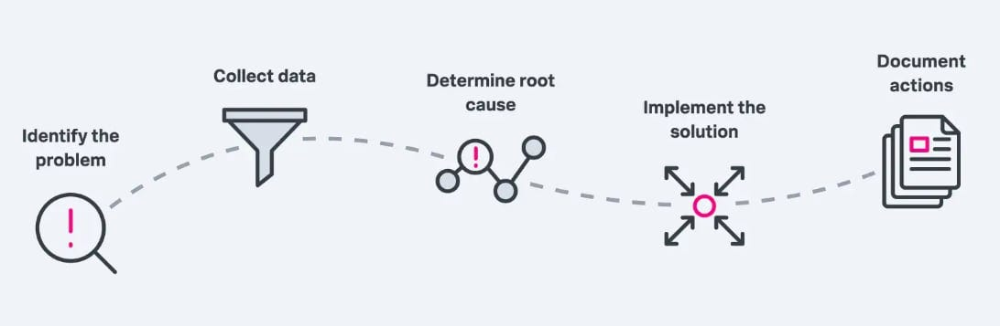
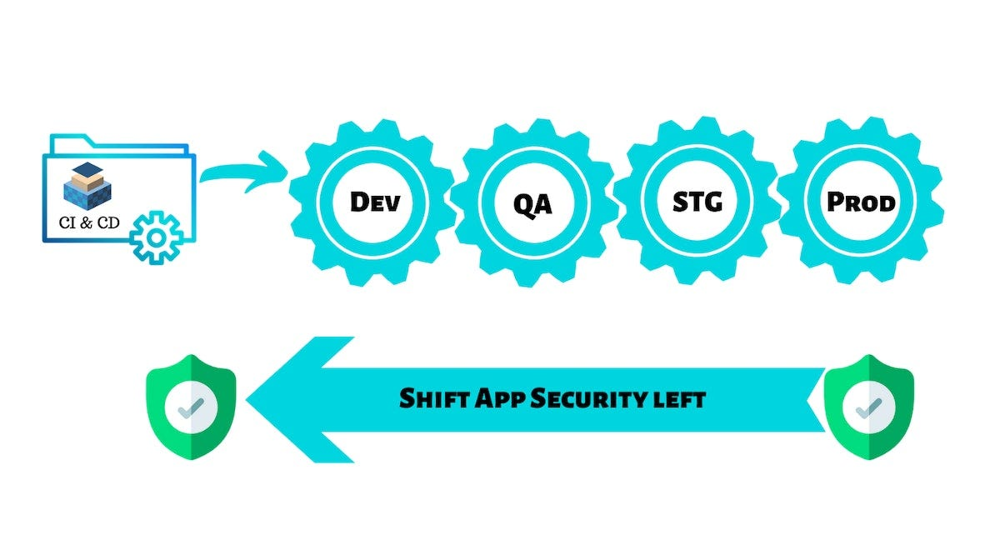

> **Shifting Security Left**
> **🔄 Shifting Security Left**

## 📌 Introduction

Common Vulnerabilities and Exposures (CVE) is a standardized dictionary of publicly known information security vulnerabilities and exposures. It is maintained by [MITRE](https://www.mitre.org/) and is used by many security-related products and services, including vulnerability management and remediation, intrusion detection, and incident management.

In [DevSecOps](https://www.devsecops.org/), the [CVE](https://cve.mitre.org/) vulnerability database is an essential tool for tracking and responding to vulnerabilities in software and systems. By integrating the CVE database into your DevSecOps pipeline, you can identify and fix vulnerabilities early in the development process, before they can be exploited by attackers.

This blog post will explain what the CVE vulnerability database is, how to use it in DevSecOps, and how to respond to CVEs in builds. We will also discuss CVE severity and how to prioritize remediation efforts.

## 🧠 Rationale

Reacting to CVEs in the real world requires careful consideration. You need to assess whether each CVE is serious enough to warrant the rejection of a build and a delay of a release. This is a careful balancing act, as you don't want to release code with serious known vulnerabilities, but you also don't want to cause constant delays due to unexpected CVE announcements.

### The CVE System

The CVE List is a set of records that describe specific vulnerabilities or exposures. It is maintained by a large community of trusted entities and individuals.

- **Vulnerability**: A flaw in a software, firmware, hardware, or service component that can be exploited to cause a negative impact to the confidentiality, integrity, or availability of an impacted component or components.
- **Exposure**: A code or configuration error that can be exploited to gain indirect and often hard-to-discover access to application data such as customer information.

### Assessing CVE Severity

There are a number of factors to consider when assessing the severity of a CVE, including:

- **Exploitability**: How easy is it for an attacker to exploit the vulnerability?
- **Impact**: What is the potential impact of the vulnerability if it is exploited?
- **Prevalence**: How widespread is the vulnerability?
- **Patch Availability**: Is there a patch available to fix the vulnerability?

You can use these factors to prioritize remediation efforts and decide which CVEs warrant the rejection of a build and a delay of a release.

### CVE, Security and Beyond

The CVE List plays a vital role in the cybersecurity world as an essential resource around which security products and services can share standardized information. However, the CVE List alone is not sufficient for building an effective vulnerability remediation program. Other information sources as well as advanced analytic capabilities are required in order to achieve the risk assessment and actionable remediation guidelines that are the hallmarks of a cutting-edge vulnerability remediation solution.

### Quick CVE Recap

First, though, a brief definition of CVEs. Short for Common Vulnerabilities and Exposures, a CVE is a known vulnerability in a certain piece of software.

The concept of CVEs was introduced in 1999 in an effort to provide a universal framework for identifying security issues. The idea is that whenever a vulnerability is discovered, a CVE entry will be created for it. The CVE entry can then be accessed and shared by the public. The [official CVE list](https://www.cve.org/) is maintained by MITRE, a nonprofit group also known for the [MITRE ATT&CK methodology](https://www.splunk.com/en_us/data-insider/what-is-the-mitre-att-and-ck-framework.html).

The big caveat here is that the official CVE list does not include an assessment of the severity of each CVE. Other organizations that maintain their own lists of CVEs, most notably [NIST's National Vulnerability Database](https://nvd.nist.gov/), assign severity categories (such as "medium," "high," and "critical") and/or numerical severity scores to CVEs.

[NIST](https://www.nist.gov/) (National Institute of Standards and Technology) is a non-regulatory agency of the U.S. Department of Commerce that promotes innovation and industrial competitiveness by advancing measurement science, standards, and technology in ways that enhance economic security and improve our quality of life.

NIST plays an important role in the CVE program by providing funding and technical support. NIST also maintains the National Vulnerability Database (NVD), which is a comprehensive database of vulnerabilities that includes CVE information.

The NVD is used by organizations around the world to track and respond to vulnerabilities. NIST also develops and maintains a number of other resources related to vulnerabilities, such as the Common Weakness Enumeration (CWE) and the CVSS vulnerability scoring system.

## 📌 How to React to a CVE

There are a variety of tools that will automatically monitor and scan [your application code](https://www.splunk.com/en_us/data-insider/what-is-source-code-management.html), dependencies, or environments in an effort to detect components that are subject to known CVEs, then alert you to them. Thus, it's relatively easy to find CVEs that are relevant to an application you develop or manage.

The harder task is what to do when you discover a CVE that impacts your application. As noted above, it's not always practical to delay the release of your application until the CVE is addressed. Importantly, though, patches to correct CVEs sometimes appear almost as quickly as a CVE is announced. In some cases, it can take months or longer before a CVE solution becomes available (and it's not always clear how long it's going to take for a fix to arrive). You may not be able to wait that long.

Also, you may simply get so many CVE alerts that [delaying a release](https://www.splunk.com/en_us/blog/learn/devops-release-management.html) in response to each one is not feasible. If your application is complex and has lots of dependencies, you could get multiple CVE alerts each week. Delaying your release pipeline in response to each one would create a lot of confusion and impact your ability to deliver continuously.

## 👮 DevSecOps

DevSecOps stands for Development, Security, and Operations. In the most basic meaning, it's defined as an approach that promotes security in the SDLC (Software Development Life Cycle). The primary goal is to shift-to-left the responsibility. Security tools are integrated early in the development cycle, usually in CI/CD pipelines, to let Devs find vulnerabilities as early as possible and fix them before reaching production environments.

### ◀️ Shift-to-left

Maybe you heard it, maybe not, let me explain what it means. Shifting security controls to the left means putting the security tools more left in the pipelines, and by consequence, in the development process. The more left it's, the better because remediation is easier and it's done before reaching production.

### DevSecOps Best Practices

- **🔄 Automate as much as you can**: Automation is the key to successfully leveraging security in the pipelines.
- **✅ Define must-checks to deploy**: If you have some must-pass security checks, define them in the CI/CD pipelines, especially for production.
- **📚 Encourage and train**: Whenever possible, promote security training to your Devs. They'll be more motivated and with the knowledge to fix vulnerabilities and avoid them in the future.

The advantages are pretty clear, automation is the key like it's in common DevOps practices, and we benefit from it by adding the compliance checks in our pipelines. Some of those checks will be mandatory, so you're gonna put your barriers of trust in the automation, ensuring that nothing will go through those controls unless it has the level of trust you've defined.

### 🏗️ Infrastructure-As-Code

One of the best open-source tools to analyze IaC is [Kics](https://github.com/Checkmarx/kics). It's a tool designed to find security vulnerabilities, compliance issues, and infrastructure misconfigurations. It supports multiple platforms, such as Terraform, Kubernetes, Docker, Helm. It comes with a lot of predefined checks to assess your infrastructure, containers, and deployments.

One of the key benefits of this tool is that it's designed to let you expand the analyzing capabilities. Using the extensible query configuration, you can create your checks, adapted to your staff and environment, and disable the ones that are less important to the company.

### 📦 Dependency Checks

You didn't write all the code of your applications, nobody does it in WebApps today. You use libraries, and probably a lot of them. Like any piece of code, it has its vulnerabilities, and you should check them. Dependency checking is the process of finding what vulnerable versions of third-party you're using. Most tools do that by comparing the version with popular vuln databases, such as [NIST](https://nvd.nist.gov/) and [CVE](https://cve.mitre.org/).

### 🛠️ Static Application Security Testing (SAST)

These tools are designed to scan your code to find flaws in your project. It could help to find SQL Injection, Buffer Overflows, Memory Leaks, XSS (Cross-Site-Scripting), and more. SAST is known as white-box scanning because it works by analyzing your source code and finding vulnerabilities based on your implementation.

The downside is that they aren't perfect, they have a lot of false positives, and the worst: false negatives. Despite its shortcomings, it's another layer of defense to add to our pipelines.

- [Bandit](https://github.com/PyCQA/bandit): SAST tool for Python.
- [BrakeMan](https://brakemanscanner.org/): SAST tool for Ruby on Rails.
- [DawnScanner](https://rubygems.org/gems/dawnscanner): Another SAST tool for Ruby, but in this case with support for the most MVC frameworks, like Rails, Padrino, and Sinatra. It provides more than 150 security checks, with remediation suggestions.
- [FindSecBugs](https://find-sec-bugs.github.io/): SAST tool for Java code. Includes 100 security checks and supports all major Java frameworks.
- [HoruSec](https://github.com/ZupIT/horusec): It supports multiple languages, and it has an extension for VSCode. Very interesting tool. You must give it a shot.

### 🔍 Dynamic Application Security Testing (DAST)

In comparison with SAST, as its name suggests, it dynamically analyzes your live application and performs different types of attacks against it, to find vulnerabilities. It's also known as black-box scanning since it doesn't analyze your code, it analyzes the live web server.

The best way to integrate these kinds of tools in pipelines is after deployment in lower environments, like Dev or Stage. After the deployment step in the CD process, you should have another step to perform the scanning, and if the results are not good enough, revert the deployment and flag the artifact as vulnerable to prevent production deployments.

- [ZedAttackProxy (ZAP)](https://www.zaproxy.org/getting-started/): It's a well-known tool to do pentesting, but it also has a lot of automated scanning capabilities to test your app. It could be deployed using GithubActions too.
- [Arachni](https://www.arachni-scanner.com/): DAST tool with high performance and multiple types of integrations, including a WebServer where you can check scanning results.

## 📝 Final Words

The CVE vulnerability database is an essential tool for tracking and responding to vulnerabilities in software and systems. By integrating the CVE database into your DevSecOps pipeline, you can shift security to the left and identify and fix vulnerabilities early in the development process.

**Thank You 🖤**

 

**_Until next time, つづく 🎉_**

> 💡 Thank you for Reading !! 🙌🏻😁📃, see you in the next blog.🤘 **_Until next time 🎉_**

🚀 Thank you for sticking up till the end. If you have any questions/feedback regarding this blog feel free to connect with me:

**♻️ LinkedIn:** [https://www.linkedin.com/in/rajhi-saif/](https://www.linkedin.com/in/rajhi-saif/)

**♻️ X/Twitter:** [https://x.com/rajhisaifeddine](https://x.com/rajhisaifeddine)

**The end ✌🏻**

<h1 align="center">🔰 Keep Learning !! Keep Sharing !! 🔰</h1>

**📅 Stay updated**

Subscribe to our newsletter for more insights on AWS cloud computing and containers.
## 📌 Introduction

Common Vulnerabilities and Exposures (CVE) is a standardized dictionary of publicly known information security vulnerabilities and exposures. It is maintained by MITRE and is used by many security-related products and services, including vulnerability management and remediation, intrusion detection, and incident management.
In [DevSecOps](https://www.devsecops.org/), the [CVE](https://cve.mitre.org/) vulnerability database is an essential tool for tracking and responding to vulnerabilities in software and systems. By integrating the CVE database into your DevSecOps pipeline, you can identify and fix vulnerabilities early in the development process, before they can be exploited by attackers.
This blog post will explain what the CVE vulnerability database is, how to use it in DevSecOps, and how to respond to CVEs in builds. We will also discuss CVE severity and how to prioritize remediation efforts.

## 🧠 Rationale

Reacting to CVEs in the real world requires careful consideration. You need to assess whether each CVE is serious enough to warrant the rejection of a build and a delay of a release. This is a careful balancing act, as you don't want to release code with serious known vulnerabilities, but you also don't want to cause constant delays due to unexpected CVE announcements.
The CVE System:
The CVE List is a set of records that describe specific vulnerabilities or exposures. It is maintained by a large community of trusted entities and individuals.
A vulnerability is a flaw in a software, firmware, hardware, or service component that can be exploited to cause a negative impact to the confidentiality, integrity, or availability of an impacted component or components.
An exposure is a code or configuration error that can be exploited to gain indirect and often hard-to-discover access to application data such as customer information.
Assessing CVE Severity:
There are a number of factors to consider when assessing the severity of a CVE, including:
The exploitability of the CVE: How easy is it for an attacker to exploit the vulnerability?
The impact of the CVE: What is the potential impact of the vulnerability if it is exploited?
The prevalence of the CVE: How widespread is the vulnerability?
The availability of a patch: Is there a patch available to fix the vulnerability?

You can use these factors to prioritize remediation efforts and decide which CVEs warrant the rejection of a build and a delay of a release.
CVE, Security and Beyond:
The CVE List plays a vital role in the cybersecurity world as an essential resource around which security products and services can share standardized information. However, the CVE List alone is not sufficient for building an effective vulnerability remediation program. Other information sources as well as advanced analytic capabilities are required in order to achieve the risk assessment and actionable remediation guidelines that are the hallmarks of a cutting-edge vulnerability remediation solution.
Quick CVE recap:
First, though, a brief definition of CVEs. Short for Common Vulnerabilities and Exposures, a CVE is a known vulnerability in a certain piece of software.
The concept of CVEs were introduced in 1999 in an effort to provide a universal framework for identifying security issues. The idea is that whenever a vulnerability is discovered, a CVE entry will be created for it. The CVE entry can then be accessed and shared by the public. The [official CVE list](https://www.cve.org/) is maintained by MITRE, a nonprofit group who's also known for the [MITRE ATT&CK methodology](https://www.splunk.com/en_us/data-insider/what-is-the-mitre-att-and-ck-framework.html).
The big caveat here is that the official CVE list does not include an assessment of the severity of each CVE. Other organizations that maintain their own lists of CVEs, most notably [NIST's National Vulnerability Database](https://nvd.nist.gov/), assign severity categories (such as "medium," "high" and "critical") and/or numerical severity scores to CVEs.
NIST (National Institute of Standards and Technology) is a non-regulatory agency of the U.S. Department of Commerce that promotes innovation and industrial competitiveness by advancing measurement science, standards, and technology in ways that enhance economic security and improve our quality of life.
NIST plays an important role in the CVE program by providing funding and technical support. NIST also maintains the National Vulnerability Database (NVD), which is a comprehensive database of vulnerabilities that includes CVE information.
The NVD is used by organizations around the world to track and respond to vulnerabilities. NIST also develops and maintains a number of other resources related to vulnerabilities, such as the Common Weakness Enumeration (CWE) and the CVSS vulnerability scoring system.
📌 How to react to a CVE:
There are a variety of tools that will automatically monitor and scan [your application code](https://www.splunk.com/en_us/data-insider/what-is-source-code-management.html), dependencies or environments in an effort to detect components that are subject to known CVEs, then alert you to them. Thus, it's relatively easy to find CVEs that are relevant to an application you develop or manage.

The harder task is what to do when you discover a CVE that impacts your application. As noted above, it's not always practical to delay the release of your application until the CVE is addressed. Importantly, though, patches to correct CVEs sometimes appear almost as quickly as a CVE is announced. In some cases, it can take months or longer before a CVE solution becomes available (and it's not always clear how long it's going to take for a fix to arrive). You may not be able to wait that long.

Also, you may simply get so many CVE alerts that [delaying a release](https://www.splunk.com/en_us/blog/learn/devops-release-management.html) in response to each one is not feasible. If your application is complex and has lots of dependencies, you could get multiple CVE alerts each week. Delaying your release pipeline in response to each one would create a lot of confusion and impact your ability to deliver continuously.

**Thank You 🖤**

 

**_Until next time, つづく 🎉_**

> 💡 Thank you for Reading !! 🙌🏻😁📃, see you in the next blog.🤘  **_Until next time 🎉_**

🚀 Thank you for sticking up till the end. If you have any questions/feedback regarding this blog feel free to connect with me:

**♻️ LinkedIn:** https://www.linkedin.com/in/rajhi-saif/

**♻️ X/Twitter:** https://x.com/rajhisaifeddine

**The end ✌🏻**

<h1 align="center">🔰 Keep Learning !! Keep Sharing !! 🔰</h1>

**📅 Stay updated**

Subscribe to our newsletter for more insights on AWS cloud computing and containers.
