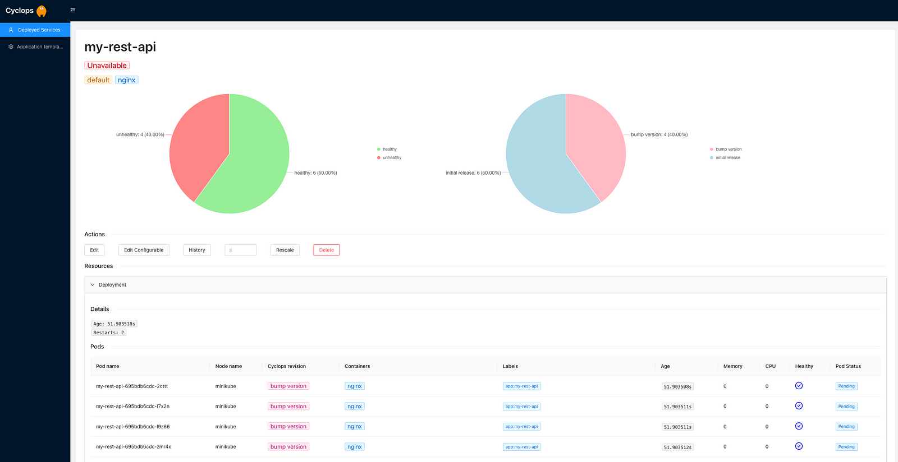

> **Turning Kubernetes into a Developer-Friendly Platform with Cyclops ☸️**

## 📌 Introduction

Kubernetes is one of the most important container orchestrations, enabling the deployment, scaling, and management of containerized applications.

However, its complexity and the steep learning curve have made it challenging for developers to make use of its full potential. In this blog post, we will explore how **Cyclops**, an innovative open-source tool, is transforming the Kubernetes experience, making it more accessible and developer-friendly.

We will check its features, benefits, and the impact it can have on simplifying the management of distributed systems, with a specific focus on Kubernetes.


## 🚧 Cyclops: The Developer's Solution to Kubernetes Complexity

**Cyclops** is an innovative web-based tool designed to streamline the management of distributed systems, particularly focusing on the widely used Kubernetes platform. It offers a user-friendly interface that simplifies the management of containerized applications on Kubernetes, providing an intuitive and user-friendly experience for developers, system administrators, and DevOps professionals. Key features of Cyclops include:

- **Configurable UI**: Cyclops abstracts complex Kubernetes configuration files into intuitive web forms, making it easier for developers to deploy applications and manage Kubernetes environments.
- **Templates for YAML configuration files**: Users can create parameterized and customizable configurations that can be easily adapted to different environments or use cases, promoting consistency and streamlining the deployment process.
- **Versioning templates**: Cyclops provides a structured way to keep track of changes and updates made to templates over time, facilitating collaboration, maintenance, and rollback if necessary.
- **Integration with Helm**: Cyclops integrates with [Helm](https://helm.sh/), allowing users to bring their existing Helm configuration files into the system, making the transition process smoother.

Cyclops offers a comprehensive dashboard that provides an overview of the cluster's health, performance, and resource utilization. The dashboard presents key metrics and information about pods, nodes, deployments, services, and more, enabling users to monitor the cluster's status at a glance.

With Cyclops, users can effortlessly deploy and scale their applications on the cluster, and create templates of YAML configuration files for their applications with variables that can be assigned later.



## 🛠️ Hands-on Lab

To test out Cyclops, you are going to need some things. The first thing you are going to need is a Kubernetes cluster. Another thing you will need is `kubectl`, a command line interface for running commands against your cluster.

### Installation

To install Cyclops in your cluster, run the command below:

```sh
kubectl apply -f https://raw.githubusercontent.com/cyclops-ui/cyclops/main/install/cyclops-install.yaml
```

It will create a new namespace called `cyclops` and deploy everything you need for your Cyclops instance to run.

Now all that is left is to expose the Cyclops server outside the cluster. You will still need to expose both the backend and frontend with the commands below.

Expose frontend through:

```sh
kubectl port-forward svc/cyclops-ui 3000:3000 -n cyclops
```

and backend through:

```sh
kubectl port-forward svc/cyclops-ctrl 8080:8080 -n cyclops
```

You can now access Cyclops in your browser at [http://localhost:3000](http://localhost:3000).

I think that this introduction provides a clear understanding of the basics of Cyclops. If you find it valuable, please consider starring it on [GitHub](https://github.com/cyclops-ui/cyclops) and exploring its features. Don't hesitate to share your feedback with the maintainers for continuous improvement. 🎉

## 🏁 Conclusion

Cyclops emerges as a great and user-friendly tool that simplifies the management of containerized applications on Kubernetes. With its intuitive interface, template-based configuration, versioning, and seamless integration with Helm, Cyclops streamlines the deployment and management processes, empowering developers, IT operations teams, and DevOps professionals to achieve greater efficiency, consistency, and visibility in their Kubernetes environments.

By providing a comprehensive dashboard and a host of features aimed at reducing the learning curve associated with Kubernetes, Cyclops stands out as a valuable asset for organizations looking to harness the full potential of container orchestration while minimizing complexity and maximizing productivity.

**Thank You 🖤**

<br>

**_Until next time, つづく 🎉_**

> 💡 Thank you for Reading !! 🙌🏻😁📃, see you in the next blog.🤘  **_Until next time 🎉_**

🚀 Thank you for sticking up till the end. If you have any questions/feedback regarding this blog feel free to connect with me:

**♻️ LinkedIn:** https://www.linkedin.com/in/rajhi-saif/

**♻️ X/Twitter:** https://x.com/rajhisaifeddine

**The end ✌🏻**

<h1 align="center">🔰 Keep Learning !! Keep Sharing !! 🔰</h1>

**📅 Stay updated**

Subscribe to our newsletter for more insights on AWS cloud computing and containers.
