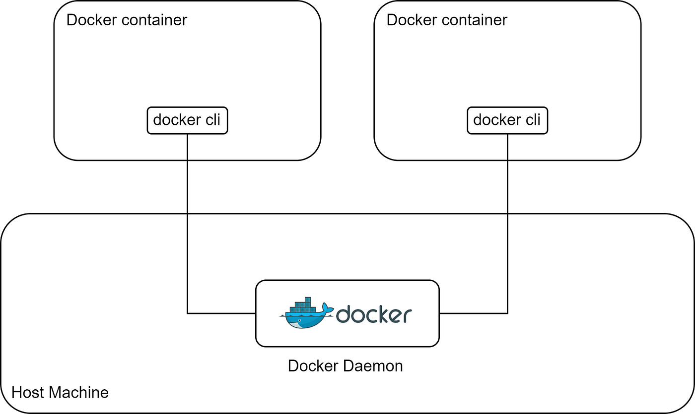
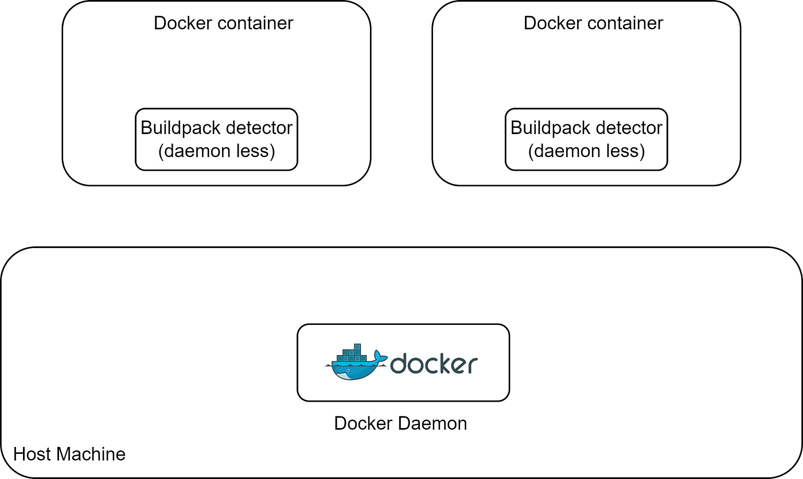

> **Daemonless Docker Image Building in k8s ☸️**

## 📌 Introduction

[Kaniko](https://github.com/GoogleContainerTools/kaniko) is an open-source tool developed by Google that enables building container images from a Dockerfile inside a Kubernetes cluster without requiring a Docker daemon. Kaniko executes each command in the Dockerfile in the user space using an executor image, which runs inside a container, such as a Kubernetes pod. This allows building container images in environments where the user doesn't have root access, like a Kubernetes cluster. In this blog post, we will explore how to use Kaniko to build container images in a Kubernetes cluster without a Docker daemon.


## 🚀 Benefits of Kaniko

Kaniko offers several benefits for building images in Kubernetes:

- **No Docker daemon required**: Kaniko eliminates the need for a Docker daemon in a Kubernetes cluster, reducing security risks and overhead.
- **Improved security**: By building images in userspace without privileges, Kaniko reduces the attack surface compared to using Docker.
- **Kubernetes integration**: Kaniko is specifically designed to build images within a Kubernetes pod, seamlessly integrating into Kubernetes workflows.
- **Caching**: During builds, Kaniko caches image layers, enabling faster image rebuilding.
- **Debugging**: Kaniko provides robust debugging tools for troubleshooting builds, enhancing the development process.

## ⚙️ How Kaniko Works

Kaniko builds container images by parsing the Dockerfile and executing each command within a container isolated from the host environment. Instead of using a Docker daemon, Kaniko simulates the Docker builder by providing its own implementations of Docker commands like `ADD`, `COPY`, `RUN`, etc.

Each command gets executed in its own scratch container based on the base image. This allows Kaniko to capture changes made by each command and construct the final image layer by layer. Kaniko also intelligently caches image layers to optimize rebuild time. The hashing of commands and layers allows for avoiding redundant build steps.

For more detailed information, you can refer to the [Kaniko documentation](https://github.com/GoogleContainerTools/kaniko#readme).

## 🆚 Kaniko vs DinD



DinD (Docker in Docker) technology shares the host's Docker daemon with the container it's running in. This means that it has full access to Docker on the host, potentially impacting the host's Docker environment, which can be really dangerous. But Kaniko is more secure because it doesn't need access to the host's Docker daemon inside the container, reducing potential security risks.

On the other hand, Kaniko is primarily useful for building a Docker image, while DinD has a broader range of uses, with building images being just one of them. You can perform various tasks with DinD, such as managing containers on the daemon host and monitoring their status.

## 🆚 Kaniko vs Buildpacks



Buildpacks are highly automated and aim to make image building easier, without requiring you to write a Dockerfile for your project. In contrast, Kaniko requires manual Dockerfile creation and configuration.

On the other hand, Kaniko is a more low-level project that allows you to customize your project extensively, making your build process highly customizable. In comparison, the level of customization in Buildpacks can be somewhat challenging and occasionally impossible.

## 🏗 Using Kaniko In Kubernetes

To use Kaniko in Kubernetes, a pod specification is created with Kaniko as the container image, and the Dockerfile is mounted as a volume. Upon running the pod, Kaniko will proceed to build the image from the Dockerfile and push it to the designated registry.

### Example Pod Specification

An example pod specification for running Kaniko is as follows:

```yaml
apiVersion: v1
kind: Pod
metadata:
    name: kaniko
spec:
    containers:
    - name: kaniko
        image: gcr.io/kaniko-project/executor:latest
        args: ["--dockerfile=/Dockerfile", "--destination=myregistry/myimage"]
        volumeMounts:
            - name: dockerfile
                mountPath: /Dockerfile
    volumes:
        - name: dockerfile
            configMap:
                name: dockerfile-configmap
    restartPolicy: Never
```

The Dockerfile is stored in a ConfigMap which gets mounted by Kaniko to build the image.

Kaniko provides a secure and efficient way to build container images within a Kubernetes cluster. By avoiding privileged Docker daemons, Kaniko simplifies image building while improving security. The caching and Kubernetes integration make Kaniko a natural fit for automating image creation as part of a CD pipeline.

## 📚 Tutorial: Build Container Images with Kaniko in Kubernetes

Kaniko is a tool that allows building container images from a Dockerfile inside a Kubernetes cluster without needing Docker. In this tutorial, we'll walk through an example of using Kaniko to build and push an image to a registry from a Kubernetes pod.

### Prerequisites

- Kubernetes cluster
- Docker Hub account for pushing the built image

### 1. Write a Dockerfile

First, we'll write a simple Dockerfile that defines our example image:

```dockerfile
FROM alpine:3.12
RUN apk add --update nginx \
 && rm -rf /var/cache/apk/*
RUN echo 'This image is created by kaniko' > /usr/share/nginx/html/index.html
EXPOSE 80
CMD ["nginx", "-g", "daemon off;"]
```

This Dockerfile starts from the alpine base image, installs nginx, copies over a custom `index.html`, exposes port 80, and sets the container command.

### 2. Create a ConfigMap for the Dockerfile

Next, we'll create a ConfigMap that contains this Dockerfile so that we can mount it into the Kaniko pod later:

```sh
kubectl create configmap dockerfile-config --from-file=Dockerfile
```

### 3. Define a Pod Spec for Kaniko

Now we can define a pod spec in a YAML file with Kaniko as the container:

```yaml
apiVersion: v1
kind: Pod
metadata:
    name: kaniko
spec:
    containers:
    - name: kaniko
        image: gcr.io/kaniko-project/executor:latest
        args: ["--dockerfile=/Dockerfile", "--context=/workspace", "--destination=mydockerhubusername/nginx-image"]
        volumeMounts:
            - name: dockerfile 
                mountPath: /Dockerfile
    restartPolicy: Never
    volumes:
        - name: dockerfile
            configMap:
                name: dockerfile-config
```

The key parts are:

- Mounting our ConfigMap containing the Dockerfile to `/Dockerfile`
- Setting the Dockerfile path in the `args`
- Specifying the destination image repository and tag

### 4. Run the Kaniko Pod

We can now create the pod to trigger the Kaniko build:

```sh
kubectl create -f kaniko.yaml
```

Once launched, you can watch the pod's logs to see the build process:

```sh
kubectl logs -f kaniko
```

After the build completes, the image will be pushed to the destination registry specified.

### 5. Verify the Built Image

Finally, we can pull and run a container from the image built by Kaniko to verify it works as expected:

```sh
docker pull mydockerhubusername/nginx-image
docker run -p 80:80 mydockerhubusername/nginx-image
```

When you visit `localhost`, you should see the custom `index.html` from the image served by nginx!

And that's it! We used Kaniko to build and push a Docker image from a Kubernetes pod, without needing direct access to Docker. Kaniko is a handy tool to integrate image building into a Kubernetes-based CI/CD pipeline.

## 📌 Common Use Cases and Examples

- ✅ **Kubernetes CI/CD pipelines**: Kaniko can be used to build application container images as part of a continuous integration and deployment workflow in Kubernetes. For example, building images within a Kubernetes cluster after application code is pushed to a git repository.
- ✅ **Building images in serverless architectures**: When running containerized workloads on serverless platforms like AWS Fargate, Kaniko allows building images as part of the serverless workflow without needing a dedicated Docker environment.
- ✅ **Building images in constrained environments**: Kaniko can build images in environments that don't allow running privileged containers like a Docker daemon. For example on managed Kubernetes services that have security restrictions.
- ✅ **Debugging Dockerfiles**: Kaniko can be used to debug Dockerfile commands and scripts by building images step-by-step.
- ✅ **Reproducing builds**: The cache digest produced by Kaniko makes builds reproducible by allowing exactly the same image to be rebuilt multiple times.
- ✅ **Self-hosted image registries**: Kaniko can push images to private registries and doesn't depend on hub.docker.com for hosting images.
- ✅ **Custom base images**: Kaniko allows building custom base images efficiently from scratch before using them in application images.
- ✅ **Multi-stage builds**: Kaniko supports multi-stage Dockerfiles out of the box for creating final production images.
- ✅ **Scratch image builds**: Images can be built from scratch without needing a base image.

Kaniko fits nicely into Kubernetes and CI/CD workflows, allows building images in restricted environments, and provides reproducibility and debugging for Dockerfile builds.

## 🏁 Conclusion

Kaniko enables building container images within a Kubernetes cluster without privileged access or external Docker daemons. It offers improved security, simpler setup, and easier integration with existing Kubernetes workflows.

By using Kaniko, the build and push process can be entirely self-contained within the cluster, eliminating the need for external dependencies and simplifying build orchestration. This approach paves the way for faster and more integrable builds in CI/CD pipelines with security as a guiding principle.

**Thank You 🖤**

<br>

**_Until next time, つづく 🎉_**

> 💡 Thank you for Reading !! 🙌🏻😁📃, see you in the next blog.🤘  **_Until next time 🎉_**

🚀 Thank you for sticking up till the end. If you have any questions/feedback regarding this blog feel free to connect with me:

**♻️ LinkedIn:** https://www.linkedin.com/in/rajhi-saif/

**♻️ X/Twitter:** https://x.com/rajhisaifeddine

**The end ✌🏻**

<h1 align="center">🔰 Keep Learning !! Keep Sharing !! 🔰</h1>

**📅 Stay updated**

Subscribe to our newsletter for more insights on AWS cloud computing and containers.
