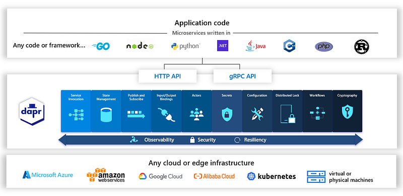
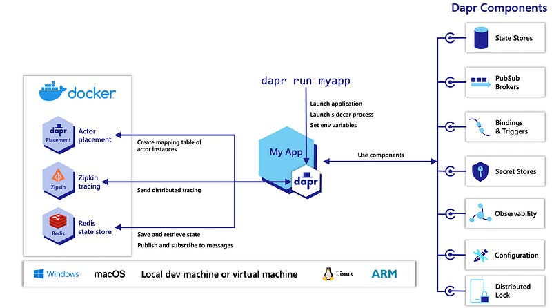
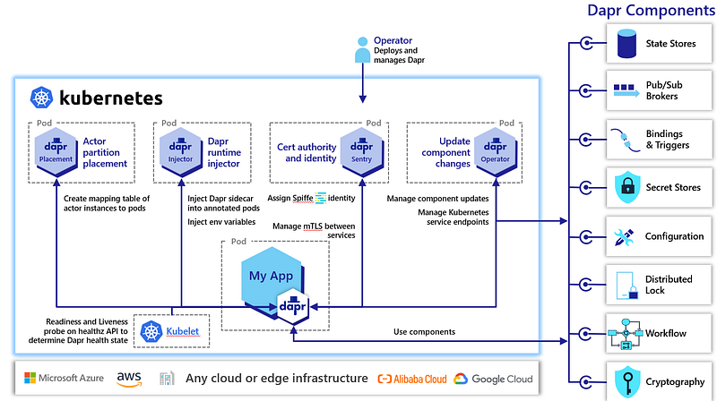
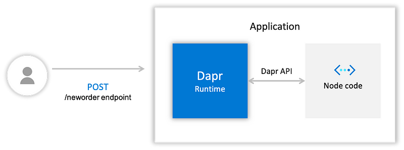

> **A Beginner's Guide 📗**

Distributed applications are becoming increasingly popular, as they offer a number of advantages over traditional monolithic applications. However, building and running distributed applications can be complex and challenging.

[Dapr](https://docs.dapr.io/getting-started/) is a portable, event-driven runtime that makes it easy to build and run distributed applications across the cloud and edge. It provides a set of building blocks that developers can use to easily build and run microservices, event-driven applications, and stateful applications.

In this blog post, we will introduce Dapr and discuss its benefits and features. We will also show you how to get started with Dapr by building a simple microservices application.

## What is Dapr?

[Dapr](https://docs.dapr.io/getting-started/) is a portable, event-driven runtime that makes it easy for any developer to build resilient, stateless, and stateful applications that run on the cloud and edge and embraces the diversity of languages and developer frameworks. Leveraging the benefits of a sidecar architecture, Dapr helps you tackle the challenges that come with building microservices and keeps your code platform agnostic.

### Introduction to the Distributed Application Runtime

Dapr is a portable, event-driven runtime that makes it easy for any developer to build resilient, stateless, and stateful applications that run on the cloud and edge and embraces the diversity of languages and developer frameworks.

### Any Language, Any Framework, Anywhere



With the current wave of cloud adoption, web + database application architectures (such as classic 3-tier designs) are trending more toward microservice application architectures, which are inherently distributed. You shouldn't have to become a distributed systems expert just to create microservices applications.

This is where Dapr comes in. Dapr codifies the best practices for building microservice applications into open, independent APIs called [building blocks](https://docs.dapr.io/concepts/overview/#microservice-building-blocks-for-cloud-and-edge).

### Dapr's Building Blocks

- Enable you to build portable applications using the language and framework of your choice.
- Are completely independent.
- Have no limit to how many you use in your application.

Using Dapr, you can incrementally migrate your existing applications to a microservices architecture, thereby adopting cloud-native patterns such as scale out/in, resiliency, and independent deployments.

Dapr is platform agnostic, meaning you can run your applications:

- Locally
- On any Kubernetes cluster
- On virtual or physical machines
- In other hosting environments that Dapr integrates with.

This enables you to build microservice applications that can run on the cloud and edge.

### Hosting Environments

Dapr can be hosted in multiple environments, including:

- Self-hosted on a Windows/Linux/macOS machine for local development.
- On Kubernetes or clusters of physical or virtual machines in production.

#### Self-Hosted Local Development

In [self-hosted mode](https://docs.dapr.io/operations/hosting/self-hosted/self-hosted-overview/), Dapr runs as a separate sidecar process, which your service code can call via HTTP or gRPC. Each running service has a Dapr runtime process (or sidecar) configured to use state stores, pub/sub, binding components, and other building blocks.

You can use the [Dapr CLI](https://github.com/dapr/cli#launch-dapr-and-your-app) to run a Dapr-enabled application on your local machine. In the following diagram, Dapr's local development environment gets configured with the CLI init command. Try this out with [the getting started samples](https://docs.dapr.io/getting-started/).



#### Kubernetes

Kubernetes can be used for either:

- **Local development** (for example, with [minikube](https://minikube.sigs.k8s.io/docs/) and [k3S](https://k3s.io/))
- **Production** (see [production hosting](https://docs.dapr.io/operations/hosting/kubernetes/))

In container hosting environments such as Kubernetes, Dapr runs as a sidecar container with the application container in the same pod. Dapr's `dapr-sidecar-injector` and `dapr-operator` control plane services provide first-class integration to:

- Launch Dapr as a sidecar container in the same pod as the service container
- Provide notifications of Dapr component updates provisioned in the cluster

The `dapr-sentry` service is a certificate authority that enables mutual TLS between Dapr sidecar instances for secure data encryption, as well as providing identity via Spiffe. For more information on the Sentry service, [read the security overview](https://docs.dapr.io/concepts/security-concept/#dapr-to-dapr-communication).

Deploying and running a Dapr-enabled application into your Kubernetes cluster is as simple as adding a few annotations to the deployment schemes.



## Hands-On and Getting Started 

The project is surprisingly easy to get up and running regardless of your developer background and language of choice. I was able to follow the [getting started guides](https://docs.dapr.io/getting-started/) and run various quickstarts in no time on my macOS. Here are roughly the steps I followed:

### Install Dapr CLI 🛠️

Dapr CLI is the main tool for performing Dapr-related tasks such as running an application with Dapr, viewing logs, running the Dapr dashboard, or deploying to Kubernetes.

```shell
brew install dapr/tap/dapr-cli
```

With the CLI installed, we have a few different options for installing and running Dapr. I'll start from the least demanding and flexible option and progress from there.

**Option 1: Install Dapr without Docker:**

This is the lightest but not the most useful way to run Dapr.

```shell
dapr init --slim
```

In this slim mode, only `daprd` and `placement` binaries are installed on the machine, which is sufficient for running Dapr sidecars locally.

### 🛠️ Run a Dapr Sidecar

The following command will start a Dapr sidecar called `no-app` listening on HTTP port 3500 and a random gRPC port.

```shell
dapr run --app-id no-app --dapr-http-port 3500
```

Congratulations, you have your first Dapr sidecar running. You can see the sidecar instance through this command:

```shell
dapr list
```

Or query its health status:

```shell
curl -i http://localhost:3500/v1.0/healthz
```

Dapr sidecars are supposed to run next to an application and not on their own. Let's stop this instance and run it with an application.

```shell
dapr stop --app-id no-app
```

### 🚀 Run a Simple App with a Dapr Sidecar

For more details, refer to the [Dapr documentation](https://docs.dapr.io/).

For this demonstration, we will use a [simple NodeJS application](https://github.com/dapr/samples/tree/master/hello-dapr-slim):

```shell
git clone https://github.com/dapr/samples.git
cd samples/hello-dapr-slim
npm install
```

This is a Hello World the Dapr way and here is the gist of it:

```javascript
app.post('/neworder', bodyParser.json(), (req, res) => { 
    const data = req.body.data; 
    const orderId = data.orderId; 
    res.status(200).send("Got a new order! Order ID: " + orderId); 
});
```

For more examples and detailed guides, check out the [Dapr Samples Repository](https://github.com/dapr/samples).

The application has one `/neworder` endpoint listening on port 3000. We can run this application and the sidecar with the following command:

```shell
dapr run --app-id nodeapp --app-port 3000 --dapr-http-port 3500 node app.js
```

The command starts the NodeJS application on port 3000 and Dapr HTTP endpoint on 3500. Once you see in the logs that the app has started successfully, we can interact with it. Instead of hitting the `/neworder` endpoint directly on port 3000, we will interact with the application through the sidecar using the Dapr CLI:

```shell
dapr invoke --verb POST --app-id nodeapp --method neworder --data '{"data": { "orderId": "41" } }'
```

For more information on Dapr CLI commands, refer to the [Dapr CLI documentation](https://docs.dapr.io/reference/cli/dapr-cli-overview/).

You can also use a curl command to achieve the same result:

```shell
curl -XPOST -d @sample.json -H "Content-Type:application/json" http://localhost:3500/v1.0/invoke/nodeapp/method/neworder
```

This command uses Dapr's service invocation API to interact with the application. Here is a visual representation of what just happened:



With Dapr on the request path, we get benefits such as resiliency policies (retries, timeouts, circuit breakers), observability enhancements (metrics, tracing, logs), and security enhancements (mTLS, [allow lists](https://docs.dapr.io/operations/configuration/invoke-allowlist/)). You can explore metadata, metrics endpoints, [configuration options](https://docs.dapr.io/operations/configuration/configuration-overview/), or see your microservice in the Dapr dashboard:

```shell
dapr dashboard
```

The slim mode we are running is good for the Hello World scenario but not ideal for local development as it lacks state store, pub/sub, and metric server. Let's stop the nodeapp and remove the slim Dapr binary:

```shell
dapr stop --app-id nodeapp
dapr uninstall
```

Note that this command will not remove the default configuration and component specification files usually located in the `~/.dapr` folder. If you follow other tutorials and change those files, they will remain and get applied with every `dapr run` command in the future (unless overridden). Keep this in mind to avoid confusion.

### **Option 2: Install Dapr with Docker 🐳**

This is the preferred way for running [Dapr locally](https://docs.dapr.io/getting-started/install-dapr-selfhost/) for development purposes, but it requires Docker. Let's set it up:

```shell
dapr init
```

The command will download and run 3 containers:

- **Dapr placement container**: Used with actors (I wish this was an optional feature).
- **Zipkin**: For collecting tracing information from our sidecars.
- **Redis**: A single node Redis container used for state store, pub/sub, and distributed-lock implementations.

You can verify when these containers are running and you are ready to go:

```shell
docker ps
```

### **Run the Quickstarts 🚀**

My next step from here was to try out the [quickstarts](https://docs.dapr.io/getting-started/quickstarts/) that demonstrate the building blocks for service invocation, pub/sub, state store, bindings, etc. The awesome thing about these quickstarts is that they demonstrate the same example in multiple ways:

- With Dapr SDK and without any dependency on Dapr SDK (i.e., using HTTP only).
- In multiple languages: Java, JavaScript, .NET, Go, Python, etc.

You can mix and match different languages and interaction methods (SDK or native) for the same example, which demonstrates Dapr's polyglot nature.

### **Option 3: Install Dapr on Kubernetes ☸️**

If you have come this far, you should have a good high-level understanding of what Dapr can do for you. The next step would be to deploy Dapr on Kubernetes where most of the Dapr functionalities are available and closest to a production deployment. For this purpose, I used [minikube](https://minikube.sigs.k8s.io/docs/) locally with default settings and no custom tuning.

```shell
dapr init --kubernetes --wait
```

If successful, this command will start the following pods in the `dapr-system` namespace:

- **dapr-operator**: Manages all components for state store, pub/sub, configuration, etc.
- **dapr-sidecar-injector**: Injects Dapr sidecars into annotated deployment pods.
- **dapr-placement**: Required with actors only.
- **dapr-sentry**: Manages mTLS between services and acts as a certificate authority.
- **dapr-dashboard**: A simple web app to explore what is running within a Dapr cluster.

These Pods collectively represent the [Dapr control plane.](https://docs.dapr.io/concepts/dapr-services/)

### **Injecting a Sidecar 🛠️**

From here on, adding a Dapr sidecar to an application (this would be Dapr dataplane) is as easy as adding the [following annotations](https://docs.dapr.io/reference/arguments-annotations-overview/) to your Kubernetes Deployments:

```yaml
annotations:
    dapr.io/enabled: "true"
    dapr.io/app-id: "nodeapp"
    dapr.io/app-port: "3000"
```

The `dapr-sidecar-injector` service watches for new Pods with the `dapr.io/enabled` annotation and injects a container with the `daprd` process within the pod. It also adds `DAPR_HTTP_PORT` and `DAPR_GRPC_PORT` environment variables to your container so that it can easily communicate with Dapr without hard-coding Dapr port values.

To deploy a complete application on Kubernetes, I suggest this [step-by-step example](https://github.com/dapr/quickstarts/tree/master/tutorials/hello-kubernetes). It has provider and consumer services and it worked the first time for me.

### **Transparent vs Explicit Proxy 🔍**

Notice that Dapr sidecar injection is less intrusive than a typical service mesh with a transparent sidecar such as Istio's Envoy. To inject a transparent proxy, typically the Pods also get injected with an init-container that runs at the start of the Pod and re-configures the Pod's networking rules so that all ingress and egress traffic of your application container goes through the sidecar. With Dapr, that is not the case. There is a sidecar injected, but your application is in control of when and how to interact with Dapr over its well-defined explicit (non-transparent) APIs.

Transparent service mesh proxies operate at lower network layers typically used by operations teams, whereas Dapr provides application layer primitives needed by developers. If you are interested in this topic, here is a good [explanation of the differences and overlaps of Dapr with service meshes](https://docs.dapr.io/concepts/service-mesh/).

## **Summary 📝**

Dapr emerges as a versatile and event-driven runtime, providing a beginner-friendly solution for constructing distributed applications. With its portable nature and emphasis on simplifying development complexities, Dapr empowers newcomers to seamlessly navigate the intricacies of building distributed systems. As a beginner's guide, this post sheds light on Dapr's fundamental features, offering a gateway for developers to embark on their journey into the realm of distributed application development.

<br>

**_Until next time, つづく 🎉_**

> 💡 Thank you for Reading !! 🙌🏻😁📃, see you in the next blog.🤘  _**Until next time 🎉**_

🚀 Thank you for sticking up till the end. If you have any questions/feedback regarding this blog feel free to connect with me:

**♻️ LinkedIn:** https://www.linkedin.com/in/rajhi-saif/

**♻️ X/Twitter:** https://x.com/rajhisaifeddine

**The end ✌🏻**

<h1 align="center">🔰 Keep Learning !! Keep Sharing !! 🔰</h1>

**📅 Stay updated**

Subscribe to our newsletter for more insights on AWS cloud computing and containers.
