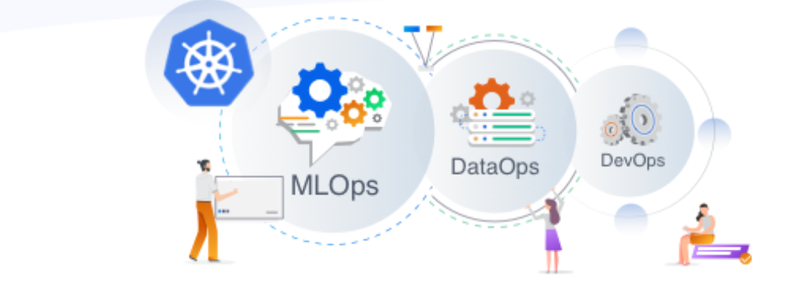

> **From databases to Big data: how k8s handles stateful workloads 📗**
> This is a blog series about Data on Kubernetes DoK 🔥
I have been inspired by the work done by [Data On Kubernetes community DOKC](https://dok.community/).

**👉 Few weeks ago, I have posted on reddit to ask on some feedback on [running stateful data workloads or running databases on Kubernetes](https://www.reddit.com/r/kubernetes/comments/1dp062w/are_you_running_stateful_data_workloads_or/?sort=old) and I got a lot of interesting answers.**

## 📚 Introduction

Kubernetes, the popular container management system, was initially designed for stateless applications. But guess what? It's not just for simple apps anymore! k8s has become a great data orchestrator.

Organizations now recognize data as a valuable asset, and Kubernetes provides an ideal framework for managing data workloads. It handles everything from processing massive datasets to running machine learning pipelines.

Key features include seamless deployment of stateful applications using StatefulSets and Persistent Volumes, data pipelines as code with tools like Airflow, and service discovery for databases like PostgreSQL, Elasticsearch, and Cassandra.

 
 

https://giphy.com/gifs/Giflytics-gif-jazminantoinette-giflytics-xT9C25UNTwfZuk85WP

## Stateless vs. Stateful workloads in a containerized ecosystem

When it comes to deploying applications in a containerized environment, understanding the distinction between stateless and stateful workloads is crucial.

Cloud native apps and specifically containers, often associated with the "cattle vs. pets" analogy.

### Stateless Applications and Containers

- **Cattle mindset**: Stateless apps, like cattle, are designed to be disposable and replaceable. They don't carry any emotional attachment; if one fails, you spin up another without hesitation.
- **Container alignment**: Containers, with their lightweight and immutable nature, align perfectly with stateless workloads. Each container instance is identical, and orchestration platforms like Kubernetes can easily scale them horizontally.
- **Microservices harmony**: Stateless microservices, encapsulated within containers, thrive in this environment. They handle individual requests, perform computations, and communicate with other services via APIs.

Initially made for stateless applications, Kubernetes excels at managing containerized microservices. Features like auto-scaling, rolling updates, and service discovery simplify the deployment and maintenance of stateless components.

### Stateful Applications and Containers

- **Pets nurturing**: Stateful applications, akin to pets, have unique identities and require special care. Think of your beloved pet dog; it's not interchangeable like cattle.
- **Container challenges**: Containers, while great, face challenges when hosting stateful workloads. Data persistence, ordering, and identity become big concerns.
- **Managing complexity**: Handling databases, caching systems, and file servers within containers demands thoughtful design. Persistent storage, data consistency, and failover strategies must be carefully orchestrated.
- **Kubernetes adaptation**: Kubernetes evolved to accommodate stateful applications. StatefulSets provide stable network identities, and Persistent Volumes (PVs) ensure data survives container restarts.
- **Pet-Like attention**: However, treating stateful containers like cattle is a recipe for disaster. Instead, they need the nurturing attention reserved for pets.

## Considerations and challenges of managing Stateful workloads in Kubernetes

When managing stateful workloads in Kubernetes, a lot of challenges arise, especially when compared to stateless applications. Let's delve into some of these considerations:

### Persistent Data Management

- Stateful applications, such as databases or DevOps systems, rely on persistent storage for data persistence.
- Kubernetes provides solutions like Persistent Volumes (PVs) and StatefulSets, but ensuring fault tolerance requires applications to checkpoint their in-memory state.
- Ensuring reliable data persistence is really important for stateful workloads.

### Scaling and Updating Challenges

- Scaling or updating stateful applications is complex.
- Autoscalers need to participate in state management to handle scaling activities effectively.

### Reliability-Durability Dichotomy

- Kubernetes maintains the durability of stateful applications by ensuring access to Persistent Volumes during disruptions.
- However, achieving high-nines availability and consistent performance remains a challenge.
- Traditional failover and recovery strategies may not fully address the sensitivity of stateful applications to disruptions.

## Databases on k8s; success stories

To see if running DBs on k8s is a good idea or not let us explore some success stories of running stateful workloads and databases in k8s.

### ✔️ Yellowbrick Data

Yellowbrick, an MPP (Massively Parallel Processing) database, stands out as a success story on Kubernetes. Last year, they presented a VLDB (Very Large Databases) paper that shed light on their architecture. What sets Yellowbrick apart is its approach to separating compute and storage components. By doing so, [Yellowbrick thrives in a Kubernetes environment](https://yellowbrick.com/blog/cloud/dbas-face-up-to-kubernetes/), demonstrating that stateful workloads can indeed succeed in this dynamic platform.

### ✔️ IBM DB2 Warehouse and IBM Netezza

IBM's offerings, including DB2 Warehouse and Netezza, are robust MPP databases. [Their adoption of Kubernetes showcases the feasibility](https://www.ibm.com/docs/en/db2-warehouse?topic=warehouse-redeploying-using-kubernetes) of running large-scale workloads. The key to their success lies in Kubernetes operators. But what exactly are these operators?

### Kubernetes Operators

Operators are programmable extensions. They perform operations that Kubernetes cannot handle natively. Think of them as intelligent, dynamic managers that extend the functionality of the Kubernetes API. Their real impact lies in managing stateful workloads.

## Benefits of Running Databases on Kubernetes

- **Cost Efficiency**: [Kubernetes leverages cost-effective cloud resources, resulting in significant savings compared to public DBaaS solutions](https://thenewstack.io/stateful-workloads-on-kubernetes-are-a-thing-but-there-is-a-twist/).
- **Scalability**: Kubernetes enables easy scaling of database resources based on demand.
- **Automation**: Operators handle tasks like backups, scaling, and tuning, streamlining database management.

## Kubernetes for data science and Machine Learning

[source](https://www.xenonstack.com/blog/generative-ai-platform)

<a href="https://www.xenonstack.com/blog/generative-ai-platform">Machine Learning on Kubernetes</a>

Kubernetes different capabilities address the demands of ML workloads, providing an orchestration framework that transcends mere container management.

### ⭐️ Simplified infrastructure and clear configuration

- Kubernetes simplifies the underlying infrastructure complexities: Data scientists can focus on their models, algorithms, and insights without worrying about hardware details or network intricacies.
- Declarative configurations allow you to express your application's desired state: Kubernetes automatically configures the environment to match that state, consolidating workload management and ensuring consistency across deployments.

### ⭐️ Scalability and efficient resource usage

- Scalability is at the heart of Kubernetes: Whether you're handling a single data science workload or orchestrating a complex ML pipeline, Kubernetes adapts ideally. It scales resources up or down based on demand.
- Managing large datasets, memory-intensive computations, and storage requirements becomes easy: Kubernetes ensures that your applications have the necessary resources, optimizing performance and responsiveness.

### ⭐️ More Than Container Orchestration

- Kubernetes excels in container orchestration: It manages container lifecycles, dependencies, and services. But it doesn't stop there - it also handles networking, load balancing, and service discovery.
- With Kubernetes, you can define intricate workflows, ensuring smooth data pipelines: It takes care of service discovery, DNS resolution, and load balancing while maintaining high availability.

## ⭐️ Advantages for Machine Learning

### GPU Support

Machine learning relies on computational power. Kubernetes embraces GPUs, accelerating model training and inference. Whether fine-tuning neural networks or running large-scale simulations, GPUs are a game-changer.

### Tool Integration

Kubernetes ideally integrates with popular ML tools like Spark, TensorFlow, Jupyter Notebooks, and Kubeflow. You can build, test, and deploy models within the same orchestrated environment.

### Automated Workflows

Managing ML workflows involves data pre-processing, model training, and deployment. Kubernetes streamlines these tasks. Imagine automating data transformations, hyperparameter tuning, and model versioning — all orchestrated through Kubernetes.

## ⭐️ Scalable Models and Improved Accuracy

Kubernetes scales well for machine learning models. Whether training deep learning models on massive datasets or deploying ensemble models, Kubernetes adapts. It ensures models scale horizontally to meet performance demands.

By efficiently processing extensive datasets, Kubernetes contributes to model accuracy. Whether predicting customer churn, analyzing medical images, or recommending personalized content, Kubernetes provides the computational power.

## 🔚 Closing thoughts

Kubernetes provides great solutions for managing stateful workloads, including databases and big data applications. Its features, such as scalability, fault tolerance, and efficient resource management, make it an ideal platform for handling data-intensive tasks.

Stay tuned for next blogs in this series 🎉

 
 

> 💡 Thank you for Reading !! 🙌🏻😁📃, see you in the next blog.🤘  _**Until next time 🎉**_

🚀 Thank you for sticking up till the end. If you have any questions/feedback regarding this blog feel free to connect with me:

**♻️ LinkedIn:** https://www.linkedin.com/in/rajhi-saif/

**♻️ X/Twitter:** https://x.com/rajhisaifeddine

**The end ✌🏻**

_**Keep Learning !! Keep Sharing !! 🔰**_

**📻🧡 References:**

- [The future of Data on Kubernetes - Data on Kubernetes Community](https://dok.community/blog/the-future-of-data-on-kubernetes/)
- [Are you running stateful data workloads or running databases on Kubernetes? : r/kubernetes (reddit.com)](https://dok.community/blog/the-future-of-data-on-kubernetes/)
- www.youtube.com/watch?v=99uSJXkKpeI

**📅 Stay updated**

Subscribe to our newsletter for more insights on AWS cloud coomputing and containers.
