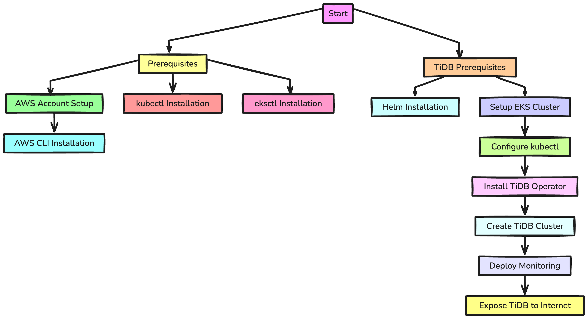

> **TiDB: A Cloud-Native Database for hybrid workloads**

## 📚 Introduction

The idea of a Kubernetes-native database like TiDB came up to solve the problems of running traditional databases on Kubernetes. Databases like MySQL and Cassandra have been around for a long time and work well, but they can be hard to manage on Kubernetes. 

[TiDB](https://docs.pingcap.com/tidb/stable), created by PingCAP, is built from the start to work well with Kubernetes. It can handle both [transactional and analytical workloads](https://www.fivetran.com/blog/databases-demystified-analytical-vs-transactional) without needing a separate ETL process. This makes TiDB a very useful  for managing data on Kubernetes.

Traditional databases often face challenges when adapted to Kubernetes, such as managing multiple nodes and integrating with Kubernetes storage. TiDB addresses these issues by being designed as a cloud-native database from day one. 

It makes use of Kubernetes resources like Pods, StatefulSets, and PersistentVolumes, and is managed by an operator, making deployment and scaling easier. With TiDB, you get the benefits of both transactional and analytical processing in one system, simplifying your data management tasks.

## ✍️ History and development of TiDB


TiDB, [short for "Titanium Database,"](https://docs.pingcap.com/tidb/stable/overview) is an open-source, MySQL-compatible database developed by PingCAP. The development of TiDB began in 2015 with the goal of creating a database that could handle both transactional and analytical workloads efficiently. The inspiration for TiDB came from Google's F1 project, which built on top of Spanner, a globally distributed database. 

TiDB was designed to address the limitations of traditional databases, such as scalability and flexibility, by making use of a cloud-native architecture.


### Overview of PingCAP and their role in the development of TiDB

PingCAP, the company behind TiDB, was founded by a group of engineers with extensive experience in database systems and distributed computing. Their mission was to build a database that could meet the demands of modern applications, which require both high availability and the ability to process large volumes of data in real-time. 

PingCAP has been the primary contributor to TiDB, continuously improving its features and performance. They have also fostered a strong community around TiDB, encouraging collaboration and contributions from developers worldwide.

### Key Features of TiDB

**_✅ Hybrid Transactional and Analytical Processing (HTAP):_**

One of the standout features of TiDB is its support for Hybrid Transactional and Analytical Processing (HTAP). This means TiDB can handle both transactional (OLTP) and analytical (OLAP) workloads without the need for a separate ETL process. TiDB achieves this by using two different storage engines: TiKV for transactional workloads and TiFlash for analytical workloads. This dual-engine approach allows TiDB to provide real-time analytics on fresh transactional data, making it highly efficient for applications that require both types of operations.

**_✅ MySQL compatibility:_**

TiDB is fully compatible with MySQL, which means it can be used as a drop-in replacement for MySQL databases. This compatibility extends to MySQL protocols and SQL syntax, making it easy for developers to migrate their applications to TiDB without significant changes. This feature also allows TiDB to integrate seamlessly with existing MySQL tools and ecosystems.

**_✅ Scalability and flexibility:_**

TiDB is designed to scale horizontally, which means it can handle increasing amounts of data and traffic by adding more nodes to the cluster. This scalability is achieved through a distributed architecture where data is automatically sharded and balanced across multiple nodes. TiDB's flexibility allows it to run on various environments, including on-premises data centers, public clouds, and Kubernetes clusters. This makes TiDB a versatile solution for different deployment scenarios.

**_✅ High availability and fault tolerance:_**

TiDB ensures high availability and fault tolerance through its distributed architecture. Data is replicated across multiple nodes, typically with at least three replicas, to provide redundancy. In the event of a node failure, TiDB can automatically failover to another replica, ensuring continuous availability. The Placement Driver (PD) component of TiDB manages metadata and coordinates data placement, further enhancing the system's resilience and ability to recover from failures.

## TiDB Architecture

TiDB's architecture is designed for high performance, scalability, and flexibility by separating compute and storage into distinct, independently scalable components. 

Let's look at each component:

**_❎ TiDB:_**

Each TiDB instance is a stateless service exposing a MySQL endpoint. It parses SQL requests, uses metadata from the Placement Driver to create execution plans, and queries TiKV and TiFlash nodes. Results are assembled and returned to the client. A proxy typically provides load balancing for the TiDB cluster.

**_❎ TiKV:_**

TiKV is an open-source, distributed key-value database for transactional workloads. It uses RocksDB and provides a custom Distributed SQL API. TiKV ensures high availability and fault tolerance by storing multiple replicas of data across nodes, supporting automatic failover. It is a CNCF Graduated project recognized for its reliability.

**_❎ TiFlash:_**

TiFlash is a columnar storage engine for analytical workloads, based on ClickHouse. Data is replicated from TiKV to TiFlash in real-time, enabling analytical queries on fresh transactional data without a separate ETL process. Columnar storage offers significant performance advantages for analytical queries.

**_❎ TiSpark:_**

TiSpark is a library for Apache Spark, supporting complex analytical (OLAP) queries. It integrates with Spark to ingest data from TiFlash using the Distributed SQL API, leveraging Spark's data processing capabilities for large-scale analytics.

**_❎ Placement Driver (PD):_**

The PD manages metadata for TiDB, deployed in a cluster of at least three nodes. It uses range-based sharding to divide table keys into regions, assigning them to TiKV nodes. PD monitors data amounts, splitting large regions to scale up and merging smaller ones to scale down.

**_❎ TiDB Operator:_**

The TiDB Operator automates deployment, management, and scaling of TiDB clusters on Kubernetes. It handles tasks like deployment, scaling, upgrades, monitoring, and backup/restore operations, leveraging Kubernetes resources like Pods, StatefulSets, and PersistentVolumes.


### How TiDB uses Kubernetes resources

TiDB integrates seamlessly with Kubernetes, using its resources to manage and scale efficiently:

- **_Pods:_** Each TiDB instance runs as a stateless service in a Pod, easily scalable based on demand.
- **_StatefulSets:_** TiKV and TiFlash nodes are deployed using StatefulSets, ensuring stable network identities and persistent storage.
- **_PersistentVolumes (PVs) and PersistentVolumeClaims (PVCs):_** TiDB uses PVs for durable storage and PVCs for specific storage requests.

### Role of the TiDB operator in managing the databases:

The TiDB Operator simplifies running TiDB on Kubernetes by automating:

- **_Deployment:_** Automates deployment of TiDB components using Kubernetes resources.
- **_Scaling:_** Automatically scales TiDB clusters based on resource usage and demand.
- **Upgrades:** Manages rolling upgrades, minimizing downtime.
- **_Monitoring and alerts:_** Integrates with Prometheus and Grafana for metrics and alerts.
- **_Backup and restore:_** Supports backup and restore operations for data durability and recovery.

## Deploy TiDB on EKS

Deploying TiDB on AWS Elastic Kubernetes Service EKS involves several steps to ensure a smooth and efficient setup. Below is a guide to help you through the process.




Before deploying a TiDB cluster on EKS, make sure the below requirements are satisfied:

- [Install Helm 3](https://helm.sh/docs/intro/install/): used for deploying TiDB Operator.
- [Complete all operations in Getting started with eksctl](https://docs.aws.amazon.com/eks/latest/userguide/getting-started-eksctl.html). The guide includes the steps to install and configure `awscli`, `eksctl` used for creating Kubernetes clusters and `kubectl`.


### Create EKS Cluster and Node Pool

The Recommended instance types and storage are:
Instance types: to gain better performance, the following is recommended:

- **_PD nodes:_** `c7g.xlarge`
- **_TiDB nodes:_** `c7g.4xlarge`
- **_TiKV or TiFlash nodes:_** `m7g.4xlarge`
- **_Storage:_** Because AWS supports the EBS `gp3` volume type, it is recommended to use `EBS gp3`. For gp3 provisioning, the following is recommended:
- **_TiKV:_** 400 MiB/s, 4000 IOPS
- **_TiFlash:_** 625 MiB/s, 6000 IOPS
- **_AMI type:_** `Amazon Linux 2`


**Create EKS Cluster:**


```Yaml
apiVersion: eksctl.io/v1alpha5
kind: ClusterConfig
metadata:
  name: tidb-eks-demo
  region: eu-west-1
addons:
  - name: aws-ebs-csi-driver

nodeGroups:
  - name: admin
    desiredCapacity: 1
    privateNetworking: true
    labels:
      dedicated: admin
    iam:
      withAddonPolicies:
        ebs: true
  - name: tidb-1a
    desiredCapacity: 1
    privateNetworking: true
    availabilityZones: ["eu-west-1a"]
    instanceType: c5.2xlarge
    labels:
      dedicated: tidb
    taints:
      dedicated: tidb:NoSchedule
    iam:
      withAddonPolicies:
        ebs: true
  - name: tidb-1b
    desiredCapacity: 0
    privateNetworking: true
    availabilityZones: ["eu-west-1b"]
    instanceType: c5.2xlarge
    labels:
      dedicated: tidb
    taints:
      dedicated: tidb:NoSchedule
    iam:
      withAddonPolicies:
        ebs: true
  - name: tidb-1c
    desiredCapacity: 1
    privateNetworking: true
    availabilityZones: ["eu-west-1c"]
    instanceType: c5.2xlarge
    labels:
      dedicated: tidb
    taints:
      dedicated: tidb:NoSchedule
    iam:
      withAddonPolicies:
        ebs: true
  - name: pd-1a
    desiredCapacity: 1
    privateNetworking: true
    availabilityZones: ["eu-west-1a"]
    instanceType: c7g.xlarge
    labels:
      dedicated: pd
    taints:
      dedicated: pd:NoSchedule
    iam:
      withAddonPolicies:
        ebs: true
  - name: pd-1b
    desiredCapacity: 1
    privateNetworking: true
    availabilityZones: ["eu-west-1b"]
    instanceType: c7g.xlarge
    labels:
      dedicated: pd
    taints:
      dedicated: pd:NoSchedule
    iam:
      withAddonPolicies:
        ebs: true
  - name: pd-1c
    desiredCapacity: 1
    privateNetworking: true
    availabilityZones: ["eu-west-1c"]
    instanceType: c7g.xlarge
    labels:
      dedicated: pd
    taints:
      dedicated: pd:NoSchedule
    iam:
      withAddonPolicies:
        ebs: true
  - name: tikv-1a
    desiredCapacity: 1
    privateNetworking: true
    availabilityZones: ["eu-west-1a"]
    instanceType: r5b.2xlarge
    labels:
      dedicated: tikv
    taints:
      dedicated: tikv:NoSchedule
    iam:
      withAddonPolicies:
        ebs: true
  - name: tikv-1b
    desiredCapacity: 1
    privateNetworking: true
    availabilityZones: ["eu-west-1b"]
    instanceType: r5b.2xlarge
    labels:
      dedicated: tikv
    taints:
      dedicated: tikv:NoSchedule
    iam:
      withAddonPolicies:
        ebs: true
  - name: tikv-1c
    desiredCapacity: 1
    privateNetworking: true
    availabilityZones: ["eu-west-1c"]
    instanceType: r5b.2xlarge
    labels:
      dedicated: tikv
    taints:
      dedicated: tikv:NoSchedule
    iam:
      withAddonPolicies:
        ebs: true
```


By default, only two TiDB nodes are required, so you can set the desiredCapacity of the `tidb-1b` node group to 0. You can scale out this node group any time if necessary.

Execute the following command to create the cluster:

```Shell
$ eksctl create cluster -f cluster.yaml
```

### Configure Storage

**Deploy AWS EBS CSI Driver: **

If you are using the gp3 storage type, deploy the AWS EBS Container Storage Interface (CSI) driver.

```Shell
$ kubectl patch -n kube-system ds ebs-csi-node -p '{"spec":{"template":{"spec":{"tolerations":[{"operator":"Exists"}]}}}}'
```

Expected output:
```Shell
$ daemonset.apps/ebs-csi-node patched
```

**Create StorageClass for gp3:**

```Shell
kind: StorageClass
apiVersion: storage.k8s.io/v1
metadata:
  name: gp3
provisioner: ebs.csi.aws.com
allowVolumeExpansion: true
volumeBindingMode: WaitForFirstConsumer
parameters:
  type: gp3
  fsType: ext4
  iops: "4000"
  throughput: "400"
mountOptions:
  - nodelalloc
  - noatime
```

### Deploy TiDB Operator

To deploy TiDB Operator in the EKS cluster, follow the below steps.

**Install TiDB Operator CRDs:**

```Shell
$ kubectl create -f https://raw.githubusercontent.com/pingcap/tidb-operator/v1.6.0/manifests/crd.yaml
```

**Install TiDB Operator:**

```Shell
$ helm repo add pingcap https://charts.pingcap.org/ 
$ kubectl create namespace tidb-admin 
$ helm install --namespace tidb-admin tidb-operator pingcap/tidb-operator --version v1.6.0
```

**Confirm TiDB Operator Components:**
```Shell
$ kubectl get pods --namespace tidb-admin -l app.kubernetes.io/instance=tidb-operator
```

### Deploy TiDB Cluster and Monitoring Component:

**Create Namespace:**
```Shell
$ kubectl create namespace tidb-cluster
```

**Deploy TiDB Cluster and Monitor:**

```Shell
$ curl -O https://raw.githubusercontent.com/pingcap/tidb-operator/v1.6.0/examples/aws/tidb-cluster.yaml
$ curl -O https://raw.githubusercontent.com/pingcap/tidb-operator/v1.6.0/examples/aws/tidb-monitor.yaml
$ curl -O https://raw.githubusercontent.com/pingcap/tidb-operator/v1.6.0/examples/aws/tidb-dashboard.yaml
$ kubectl apply -f tidb-cluster.yaml -n tidb-cluster
$ kubectl apply -f tidb-monitor.yaml -n tidb-cluster
$ kubectl apply -f tidb-dashboard.yaml -n tidb-cluster
```

**View Cluster Status:**

```Shell
$ kubectl get pods -n tidb-cluster
```

When all the Pods are in the Running or Ready state, the TiDB cluster is successfully started.

**It's your turn to set up TiDB. Good luck and have fun! 😄**

## 🔚 Closing thoughts


TiDB offers a modern solution to the challenges of running traditional databases on Kubernetes. By being designed as a cloud-native database from the start, TiDB seamlessly integrates with Kubernetes resources, making deployment and scaling straightforward. It efficiently handles both transactional and analytical workloads, eliminating the need for separate ETL processes.

<br>
<br>

> 💡 Thank you for Reading !! 🙌🏻😁📃, see you in the next blog.🤘  _**Until next time 🎉**_


🚀 Thank you for sticking up till the end. If you have any questions/feedback regarding this blog feel free to connect with me:

**♻️ LinkedIn:** https://www.linkedin.com/in/rajhi-saif/

**♻️ X/Twitter:** https://x.com/rajhisaifeddine

**The end ✌🏻**

_**Keep Learning !! Keep Sharing !! 🔰**_


**📻🧡 References:**

- https://docs.pingcap.com/tidb/stable
- https://docs.pingcap.com/tidb-in-kubernetes/stable/deploy-on-aws-eks
- https://docs.pingcap.com/tidb/stable/tidb-in-kubernetes
- https://github.com/pingcap/tidb-operator
- https://www.youtube.com/watch?v=FqMcwv_FL7Q
- https://surrealdb.com/docs/surrealdb/deployment/amazon

**📅 Stay updated**

Subscribe to our newsletter for more insights on AWS cloud coomputing and containers.
