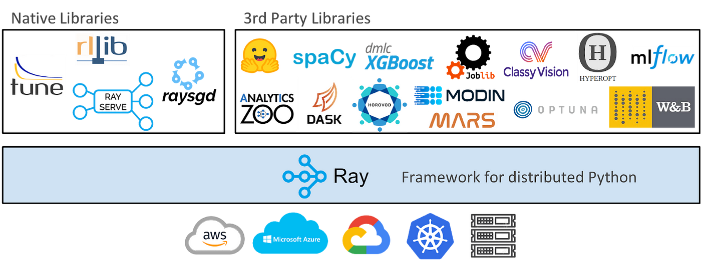
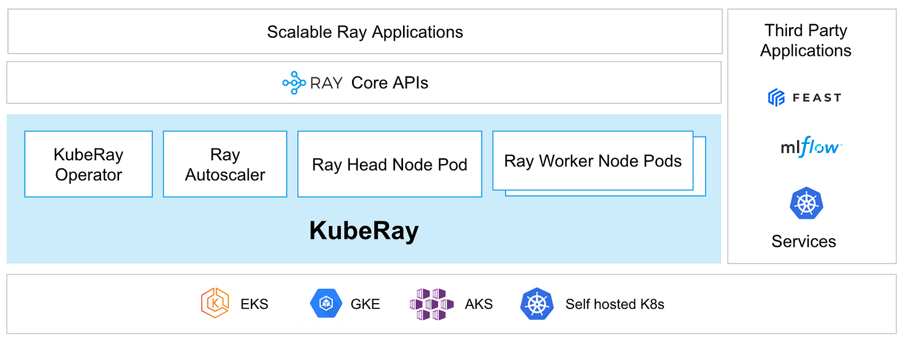
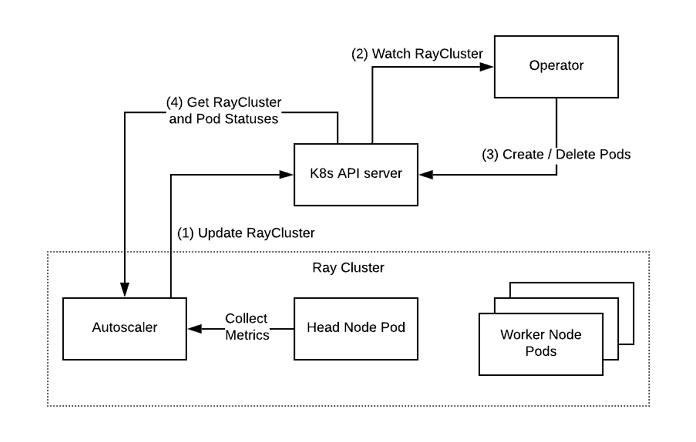

> **Using Kubernetes to deploy and scale AI/ML models efficiently 📈**

## 📚 Introduction

Welcome back to our 'Data on Kubernetes' series. In this fifth part, we're focusing on AI and machine learning (ML). We'll discuss how Kubernetes is transforming the use of [AI/ML](https://ai.engineering.columbia.edu/ai-vs-machine-learning/) software.

The more we rely on [AI/ML](https://ai.engineering.columbia.edu/ai-vs-machine-learning/), the more complex it becomes to manage these systems. Kubernetes offers a helping hand with features that allow AI/ML software to automatically adjust their size, update without stopping, and repair themselves. This keeps AI/ML systems always on and working smoothly.

In this blog, we'll discover the tools [Ray](https://www.ray.io/) and [PyTorch](https://pytorch.org/), and their integration with Kubernetes to simplify the process, all within the AWS cloud ecosystem.

## 🚀 Kubernetes: Making AI/ML Easier

When we use AI and ML, things can get pretty tricky. It's exciting but can also be a bit overwhelming with all the pieces you need to keep track of and there's a lot to manage. That's exactly why Kubernetes comes in — it's like having a smart assistant that helps keep everything in order.

Kubernetes is great because it can fix itself. If something goes wrong with an AI program, Kubernetes doesn't wait around; it jumps right in to fix the problem.

This means if an AI program stops working, Kubernetes doesn't just stand by. It jumps into action, fixing things up or starting fresh so that there's no downtime. This means you can rely on your AI and ML to work non-stop.

But that's not all. Kubernetes is also smart about using resources. Sometimes AI needs more resources to work on big tasks, and sometimes it needs less.

Kubernetes is smart enough to adjust on the fly, giving them more resources when they're busy and scaling back when they're not. This way, you're not wasting any energy or money, and everything runs super efficiently.

### 🛠️ Ray and Kubernetes

When working with AI and ML tasks, we require tools that can manage extensive workloads efficiently.

[Ray](https://www.ray.io/) is such a tool, designed for [Python](https://www.python.org/), a widely-used programming language. It simplifies the execution of large-scale projects on multiple computers simultaneously.

Ray serves as a comprehensive toolkit for deep learning, an AI branch that equips computers with cognitive abilities.

[Developed by experts at UC Berkeley](https://ray-project.github.io/q4-2021-docs-hackathon/0.4/ray-overview/what-and-why-ray/), Ray's objective is to streamline large computing projects. It consists of Ray Core, the primary component for distributing tasks across computers, and Ray Ecosystem, a suite of specialized tools for various purposes, including project optimization and decision-making algorithms.

While similar to Dask, a tool for executing Python code concurrently in different locations and processing multiple data-related tasks simultaneously, Ray stands out.

It doesn't merely replicate existing tools like NumPy and Pandas; it's engineered to be versatile, catering to a wide array of projects beyond data science. Its adaptability has led major projects such as spaCy, Hugging Face, and XGBoost to incorporate Ray, enhancing their efficiency and intelligence.


<div class="image-title"><a href="https://medium.com/pytorch/getting-started-with-distributed-machine-learning-with-pytorch-and-ray-fd83c98fdead">Source</a></div>

The diagram above shows that at a high level, the Ray ecosystem consists of:

- The core Ray system
- Scalable libraries for machine learning (both native and third party)
- Tools for [launching clusters on any cluster or cloud provider](https://medium.com/distributed-computing-with-ray/how-to-scale-python-on-every-major-cloud-provider-12b3bde01208)

KubeRay amplifies Ray's capabilities by integrating it with Kubernetes, a platform that orchestrates numerous computers working in unison. This integration combines Ray's user-friendly Python interface with Kubernetes' robust and dependable framework.

The result is a great system capable of developing, operating, and maintaining large-scale projects easily. It's akin to an advanced system that scales with your requirements, self-repairs, and autonomously performs maintenance and updates.

The use of Kubernetes is advantageous for Ray. It acts as a command center for computers, ensuring smooth operation and task management. Kubernetes excels with both tools, adeptly managing numerous tasks without confusion.


<div class="image-title"><a href="https://docs.ray.io/en/latest/cluster/kubernetes/index.html">Source</a></div>

### 🔥 PyTorch and Kubernetes

[PyTorch](https://pytorch.org/) is an open-source machine learning library for Python, widely used for applications such as natural language processing, computer vision, and deep learning.

What makes PyTorch special is its ease of use, flexibility, and dynamic computational graph, which allows for quick prototyping and experimentation. Researchers like it because it's designed to work well with Python and makes deep learning straightforward.

#### PyTorch and TensorFlow

[PyTorch](https://pytorch.org/) and [TensorFlow](https://www.tensorflow.org/) are both strong in deep learning, but they're good at different things. TensorFlow, made by Google, is great for getting big machine learning models ready for use and for training them on many computers at once.

PyTorch is more about being easy to work with and changing things as you go, which is really helpful when you're still figuring things out.

#### PyTorch with Ray and KubeRay

When PyTorch works together with Ray or KubeRay, it gets even better at deep learning jobs. Ray and KubeRay help spread out the work over many computers, making things faster and more reliable.

This integration facilitates the distribution of computational tasks across multiple nodes, enabling faster processing times and resilience against individual node failures.

They also make better use of cloud services, saving money. This combination means developers can spend more time being creative with their machine learning models, while the tough tech stuff is taken care of.

#### PyTorch meets Kubernetes

By using PyTorch with Kubernetes (also known as k8s), you get all the perks of Kubernetes' smart way of managing containers. Kubernetes helps set up, grow, and manage containers over lots of computers.

This means PyTorch applications can handle big, complicated jobs better, grow more easily, and keep running smoothly. Developers can then put more energy into making their models, without worrying too much about the tech behind it.

## 🛠️ Hands-on: Ray on Kubernetes

Our setup consists of a Kubernetes cluster in Amazon EKS, which hosts our AI applications. The recommended method for installing Ray onto a Kubernetes cluster is through KubeRay, a Kubernetes Operator. The KubeRay Operator allows you to create and manage Ray clusters in a Kubernetes-native way by defining clusters as a custom resource called a RayCluster.

The installation of KubeRay Operator involves deploying the operator and the CRDs for RayCluster, RayJob, and RayService as documented [here](https://docs.ray.io/en/latest/cluster/kubernetes/index.html).

This RayCluster resource describes the desired state of a Ray cluster. The KubeRay Operator manages the cluster lifecycle, autoscaling, and monitoring functions.

Hence, we use the KubeRay Operator for our Ray cluster installation.


<div class="image-title"><a href="https://medium.com/sage-ai/demystifying-the-process-of-building-a-ray-cluster-110c67914a99">Source</a></div>

KubeRay Operator managing the Ray Cluster lifecycle. Now let us deploy the infrastructure. Start by cloning the repo and change the working directory.

```shell
git clone https://github.com/seifrajhi/data-on-eks
cd data-on-eks/ai-ml/ray/terraform
```

Next, we can use the shell script `install.sh` to run the `terraform init` and `apply` commands.

Update `variables.tf` to change the region. Also, we can update any other input variables or make any other changes to the terraform template.

```shell
./install.sh
```

And now, we can run the PyTorch benchmark.

We deploy a Ray Cluster with its own configuration for Karpenter workers. Different jobs can have different requirements for Ray Cluster such as a different version of Ray libraries or EC2 instance configuration such as making use of Spot market or GPU instances.

To deploy the Ray cluster run below commands:

```shell
cd examples/pytorch
terraform init
terraform plan
terraform apply -auto-approve
```

Once running, we can forward the port for the server:

```shell
kubectl port-forward service/pytorch-kuberay-head-svc -n pytorch 8266:8265
```

We can then submit the job for PyTorch benchmark workload:

```shell
python job/pytorch_submit.py
```

You can open [http://localhost:8266](http://localhost:8266) to monitor the progress of the PyTorch benchmark.

The `pytorch_submit.py` script is a benchmarking for evaluating the performance of training and tuning a PyTorch model on a distributed system using Ray.

It measures the time taken to train a model and to find the best hyperparameters through tuning, providing insights into the efficiency of distributed machine learning workflows.

## 🔚 Key Takeaways

Kubernetes makes working with AI/ML simpler. It scales AI/ML models easily and keeps them running smoothly. With Kubernetes, Ray, and PyTorch work better in the cloud, making AI/ML systems more reliable and easier to manage.

<br>
<br>

> 💡 Thank you for Reading !! 🙌🏻😁📃, see you in the next blog.🤘  **_Until next time 🎉_**


🚀 Thank you for sticking up till the end. If you have any questions/feedback regarding this blog feel free to connect with me:

**♻️ LinkedIn:** https://www.linkedin.com/in/rajhi-saif/

**♻️ X/Twitter:** https://x.com/rajhisaifeddine

**The end ✌🏻**

<h1 align="center">🔰 Keep Learning !! Keep Sharing !! 🔰</h1>

**📻🧡 References:**

- https://docs.ray.io/en/latest/cluster/kubernetes/index.html
- https://awslabs.github.io/data-on-eks/docs/blueprints/ai-ml/
- https://aws.amazon.com/blogs/opensource/scaling-ai-and-machine-learning-workloads-with-ray-on-aws
- https://cloud.google.com/blog/products/containers-kubernetes/use-ray-on-kubernetes-with-kuberay

**📅 Stay updated**

Subscribe to our newsletter for more insights on AWS cloud computing and containers.
