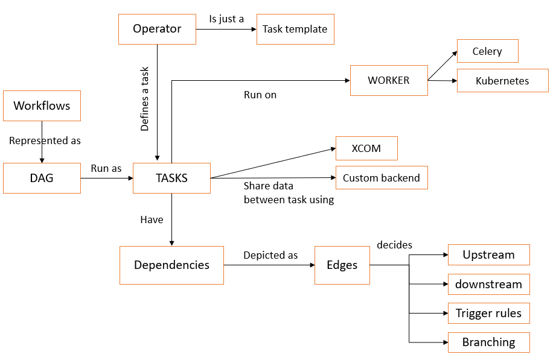

> **Automate and orchestrate data workflows in Kubernetes with Amazon managed Apache Airflow**

## 🔷 Introduction

Welcome back to this blog series on Data on Kubernetes! In this third part, we're going to focus on how to manage workflows effectively using job schedulers and orchestrators. We'll be looking at tools specifically designed for batch workloads, scientific computing, machine learning workflows, and parallel tasks.

One of the tools we'll explore is [Amazon Managed Workflows for Apache Airflow MWAA](https://docs.aws.amazon.com/mwaa/latest/userguide/what-is-mwaa.html), a great service that helps manage data pipelines, machine learning workflows, and batch processing.

## Deep Dive into Job Schedulers and Workflow Orchestrators

Nowadays, in the modern [data-driven IT world](https://www.forbes.com/sites/googlecloud/2020/05/20/how-the-world-became-data-driven-and-whats-next/), the management and automation of data workflows are becoming more and more important. This is where Job Schedulers and Batch-Oriented Workflow Orchestrators come into play.

These platforms are designed to manage and automate various data processes in a systematic and efficient manner. Consider the example of an ETL (Extract, Transform, Load) process, a common scenario in data workflows. In this process, data is extracted from various sources, transformed into a suitable format, and then loaded into a data warehouse for further analysis. Managing this process manually can be challenging and prone to errors.

This is where Job Schedulers and Workflow Orchestrators prove their worth. They automate these tasks, ensuring that the ETL process runs smoothly and efficiently. Furthermore, they enhance the portability and scalability of our workflows, which is important when dealing with large volumes of data or complex machine learning models.

Apart from ETL processes, there are other scenarios where Job Schedulers and Workflow Orchestrators can be beneficial. For instance, in machine learning pipelines, where data preprocessing, model training, model evaluation, and model deployment need to be executed in a specific order. Another example could be data synchronization tasks between different systems, which require precise timing and error handling.

There are several tools available that can help manage these workflows. [Apache Airflow](https://airflow.apache.org/) is a platform designed to programmatically author, schedule, and monitor workflows. [Kubeflow](https://www.kubeflow.org/) is a Kubernetes-native platform for developing, orchestrating, deploying, and running scalable and portable machine learning workloads. [Argo Workflows](https://argoproj.github.io/workflows/) is an open-source container-native workflow engine for orchestrating parallel jobs on Kubernetes.

In this blog, we will focus specifically on [AWS Managed Workflows for Apache Airflow MWAA](https://docs.aws.amazon.com/mwaa/latest/userguide/what-is-mwaa.html). This service makes it easier to set up and operate end-to-end data pipelines in the cloud at scale. Airflow is an open-source workflow management platform. Workflows are defined with [DAGs](https://en.wikipedia.org/wiki/Directed_acyclic_graph), Configuration as code written in Python.


<div class="image-title"><a href="https://medium.com/nerd-for-tech/airflow-mwaa-automating-etl-for-a-data-warehouse-f5e50d14713c">source</a></div>

Apache Airflow at a high level has the following components talking to each other:


<div class="image-title"><a href="https://aws.amazon.com/blogs/machine-learning/build-end-to-end-machine-learning-workflows-with-amazon-sagemaker-and-apache-airflow/">source</a></div>

## Main Concepts of Apache Airflow

Before starting this demo and the operation of MWAA, it's important to refresh briefly some key Airflow concepts. For more deep dive explanations, please refer to [Apache Airflow official documentation](https://airflow.apache.org/docs/apache-airflow/stable/index.html).

- 🌐 **Webserver**: This provides a control interface for users and maintainers. The Airflow UI is a Flask + Gunicorn setup that lists DAGs, their run history, schedule, and pause/start options. It's a central place from where we can manage the Airflow pipelines and also handles the APIs.
- 🗄️ **Metadata Database**: Airflow uses a database supported by the SQLAlchemy Library, such as PostgreSQL or MySQL. This database powers the UI and acts as the backend for the worker and scheduler. It stores configurations, such as variables, connections, user information, roles, and policies. It also stores DAG-related metadata such as schedule intervals, tasks, statistics from various runs, etc.
- 🕰️ **Scheduler**: This is a daemon, built using the Python daemon library. It schedules & delegates tasks on the worker node via the executor. It also takes care of other housekeeping tasks like concurrency checks, dependency checks, callbacks, retries, etc. The three main components of the scheduler are:
  
    - SchedulerJob
    - DagFileProcessor
    - Executor

- 👷 **Worker**: These are the workhorses of Airflow. They are the actual nodes where tasks are executed.
- 🔧 **Executor**: Executors are the "workstations" for "tasks". The Executor acts as a middleman to handle resource allocation and distribute task completion. Executors run inside the scheduler. There are many options available in Airflow for executors, including:
  - Sequential Executor: Default executor, runs one task at a time.
  - Debug Executor: A debug tool, runs tasks by queuing them.
  - Local Executor: Runs multiple tasks concurrently on a single machine.
  - Dask Executor: Executes tasks concurrently across multiple machines.
  - Celery Executor: Scales out the number of workers in parallel.
  - Kubernetes Executor: Runs each task in its own Kubernetes pod.
- 📨 **Message Broker (optional)**: A message broker is needed in distributed setups, where the CeleryExecutor is used to manage communication between the Scheduler and the Workers. The message broker, such as RabbitMQ or Redis, helps to pass task information from the Scheduler to the Workers. For MWAA, the Celery Executor is used.

### Sequence of Actions

1. The scheduler initiates DAGs based on triggers, which could be scheduled or external.
2. The scheduler loads the tasks/steps within the DAG and determines the dependencies.
3. Tasks that are ready to run are placed in the queue by the scheduler.
4. Workers retrieve these tasks from the queue and execute them.
5. Upon completion of a task, a worker updates the task's status.
6. The overall status of the DAG is determined based on the statuses of the individual tasks.


### 🔥 More Airflow Terminology

- **Operators**: They are the fundamental elements of a DAG. They outline the actual work that the DAG will carry out. The nature of the task is determined by the operators. They are represented by a Python class that serves as a task type template. They are idempotent.
- 
  - BashOperator - Executes a bash command.
  - PythonOperator - Runs a Python function.
  - SparkSubmitOperator - Executes spark-submit.
- **Task**: A task is an instance of an operator or sensor.
- **Plugins**: They offer a convenient way to write, share, and activate custom runtime behavior.

```shell
__init__.py
                |-- airflow_plugin.py
hooks/
                |-- __init__.py
                |-- airflow_hook.py
operators/
                |-- __init__.py
                |-- airflow_operator.py
sensors/
                |-- __init__.py
                |-- airflow_sensor.py
```

> Note: In MWAA, we don't have direct access to the runtime where tasks are being processed. We can use `requirements.txt` to install available Python modules. For unavailable or custom modules, we can create a zip of the packages locally, upload it to S3, and use it as needed.

- **Hooks**: Provide a way to connect your DAG to your environment. They serve as an interface for interacting with external systems. For example, we can establish an S3 connection and use S3 Hooks to retrieve the connection information and perform our task. There are various hooks available (HTTP, Hive, Slack, MySQL), and more are continuously being added by the community.
- **Sensors**: They are special operators used to monitor (or poll) long-running tasks, files, database rows, S3 keys, other DAGs/tasks, etc.
- **XComs**: XComs (cross-communication) are designed to facilitate communication between tasks. We use `xcom_push` and `xcom_pull` to store and retrieve variables, respectively.

Tasks transition from one state to another during the execution of a DAG. Initially, the Airflow scheduler determines if it's time for a task to run and whether all other dependencies for the task have been met. At this point, the task enters the scheduled state. When a task is assigned to an executor, it enters the queued state. When the executor picks up the task and a worker begins executing the task, the task enters the **running** state.


## 🚀 Demo: MWAA Airflow DAG on EKS

A Directed Acyclic Graph (DAG) is a graphical representation of a workflow in Airflow. It organizes tasks in a manner that clearly illustrates the relationships and dependencies between each task. The context for executing tasks is contained within the DAGs. In MWAA, DAGs are stored in Amazon S3. When a new DAG file is introduced, it takes approximately one minute for Amazon MWAA to begin utilizing the new file.

Amazon Managed Workflows for Apache Airflow MWAA is a managed service that simplifies the orchestration of Apache Airflow, making it more straightforward to establish and manage comprehensive data pipelines in the cloud at a large scale. With Managed Workflows, you have the ability to employ Airflow and Python to construct workflows, without the need to handle the underlying infrastructure required for scalability, availability, and security.

### Provision the Infrastructure

```bash
git clone https://github.com/seifrajhi/data-on-eks.git
cd data-on-eks/schedulers/terraform/managed-airflow-mwaa
chmod +x install.sh
./install.sh
```

The following components are provisioned in your environment:

- A VPC with 3 Private Subnets and 3 Public Subnets.
- Internet gateway for Public Subnets and NAT Gateway for Private Subnets.
- EKS Cluster with one managed node group.
- K8S metrics server and cluster autoscaler.
- A MWAA environment in version 2.2.2.
- A S3 bucket with DAG code.

After a few minutes, the script will finish and you can run the below commands:

```bash
aws eks --region eu-west-1 update-kubeconfig --name managed-airflow-mwaa
kubectl get namespaces
```

You should see output similar to the following:

```shell
default           Active    8m
emr-mwaa          Active    4m
kube-node-lease   Active    9m
kube-public       Active    9m
kube-system       Active    9m
mwaa              Active    3m
```

### Log into Apache Airflow UI

1. Open the Environments page on the Amazon MWAA console.
2. Choose an environment.
3. Under the Details section, click the link for the Airflow UI.

### Trigger the DAG Workflow to Execute Job in EKS

1. In the Airflow UI, enable the example DAG `kubernetes_pod_example` and then trigger it.


### Verify that the Pod was Executed Successfully

After it runs and completes successfully, use the following command to verify the pod:

```bash
kubectl get pods -n mwaa
```

You should see output similar to the following:

```shell
NAME                                             READY   STATUS      RESTARTS   AGE
mwaa-pod-test.4bed823d645844bc8e6899fd858f119d   0/1     Completed   0          25s
```

## 🗝️ Key Takeaways

Automating and organizing data tasks is very important for managing work and resources well in Kubernetes. This is where Job Schedulers are useful. They run jobs that are done either once or many times, making sure tasks are finished when needed. On the other hand, Batch-Oriented Workflow Orchestrators give more control. They allow for complex job scheduling, including the order of tasks and their dependencies.

**Stay tuned for next blogs in this series 🎉**

**References:**

- https://docs.aws.amazon.com/mwaa/latest/userguide/mwaa-eks-example.html
- https://medium.com/apache-airflow/what-we-learned-after-running-airflow-on-kubernetes-for-2-years-0537b157acfd
- https://medium.com/@binayalenka/airflow-architecture-667f1cc613e8
- https://awslabs.github.io/data-on-eks/docs/blueprints/job-schedulers/aws-managed-airflow

**Thank You 🖤**

<br>

**_Until next time, つづく 🎉_**

> 💡 Thank you for Reading !! 🙌🏻😁📃, see you in the next blog.🤘  **_Until next time 🎉_**

🚀 Thank you for sticking up till the end. If you have any questions/feedback regarding this blog feel free to connect with me:

**♻️ LinkedIn:** https://www.linkedin.com/in/rajhi-saif/

**♻️ X/Twitter:** https://x.com/rajhisaifeddine

**The end ✌🏻**

<h1 align="center">🔰 Keep Learning !! Keep Sharing !! 🔰</h1>

**📅 Stay updated**

Subscribe to our newsletter for more insights on AWS cloud computing and containers.
