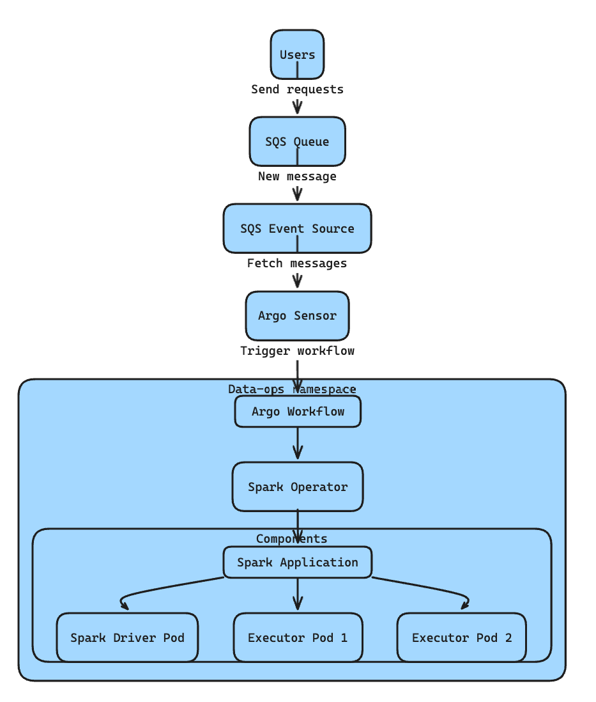
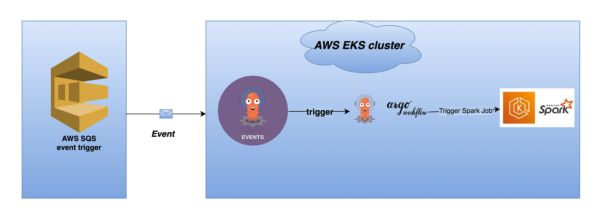
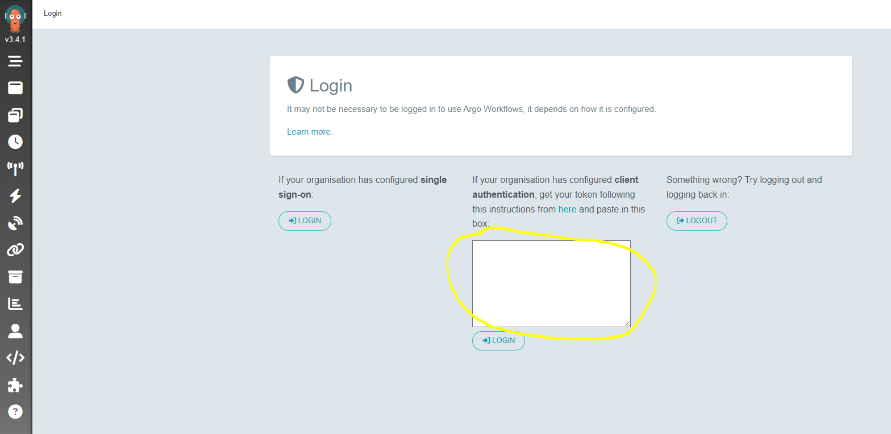
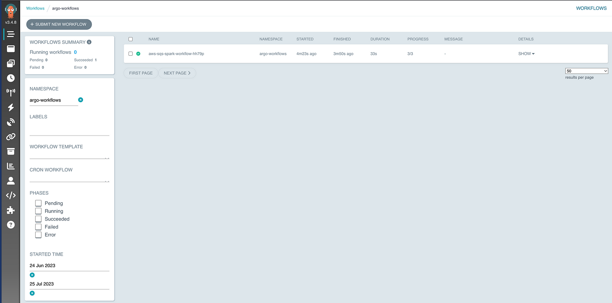
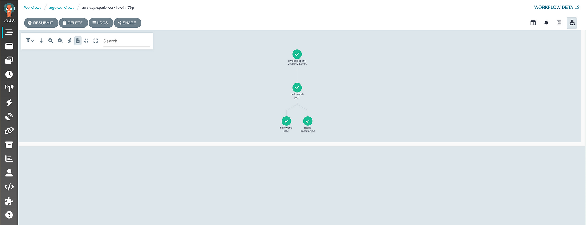

> **Container-native workflow engine for Kubernetes 🔮**

## 🐙 Introduction

Welcome to the fourth part of the "Data on Kubernetes" series!

In this part, we'll explore [Argo Workflows](https://argo-workflows.readthedocs.io/en/latest/) - an open-source, container-native workflow engine designed specifically for orchestrating parallel jobs on Kubernetes.

Argo Workflows seamlessly integrates with Kubernetes services like volumes, secrets, and RBAC, making it a powerful tool for managing complex data workflows.

## Introduction to Argo Workflows

In our [previous blog post](https://seifrajhi.github.io/blog/data-on-kubernetes-airflow-on-aws-3/), we explored the world of workflow orchestrators, with a specific focus on Apache Airflow.

Now, let's check another tool: Argo Workflows.

As an open-source, container-native workflow engine, Argo Workflows is purpose-built for orchestrating parallel jobs within Kubernetes environments.

Let's take a closer look at why Argo Workflows stands out:

### 1. What is Argo Workflows? 🤔

Argo Workflows empowers you to define workflows where each step corresponds to a container. This flexibility allows for the creation of complex data processing pipelines. Think of it as assembling a series of building blocks, where each block represents a specific task or operation.

Additionally, Argo Workflows is implemented as a Kubernetes Custom Resource Definition (CRD), seamlessly integrating into the Kubernetes ecosystem without disrupting the existing setup.

### 2. Main Features and Benefits

**Container-Native Approach:**

Argo Workflows fully embraces the containerization paradigm. Each step in your workflow runs within its own container, ensuring consistency and compatibility across different tasks. Whether you're dealing with data transformations, model training, or any other computational task, Argo Workflows has you covered.

**DAG Modeling (Directed Acyclic Graphs):**

Imagine your workflow as a flowchart with interconnected boxes. Argo Workflows allows you to model multi-step workflows using [directed acyclic graphs (DAGs)](https://en.wikipedia.org/wiki/Directed_acyclic_graph). These graphs capture dependencies between tasks, ensuring that steps execute in the correct order. It's like choreographing a dance where each move follows a logical sequence.

**Efficient Compute Handling:**

Argo Workflows shines when it comes to compute-intensive workloads. Whether you're crunching numbers, analyzing data, or training machine learning models, Argo efficiently manages the computational resources needed for each step.

### 3. Integration with the Kubernetes Ecosystem

Argo Workflows seamlessly integrates with other Kubernetes services:

- **Volumes:** Need to read or write data? Argo Workflows plays well with [Kubernetes volumes](https://kubernetes.io/docs/concepts/storage/volumes/), allowing you to handle data storage efficiently.
- **Secrets:** Security matters! Argo Workflows integrates with [Kubernetes secrets](https://kubernetes.io/docs/concepts/configuration/secret/), ensuring that sensitive information remains protected.
- **RBAC (Role-Based Access Control):** Argo Workflows respects your access policies. It works harmoniously with [Kubernetes RBAC](https://kubernetes.io/docs/reference/access-authn-authz/rbac/), allowing you to control who can orchestrate workflows and who can't.

### 4. Why Choose Argo Workflows

Argo Workflows stands out for several reasons:

- **Kubernetes Integration:** Argo Workflows seamlessly integrates with Kubernetes, simplifying usage and deployment.
- **Scalability and Complexity Handling:** It efficiently manages complex workflows, even those with thousands of steps.
- **Flexible Workflow Patterns:** Argo supports various workflow structures, adapting to your needs.
- **Active Open Source Community:** Benefit from a thriving community that actively contributes to Argo's development.

##  Exploring Argo Workflows on Amazon EKS

In this section, we'll dive into creating and deploying a data processing platform on [Amazon Elastic Kubernetes Service (Amazon EKS)](https://aws.amazon.com/eks/).

The solution includes essential Kubernetes add-ons: [Argo Workflows](https://argo-workflows.readthedocs.io/en/latest/), [Argo Events](https://argoproj.github.io/argo-events/), [Spark Operator](https://github.com/kubeflow/spark-operator) for managing Spark jobs, [Fluent Bit](https://fluentbit.io/) for logging, and [Prometheus](https://prometheus.io/) for metrics.

### 🛠️ Setup Overview

**Cluster Setup:** We'll set up an Amazon EKS cluster with a managed node group. We'll install Argo Workflows and Argo Events in their own dedicated namespaces (`argo-workflows` and `argo-events`).

**Event-Driven Workflow:** An [Amazon SQS queue](https://docs.aws.amazon.com/AWSSimpleQueueService/latest/SQSDeveloperGuide/welcome.html) will receive user requests. In the Argo Events namespace, an SQS event source object will fetch messages from this external queue. When a new message arrives, a sensor in Argo Workflow will trigger the specified workflow.

**Spark Job Execution:** The triggered workflow will create a Spark application using Spark Operator in the `data-ops` namespace. This application consists of one Spark driver pod and two executor pods.

The diagram illustrates how Argo Events sources drive the execution of Spark jobs.



> **Prerequisites:** Ensure you have [AWS CLI](https://docs.aws.amazon.com/cli/latest/userguide/install-cliv2.html), [kubectl](https://kubernetes.io/docs/tasks/tools/), [Terraform](https://learn.hashicorp.com/tutorials/terraform/install-cli), and [Argo Workflow CLI](https://github.com/argoproj/argo-workflows/releases/latest) installed.

The diagram below shows the detailed technical design that will be set up in this demo:



### 🚀 Implementation Steps

1. **Clone the Repository:**

    ```shell
    git clone https://github.com/awslabs/data-on-eks.git
    cd data-on-eks/schedulers/terraform/argo-workflow
    ```

2. **Initialize and Apply Terraform:**

    ```shell
    terraform init
    terraform apply -var region=eu-west-1 --auto-approve
    ```

    This will create:
    - **EKS and Networking Infrastructure:**
        - VPC with Private and Public Subnets.
        - Internet Gateway (Public) and NAT Gateway (Private).
        - EKS Cluster Control Plane with managed node group.
    - **EKS Managed Add-ons:**
        - VPC_CNI, CoreDNS, Kube_Proxy, EBS_CSI_Driver.
    - **Additional Kubernetes Components:**
        - Argo Workflows, Argo Events, AWS for FluentBit, Karpenter.
        - Metrics Server, CoreDNS Autoscaler, Cluster Autoscaler.
        - Kube Prometheus Stack, Spark Operator.
        - Roles for Argo Workflows and Argo Events.

3. **Create the SQS Queue:**

    ```shell
    queue_url=$(aws sqs create-queue --queue-name demo-argo-workflows --region eu-west-1 --output text)
    ```

4. **Retrieve the Queue ARN:**

    ```shell
    sqs_queue_arn=$(aws sqs get-queue-attributes --queue-url $queue_url --attribute-names QueueArn --region eu-west-1 --query "Attributes.QueueArn" --output text)
    ```

    Update the SQS access policy:

    ```shell
    template=`cat argo-events-manifests/sqs-accesspolicy.json | sed -e "s|<sqs_queue_arn>|$sqs_queue_arn|g;s|<your_event_irsa_arn>|$your_event_irsa_arn|g"`
    aws sqs set-queue-attributes --queue-url $queue_url --attributes $template --region eu-west-1
    ```

5. **Access Argo Workflows Web UI:**

    Extract the bearer token:

    ```shell
    argo auth token
    ```

    Get the load balancer URL:

    ```shell
    kubectl -n argo-workflows get service argo-workflows-server -o jsonpath="{.status.loadBalancer.ingress[*].hostname}{'\n'}"
    ```

    Open your browser, enter the URL, and paste the token (including `Bearer`) into the login prompt.

    

6. **Create a Spark Job within an Argo Workflow:**

    Install the EventBus:

    ```shell
    kubectl apply -f argo-events-manifests/eventbus.yaml
    ```

    Set up Amazon SQS as an event source:

    ```shell
    queue_name=demo-argo-workflows
    region_sqs=eu-west-1

    cat argo-events-manifests/eventsource-sqs.yaml | sed "s/<region_sqs>/$region_sqs/g;s/<queue_name>/$queue_name/g" | kubectl apply -f -
    ```

    Deploy the sensor:

    ```shell
    kubectl apply -f argo-events-manifests/sensor-rbac.yaml
    ```

    Update `taxi-trip.sh` with your S3 bucket and region:

    ```shell
    if [ $# -ne 2 ]; then
      echo "Usage: $0 <s3_bucket> <region>"
      exit 1
    fi

    s3_bucket="$1"
    region="$2"

    INPUT_DATA_S3_PATH="s3://${s3_bucket}/taxi-trip/input/"

    mkdir input

    aws s3 cp pyspark-taxi-trip.py s3://${s3_bucket}/taxi-trip/scripts/ --region ${region}

    wget https://d37ci6vzurychx.cloudfront.net/trip-data/yellow_tripdata_2022-01.parquet -O "input/yellow_tripdata_2022-0.parquet"

    max=5
    for (( i=1; i <= $max; ++i ))
    do
       cp -rf "input/yellow_tripdata_2022-0.parquet" "input/yellow_tripdata_2022-${i}.parquet"
    done

    aws s3 sync "input/" ${INPUT_DATA_S3_PATH}

    rm -rf input
    ```

    Execute the script:

    ```shell
    ./taxi-trip.sh
    ```

    Apply the sensor configuration:

    ```shell
    kubectl apply -f sensor-sqs-sparkjobs.yaml
    ```

7. **Test the Setup:**

    Send a message from SQS:

    ```shell
    aws sqs send-message --queue-url $queue_url --message-body '{"message": "hello data on k8s"}' --region $region_sqs
    ```

    Check the workflow status:

    ```shell
    kubectl get workflows -n argo-workflows
    ```

    You can also see the SQS workflow status in the web UI:

    

    

### 📌 Key Takeaways

In this post, we explored how Argo Workflows and Argo Events can help us better manage and scale Spark applications on Amazon EKS. These tools have several advantages, such as allowing us to create and automate complex pipelines using Argo Workflows, and triggering actions based on events using Argo Events.

**Stay tuned for next blogs in this series🎉**

**References:**

- https://spacelift.io/blog/argo-workflows
- https://codefresh.io/learn/argo-workflows
- https://codefresh.io/learn/argo-workflows/learn-argo-workflows-with-8-simple-examples
- https://argo-workflows.readthedocs.io/en/latest
- https://awslabs.github.io/data-on-eks/docs/blueprints/job-schedulers/argo-workflows-eks
- https://aws.amazon.com/blogs/containers/dynamic-spark-scaling-on-amazon-eks-with-argo-workflows-and-events
- https://mkdev.me/posts/argo-ecosystem-argo-cd-argo-workflows-argo-events-argo-rollouts-argo-everything
- https://dok.community/blog/scheduled-scaling-with-dask-and-argo-workflows/
- https://www.youtube.com/watch?v=FBRMURQYbgw

**Thank You 🖤**

<br>

**_Until next time, つづく 🎉_**

> 💡 Thank you for Reading !! 🙌🏻😁📃, see you in the next blog.🤘  **_Until next time 🎉_**

🚀 Thank you for sticking up till the end. If you have any questions/feedback regarding this blog feel free to connect with me:

**♻️ LinkedIn:** https://www.linkedin.com/in/rajhi-saif/

**♻️ X/Twitter:** https://x.com/rajhisaifeddine

**The end ✌🏻**

<h1 align="center">🔰 Keep Learning !! Keep Sharing !! 🔰</h1>

**📅 Stay updated**

Subscribe to our newsletter for more insights on AWS cloud computing and containers.
