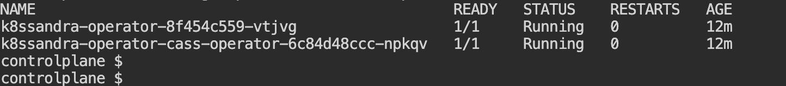

> **K8ssandra: simple Cassandra management on Kubernetes 📈**

## 📚 Introduction

In this part of my data on Kubernetes series, I will look at how [K8ssandra](https://k8ssandra.io/) makes it easy to use [Apache Cassandra](https://cassandra.apache.org/_/index.html) on Kubernetes.

[K8ssandra](https://k8ssandra.io/) is a tool that helps you set up and manage Cassandra in a Kubernetes environment. It includes everything you need, like automated operations, monitoring, and backup solutions. This makes it simpler to handle Cassandra clusters.

## 📖 Apache Cassandra Overview

Apache Cassandra is a highly scalable, distributed NoSQL database designed to handle large amounts of data across many servers without any single point of failure. It was originally developed at Facebook to power their inbox search feature and later became an open-source project under the Apache Software Foundation.

### Key Features and Benefits

- **Scalability**: Cassandra is designed to scale horizontally by adding more nodes to the cluster. This allows it to handle more data and more requests without any downtime.
- **High Availability**: With its peer-to-peer architecture, Cassandra ensures that there is no single point of failure. Data is replicated across multiple nodes, ensuring that it remains available even if some nodes fail.
- **Fault Tolerance**: Cassandra's replication strategy ensures that data is copied to multiple nodes. If one node goes down, another node can take over, ensuring continuous availability.
- **Flexible Data Model**: Cassandra uses a wide-column store model, which allows for dynamic and flexible schema design. This is particularly useful for applications that require high write throughput.
- **Tunable Consistency**: Cassandra offers tunable consistency levels, allowing you to balance between consistency and availability based on your application's needs.
- **High Performance**: Designed for high write and read throughput, Cassandra can handle large volumes of data with low latency.


### Use Cases

- **Time-Series Data**: Ideal for applications that need to store and query time-series data, such as IoT sensors and log data.
- **Real-Time Analytics**: Used in applications that require real-time data processing and analytics, such as recommendation engines and fraud detection.
- **Messaging Systems**: Suitable for high-throughput messaging systems where low latency is crucial.
- **E-commerce**: Powers e-commerce platforms that need to handle large volumes of transactions and user data.
- **Social Media**: Supports social media applications that require high availability and scalability to manage user interactions and content.

### Components

- **Nodes**: The basic unit of storage in Cassandra. Each node stores a part of the data.
- **Clusters**: A collection of nodes that work together. Data is distributed across the nodes in a cluster.
- **Keyspaces**: The top-level namespace in Cassandra, similar to a database in relational databases.
- **Tables**: Within keyspaces, tables store data in a structured format.
- **Commit Log**: A log of all write operations, used for crash recovery.
- **SSTables**: Immutable data files that store data on disk.
- **Cassandra Query Language (CQL)**: A SQL-like language used to interact with Cassandra.


### Why Choose Cassandra?

- **Scalability**: Cassandra's ability to scale horizontally without downtime makes it ideal for growing applications.
- **High Availability**: Its peer-to-peer architecture ensures no single point of failure, providing continuous availability.
- **Performance**: Optimized for high write and read throughput, making it suitable for applications with heavy data loads.
- **Flexibility**: The wide-column store model allows for flexible schema design, accommodating various data types and structures.
- **Community and Support**: As an open-source project, Cassandra has a large and active community, providing extensive resources and support.

> Some alternatives to Apache Cassandra are [ScyllaDB](https://www.scylladb.com/), which is a high-performance, low-latency NoSQL database designed as a drop-in replacement for Cassandra, and [Amazon Keyspaces](https://aws.amazon.com/keyspaces/), which is a scalable, highly available, and managed Apache Cassandra–compatible database service.

## 🌟 K8ssandra Overview

K8ssandra is an open-source distribution of Apache Cassandra that is optimized for Kubernetes. It includes everything you need to run Cassandra in a Kubernetes environment, such as automated operations, monitoring, and backup solutions. K8ssandra simplifies the deployment and management of Cassandra clusters on Kubernetes, making it easier to achieve scalability and high availability.


### 🛠️ Key Features and Benefits

- **Kubernetes Native**: K8ssandra is designed to run seamlessly on Kubernetes, leveraging Kubernetes' orchestration capabilities to manage Cassandra clusters.
- **Automated Operations**: K8ssandra includes tools for automated deployment, scaling, and maintenance of Cassandra clusters, reducing the operational overhead.
- **Monitoring and Management**: Integrated with tools like [Prometheus](https://prometheus.io/) and [Grafana](https://grafana.com/), K8ssandra provides robust monitoring and management capabilities, allowing you to keep an eye on your Cassandra clusters' health and performance.
- **Backup and Restore**: K8ssandra includes backup and restore solutions, ensuring that your data is safe and can be recovered in case of failures.
- **Helm Charts**: K8ssandra uses [Helm charts](https://helm.sh/) for easy installation and configuration, making it simple to deploy Cassandra clusters on Kubernetes.
- **Community Support**: As an open-source project, K8ssandra benefits from a vibrant community that contributes to its development and provides support.

## 🚀 Installing K8ssandra on EKS

K8ssandra Operator may be deployed in one of two modes:

- **Control-Plane mode**: The default method of installation. A Control-Plane instance of K8ssandra Operator watches for the creation and changes to K8ssandraCluster custom resources. When Control-Plane is active, Cassandra resources may be created within the local Kubernetes cluster and/or remote Kubernetes clusters (in the case of multi-region deployments). Only one instance should run in Control-Plane mode.
- **Data-Plane mode**: Kubernetes clusters acting as remote regions for Cassandra deployments should be run in Data-Plane mode. In this mode, K8ssandra Operator does not directly reconcile K8ssandraCluster resources.

### 📋 Requirements

Before you start, ensure you have the following:

- **Amazon S3 Bucket**: Backups for K8ssandra are stored within an Amazon Simple Storage Service (S3) Bucket. [Learn more about Amazon S3](https://aws.amazon.com/s3/).
- **AWS Identity & Access Management (IAM) Role**: This role is used by the EKS worker nodes to control access to the S3 bucket used for backups. See this [IAM policy](https://github.com/k8ssandra/k8ssandra-terraform/blob/main/aws/scripts/policy_document.json#L157-L190) as an example. Note your policy should limit requests to specific buckets and operations. [Learn more about IAM roles](https://docs.aws.amazon.com/IAM/latest/UserGuide/id_roles.html).
- **kubectl**: Installed and configured to access the cluster. [Install kubectl](https://kubernetes.io/docs/tasks/tools/install-kubectl/).
- **Helm**: Installed and configured to access the cluster. [Install Helm](https://helm.sh/docs/intro/install/).
- **AWS CLI**: Installed and configured. [Install AWS CLI](https://docs.aws.amazon.com/cli/latest/userguide/install-cliv2.html).
- **Cert Manager**: Cert Manager provides a common API for management of Transport Layer Security (TLS) certificates. K8ssandra Operator uses this API for certificates used by the various K8ssandra components. [Learn more about Cert Manager](https://cert-manager.io/docs/installation/kubernetes/).
- **eksctl**: Installed. [Install eksctl](https://eksctl.io/getting-started/).

### 🛠️ Create the EKS Cluster

Create an EKS Cluster:

```shell
$ eksctl create cluster --name k8ssandra-cluster --version 1.31\
--region eu-west-1 --nodegroup-name standard-workers \
--node-type t3.medium --nodes 3 --nodes-min 1 --nodes-max 4 --managed
```

This command creates an EKS cluster named `k8ssandra-cluster` in the `eu-west-1` region with Kubernetes version 1.31. It sets up a managed node group with `t3.medium` instances, starting with 3 nodes and scaling between 1 and 4 nodes.

Verify the Cluster:

```shell
$ eksctl get cluster --name k8ssandra-cluster --region eu-west-1
```

Ensure the cluster is up and running.

### ⚙️ Prepare the EKS Cluster for K8ssandra

We can deploy K8ssandra Operator for namespace-scoped operations (the default), or cluster-scoped operations.

- **Namespace-scoped**: Operations are specific only to the identified namespace within a cluster.
- **Cluster-scoped**: Operations are global to all namespace(s) in the cluster.

Add the K8ssandra Helm Repository:

```shell
$ helm repo add k8ssandra https://helm.k8ssandra.io/stable 
$ helm repo update
```

Create a namespace for K8ssandra:

```shell
$ kubectl create namespace k8ssandra
```

Install K8ssandra:

```shell
$ helm install k8ssandra-operator k8ssandra/k8ssandra-operator -n k8ssandra
```

This command installs K8ssandra in the `k8ssandra` namespace.

Verify the Installation:

```shell
$ kubectl get pods -n k8ssandra
```

Ensure all pods are running and the installation is successful.



### 📦 Deploying a K8ssandraCluster with Medusa, Reaper, and Metrics

After installing the K8ssandra operator, we can now deploy a K8ssandraCluster with [Medusa](https://docs.k8ssandra.io/components/medusa/), [Reaper](https://docs.k8ssandra.io/components/reaper/), and [metrics](https://docs.k8ssandra.io/components/metrics-collector/) enabled.

The following YAML configuration includes the necessary components and annotations to ensure proper functionality and permissions.

```yaml
apiVersion: eksctl.io/v1alpha5
kind: ClusterConfig
metadata:
  name: tidb-eks-demo
  region: eu-west-1
addons:
  - name: aws-ebs-csi-driver

nodeGroups:
  - name: admin
    desiredCapacity: 1
    privateNetworking: true
    labels:
      dedicated: admin
    iam:
      withAddonPolicies:
        ebs: true
  - name: tidb-1a
    desiredCapacity: 1
    privateNetworking: true
    availabilityZones: ["eu-west-1a"]
    instanceType: c5.2xlarge
    labels:
      dedicated: tidb
    taints:
      dedicated: tidb:NoSchedule
    iam:
      withAddonPolicies:
        ebs: true
  - name: tidb-1b
    desiredCapacity: 0
    privateNetworking: true
    availabilityZones: ["eu-west-1b"]
    instanceType: c5.2xlarge
    labels:
      dedicated: tidb
    taints:
      dedicated: tidb:NoSchedule
    iam:
      withAddonPolicies:
        ebs: true
  - name: tidb-1c
    desiredCapacity: 1
    privateNetworking: true
    availabilityZones: ["eu-west-1c"]
    instanceType: c5.2xlarge
    labels:
      dedicated: tidb
    taints:
      dedicated: tidb:NoSchedule
    iam:
      withAddonPolicies:
        ebs: true
  - name: pd-1a
    desiredCapacity: 1
    privateNetworking: true
    availabilityZones: ["eu-west-1a"]
    instanceType: c7g.xlarge
    labels:
      dedicated: pd
    taints:
      dedicated: pd:NoSchedule
    iam:
      withAddonPolicies:
        ebs: true
  - name: pd-1b
    desiredCapacity: 1
    privateNetworking: true
    availabilityZones: ["eu-west-1b"]
    instanceType: c7g.xlarge
    labels:
      dedicated: pd
    taints:
      dedicated: pd:NoSchedule
    iam:
      withAddonPolicies:
        ebs: true
  - name: pd-1c
    desiredCapacity: 1
    privateNetworking: true
    availabilityZones: ["eu-west-1c"]
    instanceType: c7g.xlarge
    labels:
      dedicated: pd
    taints:
      dedicated: pd:NoSchedule
    iam:
      withAddonPolicies:
        ebs: true
  - name: tikv-1a
    desiredCapacity: 1
    privateNetworking: true
    availabilityZones: ["eu-west-1a"]
    instanceType: r5b.2xlarge
    labels:
      dedicated: tikv
    taints:
      dedicated: tikv:NoSchedule
    iam:
      withAddonPolicies:
        ebs: true
  - name: tikv-1b
    desiredCapacity: 1
    privateNetworking: true
    availabilityZones: ["eu-west-1b"]
    instanceType: r5b.2xlarge
    labels:
      dedicated: tikv
    taints:
      dedicated: tikv:NoSchedule
    iam:
      withAddonPolicies:
        ebs: true
  - name: tikv-1c
    desiredCapacity: 1
    privateNetworking: true
    availabilityZones: ["eu-west-1c"]
    instanceType: r5b.2xlarge
    labels:
      dedicated: tikv
    taints:
      dedicated: tikv:NoSchedule
    iam:
      withAddonPolicies:
        ebs: true
```

where:

**Medusa**

Medusa is a backup and restore tool for Apache Cassandra. It integrates with Kubernetes to provide automated backups to cloud storage (e.g., S3). Ensure the service account has the necessary role annotation to write to the backup bucket.

**Reaper**

Reaper is a tool for managing and scheduling repairs in Apache Cassandra. It helps maintain the health of your Cassandra cluster by performing regular repairs to prevent data inconsistencies.

Key features include:

- **Auto-scheduling**: Automatically schedules repairs based on defined thresholds and intervals.
- **Deployment mode**: Can be deployed per datacenter (PER_DC) for better control.
- **Heap size**: Configurable heap size for managing memory usage.
- **Keyspace**: Uses a dedicated keyspace (`reaper_db`) for storing repair schedules and state.

**Stargate**

[Stargate](https://docs.k8ssandra.io/components/stargate/) is an open-source data gateway that provides a unified API layer for accessing Cassandra data. It supports multiple APIs, including REST, GraphQL, and CQL, making it easier to interact with Cassandra.

Key features include:

- **API Gateway**: Provides REST, GraphQL, and CQL APIs for accessing Cassandra data.
- **Scalability**: Can be scaled independently of the Cassandra nodes.
- **Telemetry**: Supports Prometheus for monitoring and metrics collection.

Create the K8ssandraCluster with `kubectl apply`:

```shell
$ kubectl apply -n k8ssandra -f k8sc.yaml
```

### 🔧 Access Reaper

[Reaper](http://cassandra-reaper.io/) is an interface for managing K8ssandra cluster repairs. Reaper is deployed as part of the K8ssandra Operator installation.


For details, start in the [Reaper](https://docs.k8ssandra.io/components/reaper/) topic. Then read about the [repair](https://docs.k8ssandra.io/tasks/repair/) tasks you can perform with Reaper.

## 🔚 Conclusion

K8ssandra simplifies the deployment and management of Apache Cassandra on Kubernetes, providing robust features like automated backups with Medusa, repairs with Reaper, and comprehensive monitoring with MCAC and Vector.


<br>
<br>

> 💡 Thank you for Reading !! 🙌🏻😁📃, see you in the next blog.🤘  **_Until next time 🎉_**


🚀 Thank you for sticking up till the end. If you have any questions/feedback regarding this blog feel free to connect with me:

**♻️ LinkedIn:** https://www.linkedin.com/in/rajhi-saif/

**♻️ X/Twitter:** https://x.com/rajhisaifeddine

**The end ✌🏻**

<h1 align="center">🔰 Keep Learning !! Keep Sharing !! 🔰</h1>

**📻🧡 References:**

- https://k8ssandra.io/
- https://dok.community/blog/1000-node-cassandra-cluster-on-amazons-eks
- https://medium.com/rahasak/deploy-cassandra-cluster-on-kubernetes-with-k8ssandra-fd19c535376c
- https://docs.k8ssandra.io/install/eks/
- https://github.com/k8ssandra/k8ssandra
- https://github.com/k8ssandra/k8ssandra-operator
- https://cassandra.apache.org/_/index.html

**📅 Stay updated**

Subscribe to our newsletter for more insights on AWS cloud computing and containers.
