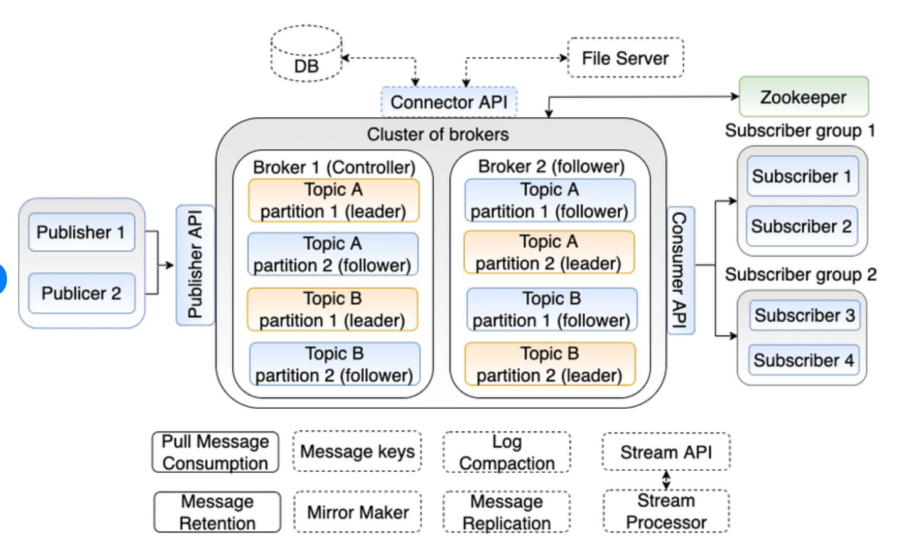
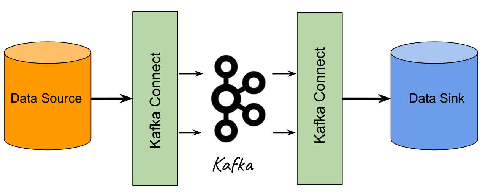
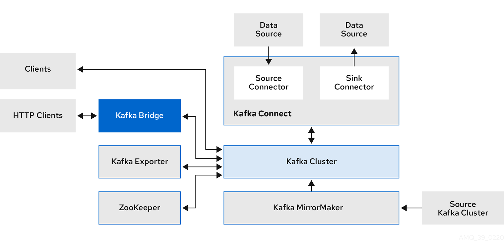

> **Kubernetes-native data streaming powered by Apache Kafka**

## 🎆 Introduction

In this part six of my series about data on Kubernetes, we will explore how Strimzi makes it easier to run Apache Kafka on Kubernetes.

Strimzi provides a set of tools and operators that help manage Kafka clusters in a Kubernetes environment. [Strimzi](https://strimzi.io/) simplifies the process, making it more accessible and manageable.

We will cover the key features of Strimzi, its benefits, and how you can get started with deploying Kafka on Kubernetes.

## 📜 Apache Kafka Overview

Apache Kafka is an open-source platform designed for building real-time data pipelines and streaming applications. It is highly scalable, fault-tolerant, and designed to handle large volumes of data with low latency.

### 🔑 Key Capabilities and Features

- **High throughput**: Kafka can process millions of messages per second, making it suitable for high-volume data streams.
- **Scalability**: Kafka can scale horizontally by adding more brokers to the cluster, ensuring it can handle increasing loads.
- **Durability**: Data in Kafka is replicated across multiple brokers, ensuring it is not lost even if some brokers fail.
- **Low latency**: Kafka is designed to deliver messages with minimal delay, making it ideal for real-time applications.
- **Fault tolerance**: Kafka's architecture ensures that the system continues to operate even in the presence of failures.

### 📈 Use Cases

- **Real-time data streaming**: Kafka is used to stream data in real-time from various sources like sensors, logs, and applications.
- **Event sourcing**: Kafka can capture and store events, making it useful for event-driven architectures.
- **Log aggregation**: Kafka collects and aggregates logs from different systems, providing a centralized log management solution.
- **Metrics collection**: Kafka can gather and process metrics from various applications and systems for monitoring and analysis.
- **Data integration**: Kafka acts as a central hub for integrating data from different sources and distributing it to various destinations.


<div class="image-title"><a href="https://blog.amigoscode.com/p/kafka-explained">Source: Amigoscode</a></div>

### 🏗️ Component Architecture

- **Brokers**: Kafka brokers are servers that store and manage the data. They handle incoming data streams and distribute them to consumers.
- **Topics**: Topics are categories or feeds to which data is sent. Each topic can have multiple partitions for parallel processing.
- **Partitions**: Partitions are subsets of a topic. They allow Kafka to scale horizontally and provide fault tolerance.
- **Producers**: Producers are applications that send data to Kafka topics.
- **Consumers**: Consumers are applications that read data from Kafka topics.
- **ZooKeeper**: ZooKeeper is used to manage and coordinate Kafka brokers. It handles tasks like leader election and configuration management.



## 🔄 Kafka Connect

Kafka Connect is a tool for streaming data between Apache Kafka and other systems. It simplifies the process of integrating Kafka with databases, key-value stores, search indexes, and file systems.

### How Kafka Connect Streams Data

Kafka Connect uses connectors to stream data in and out of Kafka. There are two types of connectors:

- **Source Connectors**: These connectors pull data from external systems and write it to Kafka topics.
- **Sink Connectors**: These connectors read data from Kafka topics and write it to external systems.



### Use Cases

- **Database integration**: Kafka Connect can stream data from databases like MySQL, PostgreSQL, and MongoDB into Kafka for real-time processing.
- **Data Lake ingestion**: Kafka Connect can ingest data into data lakes like Hadoop and Amazon S3 for long-term storage and analysis.
- **Search indexing**: Kafka Connect can stream data into search indexes like Elasticsearch for real-time search and analytics.
- **File system integration**: Kafka Connect can read data from file systems and write it to Kafka, or vice versa.

### Key Features

- **Scalability**: Kafka Connect can scale horizontally by adding more workers, ensuring it can handle large data volumes.
- **Fault tolerance**: Kafka Connect ensures data is not lost even if some connectors or workers fail.
- **Configuration management**: Kafka Connect allows you to manage connector configurations centrally, making it easy to deploy and manage connectors.
- **Monitoring and management**: Kafka Connect provides tools for monitoring and managing connectors, ensuring they operate smoothly.

## Kafka on Kubernetes

### Strimzi Overview

**Strimzi** provides a way to run an Apache Kafka cluster on Kubernetes in various deployment configurations. It simplifies the process, making it quick and efficient to get Kafka up and running.

### 🔒 Secure by Default

Strimzi comes with built-in security features to ensure your Kafka cluster is protected:

- **TLS, SCRAM-SHA, and OAuth authentication**: These protocols help secure communication and authenticate users.
- **Automated certificate management**: Strimzi handles certificate generation and renewal automatically.

### ⚙️ Simple yet Configurable

Strimzi offers flexibility in how you deploy and manage your Kafka cluster:

- **NodePort, Load Balancer, and Ingress options**: Choose the best networking option for your needs.
- **Rack awareness for High Availability (HA)**: Distribute Kafka brokers across different racks to ensure high availability.
- **Use dedicated nodes for Kafka**: Assign specific nodes in your Kubernetes cluster to run Kafka for better performance and isolation.

### 🛠️ Kubernetes-Native Experience

Strimzi integrates seamlessly with Kubernetes, providing a native experience:

- **Use `kubectl` to manage Kafka**: Leverage familiar Kubernetes tools to manage your Kafka cluster.
- **Operator-based management**: Strimzi uses operators to automate the deployment and management of Kafka. (An operator is a method of packaging, deploying, and managing a Kubernetes application.)
- **Manage Kafka using GitOps**: Apply GitOps principles to manage your Kafka configurations and deployments through version control.


<div class="image-title"><a href="https://strimzi.io">Source</a></div>

## 🧑‍💻 Kafka Operators

Operators are a method used to package, deploy, and manage applications on Kubernetes. They extend the Kubernetes API, making it easier to handle administrative tasks for specific applications.

**Strimzi operators** are designed to manage Kafka deployments. They use custom resources to define the deployment configurations, which include settings for Kafka clusters, topics, users, and other components.

Strimzi offers several operators to manage a Kafka cluster within a Kubernetes environment:

- **Cluster operator**: Responsible for deploying and managing Apache Kafka clusters, Kafka Connect, Kafka MirrorMaker, Kafka Bridge, Kafka Exporter, Cruise Control, and the Entity Operator.
- **Entity operator**: Includes the Topic Operator and User Operator.
    - **Topic operator**: Handles the management of Kafka topics.
    - **User operator**: Takes care of managing Kafka users.

## 🛠️ Hands-on: Deploying Strimzi on AWS EKS

In this section, we'll walk through the steps to deploy Strimzi on Amazon Elastic Kubernetes Service (EKS). This will involve setting up an EKS cluster, installing Strimzi, and deploying a Kafka cluster.

### Prerequisites

- **AWS Account**
- **AWS CLI**: Install and configure the [AWS CLI](https://docs.aws.amazon.com/cli/latest/userguide/install-cliv2.html).
- **kubectl**: Install [kubectl](https://kubernetes.io/docs/tasks/tools/install-kubectl/) to interact with your Kubernetes cluster.
- **eksctl**: Install [eksctl](https://eksctl.io/) to create and manage EKS clusters.

### Step 1: Create an EKS Cluster

Create the EKS Cluster:

```shell
$ eksctl create cluster --name demo-kafka-strimzi --region eu-west-1 \
--nodegroup-name linux-nodes --node-type t3.medium --nodes 3 \
--nodes-min 1 --nodes-max 4 --managed
```

This command creates an EKS cluster named `demo-kafka-strimzi` in the `eu-west-1` region with a managed node group.

Verify the Cluster:

```shell
kubectl get nodes
```

Ensure your nodes are in the Ready state.

### Step 2: Install Strimzi

Download the Strimzi YAML files:

```shell
$ curl -L "https://github.com/strimzi/strimzi-kafka-operator/releases/download/0.43.0/strimzi-topic-operator-0.43.0.yaml" \
-o strimzi-cluster-operator.yaml
```

Create Strimzi namespace:

```shell
$ kubectl create namespace strimzi
```

Deploy the Strimzi Cluster Operator:

```shell
$ sed -i 's/namespace: myproject/namespace: strimzi/g' strimzi-cluster-operator.yaml
$ kubectl apply -f strimzi-cluster-operator.yaml --namespace strimzi
```

Verify the Deployment:

```shell
kubectl get pods -n strimzi
```

Ensure the Strimzi Cluster Operator pods are running.

### Step 3: Deploy Kafka Node Pool and a Kafka Cluster

Create a Kafka Cluster YAML file:

```yaml
apiVersion: kafka.strimzi.io/v1beta2
kind: KafkaNodePool
metadata:
    name: dual-role
    labels:
        strimzi.io/cluster: strimzi-cluster
spec:
    replicas: 1
    roles:
        - controller
        - broker
    storage:
        type: jbod
        volumes:
            - id: 0
                type: persistent-claim
                size: 100Gi
                deleteClaim: false
                kraftMetadata: shared
---

apiVersion: kafka.strimzi.io/v1beta2
kind: Kafka
metadata:
    name: strimzi-cluster
    namespace: strimzi
spec:
    kafka:
        version: 3.0.0
        replicas: 3
        listeners:
            plain: {}
            tls: {}
        storage:
            type: persistent-claim
            size: 100Gi
            class: gp2
            deleteClaim: false
    zookeeper:
        replicas: 3
        storage:
            type: persistent-claim
            size: 100Gi
            class: gp2
            deleteClaim: false
    entityOperator:
        topicOperator: {}
        userOperator: {}
```

Deploy the Kafka Cluster:

```shell
$ kubectl apply -f kafka-cluster.yaml
```

Verify the Kafka Cluster:

```shell
$ kubectl get pods -n strimzi
```

Ensure all Kafka and Zookeeper pods are running.

### 📤 Send and Receive Messages

With the cluster running, run a simple producer to send messages to a Kafka topic (the topic is automatically created):

```shell
$ kubectl -n strimzi run kafka-producer -ti --image=quay.io/strimzi/kafka:0.43.0-kafka-3.8.0 --rm=true --restart=Never -- bin/kafka-console-producer.sh --bootstrap-server my-cluster-kafka-bootstrap:9092 --topic my-topic
```

Once everything is set up correctly, you'll see a prompt where you can type in your messages:

```shell
>Hello Strimzi!
```

And to receive them in a different terminal, run:

```shell
$ kubectl -n kafka run kafka-consumer -ti \
--image=quay.io/strimzi/kafka:0.43.0-kafka-3.8.0 \
--rm=true --restart=Never -- bin/kafka-console-consumer.sh \
--bootstrap-server my-cluster-kafka-bootstrap:9092 \
--topic my-topic --from-beginning
```

If everything works as expected, you'll be able to see the message you produced in the previous step:

```shell
>Hello Strimzi!
```

## 🔚 Conclusion

In this part 6 of the blog series, we introduced Kafka, its features, components, Kafka Connect, and Strimzi. We also explored how to use Strimzi operators to manage Kafka on Kubernetes, covering the setup of an EKS cluster on AWS, the installation of Strimzi, and the deployment of a Kafka cluster.

Dive deeper by following the [official documentation](https://strimzi.io/documentation/) for more detailed information.

**Stay tuned for next blogs in this series🎉**

**References:**

- https://github.com/strimzi/strimzi-kafka-operator
- https://strimzi.io/
- https://medium.com/@howdyservices9/strimzi-deploy-kafka-in-kubernetes-dd740364861c
- https://piotrminkowski.com/2023/11/06/apache-kafka-on-kubernetes-with-strimzi/
- https://blog.devgenius.io/kafka-on-kubernetes-using-strimzi-part-2-71a8ba8e9605
- https://www.linkedin.com/posts/nelsonamigoscode_systemdesign-coding-interviewtips-activity-7231623516704378883-lmCL
- https://aws.amazon.com/blogs/containers/deploying-and-scaling-apache-kafka-on-amazon-eks/
  
**Thank You 🖤**

<br>

**_Until next time, つづく 🎉_**

> 💡 Thank you for Reading !! 🙌🏻😁📃, see you in the next blog.🤘  **_Until next time 🎉_**

🚀 Thank you for sticking up till the end. If you have any questions/feedback regarding this blog feel free to connect with me:

**♻️ LinkedIn:** https://www.linkedin.com/in/rajhi-saif/

**♻️ X/Twitter:** https://x.com/rajhisaifeddine

**The end ✌🏻**

<h1 align="center">🔰 Keep Learning !! Keep Sharing !! 🔰</h1>

**📅 Stay updated**

Subscribe to our newsletter for more insights on AWS cloud computing and containers.
