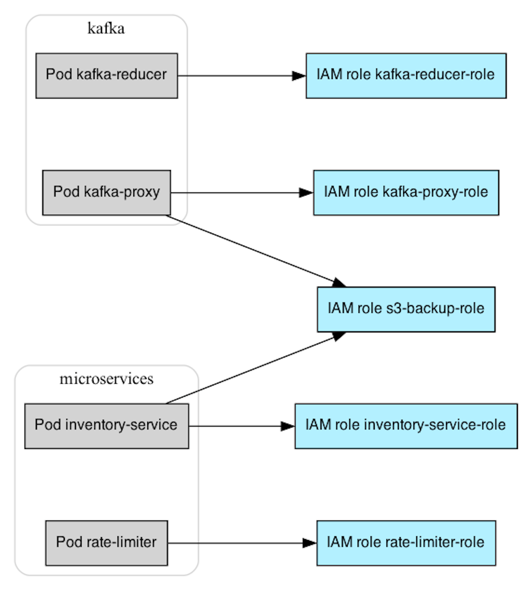

> **Enhancing Security in Managed Kubernetes 🛡️**

## 📌 Introduction

At KubeCon EU 2023, Datadog released the [Managed Kubernetes Auditing Toolkit (MKAT)](https://github.com/DataDog/managed-kubernetes-auditing-toolkit), a comprehensive solution designed to identify common security issues within managed Kubernetes environments. Initially focused on Amazon EKS, MKAT is a versatile tool that will be expanded to support other managed Kubernetes environments in the future. This all-in-one auditing toolkit offers features such as identifying trust relationships between K8s service accounts and AWS IAM roles, finding hardcoded AWS credentials in K8s resources, and testing if pods can access the AWS Instance Metadata Service (IMDS). With easy installation via Homebrew or pre-compiled binary, MKAT provides a valuable resource for enhancing the security of Kubernetes clusters. In this blog post, we will explore the key features of MKAT, its benefits for users, and how it can help improve the overall security of managed Kubernetes environments.

### 🛠️ MKAT: The All-in-One Auditing Toolkit for Kubernetes Security

MKAT is an all-in-one auditing toolkit for identifying common security issues within managed Kubernetes environments. It is currently focused on Amazon EKS and will be extended to other managed Kubernetes environments in the future. The tool provides a range of features, including:

- 🔎 [Identify trust relationships between K8s service accounts and AWS IAM roles](https://github.com/DataDog/managed-kubernetes-auditing-toolkit#identify-trust-relationships-between-k8s-service-accounts-and-aws-iam-roles) - Supports both IAM Roles for Service Accounts (IRSA), and [Pod Identity](https://aws.amazon.com/blogs/aws/amazon-eks-pod-identity-simplifies-iam-permissions-for-applications-on-amazon-eks-clusters/), released on November 26, 2023.
- 🔑 [Find hardcoded AWS credentials in K8s resources](https://github.com/DataDog/managed-kubernetes-auditing-toolkit#find-hardcoded-aws-credentials-in-k8s-resources).
- 💀 [Test if pods can access the AWS Instance Metadata Service (IMDS)](https://github.com/DataDog/managed-kubernetes-auditing-toolkit?tab=readme-ov-file#test-if-pods-can-access-the-aws-instance-metadata-service-imds).

For more details, visit the [official MKAT documentation](https://github.com/DataDog/managed-kubernetes-auditing-toolkit).

## 🚀 Installation and Setup

To install and set up the Managed Kubernetes Auditing Toolkit (MKAT), follow these steps:

1. **Add the MKAT Homebrew Tap:**
    ```sh
    brew tap datadog/mkat https://github.com/datadog/managed-kubernetes-auditing-toolkit
    ```

2. **Install MKAT:**
    ```sh
    brew install datadog/mkat/managed-kubernetes-auditing-toolkit
    ```

3. **Check the Installed MKAT Version:**
    ```sh
    mkat version
    ```

Alternatively, you can use a pre-compiled binary for installation. After installation, ensure that you are authenticated against your cluster and to AWS, as MKAT uses your current AWS and `kubectl` authentication contexts.

## 🔍 Practical Usage of MKAT

### Analyzing Role Relationships

Running `mkat eks find-role-relationships` will analyze your Kubernetes service accounts and the trust policy of IAM roles in your AWS account, then output a summary of which Kubernetes workload can assume AWS roles.



MKAT works by analyzing both the IAM roles in the AWS account and the K8s service accounts in the cluster, and then matching them together based on these two mechanisms.

```sh
$ mkat eks find-role-relationships
 _ __ ___   | | __   __ _  | |_
 | '_ ` _ \  | |/ /  / _` | | __|
 | | | | | | |   <  | (_| | | |_
 |_| |_| |_| |_|\_\  \__,_|  \__|

2023/11/28 21:05:59 Connected to EKS cluster mkat-cluster
2023/11/28 21:05:59 Retrieving cluster information
2023/11/28 21:06:00 Listing K8s service accounts in all namespaces
2023/11/28 21:06:02 Listing roles in the AWS account
2023/11/28 21:06:03 Found 286 IAM roles in the AWS account
2023/11/28 21:06:03 Analyzing IAM Roles For Service Accounts (IRSA) configuration
2023/11/28 21:06:03 Analyzing Pod Identity configuration of your cluster
2023/11/28 21:06:04 Analyzing namespace microservices which has 1 Pod Identity associations
+------------------+---------------------------+-----------------------------------+-----------------------------+--------------------------------+
| NAMESPACE        | SERVICE ACCOUNT           | POD                               | ASSUMABLE ROLE              | MECHANISM                      |
+------------------+---------------------------+-----------------------------------+-----------------------------+--------------------------------+
| microservices    | inventory-service-sa      | inventory-service                 | inventory-service-role      | IAM Roles for Service Accounts |
|                  |                           |                                   | s3-backup-role              | IAM Roles for Service Accounts |
|                  | rate-limiter-sa           | rate-limiter-1                    | rate-limiter-role           | IAM Roles for Service Accounts |
|                  |                           |                                   | webserver-role              | Pod Identity                   |
|                  |                           | rate-limiter-2                    | rate-limiter-role           | IAM Roles for Service Accounts |
|                  |                           |                                   | webserver-role              | Pod Identity                   |
+------------------+---------------------------+-----------------------------------+-----------------------------+--------------------------------+
| default          | vulnerable-application-sa | vulnerable-application            | vulnerable-application-role | IAM Roles for Service Accounts |
|                  | webserver-sa              | webserver                         | webserver-role              | IAM Roles for Service Accounts |
+------------------+---------------------------+-----------------------------------+-----------------------------+--------------------------------+
| external-secrets | external-secrets-sa       | external-secrets-66cfb84c9b-kldt9 | ExternalSecretsRole         | IAM Roles for Service Accounts |
+------------------+---------------------------+-----------------------------------+-----------------------------+--------------------------------+
```

### Identifying Hardcoded AWS Access Keys

MKAT can also identify hardcoded AWS access keys in the definition of Kubernetes ConfigMaps, Secrets, and Pods, with minimal false positives.

```sh
$ mkat eks find-secrets
                  _              _
  _ __ ___   | | __   __ _  | |_
 | '_ ` _ \  | |/ /  / _` | | __|
 | | | | | | |   <  | (_| | | |_
 |_| |_| |_| |_|\_\  \__,_|  \__|

2023/04/12 21:56:19 Connected to EKS cluster mkat-cluster
2023/04/12 21:56:19 Searching for AWS secrets in ConfigMaps...
2023/04/12 21:56:19 Analyzing 10 ConfigMaps...
2023/04/12 21:56:19 Searching for AWS secrets in Secrets...
2023/04/12 21:56:19 Analyzing 45 Secrets...
2023/04/12 21:56:19 Searching for AWS secrets in Pod definitions...
2023/04/12 21:56:19 Analyzing 8 Pod definitions...
+-----------+--------+-----------------------------------------+------------------------------------------+
| NAMESPACE | TYPE   | NAME                                    | VALUE                                    |
+-----------+--------+-----------------------------------------+------------------------------------------+
| default   | Secret | kafka-proxy-aws (aws access key) | XXXXXXXXXXXXXXXXXXXX                     |
| default   | Secret | kafka-proxy-aws (aws secret)    | XXXXXXXX/XXCAXXXXXXXXXqEPXX+XXX/XXXXXXXX |
+-----------+--------+-----------------------------------------+------------------------------------------+
```

### Validating IMDS Access

Finally, you can use MKAT to validate that you properly blocked pod access to the IMDS:

```sh
$ mkat eks test-imds-access
                  _              _
  _ __ ___   | | __   __ _  | |_
 | '_ ` _ \  | |/ /  / _` | | __|
 | | | | | | |   <  | (_| | | |_
 |_| |_| |_| |_|\_\  \__,_|  \__|

2023/04/12 21:56:19 Connected to EKS cluster mkat-cluster
2023/04/12 21:56:19 Testing if IMDSv1 and IMDSv2 are accessible from pods by creating a pod that attempts to access it
2023/04/12 21:56:23 IMDSv2 is accessible: any pod can retrieve credentials for the AWS role eksctl-mkat-cluster-nodegroup-ng-NodeInstanceRole-AXWUFF35602Z
2023/04/12 21:56:23 IMDSv1 is not accessible to pods in your cluster: able to establish a network connection to the IMDS, but no credentials were returned
```

## 🔄 Comparison with Other Tools

| **Tool** | **Description** |
|:---:|:---:|
| [kube-bench](https://github.com/aquasecurity/kube-bench) | kube-bench is a general-purpose auditing tool for Kubernetes cluster, checking for compliance against the CIS benchmarks. |
| [kubiscan](https://github.com/cyberark/KubiScan) | kubiscan focuses on identifying dangerous in-cluster RBAC permissions. |
| [peirates](https://github.com/inguardians/peirates) | peirates is a generic Kubernetes penetration testing tool. Although it has a `get-aws-token` command that retrieves node credentials from the IMDS, it is not specific to managed K8s environments. |
| [botb](https://github.com/brompwnie/botb) | botb is a generic Kubernetes penetration testing tool. It also has a command to retrieve node credentials from the IMDS, but it is not specific to managed K8s environments. |
| [rbac-police](https://github.com/PaloAltoNetworks/rbac-police) | rbac-police focuses on identifying in-cluster RBAC relationships. |
| [kdigger](https://github.com/quarkslab/kdigger) | kdigger is a general-purpose context discovery tool for Kubernetes penetration testing. It does not attempt to be specific to managed K8s environments. |
| [kubeletmein](https://github.com/4ARMED/kubeletmein) | kubeletmein _is_ specific to managed K8s environments. It's a utility to generate a kubeconfig file using the node's IAM credentials, to then use it in a compromised pod. |
| [hardeneks](https://github.com/aws-samples/hardeneks) | hardeneks _is_ specific to managed K8s environments, but only for EKS. It identifies issues and lack of best practices inside of the cluster, and does not focus on cluster to cloud pivots. |

## 🏁 Conclusion

In conclusion, MKAT is a valuable tool for enhancing security in managed Kubernetes environments. It provides a comprehensive set of audits that can help identify and remediate common security risks. MKAT is easy to use and can be integrated into your existing security workflows. Additionally, MKAT is open source and free to use. If you are responsible for securing a managed Kubernetes environment, I encourage you to give MKAT a try.

**_Until next time, つづく 🎉_**


<br><br>

> 💡 Thank you for Reading !! 🙌🏻😁📃, see you in the next blog.🤘  **_Until next time 🎉_**

🚀 Thank you for sticking up till the end. If you have any questions/feedback regarding this blog feel free to connect with me:

**♻️ LinkedIn:** https://www.linkedin.com/in/rajhi-saif/

**♻️ X/Twitter:** https://x.com/rajhisaifeddine

**The end ✌🏻**

<h1 align="center">🔰 Keep Learning !! Keep Sharing !! 🔰</h1>

**📅 Stay updated**

Subscribe to our newsletter for more insights on AWS cloud computing and containers.
