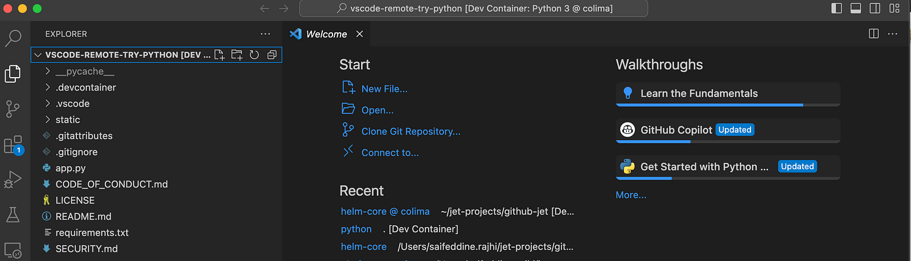
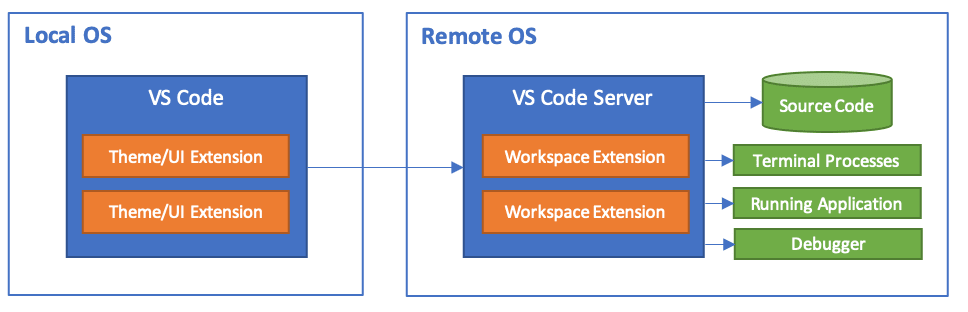

> **Building consistency in distributed teams 🐳🔥**

## 📔 Introduction

Imagine being able to instantly recreate your entire development setup - no matter where you are! That's what Devcontainers bring to the table‼️.

[Devcontainers](https://containers.dev/) part of [VSCode IDE](https://code.visualstudio.com/), use [Docker](https://docs.docker.com/manuals/) to provide isolated, reproducible development environments.

This means that every developer can enjoy a consistent experience, regardless of their local machine's hardware or OS.

As more teams adopt remote work and distributed development models, maintaining consistency across various platforms becomes increasingly important.

> Devcontainers address this issue head-on by offering a standardized approach to creating and managing development environments.

The rest of our discussion will explore he following topics:

* What are Devcontainers and why do they matter
* We'll explain the concept behind Devcontainers and highlight their key features.
* Benefits of Devcontainers
* Discover how Devcontainers enhance productivity, promote collaboration, and simplify the onboarding process.
* Setting up and configuring Devcontainers
* Learn how to get started with Devcoontainers and customize them according to your unique requirements.

By the end of this blog, you should have a good understanding of Devcontainers and their role in enhancing both individual and collaborative development experiences.


## Challenges of Reproducing Development Environments 

Developers often face challenges when it comes to reproducing development environments, especially when specific configurations and technical nuances are involved.

This can lead to issues such as **« it works on my machine 😐 »** or conflicts with other projects and dependencies on their local machines.


## Advantages of using Devcontainers

Visual Studio Code's Devcontainers system offers a user-friendly solution for quickly reproducing development environments.

It uses Docker to create isolated containers that contain the necessary tools and settings for a specific development environment.

* **Consistency:** Dev Containers ensure that everyone on the team is using the same development environment, reducing compatibility issues and making collaboration smoother.
* **Isolation:** The containerization of the development environment prevents conflicts between different projects' dependencies and configurations.
* **Portability:** With Dev Containers, developers can work on projects with complex dependencies without worrying about setup, regardless of the host operating system.
* **Ease of onboarding:** New team members can quickly jump into projects by cloning the repository and opening it in a Dev Container. This eliminates the need to set up the development environment from scratch.
* **Reproducibility:** Dev Containers make it easier to reproduce and debug issues since everyone is working in an identical environment.

## Key insights into Devcontainers

The Devcontainer configuration file allows developers to specify the operating system and tools they want to include in their development environment.

The process of setting up and using Devcontainers involves installing Visual Studio Code, Docker, and the necessary extensions, followed by cloning the repository into a container volume.


With Devcontainers, developers can enjoy secure and immutable development environments, reducing the risk of conflicts and ensuring consistency across different development environments.

## Hands-on example

If you're excited to give Dev Containers a try, here's a simplified step-by-step guide.

### ✅ Prerequisites

Before diving into Devcontainer setup, ensure you have the following prerequisites installed:

* **Visual Studio Code:** Download and install the latest version of VSCode from the [official website](https://code.visualstudio.com/).
* **Docker:** Install Docker on your machine. You can find the installation instructions for your operating system on the [Docker website](https://docs.docker.com/get-docker/).
* **Visual Studio code extensions:** Install the DevContainers extension in VSCode.

Now that you have the prerequisites in place let's create a DevContainer for a Python project.

### ✅ Getting started with Devcontainer

Simply follow the steps below to start your own, fully isolated Python development environment using the files provided in this article.

1. Open your project in VSCode.
2. In the Command Palette (`Ctrl+Shift+P` on **Windows/Linux**, `Cmd+Shift+P` on **macOS**), type `>Try a dev container sample`.
3. Select the Python 3 option from the list of available Devcontainer templates.
4. Next, click on Create Dev container Python, then wait for a few seconds until the project gets initialized.



The Dev Containers extension uses the files in the `.devcontainer` folder, namely `devcontainer.json`, and an optional `Dockerfile` or `docker-compose.yml`, to create your dev containers.

In the example, the project has a `.devcontainer` folder with a `devcontainer.json` inside. The devcontainer.json uses the image **mcr.microsoft.com/devcontainers/python:0–3.11**. 

> You can explore this image in greater detail in the [devcontainers/images repo](https://github.com/devcontainers/images/tree/main/src/python).

First, your image is built from the supplied Dockerfile or image name, which would be _mcr.microsoft.com/devcontainers/python:0–3.11_ in this example.

Then a container is created and started using some of the settings in the `devcontainer.json`.
Finally, your Visual Studio Code environment is installed and configured again according to settings in the `devcontainer.json`.

For example, the dev container in this example installs the `streetsidesoftware.code-spell-checker` extension.

<div class="note">
    <p><strong>🔵 Note:</strong></p>
    <p>Additional configuration will already be added to the container based on what's in the base image. For example, we see the <b>streetsidesoftware.code-spell-checker</b> extension above. This happens automatically when pre-building using devcontainer.json, which you may read more about in the pre-build section.</p>
</div>

Once all of this is done, your local copy of Visual Studio Code connects to the Visual Studio Code Server running inside of your new dev container.



The `devcontainer.json` is basically a config file that determines how your dev container gets built and started.

```json
// For format details, see https://aka.ms/devcontainer.json. For config options, see the
// README at: https://github.com/devcontainers/templates/tree/main/src/python
{
  "name": "Python 3",
  // Or use a Dockerfile or Docker Compose file. More info: https://containers.dev/guide/dockerfile
  "image": "mcr.microsoft.com/devcontainers/python:0-3.11",

  // Features to add to the dev container. More info: https://containers.dev/features.
  // "features": {},

  // Configure tool-specific properties.
  "customizations": {
    // Configure properties specific to VS Code.
    "vscode": {
      "settings": {},
      "extensions": [
        "streetsidesoftware.code-spell-checker"
      ]
    }
  },
  
  // Use 'forwardPorts' to make a list of ports inside the container available locally.
  // "forwardPorts": [9000],

  // Use 'portsAttributes' to set default properties for specific forwarded ports. 
  // More info: https://containers.dev/implementors/json_reference/#port-attributes
  "portsAttributes": {
    "9000": {
      "label": "Hello Remote World",
      "onAutoForward": "notify"
    }
  },

  // Use 'postCreateCommand' to run commands after the container is created.
  "postCreateCommand": "pip3 install -r requirements.txt"

  // Uncomment to connect as root instead. More info: https://aka.ms/dev-containers-non-root.
  // "remoteUser": "root"
}
```

_Congratulations, you've successfully completed this tutorial!🎊:_

<br>

https://giphy.com/gifs/youngthug-hot-young-thug-gunna-Y4VkyhG1RO7pQbQFhF

<br>

This has been a brief overview of what is possible using dev containers. 

As a next step, we recommend checking out how you can open an existing folder from your machine in a container or opening a GitHub repository or PR in a container.

Check out the other Remote Development extensions.

* [Remote - SSH](https://marketplace.visualstudio.com/items?itemName=ms-vscode-remote.remote-ssh)
* [WSL](https://marketplace.visualstudio.com/items?itemName=ms-vscode-remote.remote-wsl)

Or get them all by installing the [Remote Development Extension Pack](https://marketplace.visualstudio.com/items?itemName=ms-vscode-remote.vscode-remote-extensionpack).


## 💡 Closing thoughts

DevContainers in Visual Studio Code provides a solution for consistent, isolated, and scalable development environments. Encapsulating projects in containers streamlines collaboration, enhances onboarding, and ensures a consistent experience.

I recommend you give dev container a try. You can also explore dev containers on the cloud, such as Github Codespaces, Gitpod, or JetBrains Spaces. It can solve local resource problems, and engineers can code from any device.

**References:**

* https://containers.dev/
* https://code.visualstudio.com/docs/devcontainers/containers

**_Until next time, つづく 🎉_**


<br><br>

> 💡 Thank you for Reading !! 🙌🏻😁📃, see you in the next blog.🤘  _**Until next time 🎉**_

🚀 Thank you for sticking up till the end. If you have any questions/feedback regarding this blog feel free to connect with me:

**♻️ LinkedIn:** https://www.linkedin.com/in/rajhi-saif/

**♻️ X/Twitter:** https://x.com/rajhisaifeddine

**The end ✌🏻**

<h1 align="center">🔰 Keep Learning !! Keep Sharing !! 🔰</h1>

**📅 Stay updated**

Subscribe to our newsletter for more insights on AWS cloud computing and containers.
