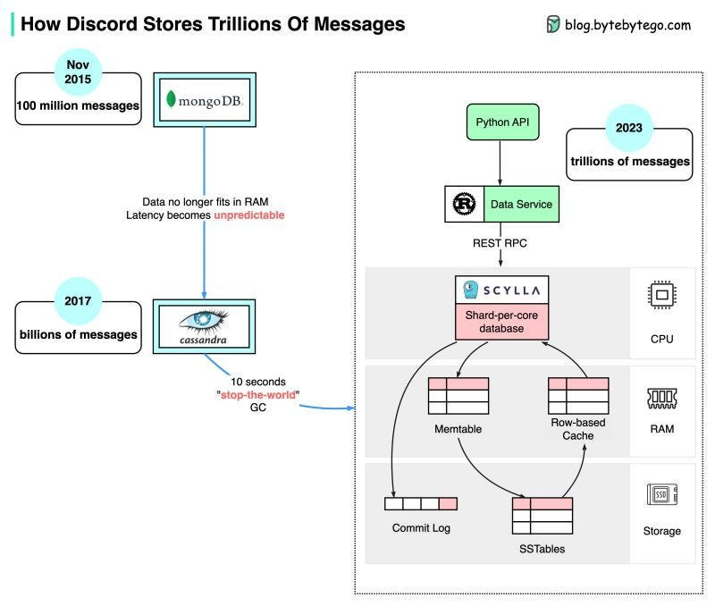

> **An Epic Journey from Cassandra to ScyllaDB with Rusty Reinforcements 🚀**

## 🔰 Overview

In the world of messaging platforms, [Discord](https://discord.com/) stands as a leader, connecting millions of users worldwide.

However, as the user base expanded, Discord encountered a daunting challenge: handling trillions of messages efficiently 🤔.

The existing database system, Cassandra, struggled with hot partitions, causing slowdowns and hindering performance.

Discord's solution? Starting on a transformative journey, migrating to [ScyllaDB](https://www.scylladb.com/), and leveraging the power of Rust.

## 🎯 Goals & Objectives

This blog dives into Discord's pursuit of scalability, exploring the situation, the complications faced, and the resolute path taken to revolutionize message storage at an unprecedented scale, inspired by [Bo Ingram's post](https://discord.com/blog/how-discord-stores-trillions-of-messages).

## 📈 From MongoDB to ScyllaDB: Discord's Evolutionary Messaging Storage

The diagram below shows the evolution of message storage at Discord:

**MongoDB ➡️ Cassandra ➡️ ScyllaDB 🎉**

In the early days of Discord's inception in 2015, the platform relied on a single MongoDB replica for message storage. However, as the number of messages grew to 100 million by November 2015, the limitations of MongoDB became apparent. The data and index became too large for the available RAM, resulting in unpredictable latency. It became necessary to migrate message storage to a more suitable database solution, and Cassandra was selected.

By 2017, Discord had transitioned to Cassandra, employing a cluster of 12 nodes to store billions of messages. As the platform continued to experience exponential growth, by the start of 2022, Discord's message count had skyrocketed into the trillions, necessitating a substantial increase in infrastructure. With 177 nodes at this stage, latency became increasingly unpredictable, and the cost of maintenance operations became prohibitively expensive.

**Cassandra** is a distributed database system designed for scalability and fault-tolerance, capable of handling massive amounts of data across multiple servers or nodes.

### Discord's Issue with Cassandra

Discord faced problems with hot partitions in Cassandra, where a particular part of the database became overloaded with requests, causing slow performance for the entire application.

The issue at hand can be attributed to several factors:

- Cassandra's internal data structure utilizes the LSM tree, which makes reads more expensive than writes. Concurrent reads from numerous users on a single server can lead to hotspots and performance degradation.
- Maintenance tasks, such as SSTable compaction, have an impact on overall performance, adding to the challenges faced.
- Latency spikes can be attributed to garbage collection pauses, further exacerbating the problem.

In response, Discord undertook a redesign of its architecture, incorporating various components. This included a monolithic API, a data service implemented in Rust, and a storage system based on ScyllaDB, a Cassandra-compatible database developed in C++.

**ScyllaDB**: ScyllaDB is a high-performance distributed NoSQL database similar to Cassandra. It uses a shared-nothing architecture and offers more efficient storage and query capabilities, reducing the occurrence of hot partitions.

The adoption of ScyllaDB brought significant improvements. The p99 (99th percentile) read latency in ScyllaDB reduced to 15ms, compared to 40–125ms in Cassandra. Likewise, the p99 write latency decreased to 5ms, compared to 5–70ms in Cassandra. These enhancements in latency highlight the positive impact of transitioning to ScyllaDB.

Discord engineers wrote data services in Rust, using its fearless concurrency feature to control concurrent traffic to hot partitions. Rust's libraries and ability to write safe concurrent code were well-suited to Discord's needs. The data services acted as intermediary services between the API monolith and database clusters, providing request coalescing to minimize multiple queries to the database.

## 🔹 How Discord Stores Trillions Of Messages

Overall, Discord's migration to ScyllaDB and the use of Rust for controlling concurrent traffic were key steps in addressing the challenges they faced with storing trillions of messages and improving database performance.

Image creds: ByteByteGo

## 📚 References

- [Discord Blog](https://discord.com/blog)
- [Cassandra Video](https://www.youtube.com/watch?v=some-video)
- [ScyllaDB YouTube Channel](https://www.youtube.com/channel/UCsome-channel)
- [ByteByteGo](https://bytebytego.com/)

## 👏 Wrapping Up

Discord embarked on an extraordinary journey, transitioning from Cassandra to ScyllaDB, and leveraging the power of Rust to scale trillions of messages. This migration showcases the effectiveness of Rust in developing resilient solutions 🗒

 

**_Until next time, つづく 🎉_**

> 💡 Thank you for Reading !! 🙌🏻😁📃, see you in the next blog.🤘  _**Until next time 🎉**_

🚀 Thank you for sticking up till the end. If you have any questions/feedback regarding this blog feel free to connect with me:

**♻️ LinkedIn:** https://www.linkedin.com/in/rajhi-saif/

**♻️ X/Twitter:** https://x.com/rajhisaifeddine

**The end ✌🏻**

<h1 align="center">🔰 Keep Learning !! Keep Sharing !! 🔰</h1>

**📅 Stay updated**

Subscribe to our newsletter for more insights on AWS cloud computing and containers.
