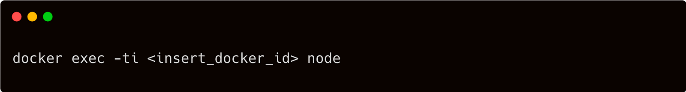

> **A Toolbox of Simple Tricks for Docker Image Optimization**

## ☸ Introduction

Docker has revolutionized the way we package and deploy applications, but often, images can become bloated and resource-consuming. Fear not! We have curated a collection of handy tricks that will help you optimize your Docker images without compromising functionality.

Whether you're a seasoned Docker user or just getting started, join us on this journey to discover the secrets of maximizing efficiency and minimizing image size. Get ready to supercharge your Docker workflow with our toolbox of simple but powerful optimization tricks.


## 🎯 Goals & Objectives

In this article, we will explore a variety of straightforward techniques that will empower you to create smaller and more efficient Docker images.

Let's dive in! **HAPPY LEARNING 💻**

### Proven Strategies for Minimizing Docker Image Size

Building smaller Docker containers should be a top priority in your containerization journey. The significance lies in the fact that smaller images, which leverage shared layers, offer enhanced transfer and deployment speeds. However, managing image size becomes challenging as each `RUN` statement generates a new layer, and intermediate artifacts are often necessary before the image is fully prepared.

If you've come across various Dockerfiles in the community, you might have observed peculiar techniques like the following:


What is the reason behind using the `&&` symbol in Dockerfiles instead of running two separate `RUN` statements? How does this peculiar approach simplify the build process and unlock the potential for smaller and more efficient Docker images?


Well, the answer is obvious: when a Docker image is built, each `RUN` statement creates a new layer. These layers consume disk space and can make the resulting image larger. However, by chaining commands with `&&`, you can execute them within a single `RUN` statement, thereby reducing the number of layers generated.

Using separate `RUN` statements instead of `&&` may seem logical, but it comes with a drawback: each `RUN` statement creates an additional layer, potentially leading to larger image sizes. By utilizing `&&`, you optimize the Docker build process, resulting in smaller and more efficient images. In the previous example, two layers were created instead of consolidating them into a single layer.


Docker layers function akin to Git commits: capturing the modifications between the previous and current image versions. These layers prove beneficial when sharing with other repositories or images, mirroring Git commits' usefulness in sharing code. When fetching an image from a registry, solely the layers absent in your possession are downloaded. This method vastly improves the efficiency of image sharing.

Nevertheless, layers come at a cost 😿. Layers occupy storage space, and the final image grows heavier with each additional layer. Git repositories exhibit a similar behavior — repository size increases in proportion to the number of layers, as Git must retain all changes between commits.

In the past, it was recommended to consolidate multiple `RUN` statements into a single line, resembling the initial example. However, this practice is no longer advisable. 👌

### Condense Multiple Layers into One Using Multi-Stage Docker Builds

Just as you can opt to merge the history of a Git repository into a single commit to simplify it, a similar approach can be applied in Docker through multi-stage builds. In the following scenario, we'll construct a Node.js container. To begin, let's consider an `index.js` file:


and `package.json`:


You can package this application with the following Dockerfile:


You can build the image with:

```sh
docker build -t node-multi-layers .
```

And you can test that it works correctly with:


Upon visiting [http://localhost:3000](http://localhost:3000), you will be warmly greeted with the message "Hello World!"

In the Dockerfile, you will notice the presence of both `COPY` and `RUN` statements. As a result, anticipate the addition of at least two additional layers beyond the base image. However, the resulting image will surprisingly contain more new layers, corresponding to each statement in the Dockerfile.

Let's explore the multi-stage Docker build approach. For this purpose, we will use the same Dockerfile as mentioned earlier, but we will employ it twice:


The first part of the Dockerfile creates three layers. The layers are then merged and copied across to the second and final stage. Two more layers are added on top of the image for a total of 3 layers.

Feel free to validate the Docker configuration. Begin by building the container using the following steps:

```sh
docker build -t node-stages .
```

And now inspect the history:


Congratulations! Now let's check if there has been any change in the file size.


Great job on achieving a slightly smaller file size for the last image! Although you've already optimized the application to a certain extent, it seems that the image size can still be further improved. But fret not, there are additional measures you can take to make it even smaller. Let's explore further techniques to further minimize the image size.

---

### Streamline Your Container by Eliminating Unnecessary Components with Distroless

The current Docker image includes a plethora of binaries and utilities, including Node.js, yarn, npm, bash, and even an entire Ubuntu operating system. However, when running your container, you only require Node.js as the essential dependency.

Docker containers should encapsulate a single process, containing only the bare minimum required for its execution. The inclusion of a complete operating system is unnecessary.

Thankfully, Google has recognized this and introduced [GoogleCloudPlatform/distroless](https://github.com/GoogleContainerTools/distroless), a solution that aligns perfectly with your needs. As described in the repository, "Distroless" images exclusively consist of your application and its essential runtime dependencies. They omit package managers, shells, and other programs typically found in a standard Linux distribution.

This precisely matches your requirements! By adjusting the Dockerfile, you can harness the power of this new base image, resulting in the following configuration:


And you can compile the image as usual with:

```sh
docker build -t node-distroless .
```

The application should run as normal. To verify that this is still the case, you could run the container like this:

```sh
docker run -p 3000:3000 -ti --rm --init node-distroless
```

And visit the page at [http://localhost:3000](http://localhost:3000).

Is the image without all the extra binaries smaller?


Impressive! The size of the new image is just 76.7MB, a remarkable reduction of 600MB compared to the previous version.

This is fantastic news! However, there is an important consideration to keep in mind when working with distroless. If you need to inspect a running container, you can attach to it using the following command:


The process of attaching to a running container and running a shell, such as a bash, resembles establishing an SSH session. However, in the case of distroless, being a minimalist version of the original operating system, it lacks additional binaries and utilities, including a shell. As a result, it is not possible to attach to a running container without a shell.

This limitation has both good and bad implications. On the one hand, it prevents executing any binaries other than Node.js within the container. On the other hand, it reinforces the container's purpose of encapsulating a single process, such as running Node.js applications:



Indeed, the absence of a shell in a distroless container can be considered good news from a security perspective. In the event of an attacker compromising your application and gaining access to the container, their ability to cause significant damage is limited without a shell. This reduction in available binaries contributes to smaller image sizes and enhances security. However, it can introduce challenges when it comes to debugging.

It is important to note that attaching to and debugging containers in a production environment is generally not recommended. Instead, relying on comprehensive logging and monitoring practices is advisable.

### 🐋 Optimize Image Size with Alpine: Choosing a Compact Base Image


Consider replacing the distroless base image with an Alpine-based image for further size reduction. Alpine Linux is a security-focused, lightweight Linux distribution built upon musl libc and busybox. In essence, it offers a smaller footprint while prioritizing security.

However, it is prudent not to solely rely on claims. Let's verify whether the Alpine-based image is indeed smaller. To achieve this, modify the Dockerfile and employ the `node:8-alpine` base image:

You can build the image with:

```sh
docker build -t node-alpine .
```

And you can check the size with:

```sh
docker images | grep node-alpine
```

```plaintext
node-alpine   aa1f85f8e724   69.7MB
```

69.7MB! Even smaller than the distroless image!

Can you attach to a running container, unlike distroless? It's time to find out. Let's start the container first:


You can attach to the running container with:


Absolutely! You can still connect to a running container, and you'll have a more compact image overall.

However, there's an important consideration to keep in mind. Alpine-based images utilize muslc, an alternative C standard library. On the other hand, widely used Linux distributions like Ubuntu, Debian, and CentOS rely on glibc, which is more prevalent and faster.

Both libraries aim to implement the same kernel interface but with different objectives. While glibc prioritizes widespread usage and performance, muslc focuses on minimal space consumption and enhanced security. When an application is compiled, it is typically linked to a specific libc. If you want to use it with another libc, recompilation is necessary.

Consequently, building your containers with Alpine images might introduce unexpected behavior due to the variance in the standard C library. You might encounter discrepancies, especially when dealing with precompiled binaries such as Node.js C++ extensions. For instance, the prebuilt package for PhantomJS doesn't function correctly on Alpine.

### 📝 Summary

➡️ In summary, the choice of base image for Docker containers depends on your priorities.

- **Distroless images** prioritize security by reducing the attack surface area and minimizing the number of binaries.
- **Alpine-based images** prioritize size optimization but may have compatibility issues due to the different C library.
- **Vanilla base images** are suitable for testing and development, providing a familiar environment with access to a wide range of binaries.

Consider your requirements for security, size, and development environment when selecting the appropriate base image for your Docker containers.

## 🌟Conclusion 🌟

Optimizing Docker images is crucial for efficient deployment. Techniques such as layer squashing, using distroless images for enhanced security, and considering Alpine-based images for size reduction provide valuable tools to streamline containerization and improve overall performance.

**Thank You 🖤**

<br>

**_Until next time, つづく 🎉_**

> 💡 Thank you for Reading !! 🙌🏻😁📃, see you in the next blog.🤘  **_Until next time 🎉_**

🚀 Thank you for sticking up till the end. If you have any questions/feedback regarding this blog feel free to connect with me:

**♻️ LinkedIn:** https://www.linkedin.com/in/rajhi-saif/

**♻️ X/Twitter:** https://x.com/rajhisaifeddine

**The end ✌🏻**

<h1 align="center">🔰 Keep Learning !! Keep Sharing !! 🔰</h1>

**📅 Stay updated**

Subscribe to our newsletter for more insights on AWS cloud computing and containers.
