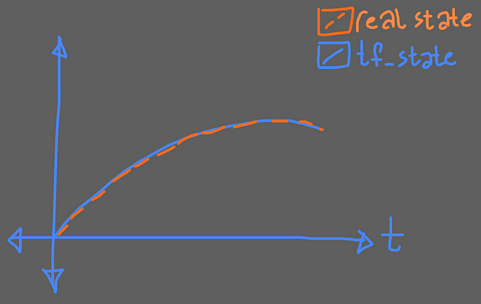
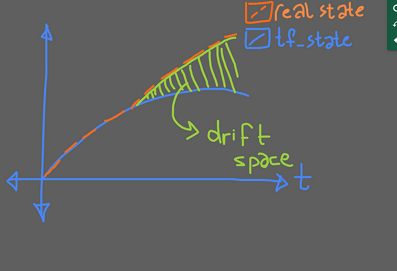
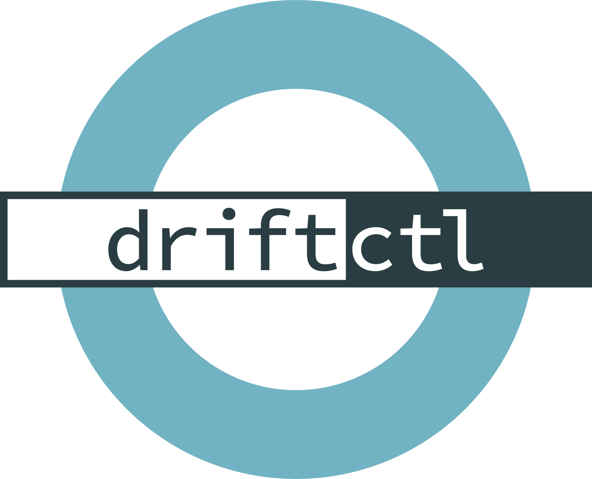

> **Maintaining consistency and reliability in your cloud environment.**

## 📚 Introduction

As [infrastructure-as-code (IaC)](https://en.wikipedia.org/wiki/Infrastructure_as_code) becomes the standard approach for managing cloud resources, it's important to ensure that the deployed infrastructure matches the defined configuration.

However, changes can sometimes occur outside of the IaC process, leading to a state of [**drift**](https://developer.hashicorp.com/terraform/tutorials/state/resource-drift) between the desired and actual infrastructure.

Detecting and addressing this drift is essential for maintaining the reliability, security, and consistency of your cloud environment.

In this blog post, we'll explore three powerful open-source tools that can help you detect drift in your [Terraform](https://www.terraform.io/)-managed infrastructure.

## Preamble

Suppose that you have a S3 bucket and you already created it via terraform code block at day1 your infra and real life state goes like that;

### Day1

When you run your IAC stack it your entire state graphic would be like that:



### Day2

After any kind of manual changes your IAC stack do not cover the entire state.

Now your terraform stack looks like that:



In this graph the greenfield represents the drifted config space.That meaning is your real-state is far away from your current terraform state.

And if you want to maintain your resources via codebase that would be fail because your terraform state will overlap and override the manual changes.

This is a very common, known and big problem in many organization so to fix that problem you can close the console access and manage everything via platform pipelines, according to the circumstances of your organizational structure.

## 🚀 Driftctl



[**Driftctl**](https://terragrunt.gruntwork.io/) is a command-line interface (CLI) tool that specializes in detecting drift between your Terraform configuration and the actual state of your cloud resources. Driftctl offers several key features:

- **Comprehensive Drift Detection**: Driftctl can identify both managed and unmanaged resources, providing a complete picture of the differences between your Terraform configuration and the live infrastructure.
- **Customizable Alerts**: You can configure Driftctl to trigger alerts based on specific drift conditions, helping you stay on top of infrastructure changes.
- **Diff Generation**: Driftctl generates detailed diffs, making it easy to understand the nature and scope of the detected drift.
- **CI/CD Integration**: Driftctl can be seamlessly integrated into your continuous integration and continuous deployment (CI/CD) pipelines, enabling automated drift detection and remediation.

> This project is now in maintenance mode. maintainers cannot promise to review contributions 😢.
> 
> Please feel free to fork the project to apply any changes you might want to make.

## Terragrunt

[Terragrunt](https://terragrunt.gruntwork.io/) is a wrapper tool for Terraform that simplifies the management of complex Terraform configurations. Terragrunt includes built-in drift detection capabilities that compare your desired infrastructure state with the actual deployed resources.
Drift Identification: Terragrunt provides clear and concise information about any detected drift, highlighting the differences between your Terraform configuration and the live infrastructure.
Automated Remediation: Terragrunt makes it easy to plan and apply the necessary changes to correct the identified drift, ensuring your infrastructure remains in sync with your Terraform configuration.

[Haydarctl](https://github.com/WoodProgrammer/haydarctl/tree/master): is a very simple tool that just run the built-in terragrunt commands to compare states between each others.

```shell
terragrunt plan & refresh
```

And it generates a simple markdown output according to the results.

## Atlantis

[Atlantis](https://www.runatlantis.io/) is a self-hosted GitOps tool for Terraform that integrates with your continuous integration (CI) pipeline. Atlantis includes drift detection features that compare your Terraform configurations with the deployed infrastructure.

- **GitOps Workflow with Atlantis**:
  - Seamless integration with your Git repository.
  - Manage infrastructure changes through pull requests and merge approvals.
  - Ensures all changes are tracked, reviewed, and approved before being applied.
  - Maintains a high level of control and accountability.

- **Drift Visualization**:
  - User-friendly interface for visualizing and reviewing detected drift.
  - Easier understanding and addressing of discrepancies between Terraform configuration and actual state.
  - Provides clear and actionable insights.
  - Helps maintain consistency and reliability in your cloud environment.

[atlantis-drift-detection](https://github.com/cresta/atlantis-drift-detection) is an open-source solution for detecting and addressing drift in Terraform infrastructure managed by the Atlantis GitOps tool. Key features include automated drift detection, drift notification, untracked workspace notification, caching, and drift remediation through an example GitHub workflow.

## terraform plan

The [Terraform CLI](https://developer.hashicorp.com/terraform/cli/commands/plan) inherently detects drift for Terraform-managed resources when we run the `terraform plan` command. Any resources that have "drifted" in the remote cloud environment will be picked up as unexpected changes in the plan output.

Unfortunately, `terraform plan` is unable to identify resources that are currently unmanaged by Terraform.

Interestingly, many enterprise drift detection offerings from products like [Terraform Cloud](https://www.hashicorp.com/blog/terraform-cloud-adds-drift-detection-for-infrastructure-management) and [Spacelift](https://spacelift.io/drift-detection) are running managed, regular `terraform plan` commands under the hood.

**Pros:**

- Natively integrated into the Terraform CLI.
- Out-of-the-box support for all cloud resources that can be managed by Terraform.

**Cons:**

- Generally run only when trying to deploy infrastructure changes, which is not an ideal time to discover drift.
- Blind to cloud resources that are not already managed by Terraform.

## terraformer

[`terraformer`](https://github.com/GoogleCloudPlatform/terraformer) is a popular tool for generating Terraform from existing cloud resources. It supports resources across all major cloud providers and many other smaller Terraform providers. Originally built by developers at Waze, the repo is now maintained by Google Cloud's GitHub organization.

**Pros:**

- Create codified versions of an entire cloud subset, including resources that are outside of Terraform control, providing the information needed to match that given by Driftctl.

**Cons:**

- Requires manual comparison against the current Terraform configuration to determine what has drifted and what resources are not yet controlled by Terraform.
- Repository is maintained irregularly, with infrequent commits and most issues closed while in "stale" status.
- Due to a reliance on internal Terraform packages, which were moved to internal/ sub-directories in subsequent releases, `terraformer` only directly supports Terraform 0.13.
- Not all cloud resources are supported by the tool.

## Conclusion

Configuration drift is a big trouble for the IAC and it is a very big problem to provide automation, idempotency, reusability and secure infrastructure, regarding to that you have to be care about the real and terraform states.
The open-source tools explored in this blog post provide powerful capabilities to detect and address drift in Terraform-managed infrastructure.

## References

- https://www.reddit.com/r/devops/comments/18ba8xq/open_source_tools_to_detect_infrastructure_change/
- https://github.com/GoogleCloudPlatform/terraformer
- https://medium.com/@hello_9187/open-source-driftctl-alternatives-fbe79f1a2d94
- https://emirozbirdeveloper.medium.com/configuration-drifts-and-ha-dd55132b2132
  
<br>

**_Until next time, つづく 🎉_**

> 💡 Thank you for Reading !! 🙌🏻😁📃, see you in the next blog.🤘  _**Until next time 🎉**_

🚀 Thank you for sticking up till the end. If you have any questions/feedback regarding this blog feel free to connect with me:

**♻️ LinkedIn:** https://www.linkedin.com/in/rajhi-saif/

**♻️ X/Twitter:** https://x.com/rajhisaifeddine

**The end ✌🏻**

<h1 align="center">🔰 Keep Learning !! Keep Sharing !! 🔰</h1>

**📅 Stay updated**

Subscribe to our newsletter for more insights on AWS cloud computing and containers.
