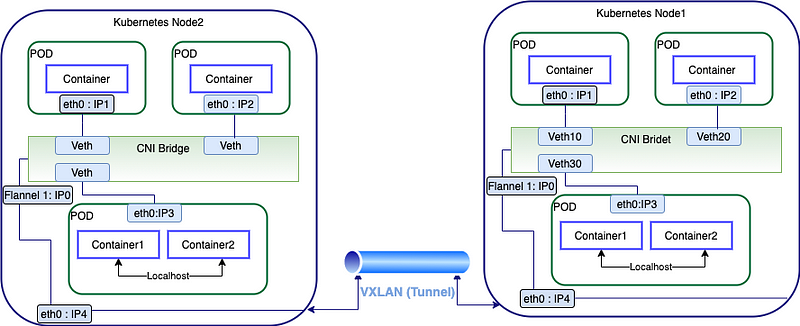
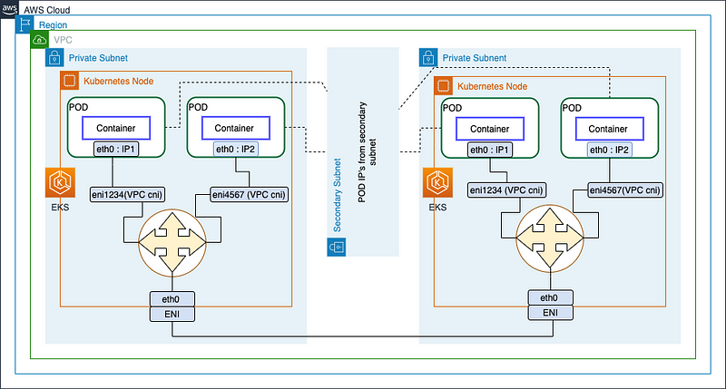
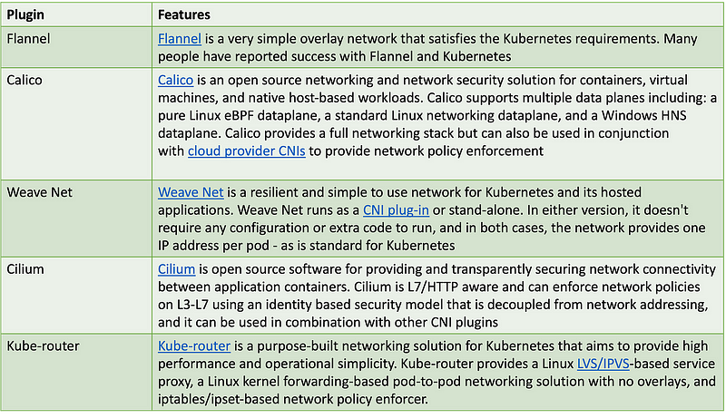
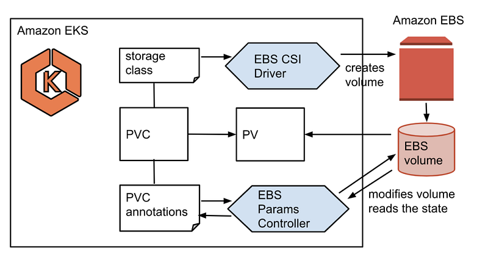
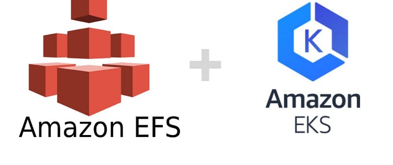
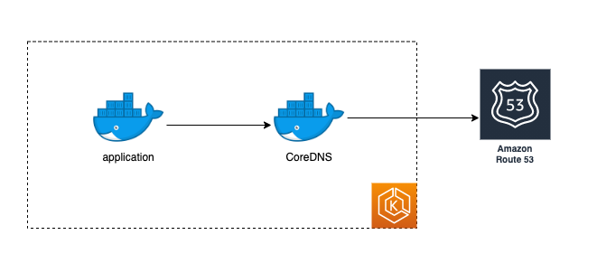
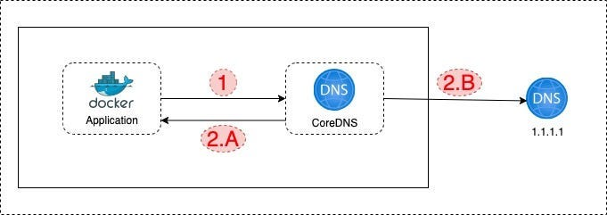
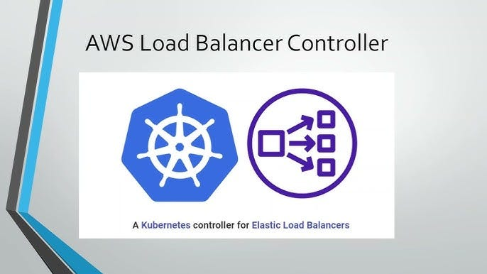
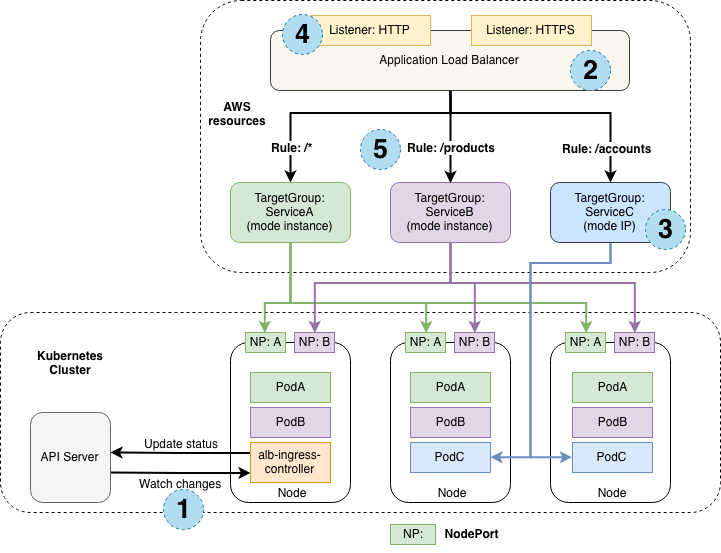

> **Amazon VPC CNI, CoreDNS, Kube-proxy, Amazon EBS CSI driver, Amazon EFS CSI driver, ADOT, AWS Load Balancer Controller add-on and more 😌**

**There's no magic, just mad science 🚀**

## 🤖 Introduction

Much like the formidable Transformers who join forces to create an unstoppable force, Amazon EKS add-ons bring a new level of functionality and performance to your Kubernetes applications. These add-ons are akin to specialized tools that enhance the operational capabilities of your EKS cluster, ensuring seamless interaction with underlying AWS resources for networking, compute, and storage.

Whether it's observability agents or purpose-built Kubernetes drivers, these add-ons are the unsung heroes that bolster your cluster's capabilities.

While EKS provides the foundation for running containerized applications, it's the Amazon EKS add-ons that take your cluster's capabilities to the next level. 

These add-ons are like the Swiss Army knives of Kubernetes, offering a range of supporting operational capabilities that enhance security, stability, and performance.

---

## 🥅 Goals and Objectives

In this blog post, we'll explore the role and importance of Amazon EKS add-ons, shedding light on how they can simplify the management of your EKS clusters.

---

## 🧮 Amazon EKS Add-ons

Amazon EKS add-ons are additional software that enhance Kubernetes applications, providing operational support. They're not tied to a specific application and can include things like observability tools and drivers for interacting with AWS resources. These add-ons are developed and maintained by the Kubernetes community, cloud providers like AWS, or third-party vendors.

Amazon EKS automatically installs certain self-managed add-ons like [Amazon VPC CNI plugin](https://aws.github.io/aws-eks-best-practices/networking/index/), [kube-proxy](https://kubernetes.io/docs/reference/command-line-tools-reference/kube-proxy/), and [CoreDNS](https://coredns.io/) for every cluster, but you can customize and update them as needed.

These add-ons from Amazon EKS come pre-packaged with the latest security updates and bug fixes, all validated by AWS to work seamlessly with Amazon EKS clusters. They simplify the process of ensuring your clusters are secure and stable, reducing the manual work needed for installation, configuration, and updates. If you already have a self-managed add-on like kube-proxy running, you can switch to using the Amazon EKS version to benefit from its features.

* **AWS EKS add-ons** are software components that are provided and managed by AWS. Some of these add-ons are automatically installed on every EKS cluster. These add-ons make it easier to secure, stabilize, and update your clusters. They offer a simplified approach to managing your EKS clusters.

* **Self-managed add-ons**, on the other hand, are managed by the user. This means that the user is responsible for installing, configuring, and updating these add-ons. Self-managed add-ons offer more flexibility, but they require more manual effort to manage.

You can adjust specific configuration settings for Amazon EKS add-ons through the [Amazon EKS API](https://docs.aws.amazon.com/eks/latest/APIReference/Welcome.html). Additionally, you have the flexibility to modify configuration fields not managed by Amazon EKS directly within the Kubernetes cluster after the add-on is installed. These changes won't be overridden by Amazon EKS, thanks to the Kubernetes server-side apply feature.

## 🌐 Amazon VPC CNI Plugin

Amazon VPC CNI Plugin is a Kubernetes container network interface (CNI) plugin that provides native VPC networking for your cluster. The self-managed or managed type of this add-on is installed on each Amazon EC2 node by default.

### What is a Container Networking Interface (CNI)? 🤔

**Container Networking Interface (CNI):**

CNI (Container Network Interface), a [Cloud Native Computing Foundation](https://www.cncf.io/) project, consists of a specification and libraries for writing plugins to configure network interfaces in Linux containers, along with a number of supported plugins. CNI concerns itself only with the network connectivity of containers and removing allocated resources when the container is deleted. Because of this focus, CNI has a wide range of support and the specification is simple and vendor-neutral.

CNI plugins are used by Kubernetes, Cloud Foundry, Podman, CRI-O, etc.

The illustration diagram below describes the CNI plugin used by Kubernetes:



- **Pods have their own IP addresses.**
- When you install Kubernetes, you need to choose a CNI plugin.
- The node manages pod subnets and allocates pod IPs locally.
- Communication/Access from one pod to another pod is through the CNI bridge (layer 2 bridge).
- Flannel creates an interface called Flannel 1, which is an interface between the container runtime and network and is also used to configure network routes.
- The Flannel interface communicates to another node through VXLAN (virtual extensible LAN, encapsulated as UDP packets and exchanged between the hosts).

Network configurations are taken care of by the CNI plugin chosen during installation, which results in fewer network failures.

### Amazon VPC CNI Plugin 🛠️

As we discussed in the previous section, the CNI plugin uses VXLAN, BGP, or other overlay networks for communication and encapsulating the packets over the network. In the case of AWS, encapsulation is taking place at the hardware when using AWS Elastic Network Interfaces (ENI) inside a VPC. AWS CNI uses native networking and removes the dependency on the secondary network for encapsulation.

The illustration diagram below describes the Amazon VPC CNI native plugin for EKS:



**Other Kubernetes CNI providers:**



### 🔐 Required IAM Permissions

This add-on uses the [IAM roles for service accounts IRSA](https://docs.aws.amazon.com/eks/latest/userguide/iam-roles-for-service-accounts.html) capability of Amazon EKS. If your cluster uses the `IPv4` family, the permissions in the [`AmazonEKS_CNI_Policy`](https://docs.aws.amazon.com/IAM/latest/UserGuide/access_policies_create.html) are required. If your cluster uses the IPv6 family, you must create an [IAM policy](https://docs.aws.amazon.com/IAM/latest/UserGuide/access_policies_create.html) with the permissions in [IPv6 mode](https://github.com/aws/amazon-vpc-cni-k8s/blob/master/docs/iam-policy.md#ipv6-mode).

You can create an IAM role, attach one of the policies to it, and annotate the Kubernetes service account used by the add-on with the following command:

```bash
eksctl create iamserviceaccount \ 
    --name aws-node --namespace kube-system \ 
    --cluster my-cluster --role-name AmazonEKSVPCCNIRole \     
    --role-only --attach-policy-arn arn:aws:iam::aws:policy/AmazonEKS_CNI_Policy \
    --approve
```

Replace `my-cluster` with the name of your cluster and `AmazonEKSVPCCNIRole` with the name for your role. If your cluster uses the IPv6 family, then replace `AmazonEKS_CNI_Policy` with the name of the policy that you created.

This command requires that you have [eksctl](https://eksctl.io/) installed on your device. If you need to use a different tool to create the role, attach the policy to it, and annotate the Kubernetes service account, see [Configuring a Kubernetes service account to assume an IAM role](https://docs.aws.amazon.com/eks/latest/userguide/associate-service-account-role.html).

### Additional informations

To learn more about the add-on's configurable settings, see [aws-vpc-cni-k8s on GitHub](https://github.com/aws/amazon-vpc-cni-k8s/blob/master/README.md).

To learn more about the plugin, see [Proposal: CNI plugin for Kubernetes networking over AWS VPC](https://github.com/aws/amazon-vpc-cni-k8s/blob/master/docs/cni-proposal.md). 

For more information about creating the add-on, see [Creating the Amazon EKS add-on.](https://docs.aws.amazon.com/eks/latest/userguide/managing-vpc-cni.html#vpc-add-on-create)

You can only update one minor version at a time. For example, if your current version is `1.25.x-eksbuild.y` and you want to update to `1.27.x-eksbuild.y`, then you must update your current version to `1.26.x-eksbuild.y` and then update it again to `1.27.x-eksbuild.y`.

For more information about updating the add-on, see [Updating the Amazon EKS add-on](https://docs.aws.amazon.com/eks/latest/userguide/managing-vpc-cni.html#vpc-add-on-update).


## 🗄️ Amazon EBS CSI Driver

Before we dive into this section, make sure to familiarize yourself with the Kubernetes storage objects (volumes, persistent volumes (PV), persistent volume claim (PVC), dynamic provisioning, and ephemeral storage) that were introduced in the [Storage](https://www.eksworkshop.com/docs/fundamentals/storage/) main section.

[`emptyDir`](https://kubernetes.io/docs/concepts/storage/volumes/#emptydir) is an example of ephemeral volumes, and we're currently utilizing it in the MySQL StatefulSet. However, we'll work on updating it in this chapter to a Persistent Volume (PV) using Dynamic Volume Provisioning.

The [**Container Storage Interface (CSI)**](https://github.com/container-storage-interface/spec/blob/master/spec.md) is a standard for exposing arbitrary block and file storage systems to containerized workloads on Container Orchestration Systems (COs) like Kubernetes. The [Kubernetes Container Storage Interface (CSI)](https://kubernetes-csi.github.io/docs/) helps you run stateful containerized applications. CSI drivers provide a CSI interface that allows Kubernetes clusters to manage the lifecycle of persistent volumes. Amazon EKS makes it easier for you to run stateful workloads by offering CSI drivers for Amazon EBS.

By using CSI, third-party storage providers can write and deploy plugins exposing new storage systems in Kubernetes without ever having to touch the core Kubernetes code.

In order to use Amazon EBS volumes with dynamic provisioning on your EKS cluster, you need to confirm that the EBS CSI Driver is installed. The [Amazon Elastic Block Store (Amazon EBS) Container Storage Interface (CSI) driver](https://github.com/kubernetes-sigs/aws-ebs-csi-driver) allows Amazon Elastic Kubernetes Service (Amazon EKS) clusters to manage the lifecycle of Amazon EBS volumes for persistent volumes.



The Amazon Elastic Block Store (Amazon EBS) Container Storage Interface (CSI) driver allows Amazon Elastic Kubernetes Service (Amazon EKS) clusters to manage the lifecycle of Amazon EBS volumes for persistent volumes.

### 📝 Considerations for Using the Amazon EBS CSI Driver

- The Amazon EBS CSI plugin requires IAM permissions to make calls to AWS APIs on your behalf. For more information, see [Creating the Amazon EBS CSI driver IAM role](https://docs.aws.amazon.com/eks/latest/userguide/csi-iam-role.html).
- You can't mount Amazon EBS volumes to Fargate Pods.
- You can run the Amazon EBS CSI controller on Fargate nodes, but the Amazon EBS CSI node DaemonSet can only run on Amazon EC2 instances.
- Alpha features of the Amazon EBS CSI driver aren't supported on Amazon EKS clusters.

The Amazon EBS CSI driver isn't installed when you first create a cluster. To use the driver, you must add it as an Amazon EKS add-on or as a self-managed add-on.

For instructions on how to add it as an Amazon EKS add-on, see [Managing the Amazon EBS CSI driver as an Amazon EKS add-on](https://docs.aws.amazon.com/eks/latest/userguide/managing-ebs-csi.html).

For instructions on how to add it as a self-managed installation, see the [Amazon EBS Container Storage Interface (CSI) driver project on GitHub](https://github.com/kubernetes-sigs/aws-ebs-csi-driver).

This add-on uses the [IAM roles for service accounts capability IRSA](https://docs.aws.amazon.com/eks/latest/userguide/iam-roles-for-service-accounts.html) of Amazon EKS. The permissions in the [`AmazonEBSCSIDriverPolicy`](https://docs.aws.amazon.com/aws-managed-policy/latest/reference/AmazonEBSCSIDriverPolicy.html) AWS managed policy are required. You can create an IAM role and attach the managed policy to it with the following command. Replace `my-cluster` with the name of your cluster and `AmazonEKS_EBS_CSI_DriverRole` with the name for your role. This command requires that you have [eksctl](https://eksctl.io/) installed on your device. If you need to use a different tool or you need to use a custom KMS key for encryption, see [Creating the Amazon EBS CSI driver IAM role](https://docs.aws.amazon.com/eks/latest/userguide/csi-iam-role.html).

```bash
eksctl create iamserviceaccount \     
    --name ebs-csi-controller-sa \     
    --namespace kube-system \     
    --cluster my-cluster \     
    --role-name AmazonEKS_EBS_CSI_DriverRole \     
    --role-only \     
    --attach-policy-arn arn:aws:iam::aws:policy/service-role/AmazonEBSCSIDriverPolicy \     
    --approve
```

### 🛠️ Adding the Amazon EBS CSI Add-on Using `eksctl`

Run the following command. Replace `my-cluster` with the name of your cluster, `111122223333` with your account ID, and `AmazonEKS_EBS_CSI_DriverRole` with the name of the IAM role created earlier. If your cluster is in the AWS GovCloud (US-East) or AWS GovCloud (US-West) AWS Regions, then replace `arn:aws:` with `arn:aws-us-gov:`.

```bash
eksctl create addon --name aws-ebs-csi-driver --cluster my-cluster --service-account-role-arn arn:aws:iam::111122223333:role/AmazonEKS_EBS_CSI_DriverRole --force
```

If you remove the `--force` option and any of the Amazon EKS add-on settings conflict with your existing settings, then updating the Amazon EKS add-on fails, and you receive an error message to help you resolve the conflict. Before specifying this option, make sure that the Amazon EKS add-on doesn't manage settings that you need to manage, because those settings are overwritten with this option. For more information about other options for this setting, see [Addons in the eksctl documentation](https://eksctl.io/usage/addons/). For more information about Amazon EKS Kubernetes field management, see [Kubernetes field management](https://docs.aws.amazon.com/eks/latest/userguide/kubernetes-field-management.html).

### 📚 Additional Information

To learn more about the add-on, see [Amazon EBS CSI driver](https://docs.aws.amazon.com/eks/latest/userguide/ebs-csi.html).

To add the Amazon EBS CSI add-on using `eksctl`, follow the instructions provided above.

For more information about creating the add-on, see [Creating the Amazon EBS CSI driver IAM role](https://docs.aws.amazon.com/eks/latest/userguide/ebs-csi.html).

For more information about updating the add-on, see [Updating the Amazon EBS CSI driver](https://docs.aws.amazon.com/eks/latest/userguide/ebs-csi.html).

## 📂 Amazon EFS CSI Driver



[Amazon Elastic File System (Amazon EFS)](https://docs.aws.amazon.com/efs/latest/ug/whatisefs.html) provides serverless, fully elastic file storage so that you can share file data without provisioning or managing storage capacity and performance. The [Amazon EFS Container Storage Interface (CSI) driver](https://github.com/kubernetes-sigs/aws-efs-csi-driver) provides a CSI interface that allows Kubernetes clusters running on AWS to manage the lifecycle of Amazon EFS file systems. This topic shows you how to deploy the Amazon EFS CSI driver to your Amazon EKS cluster.

The EFS CSI driver makes it simple to configure elastic file storage for both EKS and self-managed Kubernetes clusters running on AWS using standard Kubernetes interfaces. Applications running in Kubernetes can use EFS file systems to share data between pods in a scale-out group, or with other applications running within or outside of Kubernetes. EFS can also help Kubernetes applications be highly available because all data written to EFS is written to multiple AWS Availability Zones. If a Kubernetes pod is terminated and relaunched, the CSI driver will reconnect the EFS file system, even if the pod is relaunched in a different AWS Availability Zone.

### 🛠️ Creating Your Amazon EFS CSI Driver IAM Role with `eksctl`

Run the following command to create the IAM role and Kubernetes service account. It also attaches the policy to the role, annotates the Kubernetes service account with the IAM role ARN, and adds the Kubernetes service account name to the trust policy for the IAM role. Replace `my-cluster` with your cluster name and `AmazonEKS_EFS_CSI_DriverRole` with the name for your role.

```bash
export cluster_name=my-cluster
export role_name=AmazonEKS_EFS_CSI_DriverRole

eksctl create iamserviceaccount \
    --name efs-csi-controller-sa \
    --namespace kube-system \
    --cluster $cluster_name \
    --role-name $role_name \
    --role-only \
    --attach-policy-arn arn:aws:iam::aws:policy/service-role/AmazonEFSCSIDriverPolicy \
    --approve

TRUST_POLICY=$(aws iam get-role --role-name $role_name --query 'Role.AssumeRolePolicyDocument' | \
    sed -e 's/efs-csi-controller-sa/efs-csi-*/' -e 's/StringEquals/StringLike/')

aws iam update-assume-role-policy --role-name $role_name --policy-document "$TRUST_POLICY"
```

### 🚀 Installing the Amazon EFS CSI Driver

To use Amazon EFS file system with dynamic provisioning on your EKS cluster, confirm that the EFS CSI Driver is installed. The Amazon Elastic File System Container Storage Interface (CSI) Driver implements the CSI specification for container orchestrators to manage the lifecycle of Amazon EFS file systems.

We recommend that you install the Amazon EFS CSI driver through the Amazon EKS add-on. To add an Amazon EKS add-on to your cluster, see [Creating an add-on](https://docs.aws.amazon.com/eks/latest/userguide/eks-add-ons.html). For more information about add-ons, see [Amazon EKS add-ons](https://docs.aws.amazon.com/eks/latest/userguide/eks-add-ons.html).

If you're unable to use the Amazon EKS add-on, we encourage you to submit an issue about why you can't to the [Containers roadmap GitHub repository](https://github.com/aws/containers-roadmap/issues).

Alternatively, if you want a self-managed installation of the Amazon EFS CSI driver, see [Installation on GitHub](https://github.com/kubernetes-sigs/aws-efs-csi-driver/blob/master/docs/README.md#installation).

## 🧩 Amazon EKS CoreDNS

CoreDNS is a flexible, extensible DNS server that can serve as the Kubernetes cluster DNS. The self-managed or managed type of this add-on was installed, by default, when you created your cluster. When you launch an Amazon EKS cluster with at least one node, two replicas of the CoreDNS image are deployed by default, regardless of the number of nodes deployed in your cluster. The CoreDNS Pods provide name resolution for all Pods in the cluster. You can deploy the CoreDNS Pods to Fargate nodes if your cluster includes an [AWS Fargate profile](https://docs.aws.amazon.com/eks/latest/userguide/fargate-profile.html) with a namespace that matches the namespace for the CoreDNS deployment.



CoreDNS is an open-source DNS service with a Kubernetes plugin for service discovery and by default, it's a DNS server for most of the Kubernetes distributions. Service discovery is actually the main motivation behind hosting a DNS server inside the Kubernetes cluster, otherwise, all DNS queries would go to an external DNS server.

Better to explain with a drawing:



1. Application makes a DNS query.
2. 
    - **A:** If the record is a Kubernetes service record, like "application2-internal-service", CoreDNS responds with the service IP address result.
    - **B:** If the record is an external endpoint record like "api.google.com", then CoreDNS asks the record to the external DNS server.

This architecture is done via `kubelet`, it overwrites the `/etc/resolv.conf` file with content below:

```plaintext
nameserver 172.20.0.10  # COREDNS "SERVICE" IP ADDRESS
search [clustername].svc.cluster.local svc.cluster.local cluster.local eu-central-1.compute.internal
options ndots:5
```

Each pod inherits this `/etc/resolv.conf` configuration and thanks to the "nameserver" line, each pod goes to the CoreDNS service endpoint and CoreDNS pods after that.

### 🛠️ Creating the Amazon EKS Add-on

1. **See which version of the add-on is installed on your cluster:**

     ```bash
     kubectl describe deployment coredns --namespace kube-system | grep coredns: | cut -d : -f 3
     ```

     An example output is as follows:

     ```plaintext
     v1.9.3-eksbuild.7
     ```

2. **See which type of the add-on is installed on your cluster:**

     Depending on the tool that you created your cluster with, you might not currently have the Amazon EKS add-on type installed on your cluster. Replace `my-cluster` with the name of your cluster.

     ```bash
     aws eks describe-addon --cluster-name my-cluster --addon-name coredns --query addon.addonVersion --output text
     ```

     If a version number is returned, you have the Amazon EKS type of the add-on installed on your cluster and don't need to complete the remaining steps in this procedure. If an error is returned, you don't have the Amazon EKS type of the add-on installed on your cluster. Complete the remaining steps of this procedure to install it.

3. **Save the configuration of your currently installed add-on:**

     ```bash
     kubectl get deployment coredns -n kube-system -o yaml > aws-k8s-coredns-old.yaml
     ```

4. **Create the add-on using the AWS CLI:**

     If you want to use the AWS Management Console or `eksctl` to create the add-on, see [Creating an add-on](https://docs.aws.amazon.com/eks/latest/userguide/eks-add-ons.html) and specify `coredns` for the add-on name. Copy the command that follows to your device. Make the following modifications to the command, as needed, and then run the modified command.

     Replace `my-cluster` with the name of your cluster. Replace `v1.10.1-eksbuild.4` with the latest version listed in the latest version table for your cluster version.

     ```bash
     aws eks create-addon --cluster-name my-cluster --addon-name coredns --addon-version v1.10.1-eksbuild.4
     ```

     If you've applied custom settings to your current add-on that conflict with the default settings of the Amazon EKS add-on, creation might fail. If creation fails, you receive an error that can help you resolve the issue. Alternatively, you can add `--resolve-conflicts OVERWRITE` to the previous command. This allows the add-on to overwrite any existing custom settings. Once you've created the add-on, you can update it with your custom settings.

5. **Confirm that the latest version of the add-on for your cluster's Kubernetes version was added to your cluster:**

     Replace `my-cluster` with the name of your cluster.

     ```bash
     aws eks describe-addon --cluster-name my-cluster --addon-name coredns --query addon.addonVersion --output text
     ```

     It might take several seconds for add-on creation to complete. An example output is as follows:

     ```plaintext
     v1.10.1-eksbuild.4
     ```

6. **If you made custom settings to your original add-on, before you created the Amazon EKS add-on, use the configuration that you saved in a previous step to [update](https://docs.aws.amazon.com/eks/latest/userguide/coredns-add-on-update.html) the Amazon EKS add-on with your custom settings.**

For more information, visit the [Amazon EKS Documentation](https://docs.aws.amazon.com/eks/latest/userguide/managing-coredns.html).

## 🛠️ Kube-proxy Amazon EKS Add-on

The **Kube-proxy Amazon EKS Add-on** adds support for [kube-proxy](https://kubernetes.io/docs/concepts/overview/components/#kube-proxy). Kube-proxy maintains network rules on each Amazon EC2 node, enabling network communication to your pods

> Note that kube-proxy is not deployed to Fargate nodes.

For more information, see [kube-proxy in the Kubernetes documentation](https://kubernetes.io/docs/reference/command-line-tools-reference/kube-proxy/).

Installing Kube-proxy as an Amazon EKS add-on reduces the amount of work needed to install, configure, and update add-ons. It includes the latest security patches, bug fixes, and is validated by AWS to work with Amazon EKS. This ensures that Amazon EKS clusters are secure and stable.

Amazon EKS automatically installs Kube-proxy as a self-managed add-on for every cluster. If it is already running on your cluster, you can still install it as an Amazon EKS add-on to start benefiting from the capabilities of Amazon EKS add-ons.

To learn more about kube-proxy, see [kube-proxy in the Kubernetes documentation](https://kubernetes.io/docs/reference/command-line-tools-reference/kube-proxy/).

### 🔄 Update Information

Before updating your current version, consider the following requirements:

- **Compatibility and Skew Policy:** Kube-proxy on an Amazon EKS cluster has the same compatibility and skew policy as Kubernetes.
- **Version Matching:** Kube-proxy must be the same minor version as kubelet on your Amazon EC2 nodes.
- **Control Plane Version:** Kube-proxy can't be later than the minor version of your cluster's control plane.
- **Version Gap:** The kube-proxy version on your Amazon EC2 nodes can't be more than two minor versions earlier than your control plane. For example, if your control plane is running Kubernetes 1.27, then the kube-proxy minor version can't be earlier than 1.25.
- **Node Update:** If you recently updated your cluster to a new Kubernetes minor version, then update your Amazon EC2 nodes to the same minor version before updating kube-proxy to the same minor version as your nodes.

For more detailed information, visit the [Amazon EKS Documentation](https://docs.aws.amazon.com/eks/latest/userguide/managing-kube-proxy.html).

## 🌐 AWS Load Balancer Controller Add-on

AWS Load Balancer Controller is a controller to help manage Elastic Load Balancers for a Kubernetes cluster.

It satisfies [Kubernetes Ingress resources](https://kubernetes.io/docs/concepts/services-networking/ingress/) by provisioning [Application Load Balancers](https://docs.aws.amazon.com/elasticloadbalancing/latest/application/introduction.html). It satisfies [Kubernetes Service resources](https://kubernetes.io/docs/concepts/services-networking/service/) by provisioning [Network Load Balancers](https://docs.aws.amazon.com/elasticloadbalancing/latest/network/introduction.html).

This project was formerly known as "AWS ALB Ingress Controller". We rebranded it to be "AWS Load Balancer Controller". AWS ALB Ingress Controller was originated by [Ticketmaster](https://github.com/ticketmaster) and [CoreOS](https://github.com/coreos) as part of Ticketmaster's move to AWS and CoreOS Tectonic. Learn more about Ticketmaster's Kubernetes initiative from Justin Dean's video at [Tectonic Summit](https://www.youtube.com/watch?v=wqXVKneP0Hg). AWS ALB Ingress Controller was donated to Kubernetes SIG-AWS to allow AWS, CoreOS, Ticketmaster, and other SIG-AWS contributors to officially maintain the project. SIG-AWS reached this consensus on June 1, 2018.



### How AWS Load Balancer Controller Works

**Design:**



The following diagram details the AWS components this controller creates. It also demonstrates the route ingress traffic takes from the ALB to the Kubernetes cluster.

**Ingress Creation:**

This section describes each step (circle) above. This example demonstrates satisfying one ingress resource.

1. The controller watches for ingress events from the API server. When it finds ingress resources that satisfy its requirements, it begins the creation of AWS resources.
2. An ALB (ELBv2) is created in AWS for the new ingress resource. This ALB can be internet-facing or internal. You can also specify the subnets it's created in using annotations.
3. Target Groups are created in AWS for each unique Kubernetes service described in the ingress resource.
4. Listeners are created for every port detailed in your ingress resource annotations. When no port is specified, sensible defaults (80 or 443) are used. Certificates may also be attached via annotations.
5. Rules are created for each path specified in your ingress resource. This ensures traffic to a specific path is routed to the correct Kubernetes Service.

Along with the above, the controller also:
- Deletes AWS components when ingress resources are removed from Kubernetes.
- Modifies AWS components when ingress resources change in Kubernetes.
- Assembles a list of existing ingress-related AWS components on start-up, allowing you to recover if the controller were to be restarted.

**Ingress Traffic:**

AWS Load Balancer Controller supports two traffic modes:
- **Instance mode**
- **IP mode**

By default, Instance mode is used. Users can explicitly select the mode via `alb.ingress.kubernetes.io/target-type` annotation.

**Instance mode:**
Ingress traffic starts at the ALB and reaches the Kubernetes nodes through each service's NodePort. This means that services referenced from ingress resources must be exposed by type:NodePort in order to be reached by the ALB.

**IP mode:**
Ingress traffic starts at the ALB and reaches the Kubernetes pods directly. CNIs must support directly accessible POD IP via [secondary IP addresses on ENI](https://docs.aws.amazon.com/AWSEC2/latest/UserGuide/using-eni.html).

### 🚀 Load Balancer Controller Installation

We recommend blocking access to instance metadata by requiring the instance to use [IMDSv2](https://docs.aws.amazon.com/AWSEC2/latest/UserGuide/configuring-instance-metadata-service.html) only. For more information, please refer to the AWS guidance [here](https://docs.aws.amazon.com/AWSEC2/latest/UserGuide/configuring-instance-metadata-service.html). If you are using IMDSv2, set the hop limit to 2 or higher to allow the LBC to perform the metadata introspection.

You can set the IMDSv2 as follows:

```bash
aws ec2 modify-instance-metadata-options --http-put-response-hop-limit 2 --http-tokens required --region <region> --instance-id <instance-id>
```

Instead of depending on IMDSv2, you can specify the AWS Region and the VPC via the controller flags `--aws-region` and `--aws-vpc-id`.

### ✅ Configure IAM Permissions

The controller runs on the worker nodes, so it needs access to the AWS ALB/NLB APIs with IAM permissions. The IAM permissions can either be set up using [IAM roles for service accounts (IRSA)](https://docs.aws.amazon.com/eks/latest/userguide/iam-roles-for-service-accounts.html) or can be attached directly to the worker node IAM roles. The best practice is using IRSA if you're using Amazon EKS. If you're using kOps or self-hosted Kubernetes, you must manually attach policies to node instances.

The reference IAM policies contain the following permissive configuration:

```json
{
    "Effect": "Allow",
    "Action": [
        "ec2:AuthorizeSecurityGroupIngress",
        "ec2:RevokeSecurityGroupIngress"
    ],
    "Resource": "*"
}
```

We recommend further scoping down this configuration based on the VPC ID or cluster name resource tag.

**Example condition for VPC ID:**

```json
"Condition": {
    "ArnEquals": {
        "ec2:Vpc": "arn:aws:ec2:<REGION>:<ACCOUNT-ID>:vpc/<VPC-ID>"
    }
}
```

**Example condition for cluster name resource tag:**

```json
"Condition": {
    "Null": {
        "aws:ResourceTag/kubernetes.io/cluster/<CLUSTER-NAME>": "false"
    }
}
```

### ✅ Create an IAM OIDC Provider

You can skip this step if you already have one for your cluster:

```bash
eksctl utils associate-iam-oidc-provider \
    --region <region-code> \
    --cluster <your-cluster-name> \
    --approve
```

### ✅ Download an IAM Policy for the LBC

Use one of the following commands:

```bash
curl -o iam-policy.json https://raw.githubusercontent.com/kubernetes-sigs/aws-load-balancer-controller/v2.6.0/docs/install/iam_policy.json
```

### ✅ Create an IAM Policy Named AWSLoadBalancerControllerIAMPolicy

If you downloaded a different policy, replace `iam-policy` with the name of the policy that you downloaded.

```bash
aws iam create-policy \
    --policy-name AWSLoadBalancerControllerIAMPolicy \
    --policy-document file://iam-policy.json
```

Take note of the policy ARN that's returned.

### ✅ Create an IAM Role and Kubernetes ServiceAccount for the LBC

Use the ARN from the previous step:

```bash
eksctl create iamserviceaccount \
--cluster=<cluster-name> \
--namespace=kube-system \
--name=aws-load-balancer-controller \
--attach-policy-arn=arn:aws:iam::<AWS_ACCOUNT_ID>:policy/AWSLoadBalancerControllerIAMPolicy \
--override-existing-serviceaccounts \
--region <region-code> \
--approve
```

### 🌐 Network Configuration

Review the [worker nodes security group docs](https://docs.aws.amazon.com/eks/latest/userguide/sec-group-reqs.html). Your node security group must permit incoming traffic on TCP port 9443 from the Kubernetes control plane. This is needed for webhook access. If you use `eksctl`, this is the default configuration.

### 🚀 Add Controller to Cluster

We recommend using the Helm chart to install the controller. The chart supports Fargate and facilitates updating the controller. If you want to run the controller on Fargate, use the Helm chart, since it doesn't depend on the cert-manager.

**Detailed Instructions:**

Follow the instructions in the [aws-load-balancer-controller Helm chart](https://github.com/aws/eks-charts/tree/master/stable/aws-load-balancer-controller).

**Add the EKS chart repo to Helm:**

```bash
helm repo add eks https://aws.github.io/eks-charts
```

**If upgrading the chart via helm upgrade, install the TargetGroupBinding CRDs:**

```bash
kubectl apply -k "github.com/aws/eks-charts/stable/aws-load-balancer-controller//crds?ref=master"
```

**Helm install command for clusters with IRSA:**

```bash
helm install aws-load-balancer-controller eks/aws-load-balancer-controller -n kube-system --set clusterName=<cluster-name> --set serviceAccount.create=false --set serviceAccount.name=aws-load-balancer-controller
```

## 📢 Calls to Action

### 🚀 Give Amazon EKS Add-ons a Spin!

If you are running Amazon EKS and you haven't tried add-ons yet, now is the time. The new advanced configurations add more robust configuration management to Amazon EKS add-ons. You can now discover additional settings that are underpinned by the Helm charts we use to manage add-ons in your clusters. This provides for more granular configurations, a more flexible user experience, and better fits new and existing DevOps automation.

### 🔍 Check Out Our Containers Roadmap!

Explore our [containers roadmap](https://github.com/aws/containers-roadmap/projects/1) to see what's coming next. If you have ideas about how we can improve Amazon EKS add-ons or other aspects of our container services, please use our containers roadmap to provide us feedback and review our existing roadmap items.


### 💡 Share Your Feedback

Your feedback is invaluable to us. Help us shape the future of Amazon EKS add-ons by sharing your thoughts and suggestions on our [GitHub issues page](https://github.com/aws/containers-roadmap/issues).


---

## 📜 Conclusion

Amazon EKS add-ons are curated software components that simplify and enhance the management of Kubernetes clusters. They streamline operations, boost security and stability, and offload the heavy lifting of configuring and maintaining essential components.

This frees users to focus on developing and innovating containerized applications.

In a world where cloud-native technologies are constantly evolving, efficient cluster management is critical. Amazon EKS add-ons provide a reliable and efficient way to ensure that Kubernetes clusters are always up-to-date, secure, and well-configured.

By automating the deployment and maintenance of critical components, AWS empowers users to optimize their time and resources, making it easier than ever to harness the full potential of Kubernetes on the cloud.

**References:**

- [Installation Guide - AWS Load Balancer Controller](https://kubernetes-sigs.github.io/aws-load-balancer-controller/v2.6/deploy/installation/)
- [Amazon EKS Pod Networking](https://docs.aws.amazon.com/eks/latest/userguide/pod-networking.html)
- [Kubernetes Networking Concepts](https://kubernetes.io/docs/concepts/cluster-administration/networking/)
- [YouTube: Kubernetes Networking](https://www.youtube.com/watch?v=7LRtytR6ZbA&t=296s)
- [YouTube: EKS Networking Deep Dive](https://www.youtube.com/watch?v=U35C0EPSwoY)
- [Medium: EKS EBS Storage with eksctl](https://joachim8675309.medium.com/eks-ebs-storage-with-eksctl-3e526f534215)
- [Amazon EKS Add-ons Documentation](https://docs.aws.amazon.com/eks/latest/userguide/eks-add-ons.html)

<br>

**_Until next time, つづく 🎉_**

> 💡 Thank you for Reading !! 🙌🏻😁📃, see you in the next blog.🤘  _**Until next time 🎉**_

🚀 Thank you for sticking up till the end. If you have any questions/feedback regarding this blog feel free to connect with me:

**♻️ LinkedIn:** https://www.linkedin.com/in/rajhi-saif/

**♻️ X/Twitter:** https://x.com/rajhisaifeddine

**The end ✌🏻**

<h1 align="center">🔰 Keep Learning !! Keep Sharing !! 🔰</h1>

**📅 Stay updated**

Subscribe to our newsletter for more insights on AWS cloud computing and containers.
