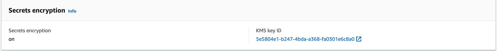

> **Enhance security and simplify secrets management for K8s apps**

## 🗯 Introduction

Managing secrets like API keys and database passwords securely is important to keep the applications running in Kubernetes secure.

And if you're using Amazon EKS Elastic Kubernetes Service for your Kubernetes applications, AWS KMS with AWS Secrets Manager can help you handle these secrets safely and easily.

## ㊙️ Using AWS Secrets Manager with Amazon EKS

[AWS Secrets Manager](https://docs.aws.amazon.com/secretsmanager/latest/userguide/integrating_csi_driver.html) can be integrated with EKS using the [AWS Secrets and Configuration Provider ASCP](https://github.com/aws/secrets-store-csi-driver-provider-aws) for the [Kubernetes Secrets Store CSI Driver](https://secrets-store-csi-driver.sigs.k8s.io/).

**Benefits:**

- Centralized secret management
- Fine-grained access control
- Seamless integration with EKS
- Ability to mount secrets as volumes in pods
- Option to sync with native Kubernetes secrets


**Implementation steps:**

1. Create secrets in AWS Secrets Manager
2. Create an IAM policy for secret retrieval
3. Use [IAM Roles for Service Accounts (IRSA)](https://docs.aws.amazon.com/eks/latest/userguide/iam-roles-for-service-accounts.html) to limit secret access
4. Deploy a SecretProviderClass custom resource
5. Configure pods to mount volumes based on the SecretProviderClass
6. Sync mounted secrets to native Kubernetes secrets
7. Set up environment variables in pods using specific secret keys


## Encrypting Kubernetes Secrets in Amazon EKS

Amazon EKS clusters (version 1.13+) support encrypting [Kubernetes secrets](https://kubernetes.io/docs/concepts/configuration/secret/) using [AWS Key Management Service (KMS) Customer Managed Keys (CMK)](https://docs.aws.amazon.com/kms/latest/developerguide/concepts.html). This provides stronger security than the default Base64 encoding.
Key points:

- No changes are required in how secrets are used.
- Encryption provider support must be enabled during EKS cluster creation
- Each secret write generates a unique Data Encryption Key (DEK).
- The DEK is encrypted with the CMK and stored in etcd.
- Decryption occurs when pods access the secret.

## EKS Secrets and Secrets Manager hands-on guide

Let us start by provisioning our EKS cluster using Terraform the IAC tool.

First, clone the repo:

```shell
$ git clone https://github.com/seifrajhi/eks-secrets-manager-kms-demo.git
```

Then run the following commands:

```shell
$ cd eks-secrets-manager-kms-demo/eks-tf
$ terraform init
$ terraform plan
$ terraform apply --auto-approve
```

This will provision the EKS cluster and VPC with the needed add-ons.

## Deploy the app

To deploy the app, clone the repo:

```shell
$ git clone https://github.com/seifrajhi/eks-secrets-manager-kms-demo.git
```

For the deployment of our demo application, we have created the Helm chart and uploaded it to the [Git Repository](https://github.com/seifrajhi/eks-secrets-manager-kms-demo/tree/main/helm-charts).

Install the Helm chart:

```shell
cd eks-secrets-manager-kms-demo/helm-charts
helm install demo .
NAME: demo
LAST DEPLOYED: Sat Oct 11 18:42:20 2024
NAMESPACE: default
STATUS: deployed
REVISION: 1
```

### Deploy Amazon EBS CSI Driver

[The Container Storage Interface (CSI)](https://github.com/container-storage-interface/spec/blob/master/spec.md) is a standard for exposing arbitrary block and file storage systems to containerized workloads on Container Orchestration Systems (COs) like Kubernetes.
Using CSI third-party storage providers can write and deploy plugins exposing new storage systems in Kubernetes without ever having to touch the core Kubernetes code.

[The Amazon Elastic Block Store (Amazon EBS) Container Storage Interface (CSI) driver](https://github.com/kubernetes-sigs/aws-ebs-csi-driver) provides a CSI interface that allows Amazon Elastic Kubernetes Service (Amazon EKS) clusters to manage the lifecycle of Amazon EBS volumes for persistent volumes.

EBS was installed as part of the cluster add-ons.

### Define Storage Class

[Dynamic Volume Provisioning](https://kubernetes.io/docs/concepts/storage/dynamic-provisioning/) allows storage volumes to be created on-demand.

[StorageClass](https://kubernetes.io/docs/concepts/storage/storage-classes/) should be pre-created to define which provisioner should be used and what parameters should be passed when dynamic provisioning is invoked.

```yaml
kind: StorageClass
apiVersion: storage.k8s.io/v1
metadata:
  name: mysql-gp3
provisioner: ebs.csi.aws.com # <--  Amazon EBS CSI driver
parameters:
  type: gp3
  encrypted: 'true' 
volumeBindingMode: WaitForFirstConsumer
reclaimPolicy: Delete
mountOptions:
- debug
```

Create storageclass `mysql-gp3` by running the following command:

```shell
kubectl create -f sc-gp3-mysql.yaml
```

### Deploy StatefulSet workload

We are going to deploy a MYSQL database using StatefulSet.

<div class="note">
    <p><strong>🔵 Note:</strong></p>
    <p>The MySQL deployment consists of a ConfigMap, two Services, a Kubernetes secret for the root password and a StatefulSet.</p>
</div>

The [ConfigMap](https://kubernetes.io/docs/tasks/configure-pod-container/configure-pod-configmap/) allows you to decouple configuration artifacts and secrets from image content to keep containerized applications portable. 

The ConfigMap stores `source.cnf`, `replica.cnf` and passes them when initializing leader and follower pods defined in StatefulSet:

* **source.cnf:** is for the MySQL leader pod which has binary log option (log-bin) to provides a record of the data changes to be sent to follower servers.
* **replica.cnf:** is for follower pods which have super-read-only option.

`mysql-cm.yaml` manifest:

```Yaml
apiVersion: v1
kind: ConfigMap
metadata:
  name: mysql-config
  namespace: workshop
  labels:
    app: mysql
data:
  source.cnf: |
    # Apply this config only on the leader.
    [mysqld]
    log-bin
  replica.cnf: |
    # Apply this config only on followers.
    [mysqld]
    # super-read-only
```

Then run:
```shell
kubectl create -f mysql-cm.yaml
```

StatefulSet requires a [Headless Service](https://kubernetes.io/docs/concepts/services-networking/service/#headless-services) to control the domain of its Pods, directly reach each Pod with stable DNS entries.

> The Headless Service provides a home for the DNS entries that the StatefulSet controller creates for each Pod that's part of the set. By specifying "None" for the clusterIP, you can create Headless Service.
>
> Because the Headless Service is named mysql, the Pods are accessible by resolving **`.mysql`** from within any other Pod in the same Kubernetes cluster and namespace.

You can see the `mysql service` is for DNS resolution so that when pods are placed by StatefulSet controller, pods can be resolved using pod-name.mysql.

The Client Service `mysql-read` is a normal client Service with its own cluster IP that distributes connections across all MySQL Pods that report being Ready.

Create service **mysql** and **mysql-read** by running the following commands:

```Shell
$ git clone https://github.com/seifrajhi/eks-secrets-manager-kms-demo.git
$ cd eks-secrets-manager-kms-demo/demo-app
$ kubectl create -f mysql-svc.yaml
```

StatefulSet consists of **serviceName**, **replicas**, **template** and **volumeClaimTemplates**:

- serviceName is "mysql", headless service we created in previous section.
- replicas is 2, the desired number of pod.
- template is the configuration of pod.
- volumeClaimTemplates is to claim volume for pod based on storageClassName gp3.

Run the following command under demo-app directory:

```shell
$ kubectl apply -f statefulset.yaml
```

**Populate database:**

We are creating the database qa and products table in below command and inserting a products into the table. Later we will see how this data will show up in our application which is accessing this database.

```shell
$ kubectl -n workshop run mysql-client --image=mysql:5.7 -i --rm --restart=Never --\
  mysql -uroot -pdemo_ascp -h mysql-0.mysql.workshop <<EOF
CREATE DATABASE qa;
CREATE TABLE qa.products (prodId VARCHAR(120), prodName VARCHAR(120));
INSERT INTO qa.products (prodId,prodName) VALUES ('999','Mountain Bike');
EOF
```

## Kubernetes secrets encryption using AWS KMS

When we deployed the MySQL database, and the kubernetes secret `mysql-secret` to hold the **password** for the database, the EKS control plane created a [Data Encryption Key (DEK)](https://docs.aws.amazon.com/sns/latest/dg/sns-server-side-encryption.html#sse-key-terms) to encrypt the secret, saved the encrypted secret to etcd and used [kms:encrypt](https://kubernetes.io/docs/tasks/administer-cluster/kms-provider/) to encrypt DEK and cached the encrypted DEK.

Let's use the Kubernetes secret `mysql-secret` created while deploying the MySQL StatefulSet in the prodcatalog service to connect to the MYSQL database and show how EKS uses KMS to decrypt the Kubernetes secret `mysql-secret`.

```Shell
$ cd helm-charts
$ helm upgrade --reuse-values -f values-k8s-secret.yaml demo .

Release "demo" has been upgraded. Happy Helming!
NAME: demo
LAST DEPLOYED: Sat Oct 11 19:20:20 2024
NAMESPACE: default
STATUS: deployed
REVISION: 3
```

**Validate Kubernetes Encryption using KMS:**

Now let's validate that AWS KMS was used when we create and use the kubernetes secret.

Log into console and navigate to `EKS → Cluster → Overview,` you will see the Secrets encryption as shown below:



The EKS cluster was created with KMS encryption enabled and that is why your Secrets encryption is enabled.

_Make a note of the KMS key ID._

A **cloudtrail Decrypt** event corresponding to this KMS key ID should be available with sourceIpAddress as `eks.amazonaws.com`.

If you go to [CloudTrail](https://docs.aws.amazon.com/awscloudtrail/latest/userguide/cloudtrail-user-guide.html) you should see a record available if you search for the Event types Encrypt and Decrypt.

### Mount secrets from AWS Secrets Manager

We have the MYSQL StatefulSet deployed and now we are going to save the password for the MYSQL database in AWS Secrets Manager and sync the secrets manager secret to a Native Kubernertes secret using the [Secrets Store CSI driver](https://secrets-store-csi-driver.sigs.k8s.io/).

The Kubernetes secret created by the CSI driver will be used in the **productcatalog** service to connect to the MYSQL Database.

**Install CSI Driver:**

Prepare your cluster by installing Secrets Store CSI Secret driver and AWS Secrets and Configuration Provider (ASCP).

```shell
helm repo add secrets-store-csi-driver https://kubernetes-sigs.github.io/secrets-store-csi-driver/charts
```

Then install the CSI driver:

```shell
$ helm install -n kube-system csi-secrets-store \
--set syncSecret.enabled=true \
--set enableSecretRotation=true \
secrets-store-csi-driver/secrets-store-csi-driver
```

Then install AWS Secrets and Configuration [Provider ASCP](https://docs.aws.amazon.com/secretsmanager/latest/userguide/integrating_csi_driver.html):

```shell
helm repo add aws-secrets-manager https://aws.github.io/secrets-store-csi-driver-provider-aws
helm install -n kube-system secrets-provider-aws aws-secrets-manager/secrets-store-csi-driver-provider-aws
```

**Prepare Secret and IAM access:**

Next step, create a test secret in AWS Secrets Manager:

```Shell
$ aws secretsmanager create-secret \
--name DBSecret_eksdemo \
--description "MYSQL DB Secret." \
--secret-string "{\"username\":\"root\",\"password\":\"demo_ascp\"}"
```

After that, create an IAM policy with permissions to access the secrets manager secret:

```Shell
export IAM_POLICY_ARN_SECRET=$(aws iam \
create-policy --query Policy.Arn \
--output text --policy-name DBSecret_eksdemo_secrets_policy\
--policy-document '{
"Version": "2012-10-17",
"Statement": [ {
"Effect": "Allow",
"Action": ["secretsmanager:GetSecretValue", "secretsmanager:DescribeSecret"],
"Resource": ["'"$SECRET_ARN"'" ]
} ]
}')

echo $IAM_POLICY_ARN_SECRET | tee -a 00_iam_policy_arn_dbsecret
```
Next, create an IAM Service Account IRSA to access the secrets manager secret:

```shell
$ eksctl create iamserviceaccount \
--name "catalog-deployment-sa" \
--cluster "demo-eks-secrets-kms-bottlerocket" \
--attach-policy-arn "$IAM_POLICY_ARN_SECRET" --approve \
--namespace workshop \
--override-existing-serviceaccounts
```

**Sync with Native Kubernetes Secrets:**

When all is ready, we can create a SecretProviderClass custom resource and use jmesPath field in the spec file.

> Use of [jmesPath](https://jmespath.org/) allows extracting specific key-value from a JSON-formatted secret. It is a provider-specific feature from ASCP.

[secretObjects](https://secrets-store-csi-driver.sigs.k8s.io/topics/sync-as-kubernetes-secret) spec section allows specifying the Kubernetes native secret structure synced from the objects: extracted from the JSON formatted secret using jmesPath.

The feature is provided by the standard [Secret Store CSI Driver](https://secrets-store-csi-driver.sigs.k8s.io/topics/sync-as-kubernetes-secret.html).

`SecretProviderClass.yaml` template:

```yaml
apiVersion: secrets-store.csi.x-k8s.io/v1
kind: SecretProviderClass
metadata:
  name: catalog-deployment-spc-k8s-secrets
  namespace: workshop
spec:
  provider: aws
  parameters: 
    objects: |
      - objectName: "DBSecret_eksworkshop"
        objectType: "secretsmanager"
        jmesPath:
          - path: username
            objectAlias: dbusername
          - path: password
            objectAlias: dbpassword
  secretObjects:                
    - secretName: mysql-secret-from-secrets-manager
      type: Opaque
      data:
        - objectName: dbusername
          key: db_username
        - objectName: dbpassword
          key: db_password
```

After, run the command:

```Shell
kubectl apply -f SecretProviderClass.yaml
```

**Create Pod Mount Secrets Volumes and set up environment variables:**

Now let us Configure productcatalog service pod to mount volumes for individually extracted key-value pairs from the secrets. Once the pod is created with secrets volume mounts, the Secrets Store CSI Driver then creates and syncs Kubernetes secret object mysql-secret-from-secrets-manager .
The pod then be able to populate Environment variables from the Kubernetes secret.

```Shell
$ cd helm-charts
$ helm upgrade --reuse-values -f values-secrets-manager.yaml demo .

Release "demo" has been upgraded. Happy Helming!
NAME: demo
LAST DEPLOYED: Sat Oct 11 20:11:20 2024
NAMESPACE: default
STATUS: deployed
REVISION: 5
```

**🎉 Verify the result:**

Get a shell prompt within the product catalog pod by running the following commands. Verify the secret mounted as separate files for each extracted key-value pair and corresponding environment variables set as well.

```Shell
export PROD_CATALOG=$(kubectl get pods -n workshop -l app=prodcatalog -o jsonpath='{.items[].metadata.name}')
kubectl -n workshop exec -it ${PROD_CATALOG} -c prodcatalog bash
```

Wait for the root shell prompt within the pod.
Run the following set of commands and watch the output in the pod's shell:

```Shell
export PS1='# '
cd /mnt/secrets
ls -l #--- List mounted secrets
cat dbusername; echo
cat dbpassword; echo
cat DBSecret_eksworkshop; echo
env | grep MYSQL #-- Display the MYSQL_ROOT_PASSWORD ENV variables set from the secret value
```

The output shows the information as displayed below:

```Shell
# cd /mnt/secrets
# ls -l #--- List mounted secrets
total 12
-rw-r--r-- 1 root root 41 Oct 11 21:42 DBSecret_eksworkshop
-rw-r--r-- 1 root root  8 Oct 11 21:42 dbpassword
-rw-r--r-- 1 root root  4 Oct 11 21:42 dbusername
# 
# cat dbusername; echo
root
# cat dbpassword; echo
demo_ascp
# cat DBSecret_eksworkshop; echo
{"username":"root","password":"demo_ascp"}
# 
# env | grep MYSQL #-- Display the MYSQL_ROOT_PASSWORD ENV variables set from the secret value
MYSQL_ROOT_PASSWORD=demo_ascp
MYSQL_READ_PORT_3306_TCP_PORT=3306
MYSQL_READ_PORT_3306_TCP_PROTO=tcp
MYSQL_READ_PORT_3306_TCP=tcp://10.100.88.165:3306
MYSQL_READ_SERVICE_HOST=10.100.88.165
MYSQL_READ_SERVICE_PORT=3306
MYSQL_READ_SERVICE_PORT_MYSQL=3306
MYSQL_READ_PORT_3306_TCP_ADDR=10.100.88.165
MYSQL_READ_PORT=tcp://10.100.88.165:3306
```

Notice under the path `/mnt/secrets` key-values pairs extracted in separate files based on jmesPath specification. Files `dbusername` and `dbpassword` contains extracted values from the JSON formatted secret `DBSecret_eksworkshop`

The Environment variable **MYSQL_ROOT_PASSWORD** is set up correctly. 

The ENV var mapped from the Kubernetes secrets object `mysql-secret-from-secrets-manager` created automatically by the CSI driver.
Confirm the presence of Kubernetes secrets. It was created automatically by the CSI driver during pod deployment.

```shell
$ kubectl describe secrets mysql-secret-from-secrets-manager -n workshop
Name: mysql-secret-from-secrets-manager
Namespace: workshop
Labels: secrets-store.csi.k8s.io/managed=true
Annotations: <none>
Type: Opaque
Datadb_password: 8 bytes
db_username: 4 bytes
```

## 💬 Key Takeaways

Using AWS Secrets Manager with Amazon EKS makes handling secrets in Kubernetes much safer and easier.

It helps keep your sensitive information secure and makes managing secrets simpler.

**_Until next time, つづく 🎉 🇵🇸_**

<br><br>

> 💡 Thank you for Reading !! 🙌🏻😁📃, see you in the next blog.🤘  _**Until next time 🎉**_

🚀 Thank you for sticking up till the end. If you have any questions/feedback regarding this blog feel free to connect with me:

**♻️ LinkedIn:** https://www.linkedin.com/in/rajhi-saif/

**♻️ X/Twitter:** https://x.com/rajhisaifeddine

**The end ✌🏻**

<h1 align="center">🔰 Keep Learning !! Keep Sharing !! 🔰</h1>

**References:**

- https://docs.aws.amazon.com/secretsmanager/latest/userguide/integrating_csi_driver.html
- https://aws.amazon.com/blogs/security/how-to-use-aws-secrets-configuration-provider-with-kubernetes-secrets-store-csi-driver/
- https://catalog.workshops.aws/eks-immersionday/en-US/secrets-manager
- https://aws.github.io/aws-eks-best-practices/security/docs/data/
- https://youtu.be/CXbFkpugxyQ
  
**📅 Stay updated**

Subscribe to our newsletter for more insights on AWS cloud computing and containers.
