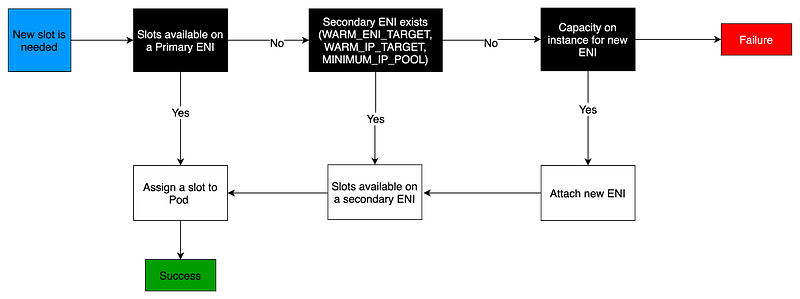
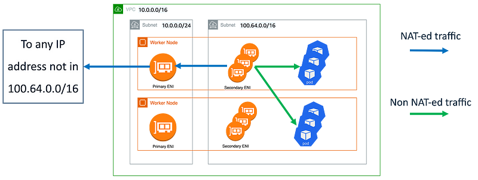

> **Avoid IP Exhaustion Problem with few practices**

## 🕸 Introduction

Each Amazon EC2 instance supports a maximum number of elastic network interfaces and a maximum number of IP addresses that can be assigned to each network interface. Each node requires one IP address for each network interface. All other available IP addresses can be assigned to Pods.

Each Pod requires its own IP address. As a result, you might have nodes that have available compute and memory resources, but can't accommodate additional Pods because the node has run out of IP addresses to assign to Pods. This issue is exacerbated by the limited number of IPv4 addresses available in VPCs.

In this blog post, we will explore a few solutions to this problem and how to significantly increase the number of IP addresses that nodes can assign to Pods.

### EKS VPC CNI Basics

Pods are the smallest deployable units of computing that can be created and managed in Kubernetes. A pod requires a unique IP address to communicate in the Kubernetes cluster (host networking pods being an exception).

[Amazon Elastic Kubernetes Services (EKS)](https://docs.aws.amazon.com/eks/index.html) by default runs the [VPC Container Networking Interface (CNI) Plugin](https://github.com/aws/amazon-vpc-cni-k8s) to assign IP addresses to a pod by managing network interfaces and IP addresses on EC2 instances.

The VPC CNI plugin integrates directly with EC2 networking to provide high performance, low latency container networking in Kubernetes clusters running on AWS. This plugin assigns an IP address from the cluster's VPC to each pod.

By default, the number of IP addresses available to assign to pods is based on the [maximum number](https://docs.aws.amazon.com/AWSEC2/latest/UserGuide/using-eni.html#AvailableIpPerENI) of elastic network interfaces and secondary IPs per interface that can be attached to an EC2 instance type.

When the [Amazon VPC Container Network Interface (CNI) plugin](https://github.com/aws/amazon-vpc-cni-k8s) assigns IPv4 addresses to Pods, it allocates them from the VPC CIDR range assigned to the cluster.

While it makes Pods first-class citizens within the VPC network, it often leads to exhaustion of the limited number of IPv4 addresses available in the VPCs. The long-term solution for addressing this issue is the adoption of IPv6; however, many customers aren't ready to make these types of decisions at the organization level.

When an instance is created, EC2 creates and attaches a primary ENI associated with a primary subnet. The primary subnet may be public or private. The Pods that run in hostNetwork mode use the primary IP address assigned to the node primary ENI and share the same network namespace as the host.

The CNI plugin manages [Elastic Network Interfaces (ENI)](https://docs.aws.amazon.com/AWSEC2/latest/UserGuide/using-eni.html) on the node. When a node is provisioned, the CNI plugin automatically allocates a pool of slots (IPs or Prefixes) from the node's subnet to the primary ENI. This pool is known as the warm pool, and its size is determined by the node's instance type.

Depending on CNI settings, a slot may be an IP address or a prefix. When a slot on an ENI has been assigned, the CNI may attach additional ENIs with a warm pool of slots to the nodes.

These additional ENIs are called Secondary ENIs. Each ENI can only support a certain number of slots, based on instance type. The CNI attaches more ENIs to instances based on the number of slots needed, which usually corresponds to the number of Pods.

This process continues until the node can no longer support additional ENIs. The CNI also pre-allocates "warm" ENIs and slots for faster Pod startup. Note each instance type has a maximum number of ENIs that may be attached. This is one constraint on Pod density (number of Pods per node), in addition to compute resources.

### 📊 EC2 Instance Limits

The maximum number of network interfaces, and the maximum number of slots that you can use varies by the type of EC2 Instance.

Since each Pod consumes an IP address on a slot, the number of Pods you can run on a particular EC2 Instance depends on how many ENIs can be attached to it and how many slots each ENI supports. We suggest setting the maximum Pods per [EKS user guide](https://docs.aws.amazon.com/eks/latest/userguide/pod-configuration.html) to avoid exhaustion of the instance's CPU and memory resources. Pods using hostNetwork are excluded from this calculation. You may consider using a script called [max-pod-calculator.sh](https://github.com/awslabs/amazon-eks-ami/blob/master/files/max-pods-calculator.sh) to calculate EKS's recommended maximum Pods for a given instance type.

### 🔄 Consider Another CNI?

You can disable native AWS IPs provisioning by using another CNI. IPv4 management will work in the following way:
- IP addresses of pods are scoped to the internal network.
- Pods are not directly reachable from outside the cluster.
- Every pod uses the primary node ENI.

However, there are many benefits you lose by dropping the VPC CNI:
- [Security group for pods](https://docs.aws.amazon.com/eks/latest/userguide/security-groups-for-pods.html)
- Pod identification in [VPC flow logs](https://docs.aws.amazon.com/vpc/latest/userguide/flow-logs.html)
- [Pod readiness gate](https://kubernetes-sigs.github.io/aws-load-balancer-controller/v2.6/deploy/pod_readiness_gate/) with load balancer controller
- Simpler networking: no overlay network, you use the network provided by Amazon VPC

We will focus in this article on keeping the usage of VPC CNI.

## Optimize IP Address Utilization

When designing your AWS networking architecture, it is important to optimize Amazon EKS IP consumption at the VPC and at the node level. This will help you mitigate IP exhaustion issues and increase the pod density per node. In this section, we will discuss techniques that can help you achieve these goals.

### Optimize Node-Level IP Consumption

[Prefix delegation](https://docs.aws.amazon.com/eks/latest/userguide/cni-increase-ip-addresses.html) is a feature that allocates a prefix (/28 for IPv4 and /80 for IPv6) instead of a secondary IP in the ENIs subnet. The total number of prefixes and private IP addresses will be less than the limit on private IPs allowed by your instance. Setting or resetting of `ENABLE_PREFIX_DELEGATION` while pods are running or if ENIs are attached is supported and the new pods allocated will get IPs based on the mode of IPAMD but the max pods of kubelet should be updated which would need either kubelet restart or node recycle.

Setting `ENABLE_PREFIX_DELEGATION` to true will not increase the density of branch ENI pods. The limit on the number of branch [network interfaces per instance type will remain the same](https://docs.aws.amazon.com/eks/latest/userguide/security-groups-for-pods.html#supported-instance-types). Each branch network will be allocated a primary IP and this IP will be allocated for the branch ENI pods.

Please refer to the [VPC CNI Feature Matrix section](https://github.com/aws/amazon-vpc-cni-k8s#vpc-cni-feature-matrix) below for additional information around using Prefix delegation with Custom Networking and Security Groups Per Pod features.

    
<strong>🔵 Note:</strong>

    
It is highly recommended that you create new node groups to increase the number of available IP addresses rather than doing rolling replacement of existing worker nodes. Cordon and drain all the existing nodes to safely evict all of your existing Pods. To prevent service disruptions, we suggest implementing <a href="https://kubernetes.io/docs/tasks/run-application/configure-pdb">Pod Disruption Budgets</a> on your production clusters for critical workloads. Pods on new nodes will be assigned an IP from a prefix assigned to an ENI.

### 🌐 Custom Networking

`AWS_VPC_K8S_CNI_CUSTOM_NETWORK_CFG=true`

Custom networking provides a solution to the IP exhaustion issue by assigning the Pod IPs from secondary VPC address spaces (e.g., CIDR). When custom networking is enabled in VPC CNI, it creates secondary ENIs in the subnet defined under a custom resource named ENIConfig that includes an alternate subnet CIDR range created from a secondary VPC CIDR. The VPC CNI assigns Pods IP addresses from the CIDR range defined in the ENIConfig custom resource.

The diagram below shows an overview of the solution:

Custom networking with internal SNAT

We create dedicated subnets for the pods. These ones should not be routable from outside the VPC (we can call these subnets internal). New subnets can have any CIDR block, but a good choice is to use [CG-NAT space](https://en.wikipedia.org/wiki/Carrier-grade_NAT) because companies don't usually use these ranges for private networks.

Use custom networking to use the new subnets for pods ENIs (more information on [EKS best practices guide](https://aws.github.io/aws-eks-best-practices/networking/custom-networking/#example-configuration)). Internal SNAT is enabled by default when using custom networking (see [AWS documentation](https://docs.aws.amazon.com/eks/latest/userguide/external-snat.html)).

With this configuration:

- Network flow from pod to pod will not be NAT-ed. You will see pods IPs in the VPC flow logs.
- Network flow from a load balancer in the same VPC to any pod is possible without any NAT.
- Network flow from a pod to an address IP not associated with a pod is NAT-ed through the primary node ENI.
- Ingress traffic from outside the VPC to the pods should pass through a load balancer (a.k.a layer 4 proxy) located in non-internal subnets.
- You can create as many subnets with overlapping CIDR in different VPCs as you want.
  
### VPC CNI Tweaking

With the default configuration, the VPC CNI keeps an entire ENI (and associated IPs) in the warm pool. This may consume a large number of IPs, especially on larger instance types. If your cluster subnet has a limited number of IP addresses available, scrutinize these VPC CNI configuration environment variables:

- `WARM_IP_TARGET`
- `MINIMUM_IP_TARGET`
- `WARM_ENI_TARGET`

You can configure the value of `MINIMUM_IP_TARGET` to closely match the number of Pods you expect to run on your nodes. Doing so will ensure that as Pods get created, the CNI can assign IP addresses from the warm pool without calling the EC2 API.

> **Note:** Setting the value of `WARM_IP_TARGET` too low will cause additional calls to the EC2 API, which might cause throttling of the requests. For large clusters, use it along with `MINIMUM_IP_TARGET` to avoid throttling of the requests.

To configure these options, you can download the [aws-k8s-cni.yaml](https://github.com/aws/amazon-vpc-cni-k8s/releases) manifest and set the environment variables. Ensure the version of the configuration value matches the installed VPC CNI version.

### 🌐 Adopt IPv6

Adopting IPv6 is the easiest way to work around the [RFC1918](https://tools.ietf.org/html/rfc1918) limitations. We strongly recommend you consider adopting IPv6 as your first option when choosing a network architecture. IPv6 provides a significantly larger total IP address space, allowing cluster administrators to focus on migrating and scaling applications without devoting effort towards working around IPv4 limits.

Amazon EKS clusters support both IPv4 and IPv6. By default, EKS clusters use IPv4 address space. Specifying an IPv6-based address space at cluster creation time will enable the use of IPv6. In an IPv6 EKS cluster, Pods and services receive IPv6 addresses while maintaining the ability for legacy IPv4 endpoints to connect to services running on IPv6 clusters and vice versa. All the pod-to-pod communication within a cluster always occurs over IPv6. Within a VPC (/56), the IPv6 CIDR block size for IPv6 subnets is fixed at /64. This provides 2⁶⁴ (approximately 18 quintillion) IPv6 addresses, allowing you to scale your deployments on EKS.

For detailed information, please see the [Running IPv6 EKS Clusters](https://docs.aws.amazon.com/eks/latest/userguide/cni-ipv6.html) section and for hands-on experience, please see the [Understanding IPv6 on Amazon EKS](https://eksworkshop.com/beginner/170_ipv6/) section of the Get hands-on with IPv6 workshop.

## 🏁 Conclusion

In this blog, we discussed strategies to tackle IPv4 address exhaustion in Amazon EKS clusters. We explored the use of custom networking, minimizing private address space consumption, optimizing IP address utilization, and considering the adoption of IPv6 as long-term solutions. These approaches can effectively mitigate the challenges posed by IPv4 address exhaustion in Amazon EKS clusters, ensuring efficient address allocation and usage.

**References:**

- https://aws.amazon.com/blogs/containers/amazon-vpc-cni-increases-pods-per-node-limits/
- https://aws.amazon.com/blogs/containers/automating-custom-networking-to-solve-ipv4-exhaustion-in-amazon-eks
- https://aws.github.io/aws-eks-best-practices/networking/vpc-cni
- https://docs.aws.amazon.com/eks/latest/userguide/cni-increase-ip-addresses.html
- https://medium.com/ekino-france/kubernetes-addressing-private-ipv4-shortage-5-strategies-for-amazon-eks-1dc3df270ed8

 

**_Until next time, つづく 🎉_**

> 💡 Thank you for Reading !! 🙌🏻😁📃, see you in the next blog.🤘  _**Until next time 🎉**_

🚀 Thank you for sticking up till the end. If you have any questions/feedback regarding this blog feel free to connect with me:

**♻️ LinkedIn:** https://www.linkedin.com/in/rajhi-saif/

**♻️ X/Twitter:** https://x.com/rajhisaifeddine

**The end ✌🏻**

<h1 align="center">🔰 Keep Learning !! Keep Sharing !! 🔰</h1>

**📅 Stay updated**

Subscribe to our newsletter for more insights on AWS cloud computing and containers.
