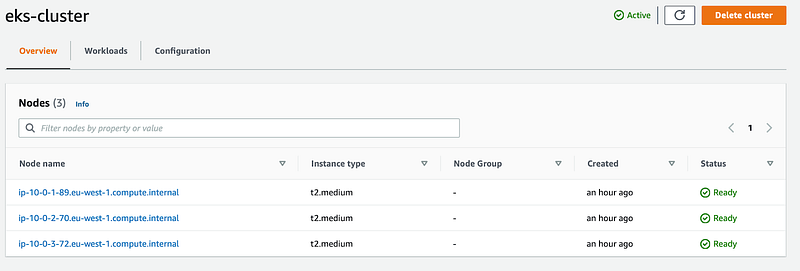
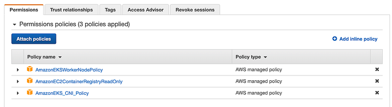

> **Proactive EKS cluster monitoring**

## 🔖 Introduction

[Kubernetes](https://kubernetes.io/) on AWS is a great managed container orchestration platform, but it can be difficult to monitor. [AWS CloudWatch Container Insights](https://docs.aws.amazon.com/AmazonCloudWatch/latest/monitoring/ContainerInsights.html) makes it easy to collect, aggregate, and summarize metrics and logs from your EKS cluster. This data can be used to identify performance bottlenecks, troubleshoot problems, and ensure that your cluster is running smoothly.

In this blog post, we will explore AWS CloudWatch Container Insights and show you how to use it to gain insight into your EKS cluster. By the end of this blog post, you will have a comprehensive understanding of how to use CloudWatch Container Insights to monitor your EKS cluster. You will be able to collect metrics and logs, create dashboards and alarms, and troubleshoot problems. This will help you to keep your cluster running smoothly and avoid downtime.

So what are you waiting for? Start reading today!


<br>

https://giphy.com/gifs/surveillance-proper-htwABV5tJsqDm

## 🌟 Explore AWS CloudWatch Container Insights

**CloudWatch Container Insights** is a feature-rich service that offers comprehensive monitoring for containerized applications and microservices.

Available for [Amazon ECS](https://aws.amazon.com/ecs/), [Amazon EKS](https://aws.amazon.com/eks/), and [Kubernetes on Amazon EC2](https://aws.amazon.com/ec2/), it automatically collects metrics, including CPU, memory, disk, and network usage, while providing diagnostic data for issue resolution.

The service employs performance log events with structured JSON schema, generating aggregated metrics at various levels for easy visualization.

Container Insights supports encryption with [AWS KMS](https://aws.amazon.com/kms/) key and uses a containerized CloudWatch agent for efficient performance data collection in Amazon EKS and Kubernetes environments.

## ⚙️ Configuring Container Insights on Amazon EKS and Kubernetes

To set up **Container Insights** on Amazon EKS or Kubernetes, you need to meet certain prerequisites. The support for Container Insights begins with Amazon EKS versions 1.23 and later, while the quick start method is available from versions 1.24 and later.

### 🛠️ Setup Process

The setup process involves the following steps:

1. **Verify Prerequisites**: Ensure compatibility and smooth installation.
2. **Install and Configure**: 
    - Install and configure the [CloudWatch agent](https://docs.aws.amazon.com/AmazonCloudWatch/latest/monitoring/ContainerInsights.html) or the [AWS Distro for OpenTelemetry](https://aws.amazon.com/otel/) as a DaemonSet on your cluster. This will enable the transmission of metrics to CloudWatch.
3. **Implement Logging**:
    - Implement [Fluent Bit](https://fluentbit.io/) or [Fluentd](https://www.fluentd.org/) to send logs to CloudWatch Logs for centralized log monitoring.

You have the option to perform these steps together as part of the quick start setup when using the CloudWatch agent, or you can choose to perform them separately.

### 🔧 Optional Steps

Additionally, there are optional steps you may consider:

- **EKS Control Plane Logging**: Set up Amazon EKS control plane logging for further insights into the cluster.
- **StatsD Endpoint**: Enable the CloudWatch agent as a StatsD endpoint on the cluster, allowing you to send StatsD metrics to CloudWatch.
- **App Mesh Logging**: If using [App Mesh](https://aws.amazon.com/app-mesh/), enable App Mesh Envoy Access Logs for enhanced monitoring.

### 📋 Prerequisites

Before installing Container Insights on Amazon EKS or Kubernetes, ensure the following prerequisites are met:

- **Functional Cluster**: You have a fully operational Amazon EKS or Kubernetes cluster with attached nodes in a supported Region. Check the list of [supported Regions](https://aws.amazon.com/about-aws/global-infrastructure/regional-product-services/).
- **kubectl Installed**: Ensure that you have [kubectl](https://kubernetes.io/docs/tasks/tools/) installed and running on your system.

Additional prerequisites for Kubernetes running on AWS (not using Amazon EKS):

- **Role-Based Access Control (RBAC)**: Make sure your Kubernetes cluster has enabled RBAC for authorization.
- **Webhook Authorization Mode**: Ensure that the kubelet has enabled Webhook authorization mode.
- **Docker Container Runtime**.

### 🔑 IAM Permissions

To enable your Amazon EKS worker nodes to send metrics and logs to CloudWatch, you need to grant IAM permissions. There are two methods to do this:

1. **Attach a Policy to the IAM Role**: Attach a policy to the IAM role of your worker nodes. This applies to both Amazon EKS clusters and other Kubernetes clusters.
2. **Use an IAM Role for Service Accounts**: Use an IAM role for service accounts for the cluster and attach the policy to this role. This method is exclusive to Amazon EKS clusters.

The first option grants CloudWatch permissions for the entire node, while the second option gives CloudWatch access only to the appropriate daemonset pods.

### 🛡️ Using IAM Service Account Role on Amazon EKS

If you choose to use an IAM service account role on an Amazon EKS cluster:

1. **Enable IAM Roles for Service Accounts**: Enable IAM roles for service accounts on your cluster.
2. **Configure the Service Account**: Configure the service account to use an IAM role.
3. **Attach Policies**: When creating the role, attach the `CloudWatchAgentServerPolicy` IAM policy in addition to any other policies you create for the role. Ensure the Kubernetes Service Account associated with this role is created in the `amazon-cloudwatch` namespace, where the CloudWatch and Fluent Bit daemonsets will be deployed in the subsequent steps.
4. **Associate IAM Role**: Finally, associate the IAM role with the service account in your cluster.

Following these prerequisites will ensure a successful installation and setup of Container Insights on your Amazon EKS or Kubernetes cluster.

## CloudWatch Container Insights for Amazon EKS Clusters

Monitoring performance metrics is always a challenge for containerized applications and microservices. When using Amazon EKS, you can use CloudWatch Container Insights for collecting, aggregating, and summarizing metrics and logs from your Kubernetes clusters.

Amazon CloudWatch is a monitoring service that monitors your AWS resources and applications in real-time. You can create custom dashboards to display custom metrics that you define. Also, you can create alarms that watch those metrics and send notifications when a threshold is reached.

CloudWatch Container Insights is a feature in CloudWatch that allows you to monitor your containerized applications. You can use Container Insights when using ECS (Elastic Container Service), EKS (Elastic Kubernetes Service), Kubernetes on EC2 and Fargate. CloudWatch automatically watches CPU, Memory, Disk, and Network metrics. With Container Insights, you can also collect diagnostic information from containers such as container failures, the total number of container restarts, and many more from your Kubernetes clusters.

To enable Container Insights on your EKS Clusters, you need to set up CloudWatch agent as a daemonset on your cluster to send metrics to Cloudwatch, and you need to deploy FluentD as a daemonset to send logs to CloudWatch Logs.

We have an example EKS Cluster set up with three EC2 Worker Nodes.



We will attach an IAM Policy to nodes' IAM Role for enabling the Worker Nodes to send metric data to CloudWatch.


<div class="image-title"><a href="https://www.xenonstack.com/blog/generative-ai-platform">Default Policies on Worker Node IAM Role</a></div>


<div class="image-title"><a href="https://www.xenonstack.com/blog/generative-ai-platform">CloudWatch agent policy</a></div>

### Instructions for the Quick Start setup of Container Insights on Amazon EKS and Kubernetes

To quickly set up Container Insights, you can follow the instructions provided in this section. There are two configurations available for Fluent Bit: an optimized version and a version similar to Fluentd. The Quick Start configuration utilizes the optimized version. For more details about the Fluentd-compatible setup, refer to the guide on setting up Fluent Bit as a DaemonSet to send logs to CloudWatch Logs.

To deploy Container Insights using the Quick Start method, execute the following command:

```bash
ClusterName=<my-cluster-name>
RegionName=<my-cluster-region>
FluentBitHttpPort='2020'
FluentBitReadFromHead='Off'
[[ ${FluentBitReadFromHead} = 'On' ]] && FluentBitReadFromTail='Off' || FluentBitReadFromTail='On'
[[ -z ${FluentBitHttpPort} ]] && FluentBitHttpServer='Off' || FluentBitHttpServer='On'
curl https://raw.githubusercontent.com/aws-samples/amazon-cloudwatch-container-insights/latest/k8s-deployment-manifest-templates/deployment-mode/daemonset/container-insights-monitoring/quickstart/cwagent-fluent-bit-quickstart.yaml | sed 's/{{cluster_name}}/'${ClusterName}'/;s/{{region_name}}/'${RegionName}'/;s/{{http_server_toggle}}/"'${FluentBitHttpServer}'"/;s/{{http_server_port}}/"'${FluentBitHttpPort}'"/;s/{{read_from_head}}/"'${FluentBitReadFromHead}'"/;s/{{read_from_tail}}/"'${FluentBitReadFromTail}'"/' | kubectl apply -f -
```

Replace `<my-cluster-name>` with the name of your Amazon EKS or Kubernetes cluster, and `<my-cluster-region>` with the name of the Region where the logs are published. It is recommended to use the same Region where your cluster is deployed to minimize AWS outbound data transfer costs.

Now, go to the CloudWatch dashboard under **Insights**, click on **Container Insights**.


From the drop-down, select **Performance monitoring** and under **Select clusters**, choose your EKS cluster. You will see a dashboard like this, displaying metrics such as CPU, memory utilization, and various network statistics across the EKS cluster.


From the drop-down, you can even select the metrics at the **pod level**:


Or even at the **EKS node level**:


## ✍️ Wrap Up

**Container Insights** is a great CloudWatch feature that offers comprehensive monitoring capabilities for ECS clusters, EKS clusters, Kubernetes clusters running on EC2 instances, and Fargate. With Container Insights, you gain access to detailed performance metrics from various components within your cluster.

For those operating Kubernetes clusters on AWS, whether using EKS or running clusters on EC2 instances, and currently lacking an APM (Application Performance Monitoring) solution for cluster metrics, CloudWatch Container Insights presents a quick and effective method to monitor your cluster's performance. By leveraging Container Insights, you can proactively monitor and optimize the performance of your containerized applications, ensuring smooth operations and efficient resource utilization.

https://giphy.com/gifs/Everdale-supercell-everdale-bigs-the-builder-BDGZ5LdDUkHCS8kS8R

<br>

**_Until next time, つづく 🎉_**

> 💡 Thank you for Reading !! 🙌🏻😁📃, see you in the next blog.🤘  _**Until next time 🎉**_

🚀 Thank you for sticking up till the end. If you have any questions/feedback regarding this blog feel free to connect with me:

**♻️ LinkedIn:** https://www.linkedin.com/in/rajhi-saif/

**♻️ X/Twitter:** https://x.com/rajhisaifeddine

**The end ✌🏻**

<h1 align="center">🔰 Keep Learning !! Keep Sharing !! 🔰</h1>

**📅 Stay updated**

Subscribe to our newsletter for more insights on AWS cloud computing and containers.
